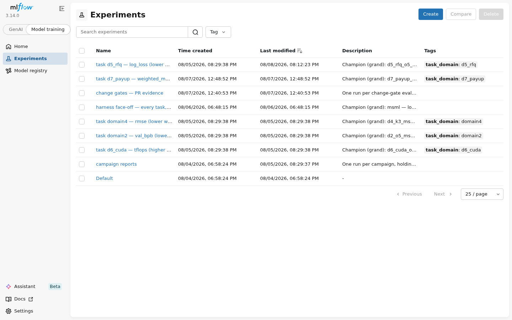
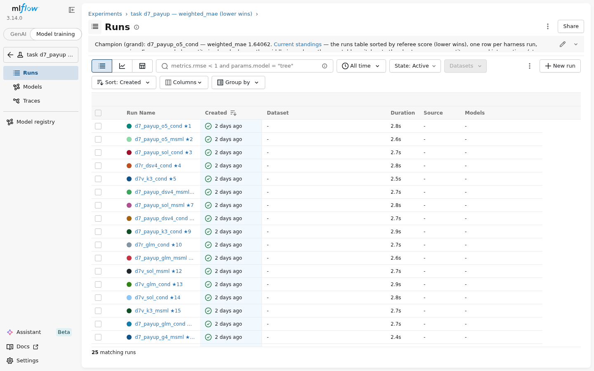
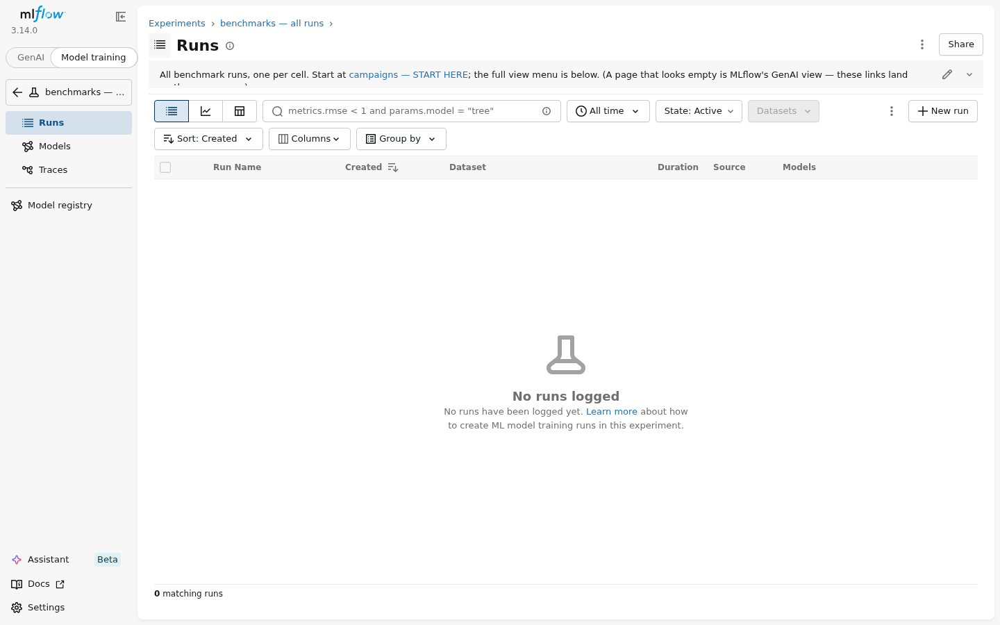
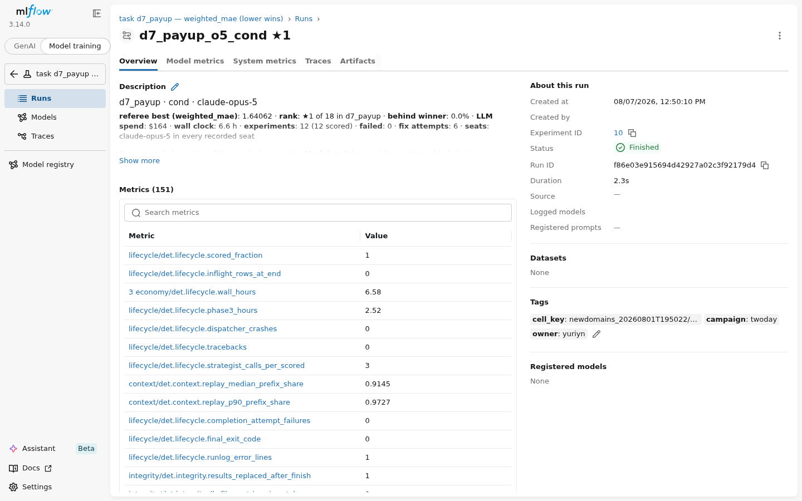
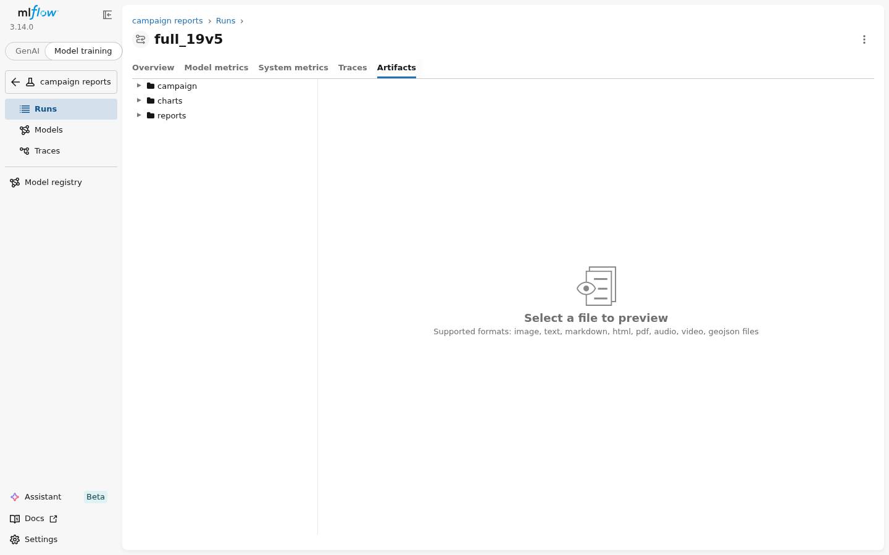

# runcmp — compare and review autonomous research runs, from their artifacts

`runcmp` takes FINISHED runs of autonomous research systems — any system, yours
included — and produces: a deterministic scoreboard (independently re-scored,
noise-calibrated), a metric registry across ~130 process measures, and
LLM-written review reports whose every claim is machine-verified against the
preserved evidence. It never writes into an input run.

It is deliberately **harness-neutral**: nothing here imports from any research
harness. The one shared piece — the layer that talks to models — is vendored
under `runcmp/llm/` and is allowed to drift from any copy your harness keeps.

## What the end product looks like

Four real reports written by the default configuration (the all-strong-model
team). **Click any of these — they open right here with every chart rendered:**

- [**The union report** — one report over an entire campaign: 75 runs, 5 tasks, every question family](examples/union_campaign_report.md)
- [**A harness-focus battery report** — which system to run, per task](examples/harness_battery_report.md)
- [**A replication battery report** — does anything survive run-to-run noise](examples/replication_battery_report.md)
- [**A single-domain battery report** — mortgage-bond prediction, 22 runs](examples/single_domain_battery_report.md)

Each chart image carries its underlying data in a fold directly beneath it.
Browser-ready HTML twins ship beside them (`examples/*.html`) — from a local
copy of this tree, double-click one.

The same four also live on the internal share; if you prefer opening them
there, paste one of these into Explorer's address bar:

```
\\v\campus\ny\appl\msml\workspace\data\yuriyn\mstech-alphalab-cond\comparison_out\grand\team_opus\REPORT.html
\\v\campus\ny\appl\msml\workspace\data\yuriyn\mstech-alphalab-cond\comparison_out\review_reasonfix\team_opus\REPORT.superseded_20260810T192259.html
\\v\campus\ny\appl\msml\workspace\data\yuriyn\mstech-alphalab-cond\comparison_out\review_d4rep\team_opus\REPORT.html
\\v\campus\ny\appl\msml\workspace\data\yuriyn\mstech-alphalab-cond\comparison_out\review_d7\team_opus\REPORT.html
```

(or as browser addresses, the same paths in the form
`file://///v/campus/ny/appl/...`). GitHub strips `file` links at render time,
so these cannot be made clickable here; the clickable copies above are the
in-tree ones.

Every finding in these passed mechanical re-verification against the preserved
evidence at the time of writing. This is the bar your own batteries should hit.

---

## 1. Sixty-second start

```bash
pip install -e .                       # one hard dep: the OpenAI client lib
# extras when you need them:
#   .[anthropic]  Claude via the native gateway     .[bedrock]  Claude via AWS
#   .[mlflow]     the publish stage                 .[html]     nicer report pages

OUT=out
python -m runcmp index    --root /path/to/finished_runs --out $OUT/corpus.json
# add --finished-only to drop runs whose process is still writing rows:
# a live run in a review measures elapsed time, not research quality
# (the printout marks any such run with [IN FLIGHT] either way)
python -m runcmp extract  --corpus $OUT/corpus.json --out $OUT/packs --workers 4
python -m runcmp tabulate --corpus $OUT/corpus.json --packs $OUT/packs --out $OUT
python -m runcmp referee  --corpus $OUT/corpus.json --packs $OUT/packs --out $OUT/referee.json
python -m runcmp bench    --corpus $OUT/corpus.json --packs $OUT/packs --out $OUT \
    --referee $OUT/referee.json
```

At this point you have, with **no model access needed**:
`$OUT/bench.md` (the scoreboard + ~130 metrics per run), `$OUT/referee.json`
(independent re-scores), `$OUT/pairs*.md` (side-by-side comparisons).

To add an LLM-written review on top (this is the DEFAULT reviewer
configuration — all seats on one strong model; see §4 for the fallbacks):

```bash
python -m runcmp investigate-team --corpus $OUT/corpus.json --packs $OUT/packs \
    --out $OUT/review --provider anthropic --model claude-opus-5 \
    --reasoning-effort high --mission auto
python -m runcmp factcheck --out $OUT/review --packs $OUT/packs
```

Read `$OUT/review/REPORT.html`. Then read `$OUT/review/verification.json` —
if `verified != total`, do not trust the report.

`factcheck`'s exit status IS that verdict: it exits `0` only when every hard
audit is clean (all findings re-verify, no unsourced chart series, no
referee-attribution violations, every chart renders). Anything flagged exits
`1` with a `FACTCHECK FLAGS` line naming why — safe to script as
`factcheck ... || exit 1`. Command success and report success used to be
separable here, and a reader was misled by exactly that (2026-08-11).

---

## 2. The flow, in one picture

```
finished runs ─▶ index ─▶ extract ─▶ tabulate ─▶ referee ─▶ bench ─▶ gate
   (disk)      corpus.json  packs/    pair+corpus  re-scored  metrics   pass/
                registry   evidence     tables      quality   registry  fail
                                                       │
                             ┌─────────────────────────┘
                             ▼
              investigate / investigate-team  ──▶  factcheck ──▶ publish
              (LLM agents write REPORT.md          re-verify      MLflow
               from packs, gated by critics)       every claim    showcase
                             │
                             ▼
                        recompose        (re-write ONLY the report,
                                          findings frozen — see §6)
```

Two halves, deliberately separable:

- **The deterministic half** (`index → bench`, plus `gate`,
  `token-accounting`): pure computation over preserved artifacts.
  Reproducible, no models, no network beyond the filesystem.
- **The judgment half** (`investigate*`, `recompose`, `factcheck`): LLM agents
  that read the evidence and write findings and reports. Everything they claim
  must carry machine-checkable references; `factcheck` re-verifies each one.

## 3. What counts as input ("hard data")

`index` walks a root directory and registers two kinds of run:

1. **Live workspaces** — what a harness leaves behind: `experiments.db`
   (row-level completeness is checked; a present-but-empty database is not a
   usable run), `logs/*.jsonl` transcripts, `experiments/<name>/results/`,
   configs, adapter files. The richer the leavings, the more of the ~130
   metrics light up.
2. **Evidence-contract submissions** — a minimal layout any harness can emit
   without adopting anything (see §8). No database, no transcripts required;
   quality is still independently re-scored.

Runs that were resumed, superseded or archived (`workspace.stalled-…`, any
directory whose name extends a live sibling's name by a dot-suffix) are
**skipped and recorded** in `corpus.json` under `archived_attempts_skipped`.
Dead runs in a corpus poison every downstream number; this rule exists because
it happened.

## 4. Reviewer agents: solos and teams

The review layer is a set of writing agents with tool access to the evidence
(packs, SQL over experiment databases, bounded log search, python probes —
all read-only). Two shapes:

- **`investigate`** — one agent does everything: plans, gathers evidence,
  records findings, writes the report.
- **`investigate-team`** — three seats, any model in any seat:
  **planner** (one call: turns the mission into a prioritized evidence plan),
  **executor** (the tool loop; gathers evidence, drafts findings, writes the
  report), **critic** (gates every finding for support, then reviews the
  finished report against the mission — scoring each draft and bouncing it
  with named required changes while budget remains).

**The default is the team, all seats on your strongest model. Most users
should run exactly that and nothing else:**

```bash
# THE DEFAULT — all three seats on one strong model ("team")
python -m runcmp investigate-team ... --provider anthropic --model claude-opus-5 \
    --reasoning-effort high --mission auto
```

In measured production use this configuration wrote the deepest reports with
zero stub sections, and it is the one the rest of this README assumes.

Two fallbacks exist for when a strong model is scarce or budgeted — use them
knowingly, not as defaults:

```bash
# fallback A: strong planner+critic, cheaper executor ("mixed").
# CAVEAT: the executor WRITES the report, so the prose quality is the
# executor's — the strong critic gates it but cannot write it for you.
python -m runcmp investigate-team ... --provider anthropic --model claude-opus-5 \
    --reasoning-effort high --role executor=openai:gpt-5.6-sol --mission auto

# fallback B: one model, no critic ("solo") — cheapest; only the mechanical
# gates stand between the writer and publication.
python -m runcmp investigate ... --provider openai --model gpt-5.6-sol \
    --reasoning-effort high --mission auto
```

Budgets scale automatically with corpus size and mission size; you do not tune
iteration counts by hand.

## 5. Reading the output

Inside a review directory:

| file | what it is |
|---|---|
| `REPORT.md` / `REPORT.html` | the deliverable |
| `findings.jsonl` | every recorded finding, with its critic verdict |
| `questions.json` | the question ledger the report had to close |
| `probes/` | every python probe the agents ran, with output |
| `plan.md` | the planner's evidence plan (team mode) |
| `critic_log.jsonl` | finding verdicts, report-review rounds with scores, chart-editor outcomes |
| `verification.json` | factcheck's re-verification: `total`, `verified`, `failed` |
| `usage.jsonl` | every model call THIS review made (seat, tokens) — the report's own bill |

Every report **ends with its production cost**: total dollars and tokens,
broken down by seat, computed from the session's own API usage at the
package's list prices (lab-hosted models are priced 0). The fact-checker
knows the footer is ledger bookkeeping and exempts it from the body audit.

The early phases are measured too: packs carry every web-search query with
its seat plus the sizes/structure of the exploration products
(`inventory.exploration`), the `exploration.*` metric family puts them on
the cross-run boards (chart them against referee quality in MLflow's native
scatter — that is the "did exploration pay off" view), and a standing
mission check makes every reviewer grade whether phases 0–1 earned their
hours.

The runs' own writing is measured the same way: a report census per run
(bytes, table rows, numeric tokens, images — for the report documents and
the per-experiment debriefs) and a readership ledger (which seats actually
opened debriefs/learnings/plans/reports mid-run, from the transcripts'
read calls) feed the `reporting.*` metric family — so "who writes the best
reports and does anyone read them" is chartable against outcomes on the
same boards.

**Trust rule:** `verification.json` must show `failed: 0` and
`verified == total` (equivalently: `factcheck` exited `0`). That proves every
citation resolves — it does *not* prove the interpretation is right; that is
what the critic seats and your own read are for.

### 5.1 Where identity lives in the JSON files

One run label — `era/domain/framework/name` — is the join key across every
file the pipeline emits. If you script against the outputs, these are the
paths that matter:

- `corpus.json` — `"schema": "runcmp-corpus-1"`; `.runs[]` is the registry,
  one object per run with `label`, `completeness`, `run_state`
  (`finished` / `in_flight` / `unknown`), `pair_key`, db row counts.
- a pack (`packs/*.json`) — identity at `.run.label`; the filename is the
  label with `/` flattened to `__`.
- `referee.json` — `.runs` is an **object keyed by label** (per-run
  re-scores); `.pairs[]` carries its identifier at `.pairs[].pair`.
- `verification.json` — `total` / `verified` / `partial` / `failed`, plus
  `findings[]` (per-reference results), `report_body_numbers`,
  `progression_series`, `referee_attributions`.

### 5.2 Day-2 helpers

Six small stages answer the questions people otherwise answer with one-off
scripts. All are read-only except `rereview`:

```bash
python -m runcmp status  --out $OUT/review        # one look at a review:
                                                  # critic rounds+scores, report,
                                                  # stub check, verification
python -m runcmp watch   --root /data/runs        # every run under a root:
                                                  # state, board counts, best-so-far
python -m runcmp preflight --root /data/runs \
    --packs $OUT/packs --provider anthropic:claude-opus-5 \
    --store showcase_mlflow                       # BEFORE spending reviewer budget:
                                                  # exit 1 on any blocker
python -m runcmp validate-submission --run run_x  # evidence-contract layout check,
                                                  # says what will light up
python -m runcmp mission --corpus $OUT/corpus.json \
    --check my_mission.md                         # lint a hand-written mission
python -m runcmp rereview --out $OUT/review \
    --corpus $OUT/corpus.json --packs $OUT/packs  # recompose with the review's OWN
                                                  # recorded writer (identity read
                                                  # from sessions.jsonl, never guessed)
```

Every investigator stage appends its identity (stage, writer provider:model,
roles) to `<review>/sessions.jsonl`, so a review always knows who wrote it —
`rereview` reads that instead of trusting whoever relaunches it.

## 6. Re-running only the report writing

The evidence half and the writing half fail independently, and the writing
fails more often. If a review's findings are sound but its report is thin,
do **not** re-run the review:

```bash
python -m runcmp recompose --out $OUT/review \
    --corpus $OUT/corpus.json --packs $OUT/packs \
    --provider <writer-provider> --model <writer-model> \
    [--role critic=<provider>:<model> | --role critic=none] \
    [--minutes 120] [--iterations 120]
```

`recompose` freezes `findings.jsonl` and the ledger (`record_finding` is
refused for the whole session), lets the writer re-read probes to quote exact
numbers, and loops draft → critic → revise. The critic scores every draft
0–100 on mission delivery; when budget or the wall clock runs out, the
draft with the **fewest hard violations, best score among those** publishes
— never the longest, never merely the latest. The replaced report is kept
beside the new one as `REPORT.superseded_<ts>.md`, a previous session's
drafts are archived as `report_drafts_prev_<ts>/` (never overwritten), and a
rewrite that fails with nothing to salvage puts the previous report back
instead of leaving the review report-less.

Frozen means verifiable: probe files are append-only (numbering continues
after everything on disk, and the write site refuses to reuse an existing
name), and recompose records a sha256 fingerprint of every frozen-evidence
file at start (`recompose_preflight_<ts>.json`), re-checks it at every exit,
and fails loudly if anything the findings cite was changed.

Keep the writer faithful to the configuration you are studying: a report
re-written by a different model is a different specimen.

---
---

# In depth

The sections above get you running. The rest is for full integration, in the
order you will need it.

## 7. Domains

A *domain* is a benchmark task: what the runs were trying to do, how quality is
measured, and how the referee independently re-scores it. Domains live in one
registry, `runcmp/lineup.json`, and the catalogue is always one command away:

```bash
python -m runcmp lineup --list
```

### 7.1 The shipped catalogue

| id | task | metric (direction) | referee | status |
|---|---|---|---|---|
| `domain2` | LLM pretraining speedrun (bits/byte under a wall-clock budget) | `val_bpb` (lower) | builtin (`bpb_curve`) | benchmarked |
| `domain4` | Traffic forecasting (RMSE on held-out horizons) | `rmse` (lower) | builtin (shared origin pool) | benchmarked |
| `ibes` | Analyst-activity trading strategies (Sharpe; self-report verification only) | `sharpe` (higher) | builtin | benchmarked |
| `d5_rfq` | ETF RFQ win/loss prediction (log-loss on a strictly later time slice) | `logloss` (lower) | `classification_table` | adopted |
| `d6_cuda` | Fused GEMM+bias+GELU CUDA kernel (correctness-gated throughput) | `tflops` (higher) | `kernel_bench` | adopted |
| `d7_payup` | Agency MBS payup prediction (face-weighted MAE, frozen walk-forward holdout) | `weighted_mae` (lower) | `regression_table` | adopted |

`d6_cuda` also ships its full task contract — the exact timing protocol,
correctness gate and report schema — in `runcmp/tasks/d6_cuda/TASK.md` with a
runnable `reference.py`. Use it as the model for any correctness-gated domain.

**On the maintainer's team?** The shipped lineup uses `<YOUR-SITE-DATA>`
placeholders; [docs/site/msml-internal.md](docs/site/msml-internal.md) has
the real dataset locations and a one-command apply for anyone who can read
the msml shared directories.

### 7.2 Anatomy of an entry

```json
{
  "id": "d7_payup",
  "title": "Agency MBS payup prediction (face-weighted MAE on a frozen holdout)",
  "detect": ["d7_payup", "domain7_payup", "_payup"],
  "resource": "cpu",
  "data_path": "/path/to/the/frozen/dataset",
  "metric": {"name": "weighted_mae", "lower_is_better": true},
  "framework_domains": {"your-harness": "tabular_regression"},
  "task": "Full task text, INCLUDING the evidence contract: which file every
           experiment must write, its exact column schema, and which metric
           key to record. This text is what run configs are generated from.",
  "status": "adopted"
}
```

- `detect` — tokens that map a run-directory name to this domain. Pick tokens
  that cannot collide with another domain's names.
- `metric` — the one number that ranks experiments, and its direction.
- `task` — the task text handed to harnesses, with the **evidence contract**
  spelled out inside it (see §8 for what that buys you). If the contract needs
  more than a paragraph — schemas, timing protocols, reference outputs — put a
  `TASK.md` under `runcmp/tasks/<id>/` and reference it from the task text.
- `referee` — how preserved predictions are re-scored. Shipped kinds:
  `classification_table` (log-loss on a frozen holdout), `regression_table`
  (weighted error on a frozen holdout), shared-origin-pool forecasting,
  `kernel_bench` (correctness-gated throughput), `bpb_curve` (pretraining loss
  curves), `returns_parquet` (returns series). A new domain that fits an
  existing kind needs **no code at all**.
- `status` — the discoverability ladder: `proposed` → `adopted` (task contract
  frozen, referee wired) → `benchmarked` (a published battery exists).

### 7.3 Adding your own domain, step by step

1. **Write the entry**: id, unambiguous `detect` tokens, metric name and
   direction, dataset path, and the full task text with the evidence contract
   inside it. Start `status` at `proposed`.
2. **Pick the referee kind.** If one of the shipped kinds fits, name it and
   you are done; new code is needed only for a genuinely new verification
   shape (then look at how the existing kinds are structured in
   `runcmp/referee.py`).
3. **Freeze the holdout.** Whatever the referee scores against must be fixed
   and dated — a moving holdout makes every historical score meaningless.
4. **If the contract is nontrivial, add `runcmp/tasks/<id>/TASK.md`** with the
   schemas and protocol, following `tasks/d6_cuda/TASK.md`.
5. **Dry-run it**: `python -m runcmp lineup --list` must show your entry;
   index one real or contract-shaped run and check the domain is detected and
   the referee scores it end to end.
6. **Emit run configs for the harnesses you want benchmarked**:
   `python -m runcmp lineup --out <campaign_dir> --domains <your-id> --models ...`
7. **Make it discoverable**: save the changed `lineup.json` (and your
   `tasks/<id>/` directory) to the shared project and submit it for review, so
   the next `lineup --list` anyone runs includes your domain. When a battery
   has been run and published, flip `status` to `benchmarked` — the catalogue
   is the registry itself, so there is no second place to update.

## 8. Bringing your own harness — the evidence contract

You do not need to adopt anything from this package to be evaluated. Emit one
directory per run, shaped like this, and point `index --root` at the parent.

Worked example — a hypothetical harness called **Alpha Lab 2** submitting two
runs of the mortgage-payup domain:

```
submissions/
  run_alphalab2-payup-a_20260810T120000Z/
    experiments/
      lgbm_baseline/
        results/metrics.json               {"weighted_mae": 3.4123}
        results/referee_predictions.parquet
        code/train.py                      (optional but reviewed if present)
      deep_mlp/
        results/metrics.json
        results/referee_predictions.parquet
  run_alphalab2-payup-b_20260810T183000Z/
    experiments/ ...
```

The rules, all of them:

1. **Directory name**: `run_<label>_<UTC timestamp>` — the pattern
   `run[_-]<label>[_-]YYYYMMDDTHHMMSS[Z]`. The label carries your harness and
   cell naming; the timestamp makes replication pairs identifiable.
2. **One directory per experiment** under `experiments/`, each with
   `results/metrics.json` containing at least the domain's metric under the
   domain's metric name (`weighted_mae` above; see `lineup.json`).
3. **Referee artifacts** per the domain's task contract — this is what makes
   your numbers *verifiable* rather than trusted. For table domains that is a
   predictions file covering every holdout row (column schema in the domain's
   task text); for the kernel domain, `results/kernel_report.json` with the
   correctness block and raw per-iteration timings. An experiment without
   referee artifacts still appears, but only as a self-report.
4. **Optional extras that unlock more of the report**: experiment code under
   `code/`, an `events.jsonl` of timestamped model calls (unlocks latency,
   token and reliability metrics), notes/debriefs (reviewed for honesty and
   methodology).

What you get back even from the minimal layout: independent re-scoring on the
frozen holdout, placement on every board next to every other harness, and
inclusion in the LLM reviews. What stays dark without transcripts: process
metrics (latency, tool discipline, cost) — those columns simply say so rather
than guessing.

## 9. Missions — the contract every report is written against

The single most load-bearing lesson in this package: **a report is only as
good as the mission that commissioned it, and the mission must spell out the
deliverable.** In one measured failure, a whole batch of reports passed every
mechanical gate and was still unusable — the mission had described the corpus
but never enumerated the sections the report owed, so the writers each
delivered whatever subset they favored, and entire question families arrived
as one-line stubs. The fix was structural, and it is now how missions work.

### 9.1 What a mission is

A markdown document, written to `<review>/mission.md` for the record, with
three jobs:

1. **The decisions the report must deliver** — numbered themes in the exact
   form `N. **Theme** — what it must answer`. This list is parsed: the report
   critic checks delivery per theme, and a deterministic stub check flags any
   matching section under ~900 characters with fewer than 2 evidence
   references. If it is not in this list, nobody owes it to you.
2. **The corpus, exactly** — generated from the registry so it can never go
   stale: every run, every replication group, what the referee ruled
   comparable, which scorecards exist.
3. **Operator notes** — facts the registry cannot know (a serving incident, a
   config knob one wave carried), passed with `--note` flags and printed as
   operator-declared rather than derived.

### 9.2 Generate, never hand-write

```bash
python -m runcmp mission --corpus $OUT/corpus.json --focus union \
    --note @battery_notes.txt          # preview without launching anything
```

`--mission auto` on any reviewer generates the same text at launch.
`--mission auto:<focus>` picks the decision preset:

| focus | the question it commissions |
|---|---|
| `harness` (default) | which harness per task and overall; what to keep/copy/fix/delete |
| `variability` | run-to-run spread over the corpus's replication groups; which verdicts survive noise |
| `gate` | does one specific change clear a bar |
| `treatment` | before/after one deliberate change, confounds weighed |
| `union` | the all-encompassing report: section list is the UNION of every theme the per-battery reports carried, at full depth — nothing may be dropped or compressed |

Hand-written missions remain supported (`--mission @file.md`); start from
`runcmp/missions/TEMPLATE.md`, and **never splice an old mission's corpus
description forward** — regenerate it.

**Complete real samples ship in `runcmp/missions/samples/`** — one full
mission per focus (`union.md`, `harness.md`, `treatment.md`,
`variability.md`) plus a real operator-notes file (`notes.txt`), all taken
verbatim from production batteries. Read `union.md` before writing anything:
it is the shape that fixed the disaster described above.

### 9.3 Notes discipline

`--note "wave-2 runs carry a max-pending cap of 4"` — repeatable;
`--note @file` reads one note per non-blank line (use the file form from shell
wrappers: an apostrophe inside a quoted note has silently killed launches
through nested quoting). Notes are context. **Requirements go in the mission's
numbered themes, never in notes** — notes are advisory, themes are checked.

### 9.4 Automating a battery

The pattern that has survived contact:

```bash
#!/bin/bash -e
OUT=battery_$(date -u +%Y%m%dT%H%M%S)
python -m runcmp index    --root $RUNS --out $OUT/corpus.json
python -m runcmp extract  --corpus $OUT/corpus.json --out $OUT/packs --workers 4
python -m runcmp tabulate --corpus $OUT/corpus.json --packs $OUT/packs --out $OUT
python -m runcmp referee  --corpus $OUT/corpus.json --packs $OUT/packs --out $OUT/referee.json
python -m runcmp bench    --corpus $OUT/corpus.json --packs $OUT/packs --out $OUT --referee $OUT/referee.json

# preflight: no archived attempts slipped in, referee produced pair verdicts
python - <<'PY'
import json,sys
c=json.load(open("$OUT/corpus.json")); r=json.load(open("$OUT/referee.json"))
assert not [x for x in c["runs"] if "." in x["label"].rsplit("/",1)[-1]], "dot-suffixed run leaked"
assert r.get("pairs"), "referee produced no pairs"
PY

for cfg in team mixed solo; do ... launch the reviewer configurations ... done
python -m runcmp factcheck --out $OUT/review_team --packs $OUT/packs
```

Run it from a scheduler if batteries recur. Each successful review also
refreshes `REPORTS.md` at the battery's top level — an index of every report
beneath it with verification counters, so results are findable cold.

## 10. Proving a harness change belongs — the PR gate

You changed your harness — any harness — and want the change adopted into its
main line. The claim you must prove has two halves: **you made something
better** (at least one dimension moved by a real margin) and **you destroyed
nothing important** (every guarded dimension held). This package turns that
claim into a page of evidence a human can decide on. Roughly, you produce:

1. **Two comparable campaigns.** The same tasks on the same model(s) with the
   same configs — the only difference is your change. The baseline can be a
   campaign you already have. Land the two sides distinguishably (e.g. two
   top-level directories: `runs_baseline/`, `runs_candidate/`); both must be
   finished runs (§3 — no in-flight processes, archived attempts renamed
   aside).
2. **The deterministic screen.** `gate` pairs the sides per (task, model)
   cell and judges `runcmp/gate_policy.json`: *guard* dimensions the change
   must not hurt (referee-scored final quality, wall clock, cost, failure
   signatures, code quality — tolerances are data, not code) and
   *improvement* dimensions that must move by a stated minimum. Out come
   `gate.md` (the per-dimension evidence table), `gate.json`
   (machine-readable), and an exit code CI can use. The screen is not the
   decision: single runs carry real run-to-run spread (§13), so read it as a
   screen, not a verdict.
3. **Reviewer verdicts.** `gate` also writes a `mission.md` that REQUIRES a
   report opening with `Recommendation: PASS` or `Recommendation: FAIL`, a
   confidence grade, and the evidence that would flip it. Run one or more
   reviewer models over the same corpus with that mission; several reviewers
   on one mission give you comparable positions, and every report is
   fact-checked afterwards (`factcheck` must exit 0).
4. **The one-page evidence** (optional): `publish --gate gate.json` adds one
   run to the `change gates — PR evidence` experiment in MLflow — deltas per
   task as charts, the full table and every reviewer's recommendation line in
   the description, the full reviews under Artifacts. Link that page from
   your PR.

```bash
OUT=gate_out
python -m runcmp index    --root /data/runs_baseline --root /data/runs_candidate \
    --out $OUT/corpus.json --finished-only
python -m runcmp extract  --corpus $OUT/corpus.json --out $OUT/packs --workers 4
python -m runcmp tabulate --corpus $OUT/corpus.json --packs $OUT/packs --out $OUT
python -m runcmp referee  --corpus $OUT/corpus.json --packs $OUT/packs --out $OUT/referee.json
python -m runcmp bench    --corpus $OUT/corpus.json --packs $OUT/packs --out $OUT \
    --referee $OUT/referee.json
python -m runcmp gate     --corpus $OUT/corpus.json --bench $OUT/bench.json \
    --referee $OUT/referee.json --out $OUT \
    --baseline era=runs_baseline --candidate era=runs_candidate   # exit 0 = mechanical PASS
python -m runcmp investigate-team --corpus $OUT/corpus.json --packs $OUT/packs \
    --out $OUT/review --provider anthropic --model claude-opus-5 \
    --reasoning-effort high --mission @$OUT/mission.md
python -m runcmp factcheck --out $OUT/review --packs $OUT/packs   # exit 0 = clean
```

Or as one command — `scripts/runcmp_gate.sh` runs everything above (add
`GATE_REVIEWERS="anthropic:claude-opus-5 openai:gpt-5.6-sol"` to get several
reviewer verdicts in parallel, `GATE_STORE=<mlflow_dir>` to publish the
evidence page):

```bash
scripts/runcmp_gate.sh gate_out era=runs_baseline era=runs_candidate \
    /data/runs_baseline /data/runs_candidate
```

The `--baseline` / `--candidate` selectors match registry fields
(`era=` / `framework=` / `model=` / `domain=` / `label=`, `*` wildcards,
repeat a flag to OR). Tune the bar in `runcmp/gate_policy.json` — the gate
refuses unknown metric ids loudly. `--allow-model-mismatch` is off by
default on purpose: a model change is a different experiment, not a harness
change.

## 11. The review machinery in depth

- **Finding gate.** Every `record_finding` must carry references whose quoted
  strings are verified character-for-character against tool outputs at record
  time; with a critic seated, the finding then needs the critic's accept.
  Revise verdicts flow back as tool output; churn is bounded and refunds
  scale with mission size.
- **Report gate.** `write_report` is refused while ledger questions are open.
  The draft then goes to the report critic (team mode), which scores it 0–100
  on mission delivery and either accepts or returns numbered required
  changes. Bouncing continues while iterations remain and the report phase is
  inside its wall clock; the floor is 2 rounds either way. When bouncing
  stops, the winner publishes: fewest hard audit violations first, best
  score among those. Score alone is not enough — a writer that fixed four
  referee-attribution violations in one round must not have a stale
  one-point-higher round reintroduced over it. Every submitted draft is
  kept on disk under `report_drafts/` with its score and violation count,
  and if the writer becomes unable to submit at all (context exhausted,
  API dead, iteration cap) the same winner still publishes — a review
  cannot end report-less by construction (one did, on 2026-08-10:
  23 scored drafts on disk, best 85/100, no report).
- **Chart floors.** A report must carry a minimum count and diversity of
  charts in the pipe-row grammar the renderer accepts (the grammar is in the
  writer's instructions; unknown `type:` values are refused with the legal
  list). A visualization editor pass may improve chart choice under a hard
  constraint: it may only re-present numbers already in the draft, its output
  must render, and if it errs it is told its own errors and asked to fix
  them — a failed pass is logged with reasons, never silently discarded.
- **factcheck** re-verifies every finding's references, audits report-body
  numbers for provenance (deterministic vs probe-computed vs unsourced),
  checks progression series against the packs, and re-renders findings.md.
  Its counters land in `verification.json`.

## 12. publish and MLflow — the showcase, in depth

### 12.1 The philosophy of the layout

Five rules explain everything you will see; internalize these and the UI needs
no manual:

1. **MLflow is the showcase, never the source of truth.** Every number shown
   was computed by the deterministic stages; `publish` only *arranges* it. If
   anything in MLflow surprises you, the file it came from is in the battery
   directory on disk — go there to dig, come here to look.
2. **The unit of comparison is the cell** — one harness × one model on one
   task. Each task experiment holds one MLflow run **per cell**, not per
   pipeline run, so the runs table *is* the leaderboard.
3. **Names carry the verdict.** A run is named `<cell>  ★<rank>` with `✗`
   appended when the underlying run was not complete — you read the standings
   without opening anything. The experiment's description (the note at the
   top) states the champion and how the page is sorted; each run's note holds
   that cell's verdict facts in prose.
4. **The metric namespace is a layout.** MLflow sorts metric names
   alphabetically, so keys are prefixed to force reading order: `0 seats/…`
   (which model actually sat in every agent seat), `0 coverage/…` (how much of
   the run the referee could score), `1 verdict/…` (referee results: 
   `referee.best_score`, `rank`, `pct_behind_winner`). The slash makes each
   prefix a collapsible section in the run page.
5. **Nothing is hand-made.** No hand-authored HTML, no manually typed tables;
   the store is regenerated by `publish` from `corpus.json`, `bench.json` and
   `referee.json`, so it can never drift from the evidence.

The shelf of experiments, left sidebar, top to bottom:

| experiment | one row per | what it answers |
|---|---|---|
| `benchmarks — all runs` | pipeline run | the full ~130-metric registry: reliability, latency, cost, tools, context |
| `task <id> — <metric> (lower/higher wins)` | cell | the leaderboard for that task, referee-scored |
| `harness face-off — every task, one page` | harness | ranks across all tasks at once |
| `campaign reports` | battery | the written reports, as browsable artifacts |
| `change gates — PR evidence` | gate check | did a specific change clear its bar |

### 12.2 Serve it

```bash
pip install -e .[mlflow]
python -m runcmp publish --corpus $OUT/corpus.json --packs $OUT/packs \
    --bench $OUT/bench.json --referee $OUT/referee.json --out $OUT --store my_store
mlflow server --backend-store-uri sqlite:///my_store/mlflow.db \
    --default-artifact-root my_store/artifacts --port 5601
```

Open http://127.0.0.1:5601 (localhost-only by default; `--host 0.0.0.0` to
share). If MLflow 3 lands you on a "GenAI / Usage" page, click the **Model
training** toggle at the top left — the publisher tags every experiment as
model-training, but the UI sometimes remembers the other mode.

### 12.3 A guided tour, with the actual screens

**The home page** — the shelf of experiments described above:



**A task board** (`task d7_payup — weighted_mae (lower wins)`): note the
champion line in the description, the ★-ranked run names, and that the table
is the leaderboard — 25 cells, best first. Sort or filter by any metric
column; the search box accepts expressions like
`params.framework = 'cond'`:



**The all-runs board** — one row per pipeline run with the full registry;
this is where process questions (reliability, latency, cost) live:



**A cell's run page** — the note carries the verdict prose; the metrics pane
shows the numbered sections (`0 seats/…`, `0 coverage/…`, `1 verdict/…`):



**A campaign report's artifacts** — the written reviews ship as artifacts
under `reviews/<name>/` and `reports/<name>/`; click `REPORT.html` to read a
report without leaving the browser:



### 12.4 Investigating mysteries with the hard data

The design gives every quality claim two independent sources — the harness's
own self-report (all-runs board) and the referee's re-score (task board) —
and every process claim a census metric. Inconsistencies are therefore
*findable by construction*. The standing recipes:

- **Two cells, same model, different results.** Select both on the task board
  → Compare. Read `1 verdict/referee.best_score` alongside
  `0 coverage/…` and `1 verdict/referee.scored_experiments`: a low-coverage
  cell lost rows to bookkeeping, not to model quality — the gap is an
  artifact question, not a capability one.
- **A great score wearing ✗.** The run was incomplete; its note says how. Then
  open the same run in `benchmarks — all runs` and read the reliability
  section (execution failures, agent deaths, retries) for the mechanism.
- **Self-report disagrees with the referee.** In the cell's run, compare the
  harness-claimed metric against `1 verdict/referee.best_score`. Then check
  `referee.artifact_coverage`: if the referee scored fewer rows than the run
  claims, the run's prediction files do not cover the holdout — the pack on
  disk names exactly which experiments were unscorable.
- **Who actually sat in the seats?** The `0 seats/<seat>: <model>` metrics
  make seat assignments comparable across runs — an unexpected model in one
  seat means a mixed-seat run, and any comparison treating it as pure is
  wrong.
- **Latency or cost looks off.** All-runs board, `speed.*` and
  `efficiency.*` columns; group by `params.campaign` to separate eras before
  believing any trend — serving incidents cluster in time.
- **When MLflow isn't enough**: every run row carries its battery directory in
  its params — the packs, referee JSON and factcheck outputs on disk are the
  next layer down, and they are the same numbers, not a parallel accounting.

### 12.5 A placeholder store to practice on

`examples/demo_submission/` ships two minimal evidence-contract runs (a
fictional harness, two experiments each, self-reported `weighted_mae` only).
Its README walks the whole pipeline over them — index through publish — ending
in a browsable MLflow store, so you can learn the navigation above on toy data
before touching anything real. Verified: the demo indexes as 2 complete runs
and produces the full 131-metric registry.

## 13. Avoiding the known disasters

Each of these is a rule because it failed once and cost real work:

1. **Spell out the report's sections in the mission** (the `union` focus does
   this for you). The alternative was measured: reports that passed every
   gate and answered a fraction of what was asked. (§9)
2. **Never let a dead run into the corpus.** Check
   `archived_attempts_skipped` in `corpus.json`; a review spent on a
   half-dead corpus is wasted twice — the report is wrong and it reads as if
   it were right.
3. **Read `verification.json` before believing any report**, and know what it
   proves (citations resolve) and what it does not (interpretation).
4. **Requirements in themes, context in notes.** A requirement placed in a
   note is a wish.
5. **Keep the writer matched to the configuration you are studying.** A
   report rewritten by a different model is a different specimen (§6).
6. **One model per seat, stated explicitly.** Defaults that quietly
   substitute a different model produce results you cannot attribute.

## 14. Troubleshooting

| symptom | first place to look |
|---|---|
| report refused repeatedly at write time | the refusal names the failing charts/sections; the writer must fix exactly those |
| `verification.json` has `failed > 0` | `findings.md` marks which findings failed and why |
| a run you expected is missing from the corpus | `corpus.json: archived_attempts_skipped`, and the dot-suffix rule in §3 |
| referee scored fewer rows than the run claims | the run's predictions file does not cover the holdout; the pack's referee section names the gap |
| review died mid-flight | the review directory is resumable evidence: run `recompose` to get a report from what was gathered |
| `python -m runcmp` works but a review stage fails on import | you need the provider extra for your chosen model (`.[anthropic]`, `.[bedrock]`) |
