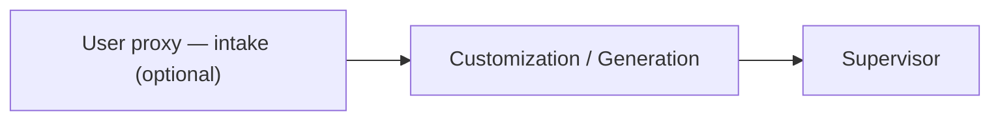
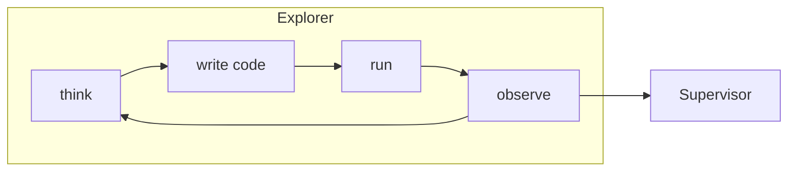
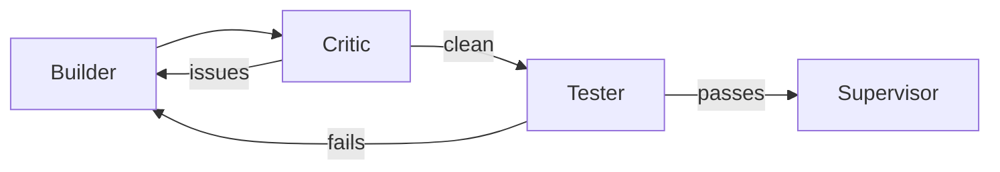
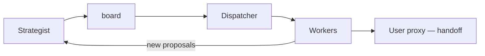
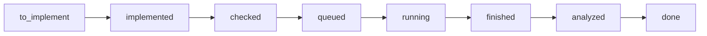

# Overview

We survey Alpha Lab's core architecture with an emphasis on explaining the lifecycle of a run.
We begin with a high-level summary of key ingredient components before discussing the phases a run
typical transitions through.

## At a Glance

A run comprises four phases and two cross-cutting roles; what each produces is
what steers the rest of the run:

- **Phase 0** — resolves the [Adapter](03_adapters.md); every later phase reads its metric, prompts, and expected file layout from it.
- **Phase 1** — one agent profiles the dataset from scratch, writing a `learnings.md` and `data_report/` that Phases 2–3 build on.
- **Phase 2** — builds the domain-specific evaluation framework Phase 3 scores every experiment against.
- **Phase 3** — proposes, runs, and analyzes experiments until convergence, accumulating a ranked leaderboard and a `playbook.md` the strategist reads to steer its next proposals.
- **Supervisor** — reviews output between phases and health-checks Phase 3, patching the adapter when it finds problems.
- **User proxy** — stands in for you via an optional intake interview and per-experiment handoff, monitors the run and updates an `agenda.md` that agents read to understand your intent.

## Phases

Alpha Lab runs in four phases (0 → 1 → 2 → 3), each building on the last, with a
Supervisor reviewing the output between them. `pipeline.phases` selects
which of 1–3 run; Phase 0 always runs first.

### Phase 0

Phase 0 resolves the [Adapter](03_adapters.md) — the per-domain config every later
phase reads from — so nothing downstream is hard-coded to one kind of task.

- **Customization / Generation** — copies a built-in template and tailors it to your data, or builds a new [Adapter](03_adapters.md) from scratch when no `domain` is given.
- **Supervisor** — validates the resolved adapter before Phase 1 begins.
- **User proxy** — optionally interviews you first (`--enable-intake`) to frame the task and generate a tailored `agenda.md`.

### Phase 1

Phase 1 is unguided discovery: one agent gets to know the raw dataset from scratch
and records what it finds in `learnings.md` and a structured `data_report/`, so the
later phases build on real understanding rather than assumptions.

- **Explorer** — profiles the dataset in a think → code → run → observe loop, producing analysis scripts, plots, a running `learnings.md`, and a structured `data_report/`.
- **Supervisor** — audits the exploration output and can patch the adapter if the prompts look misaligned with the data.

### Phase 2

Phase 2 builds the yardstick: a domain-appropriate evaluation framework, hardened
by adversarial review, so the experiments in Phase 3 are scored on something
trustworthy.

- **Builder** — writes the framework code.
- **Critic** — reviews it for lookahead bias, data leakage, and metric errors.
- **Tester** — writes and runs pytest tests until they pass.
- **Supervisor** — validates the finished framework, tests, and verdict.

Builder ↔ Critic and Builder ↔ Tester loop up to `max_fix_iterations` until the code passes.

### Phase 3

Phase 3 is the search loop: agents propose, run, and analyze experiments in
parallel, accumulating a ranked leaderboard and a `playbook.md` of what works as
they feed results back into new proposals until `max_experiments` is reached or
the strategist explicitly establishes that no further scientifically admissible
experiment remains.

- **Strategist** — reviews the board, proposes the next experiments, and maintains the `playbook.md`.
- **Dispatcher** — pure Python (no LLM); assigns Workers, submits jobs to an [Executor](#executors), polls status, and handles failures.
- **Workers** — implement a proposed experiment, analyze a finished one, or fix a failed one.
- **Reporter** — writes a milestone report every `report_interval` experiments.
- **Supervisor** — runs a health check when the error rate is high.
- **User proxy** — simulates feedback the user might provide based on the `agenda` (when enabled).

Experiments are tracked in a SQLite store (`KANBAN_COLUMNS` in `experiment_db.py`);
each moves through this status lifecycle (or is `cancelled` if the strategist prunes it):

Ending below the configured budget requires the strategist to call
`complete_research` with a concrete reason and supporting evidence. The decision
is rejected while execution work is active or before a real non-smoke result
exists. Once accepted, the dispatcher stops new strategist turns, drains finished
analysis and optional handoff work, and records successful completion. A
zero-proposal turn without this decision remains a hard failure.

The `convergence_threshold` is logged as a diagnostic signal; it does not end the
run by itself. Every knob lives in [Configuration](02_configuration.md).

## Executors

An executor runs the experiment subprocesses. Alpha Lab was designed for SLURM
clusters, but includes a **LocalGPUManager** for running on a single multi-GPU
box (like a 4x H100 workstation). The GPU and SLURM executors implement the same
small interface, so **the dispatcher doesn't know or care which is running — just
swap `executor: local` to `executor: slurm` and it works on a cluster.**

| Executor | Enabled by | Runs |
|----------|-----------|------|
| **Local GPU** | `executor: "local"` | A single multi-GPU box; pins each experiment to a GPU via `CUDA_VISIBLE_DEVICES`, enforces time limits, and packs multiple experiments per GPU. |
| **SLURM** | `executor: "slurm"` | A cluster; submits jobs via `sbatch`. |
| **Local CPU** | `cpu_enabled` (alongside the GPU executor) | CPU-suitable models — tree-based and linear (XGBoost, LightGBM, CatBoost, sklearn) — in parallel with GPU experiments. |

When Local CPU is enabled, the dispatcher routes each experiment by its `resource`
field (`"cpu"` / `"gpu"`); if that's unset, it scans the experiment's source for
GPU markers (torch / CUDA) and routes to GPU when unsure.

See [Configuration](02_configuration.md) for every executor and Phase 3 setting.
