# Which harness, which model, which pairing — verdicts from 41 preserved runs

**Corpus as it actually exists.** 41 runs, two harnesses (`cond` 21 runs, `msml` 20), three models (glm-5.2 22 runs, kimi-k3 11, deepseek-v4-flash 8), four tasks, four campaign eras. The referee could compare 16 of 20 same-model pairs; domain2's four pairs are **not** comparable (each run validates on its own held-out slice), so domain2 contributes process evidence only. Missing permutations are data, not noise: there is **no deepseek cell at all in d5_rfq or domain2**, **no kimi cell in the reasonfix era** (by design — kimi is the era control), and **no msml run for kimi + domain4 + vary**, because that cell failed four times and never produced a run of record. Everything below is scaled to what exists.

---

## 1. Headline verdicts

**Harness — `cond`, but conditionally.** cond wins the referee's comparable identity in 11 of 16 pairs, and the win is not evenly spread:

| task | comparable pairs | cond wins | margin vs that task's replication noise | verdict |
|---|---|---|---|---|
| d5_rfq | 3 | **3** | 1.12x, 1.70x, 2.01x of median noise | **decisive** |
| d7_payup | 7 | **5** | 0.17x-2.01x of a 41% noise floor | **narrow, on balance cond** |
| domain4 | 6 | 3 | 0.01x-2.70x, four of six below 0.5x | **coin flip** |
| domain2 | 0 comparable (4 pairs, all incomparable) | — | — | **no quality verdict possible** |

The decisive part of cond's case is not the metric — it is process, and process measures *are* cross-harness comparable: cond needed **1.24 attempts per cell vs msml's 2.05**; **24% vs 50%** of its scored rows misstate their own metric by more than 1% (median deviation 3.3e-07 vs 1.08e-02); **2 vs 40** rows finished as `done` while carrying an error; and it produces roughly **twice the code and documentation per experiment**.

**The big caveat, and it is the most important finding in this report.** Which harness wins flips with whether the model gets its own prior reasoning back. cond won **9 of 9** pairs where both sides replayed reasoning traces and only **2 of 7** where both sides were blind (one-sided Fisher p = 0.0048). All seven blind pairs are pre-2026-08-07 GLM/deepseek cells; the replayed set includes four kimi pairs from three *earlier* eras, so this is not simply "the good evening". On a serving path that does not return traces, this corpus gives cond no edge and msml the majority of wins.

**Model — kimi-k3 for quality, glm-5.2 for turnaround.** On referee-normalised quality (run best ÷ best value any run achieved on that task), medians are kimi 1.028 (10 scored runs), glm 1.076 (21), deepseek 1.088 (8). kimi holds the corpus best on domain2 (0.78205) and domain4 (0.021847); glm is best on d5_rfq (1.000/1.026) and clearly worst on d7_payup (1.427-2.193); deepseek holds the corpus-best d7 result (2.779368). kimi's price is clock time — registry `lifecycle.wall_hours` median **18.76 h** across its 11 runs (range 5.4-31.83) versus glm 4.78 h (3.35-17.16) and deepseek 4.28 h (1.73-8.89) — at a *lower* median token spend (56.9M vs glm 98.3M).

**Per-seat model choice cannot be answered from this corpus.** All 41 runs used exactly one model in every agent transcript (cond pins `conductor_model` to the run model; msml pins only an external `web_search_model`). The campaign's archived-attempt list even contains an `aborted_mixedmodels` directory. Any per-seat recommendation here would be invention.

**Combination to run today** (registry `search.time_to_best_hours` / `lifecycle.wall_hours` of the winning run in brackets):

| task | run this | margin |
|---|---|---|
| d5_rfq | **cond + glm-5.2** — corpus best 0.322081 (`d5r_glm_cond`: time_to_best_hours=2.24, wall_hours=3.95) | decisive vs msml, narrow vs cond+kimi |
| d7_payup | **cond + deepseek-v4-flash** — corpus best 2.779368 (`d7r_dsv4_cond`: time_to_best_hours=1.02, wall_hours=3.94); cond+kimi close behind at 2.862204 (`d7v_k3_cond`: time_to_best_hours=4.47, wall_hours=17.23) | narrow — the task's own repeat spread is 41% |
| domain4 | **cond + kimi-k3** — corpus best 0.021847 (`d4_k3_cond_direct`: time_to_best_hours=10.82, wall_hours=18.76) | coin flip vs msml+kimi (0.021862, a 0.07% gap) |
| domain2 | **cond + kimi-k3** — lowest recomputed value 0.78205 (`d2v_k3_cond`: time_to_best_hours=9.98, wall_hours=19.71) | no cross-harness identity exists; within-run evidence only |

It is task-dependent, and what drives the flip is **the model, not the harness**: cond is the better harness in every task where a verdict exists, while the best model changes with the task (glm on tabular classification, kimi on the two forecasting/pretraining tasks, deepseek on payups).

---

## 2. The registry numbers behind the timing claims

Every timing statement in this report is anchored to these published per-run registry values (`search.time_to_best_hours`, `lifecycle.wall_hours`, `search.median_queue_wait_minutes`). All 41 runs, nothing excluded; `d7_payup_glm_cond` has no time-to-best value in the registry.

| run | task | harness | model | time_to_best_hours | wall_hours | median_queue_wait_minutes |
|---|---|---|---|---|---|---|
| d5r_glm_cond | d5_rfq | cond | glm-5.2 | 2.24 | 3.95 | 10.5 |
| d5v_glm_cond | d5_rfq | cond | glm-5.2 | 1.41 | 3.82 | 7.0 |
| d5v_k3_cond | d5_rfq | cond | kimi-k3 | 22.96 | 31.83 | 183.0 |
| d5r_glm_msml | d5_rfq | msml | glm-5.2 | 2.16 | 4.73 | 8.8 |
| d5v_glm_msml | d5_rfq | msml | glm-5.2 | 1.31 | 4.83 | 6.6 |
| d5v_k3_msml | d5_rfq | msml | kimi-k3 | 9.36 | 17.55 | 78.0 |
| d7_payup_dsv4_cond | d7_payup | cond | deepseek-v4-flash | 0.67 | 2.21 | 11.7 |
| d7r_dsv4_cond | d7_payup | cond | deepseek-v4-flash | 1.02 | 3.94 | 5.4 |
| d7_payup_glm_cond | d7_payup | cond | glm-5.2 | (none) | 3.7 | 7.4 |
| d7r_glm_cond | d7_payup | cond | glm-5.2 | 1.49 | 3.68 | 37.5 |
| d7v_glm_cond | d7_payup | cond | glm-5.2 | 0.6 | 3.61 | 32.0 |
| d7_payup_k3_cond | d7_payup | cond | kimi-k3 | 1.48 | 6.58 | 70.9 |
| d7v_k3_cond | d7_payup | cond | kimi-k3 | 4.47 | 17.23 | 151.3 |
| d7_payup_dsv4_msml | d7_payup | msml | deepseek-v4-flash | 1.26 | 6.54 | 55.0 |
| d7r_dsv4_msml | d7_payup | msml | deepseek-v4-flash | 0.78 | 4.29 | 35.5 |
| d7_payup_glm_msml | d7_payup | msml | glm-5.2 | 0.15 | 4.12 | 5.8 |
| d7r_glm_msml | d7_payup | msml | glm-5.2 | 0.78 | 4.18 | 9.8 |
| d7v_glm_msml | d7_payup | msml | glm-5.2 | 0.99 | 4.06 | 13.9 |
| d7_payup_k3_msml | d7_payup | msml | kimi-k3 | 1.44 | 5.4 | 28.8 |
| d7v_k3_msml | d7_payup | msml | kimi-k3 | 6.68 | 14.08 | 68.8 |
| d2_glm_cond | domain2 | cond | glm-5.2 | 12.77 | 17.16 | 48.6 |
| d2r_glm_cond | domain2 | cond | glm-5.2 | 5.41 | 8.1 | 169.7 |
| d2v_glm_cond | domain2 | cond | glm-5.2 | 5.31 | 12.71 | 0.0 |
| d2v_k3_cond | domain2 | cond | kimi-k3 | 9.98 | 19.71 | 198.2 |
| d2_glm_msml | domain2 | msml | glm-5.2 | 1.96 | 7.91 | 7.0 |
| d2r_glm_msml | domain2 | msml | glm-5.2 | 2.62 | 5.66 | 10.4 |
| d2v_glm_msml | domain2 | msml | glm-5.2 | 2.43 | 13.23 | 6.4 |
| d2v_k3_msml | domain2 | msml | kimi-k3 | 6.67 | 20.87 | 86.0 |
| d4_dsv4_cond_direct | domain4 | cond | deepseek-v4-flash | 3.51 | 8.89 | 256.3 |
| d4r_dsv4_cond | domain4 | cond | deepseek-v4-flash | 3.15 | 7.16 | 222.9 |
| d4_glm_cond_direct | domain4 | cond | glm-5.2 | 2.63 | 5.34 | 99.5 |
| d4r_glm_cond | domain4 | cond | glm-5.2 | 0.97 | 6.17 | 70.9 |
| d4v_glm_cond | domain4 | cond | glm-5.2 | 1.38 | 4.57 | 50.2 |
| d4_k3_cond_direct | domain4 | cond | kimi-k3 | 10.82 | 18.76 | 254.4 |
| d4v_k3_cond | domain4 | cond | kimi-k3 | 11.51 | 21.56 | 199.1 |
| d4_dsv4_msml_direct | domain4 | msml | deepseek-v4-flash | 0.51 | 4.26 | 12.2 |
| d4r_dsv4_msml | domain4 | msml | deepseek-v4-flash | 1.0 | 1.73 | 9.4 |
| d4_glm_msml_direct | domain4 | msml | glm-5.2 | 1.58 | 7.44 | 13.1 |
| d4r_glm_msml | domain4 | msml | glm-5.2 | 1.43 | 3.35 | 14.8 |
| d4v_glm_msml | domain4 | msml | glm-5.2 | 2.81 | 5.14 | 17.4 |
| d4_k3_msml_direct | domain4 | msml | kimi-k3 | 18.19 | 24.44 | 136.5 |

Medians of those registry values, computed over all runs of each harness (my aggregate, definition: median of per-run registry values, every run counted once): queue wait **cond 70.9 / msml 13.5** minutes; tokens per run cond 103.4M / msml 67.3M.

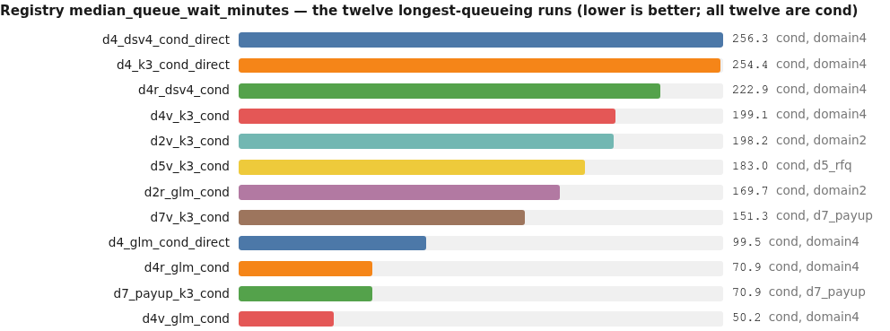

<details><summary>chart data</summary>

```chart
type: bars
title: Registry median_queue_wait_minutes — the twelve longest-queueing runs (lower is better; all twelve are cond)
d4_dsv4_cond_direct | 256.3 | cond, domain4
d4_k3_cond_direct | 254.4 | cond, domain4
d4r_dsv4_cond | 222.9 | cond, domain4
d4v_k3_cond | 199.1 | cond, domain4
d2v_k3_cond | 198.2 | cond, domain2
d5v_k3_cond | 183.0 | cond, d5_rfq
d2r_glm_cond | 169.7 | cond, domain2
d7v_k3_cond | 151.3 | cond, d7_payup
d4_glm_cond_direct | 99.5 | cond, domain4
d4r_glm_cond | 70.9 | cond, domain4
d7_payup_k3_cond | 70.9 | cond, d7_payup
d4v_glm_cond | 50.2 | cond, domain4
```

</details>

msml's highest value anywhere is 136.5 (`d4_k3_msml_direct`); its median is 13.5.

---

## 3. What the numbers look like

### Every comparable pair, margin expressed in units of its task's replication noise

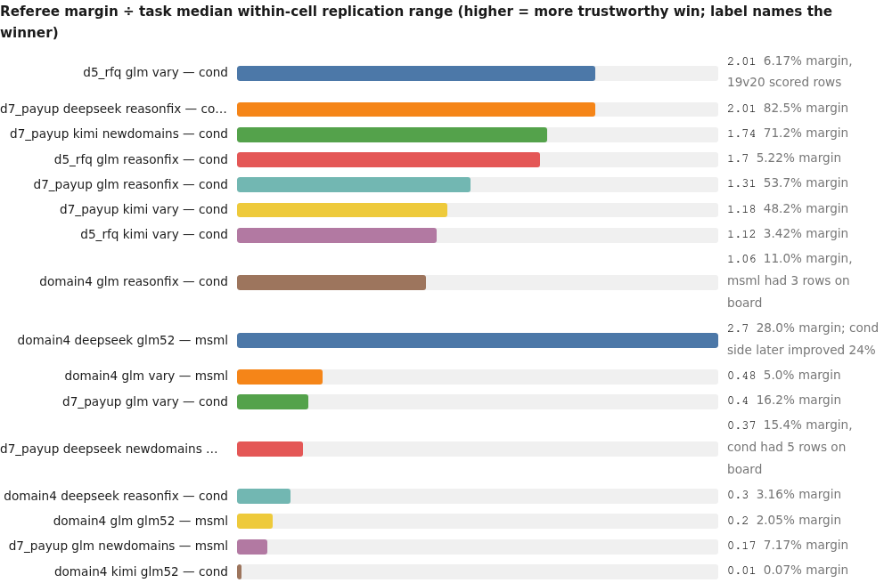

<details><summary>chart data</summary>

```chart
type: bars
title: Referee margin ÷ task median within-cell replication range (higher = more trustworthy win; label names the winner)
d5_rfq glm vary — cond | 2.01 | 6.17% margin, 19v20 scored rows
d7_payup deepseek reasonfix — cond | 2.01 | 82.5% margin
d7_payup kimi newdomains — cond | 1.74 | 71.2% margin
d5_rfq glm reasonfix — cond | 1.70 | 5.22% margin
d7_payup glm reasonfix — cond | 1.31 | 53.7% margin
d7_payup kimi vary — cond | 1.18 | 48.2% margin
d5_rfq kimi vary — cond | 1.12 | 3.42% margin
domain4 glm reasonfix — cond | 1.06 | 11.0% margin, msml had 3 rows on board
domain4 deepseek glm52 — msml | 2.70 | 28.0% margin; cond side later improved 24%
domain4 glm vary — msml | 0.48 | 5.0% margin
d7_payup glm vary — cond | 0.40 | 16.2% margin
d7_payup deepseek newdomains — msml | 0.37 | 15.4% margin, cond had 5 rows on board
domain4 deepseek reasonfix — cond | 0.30 | 3.16% margin
domain4 glm glm52 — msml | 0.20 | 2.05% margin
d7_payup glm newdomains — msml | 0.17 | 7.17% margin
domain4 kimi glm52 — cond | 0.01 | 0.07% margin
```

</details>

Anything below 1.0 is inside the noise this campaign measured for that task. Only d5_rfq clears it in all its pairs.

### Where the wins live (comparable pairs only; domain2 excluded because it has none)

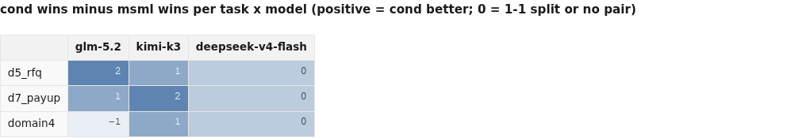

<details><summary>chart data</summary>

```chart
type: heatmap
title: cond wins minus msml wins per task x model (positive = cond better; 0 = 1-1 split or no pair)
cols: glm-5.2 | kimi-k3 | deepseek-v4-flash
row d5_rfq | 2 | 1 | 0
row d7_payup | 1 | 2 | 0
row domain4 | -1 | 1 | 0
```

</details>

d5_rfq glm = 2 pairs, both cond; d5_rfq has no deepseek cell. d7_payup deepseek and domain4 deepseek are 1-1; domain4 glm is 1 cond / 2 msml. No comparable domain2 pair exists at all.

### Best-so-far progressions, in referee units, over experiment order

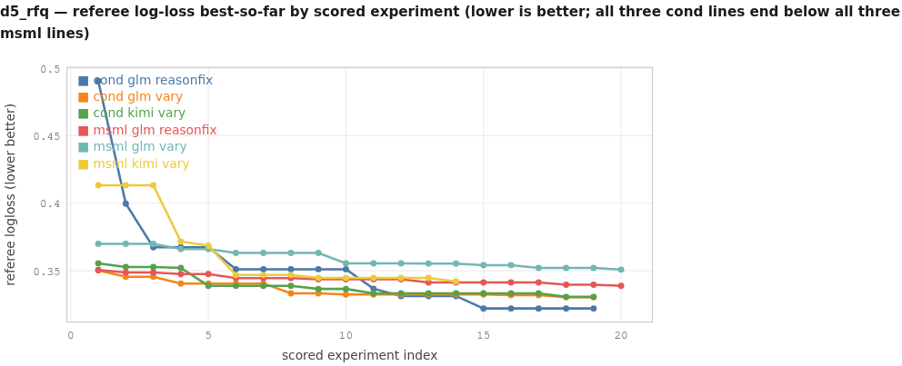

<details><summary>chart data</summary>

```chart
type: line
title: d5_rfq — referee log-loss best-so-far by scored experiment (lower is better; all three cond lines end below all three msml lines)
x: scored experiment index
y: referee logloss (lower better)
series cond glm reasonfix: 1,0.490469; 2,0.399631; 3,0.367399; 4,0.367399; 5,0.367399; 6,0.351185; 7,0.351185; 8,0.351185; 9,0.351185; 10,0.351185; 11,0.336684; 12,0.331324; 13,0.331324; 14,0.331324; 15,0.322081; 16,0.322081; 17,0.322081; 18,0.322081; 19,0.322081
series cond glm vary: 1,0.350321; 2,0.345507; 3,0.345507; 4,0.340551; 5,0.340551; 6,0.340551; 7,0.340551; 8,0.333342; 9,0.333342; 10,0.33245; 11,0.33245; 12,0.33245; 13,0.33245; 14,0.33245; 15,0.33245; 16,0.331919; 17,0.331919; 18,0.330448; 19,0.330448
series cond kimi vary: 1,0.355511; 2,0.352821; 3,0.352821; 4,0.352084; 5,0.338889; 6,0.338889; 7,0.338889; 8,0.338889; 9,0.336588; 10,0.336588; 11,0.333272; 12,0.333272; 13,0.333272; 14,0.333272; 15,0.333272; 16,0.333272; 17,0.333272; 18,0.330717; 19,0.330717
series msml glm reasonfix: 1,0.350614; 2,0.348797; 3,0.348797; 4,0.347588; 5,0.347588; 6,0.344576; 7,0.344576; 8,0.344576; 9,0.343642; 10,0.343642; 11,0.343642; 12,0.343642; 13,0.341384; 14,0.341384; 15,0.341384; 16,0.341384; 17,0.341384; 18,0.339666; 19,0.339666; 20,0.338886
series msml glm vary: 1,0.369851; 2,0.369851; 3,0.369851; 4,0.366043; 5,0.366043; 6,0.363238; 7,0.363238; 8,0.363238; 9,0.363238; 10,0.355498; 11,0.355498; 12,0.355498; 13,0.355324; 14,0.355324; 15,0.35415; 16,0.35415; 17,0.352064; 18,0.352064; 19,0.352064; 20,0.350845
series msml kimi vary: 1,0.413209; 2,0.413209; 3,0.413209; 4,0.371645; 5,0.368579; 6,0.346825; 7,0.346825; 8,0.346825; 9,0.344656; 10,0.344656; 11,0.344656; 12,0.344656; 13,0.344656; 14,0.342039
```

</details>

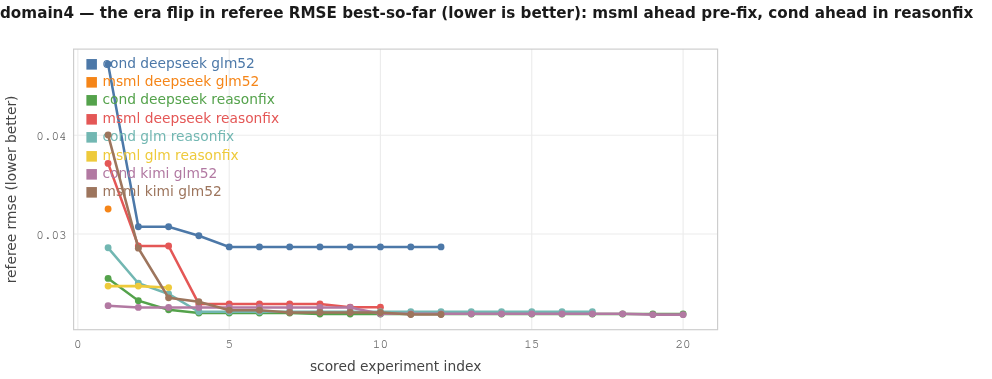

<details><summary>chart data</summary>

```chart
type: line
title: domain4 — the era flip in referee RMSE best-so-far (lower is better): msml ahead pre-fix, cond ahead in reasonfix
x: scored experiment index
y: referee rmse (lower better)
series cond deepseek glm52: 1,0.04719; 2,0.03074; 3,0.03074; 4,0.029826; 5,0.028697; 6,0.028697; 7,0.028697; 8,0.028697; 9,0.028697; 10,0.028697; 11,0.028697; 12,0.028697
series msml deepseek glm52: 1,0.032541
series cond deepseek reasonfix: 1,0.025516; 2,0.023258; 3,0.022337; 4,0.022008; 5,0.022008; 6,0.022008; 7,0.022008; 8,0.021904; 9,0.021904; 10,0.021904; 11,0.021904; 12,0.021904; 13,0.021904; 14,0.021904; 15,0.021904; 16,0.021904; 17,0.021904; 18,0.021904; 19,0.021904; 20,0.021904
series msml deepseek reasonfix: 1,0.037146; 2,0.028797; 3,0.028797; 4,0.022936; 5,0.022936; 6,0.022936; 7,0.022936; 8,0.022936; 9,0.022607; 10,0.022597
series cond glm reasonfix: 1,0.02861; 2,0.025022; 3,0.023945; 4,0.022144; 5,0.022144; 6,0.022144; 7,0.022144; 8,0.022144; 9,0.022144; 10,0.022144; 11,0.022144; 12,0.022144; 13,0.022144; 14,0.022144; 15,0.022144; 16,0.022144; 17,0.022144
series msml glm reasonfix: 1,0.024738; 2,0.024738; 3,0.024587
series cond kimi glm52: 1,0.022759; 2,0.022587; 3,0.022587; 4,0.022587; 5,0.022587; 6,0.022587; 7,0.022587; 8,0.022587; 9,0.022587; 10,0.02193; 11,0.02193; 12,0.02193; 13,0.02193; 14,0.02193; 15,0.02193; 16,0.02193; 17,0.02193; 18,0.02193; 19,0.021847; 20,0.021847
series msml kimi glm52: 1,0.040031; 2,0.028569; 3,0.023554; 4,0.023156; 5,0.022299; 6,0.022299; 7,0.022065; 8,0.022065; 9,0.022065; 10,0.022065; 11,0.021862; 12,0.021862
```

</details>

The msml deepseek glm52 series has a single point and msml glm reasonfix only three: those runs preserved predictions at the shared origins for only 1 and 3 experiments. Unequal draws are part of the story, not hidden from it.

### The search itself: how fast each harness closes the gap to the task's best

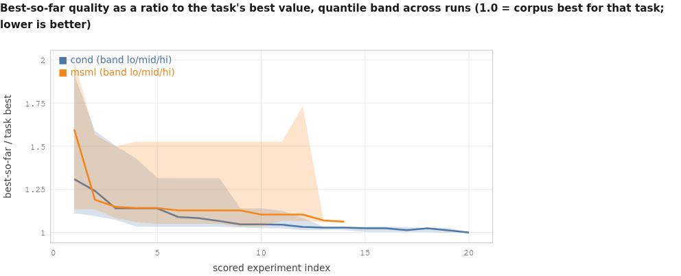

<details><summary>chart data</summary>

```chart
type: line
title: Best-so-far quality as a ratio to the task's best value, quantile band across runs (1.0 = corpus best for that task; lower is better)
x: scored experiment index
y: best-so-far / task best
band cond: 1,1.1123,1.3096,1.9166; 2,1.0954,1.2408,1.5892; 3,1.0727,1.1398,1.5013; 4,1.0349,1.1398,1.4266; 5,1.0340,1.1398,1.3163; 6,1.0340,1.0904,1.3135; 7,1.0340,1.0829,1.3135; 8,1.0340,1.0659,1.3135; 9,1.0298,1.0476,1.1398; 10,1.0244,1.0476,1.1398; 11,1.0244,1.0453,1.1264; 12,1.0136,1.0322,1.0836; 13,1.0136,1.0287,1.0347; 14,1.0136,1.0287,1.0347; 15,1.0038,1.0244,1.0347; 16,1.0038,1.0244,1.0347; 17,1.0026,1.0136,1.0305; 18,1.0026,1.0244,1.0260; 19,1.0000,1.0125,1.0260; 20,1.0000,1.0000,1.0026
band msml: 1,1.1351,1.5974,1.9961; 2,1.1351,1.1901,1.5665; 3,1.0829,1.1483,1.4983; 4,1.0599,1.1417,1.5264; 5,1.0498,1.1417,1.5264; 6,1.0498,1.1278,1.5264; 7,1.0498,1.1278,1.5264; 8,1.0498,1.1278,1.5264; 9,1.0348,1.1278,1.5264; 10,1.0343,1.1038,1.5264; 11,1.0669,1.1038,1.5264; 12,1.0669,1.1038,1.7332; 13,1.0599,1.0701,1.0728; 14,1.0599,1.0620,1.0728
```

</details>

Interquartile band across all runs with at least four runs contributing at that index (cond reaches index 20, msml index 14). The medians converge; cond's lower quartile reaches 1.0000 by index 19-20 while msml's floor stalls near 1.06.

### The cost/quality trade-off

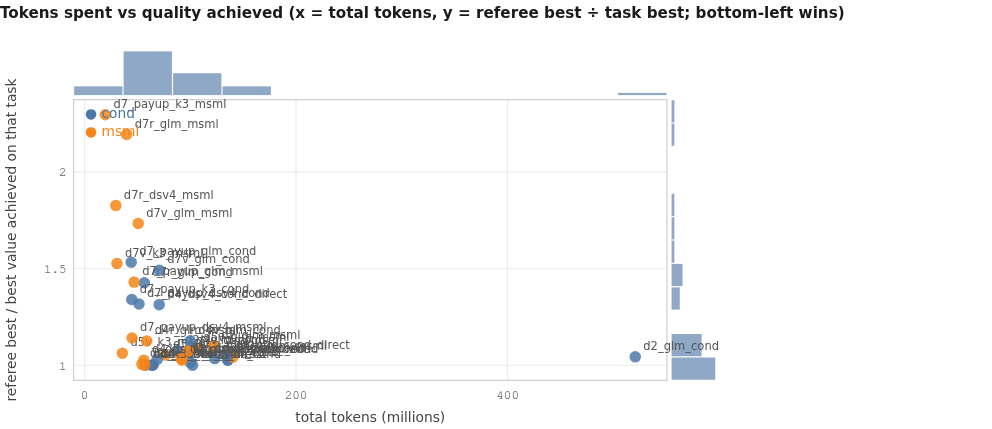

<details><summary>chart data</summary>

```chart
type: scatter
title: Tokens spent vs quality achieved (x = total tokens, y = referee best ÷ task best; bottom-left wins)
x: total tokens (millions)
y: referee best / best value achieved on that task
marginals: true
point d5r_glm_cond | 102.1 | 1.0 | cond
point d5v_glm_cond | 135.4 | 1.026 | cond
point d5v_k3_cond | 135.6 | 1.0268 | cond
point d5r_glm_msml | 76.3 | 1.0522 | msml
point d5v_glm_msml | 104.8 | 1.0893 | msml
point d5v_k3_msml | 35.7 | 1.062 | msml
point d7_payup_dsv4_cond | 51.5 | 1.3163 | cond
point d7r_dsv4_cond | 57.6 | 1.0 | cond
point d7_payup_glm_cond | 44.1 | 1.5327 | cond
point d7r_glm_cond | 56.5 | 1.4266 | cond
point d7v_glm_cond | 70.7 | 1.4913 | cond
point d7_payup_k3_cond | 44.7 | 1.3402 | cond
point d7v_k3_cond | 68.6 | 1.0298 | cond
point d7_payup_dsv4_msml | 44.9 | 1.1411 | msml
point d7r_dsv4_msml | 29.5 | 1.8252 | msml
point d7_payup_glm_msml | 46.8 | 1.4302 | msml
point d7r_glm_msml | 39.8 | 2.1933 | msml
point d7v_glm_msml | 50.8 | 1.7332 | msml
point d7_payup_k3_msml | 19.7 | 2.295 | msml
point d7v_k3_msml | 30.6 | 1.5264 | msml
point d2_glm_cond | 520.7 | 1.0437 | cond
point d2r_glm_cond | 87.6 | 1.0755 | cond
point d2v_glm_cond | 123.2 | 1.0346 | cond
point d2v_k3_cond | 64.1 | 1.0 | cond
point d2_glm_msml | 121.5 | 1.0976 | msml
point d2v_glm_msml | 140.1 | 1.0424 | msml
point d2v_k3_msml | 54.2 | 1.0051 | msml
point d4_dsv4_cond_direct | 70.5 | 1.3135 | cond
point d4r_dsv4_cond | 64.9 | 1.0026 | cond
point d4_glm_cond_direct | 135.3 | 1.0476 | cond
point d4r_glm_cond | 100.0 | 1.0136 | cond
point d4v_glm_cond | 99.9 | 1.1264 | cond
point d4_k3_cond_direct | 63.8 | 1.0 | cond
point d4_dsv4_msml_direct | 56.1 | 1.0261 | msml
point d4r_dsv4_msml | 91.3 | 1.0343 | msml
point d4v_glm_msml | 97.9 | 1.0728 | msml
point d4r_glm_msml | 58.8 | 1.1254 | msml
point d4_glm_msml_direct | 92.3 | 1.0265 | msml
point d4_k3_msml_direct | 56.9 | 1.0007 | msml
```

</details>

39 of 41 runs appear; `d2r_glm_msml` and `d4v_k3_cond` are absent because neither has a referee-comparable best (the first preserved no scoreable predictions, the second's pair partner never completed). `d2_glm_cond` at 520.7M tokens is the outlier that made cond's reputation for bloat — it is one run, not the pattern.

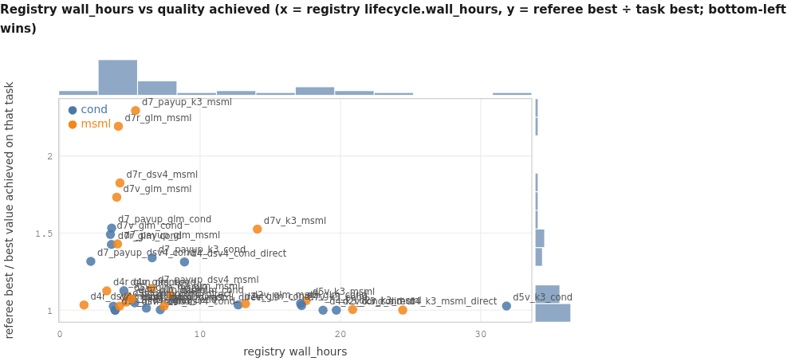

<details><summary>chart data</summary>

```chart
type: scatter
title: Registry wall_hours vs quality achieved (x = registry lifecycle.wall_hours, y = referee best ÷ task best; bottom-left wins)
x: registry wall_hours
y: referee best / best value achieved on that task
marginals: true
point d5r_glm_cond | 3.95 | 1.0 | cond
point d5v_glm_cond | 3.82 | 1.026 | cond
point d5v_k3_cond | 31.83 | 1.0268 | cond
point d5r_glm_msml | 4.73 | 1.0522 | msml
point d5v_glm_msml | 4.83 | 1.0893 | msml
point d5v_k3_msml | 17.55 | 1.062 | msml
point d7_payup_dsv4_cond | 2.21 | 1.3163 | cond
point d7r_dsv4_cond | 3.94 | 1.0 | cond
point d7_payup_glm_cond | 3.7 | 1.5327 | cond
point d7r_glm_cond | 3.68 | 1.4266 | cond
point d7v_glm_cond | 3.61 | 1.4913 | cond
point d7_payup_k3_cond | 6.58 | 1.3402 | cond
point d7v_k3_cond | 17.23 | 1.0298 | cond
point d7_payup_dsv4_msml | 6.54 | 1.1411 | msml
point d7r_dsv4_msml | 4.29 | 1.8252 | msml
point d7_payup_glm_msml | 4.12 | 1.4302 | msml
point d7r_glm_msml | 4.18 | 2.1933 | msml
point d7v_glm_msml | 4.06 | 1.7332 | msml
point d7_payup_k3_msml | 5.4 | 2.295 | msml
point d7v_k3_msml | 14.08 | 1.5264 | msml
point d2_glm_cond | 17.16 | 1.0437 | cond
point d2r_glm_cond | 8.1 | 1.0755 | cond
point d2v_glm_cond | 12.71 | 1.0346 | cond
point d2v_k3_cond | 19.71 | 1.0 | cond
point d2_glm_msml | 7.91 | 1.0976 | msml
point d2v_glm_msml | 13.23 | 1.0424 | msml
point d2v_k3_msml | 20.87 | 1.0051 | msml
point d4_dsv4_cond_direct | 8.89 | 1.3135 | cond
point d4r_dsv4_cond | 7.16 | 1.0026 | cond
point d4_glm_cond_direct | 5.34 | 1.0476 | cond
point d4r_glm_cond | 6.17 | 1.0136 | cond
point d4v_glm_cond | 4.57 | 1.1264 | cond
point d4_k3_cond_direct | 18.76 | 1.0 | cond
point d4_dsv4_msml_direct | 4.26 | 1.0261 | msml
point d4r_dsv4_msml | 1.73 | 1.0343 | msml
point d4v_glm_msml | 5.14 | 1.0728 | msml
point d4r_glm_msml | 3.35 | 1.1254 | msml
point d4_glm_msml_direct | 7.44 | 1.0265 | msml
point d4_k3_msml_direct | 24.44 | 1.0007 | msml
```

</details>

The four runs that hold a task's corpus best sit at registry wall_hours 3.95, 3.94, 18.76 and 19.71 — i.e. quality is not bought with clock time in general, but the two kimi bests are the two long ones.

### Distributions the packs preserve

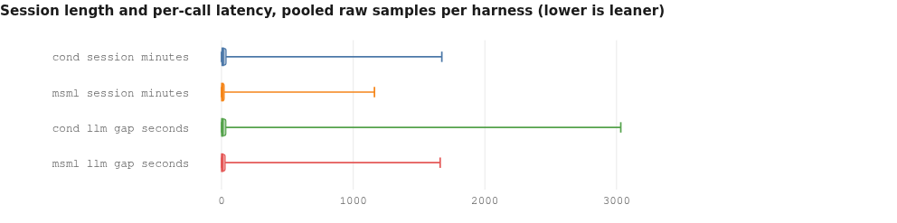

<details><summary>chart data</summary>

```chart
type: box
title: Session length and per-call latency, pooled raw samples per harness (lower is leaner)
box cond session minutes | 0.00 | 3.21 | 9.49 | 34.54 | 1673.30
box msml session minutes | 0.10 | 2.55 | 5.71 | 19.61 | 1161.42
box cond llm gap seconds | 0.15 | 1.70 | 6.31 | 32.26 | 3031.95
box msml llm gap seconds | 0.18 | 1.51 | 5.33 | 27.54 | 1660.22
```

</details>

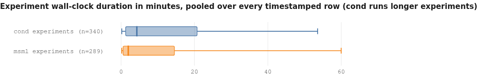

<details><summary>chart data</summary>

```chart
type: box
title: Experiment wall-clock duration in minutes, pooled over every timestamped row (cond runs longer experiments)
box cond experiments (n=340) | 0.18 | 1.23 | 4.27 | 20.72 | 53.57
box msml experiments (n=289) | 0.17 | 0.53 | 1.94 | 14.54 | 59.98
```

</details>

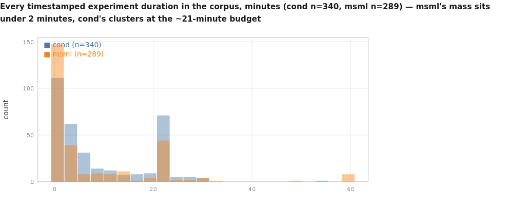

<details><summary>chart data</summary>

```chart
type: hist
title: Every timestamped experiment duration in the corpus, minutes (cond n=340, msml n=289) — msml's mass sits under 2 minutes, cond's clusters at the ~21-minute budget
series cond: 21.91, 22.02, 21.84, 21.89, 21.95, 21.24, 21.0, 20.6, 22.19, 21.21, 19.9, 22.15, 21.53, 21.62, 21.26, 21.0, 21.49, 21.67, 21.0, 20.96, 21.56, 21.03, 21.52, 23.94, 24.02, 21.56, 21.52, 20.97, 17.54, 19.49, 21.67, 21.66, 21.64, 20.76, 20.72, 21.11, 21.05, 12.31, 18.15, 4.09, 4.27, 7.25, 4.43, 2.82, 28.58, 29.93, 26.94, 3.71, 6.71, 4.26, 14.45, 0.71, 7.03, 20.6, 5.28, 3.69, 2.28, 1.06, 1.06, 2.11, 1.05, 1.28, 2.89, 0.88, 1.24, 1.42, 0.88, 10.92, 1.42, 1.06, 17.59, 1.76, 0.87, 9.6, 8.19, 6.99, 2.61, 20.21, 1.57, 1.05, 8.8, 6.82, 16.95, 4.02, 6.85, 2.27, 6.31, 6.29, 7.15, 17.49, 0.87, 6.64, 0.35, 0.18, 0.19, 1.23, 3.5, 1.77, 2.7, 14.92, 4.09, 8.31, 0.7, 2.74, 0.35, 2.12, 12.52, 13.75, 0.53, 0.53, 0.87, 0.35, 8.73, 11.9, 0.18, 0.89, 0.88, 0.7, 0.7, 0.18, 22.74, 21.91, 21.62, 21.94, 22.28, 21.71, 22.31, 20.83, 21.82, 21.7, 22.84, 22.92, 21.99, 21.55, 21.65, 21.93, 22.53, 22.73, 14.25, 22.49, 22.14, 21.59, 21.64, 22.07, 19.24, 1.25, 29.98, 5.33, 1.94, 0.53, 1.95, 13.49, 0.71, 6.12, 3.54, 0.88, 0.7, 0.71, 1.77, 13.54, 12.07, 2.28, 1.58, 3.69, 7.85, 0.7, 2.62, 10.82, 2.79, 1.92, 6.28, 16.94, 22.25, 7.01, 1.75, 0.87, 12.38, 0.7, 6.64, 8.73, 17.72, 3.84, 8.72, 1.06, 2.1, 2.81, 2.82, 2.28, 3.86, 3.76, 5.45, 3.22, 2.46, 2.47, 2.3, 2.46, 2.47, 2.62, 2.47, 2.46, 3.23, 2.47, 2.65, 2.81, 0.53, 0.18, 0.18, 1.23, 0.18, 0.18, 0.18, 0.53, 0.35, 1.05, 0.7, 1.74, 0.18, 0.7, 0.35, 1.06, 0.35, 0.36, 0.35, 0.86, 1.42, 0.53, 0.36, 0.35, 0.54, 0.36, 0.72, 5.4, 6.44, 7.15, 6.94, 0.52, 1.22, 3.68, 2.45, 4.87, 12.39, 3.31, 6.99, 22.11, 22.14, 22.32, 21.97, 22.22, 24.19, 21.86, 21.72, 21.74, 21.73, 22.01, 21.53, 23.11, 23.33, 22.71, 0.7, 23.26, 27.47, 16.84, 11.11, 25.3, 22.47, 0.88, 0.53, 19.42, 11.47, 0.71, 0.71, 3.36, 9.72, 1.78, 10.41, 53.57, 7.93, 2.47, 1.39, 2.64, 27.77, 5.31, 20.04, 9.86, 26.34, 5.62, 1.07, 3.16, 16.9, 23.65, 1.23, 8.81, 7.04, 1.07, 3.54, 29.97, 0.53, 0.35, 2.99, 29.98, 1.93, 1.57, 0.36, 4.45, 4.8, 4.43, 1.41, 0.35, 1.57, 0.7, 6.08, 0.53, 2.12, 6.19, 0.53, 0.71, 6.35, 0.53, 0.18, 1.59, 3.7, 0.53, 0.18, 3.0, 7.6, 2.12, 14.93, 4.11, 0.18, 0.7, 10.3, 1.24, 0.54, 2.83, 3.01, 0.18, 1.24, 9.15, 0.88, 4.84
series msml: 0.71, 0.18, 0.18, 0.18, 0.18, 21.51, 22.21, 20.98, 1.41, 21.32, 21.83, 22.18, 21.16, 20.99, 20.97, 21.5, 2.12, 22.3, 21.9, 59.97, 3.53, 31.96, 20.49, 5.11, 3.53, 13.73, 0.71, 59.88, 22.12, 1.06, 3.16, 5.63, 4.21, 7.91, 8.62, 2.81, 59.83, 1.41, 59.83, 1.41, 14.43, 27.43, 0.18, 1.23, 59.89, 0.7, 29.6, 59.88, 0.71, 59.98, 0.71, 7.4, 0.18, 3.52, 1.41, 0.88, 2.98, 4.92, 0.88, 3.17, 3.0, 3.17, 1.58, 1.07, 0.18, 0.18, 1.33, 14.85, 11.22, 10.03, 14.45, 10.92, 14.95, 12.71, 7.4, 7.95, 7.95, 14.83, 1.4, 2.66, 1.94, 15.0, 0.88, 2.3, 4.05, 1.94, 2.11, 1.4, 5.47, 2.64, 0.35, 0.18, 9.1, 1.23, 0.88, 2.46, 1.76, 1.59, 1.89, 3.0, 3.17, 1.58, 20.93, 1.23, 20.21, 0.18, 0.18, 0.35, 21.75, 20.36, 20.34, 0.88, 21.39, 21.82, 21.47, 21.29, 21.46, 21.15, 21.68, 21.94, 21.78, 22.36, 22.51, 29.97, 28.65, 30.05, 22.05, 23.52, 21.53, 21.23, 21.24, 21.21, 21.25, 22.45, 21.07, 21.42, 21.94, 6.75, 25.37, 16.95, 1.6, 49.76, 21.45, 12.27, 5.27, 3.16, 1.42, 2.46, 1.23, 4.54, 1.58, 1.23, 3.51, 1.75, 0.18, 0.18, 0.18, 0.18, 0.18, 0.17, 0.18, 0.18, 0.18, 0.18, 0.18, 0.18, 0.18, 0.18, 0.18, 0.18, 0.18, 0.18, 0.18, 0.18, 0.18, 0.18, 0.35, 0.36, 0.18, 0.18, 0.18, 0.18, 0.36, 0.18, 0.18, 0.18, 0.18, 0.36, 1.24, 1.6, 6.02, 3.19, 1.41, 1.41, 4.6, 3.4, 1.93, 0.35, 4.58, 0.35, 1.23, 0.88, 14.93, 0.88, 1.23, 0.7, 2.11, 1.58, 0.7, 1.23, 0.89, 22.32, 21.59, 2.11, 22.05, 1.06, 21.17, 1.23, 21.13, 1.06, 21.33, 21.8, 10.46, 0.7, 3.36, 0.88, 1.59, 2.3, 1.06, 0.71, 1.41, 2.65, 4.44, 9.34, 59.86, 0.35, 0.35, 1.77, 1.58, 29.99, 0.35, 0.35, 0.35, 0.18, 0.53, 0.18, 0.18, 0.36, 0.18, 0.18, 0.18, 0.18, 0.18, 0.18, 0.18, 0.18, 0.18, 0.18, 2.65, 0.35, 1.94, 0.53, 0.18, 1.77, 0.18, 12.19, 3.54, 0.53, 2.64, 4.65, 9.97, 14.54, 13.07, 4.24, 11.41, 12.06, 2.04, 0.53, 0.35, 0.89, 0.89, 1.93, 0.53, 0.88, 0.88, 1.46, 1.93, 0.88, 2.47
```

</details>

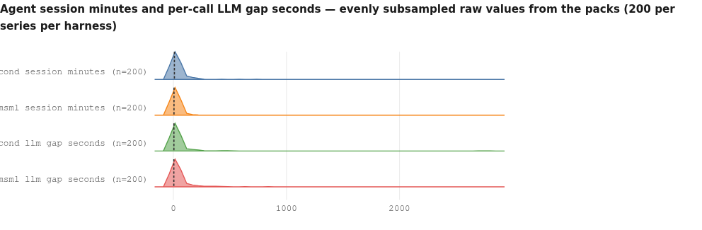

<details><summary>chart data</summary>

```chart
type: density
title: Agent session minutes and per-call LLM gap seconds — evenly subsampled raw values from the packs (200 per series per harness)
series cond session minutes: 449.86, 1.76, 85.79, 1.67, 2.89, 2.76, 2.96, 1.83, 2.45, 2.5, 1.72, 12.86, 1.26, 21.28, 1.0, 0.61, 3.73, 2.38, 1.17, 4.01, 15.44, 24.75, 14.26, 2.33, 7.2, 7.06, 7.55, 5.34, 13.88, 5.55, 7.84, 96.89, 4.22, 31.17, 30.93, 71.68, 235.99, 60.09, 93.72, 194.83, 0.79, 6.75, 5.57, 0.56, 2.68, 4.27, 2.93, 4.94, 4.17, 11.26, 1.46, 1.87, 184.51, 4.41, 16.36, 5.22, 0.6, 0.32, 8.43, 23.71, 9.23, 20.36, 7.5, 4.01, 7.43, 24.57, 0.27, 36.68, 22.51, 26.02, 0.65, 719.44, 22.18, 32.58, 1.21, 8.79, 94.2, 10.01, 34.37, 4.1, 20.14, 47.94, 566.92, 30.0, 26.31, 83.92, 10.05, 25.54, 25.01, 25.49, 42.83, 4.9, 7.94, 0.86, 5.72, 3.43, 8.09, 13.37, 10.47, 29.68, 8.52, 19.48, 4.15, 80.2, 11.42, 80.1, 69.75, 35.43, 75.44, 62.84, 3.74, 3.78, 5.34, 0.78, 3.44, 1.59, 4.12, 8.22, 3.59, 1.08, 17.8, 199.87, 190.46, 134.52, 107.89, 115.21, 44.84, 68.01, 181.77, 19.25, 0.0, 152.41, 3.96, 0.53, 9.18, 9.17, 12.35, 11.36, 22.46, 10.58, 11.93, 118.67, 238.47, 182.03, 77.33, 60.12, 13.13, 58.68, 76.17, 29.28, 3.61, 67.25, 0.17, 4.3, 4.18, 3.89, 3.43, 5.04, 13.51, 5.83, 0.7, 2.5, 0.36, 128.71, 1.71, 2.51, 6.32, 6.69, 7.77, 7.89, 4.29, 28.94, 9.22, 0.44, 12.16, 7.62, 9.43, 30.92, 9.01, 32.33, 48.98, 11.87, 0.98, 11.53, 0.35, 25.55, 15.56, 13.46, 9.52, 1.24, 0.64, 182.43, 2.2, 0.33, 0.39, 2.25, 1.83, 1.2, 22.02, 27.23
series msml session minutes: 124.36, 8.48, 123.58, 2.04, 1.44, 0.66, 3.51, 6.04, 1.95, 1.45, 22.73, 13.68, 112.85, 0.9, 0.64, 0.68, 6.6, 0.76, 0.96, 4.12, 144.69, 2.95, 0.57, 2.49, 1.55, 2.8, 3.05, 1.12, 8.56, 2.03, 34.72, 24.57, 1.17, 70.48, 16.41, 38.33, 18.16, 22.51, 12.77, 23.15, 115.46, 0.57, 0.15, 0.67, 0.51, 0.27, 4.52, 31.27, 6.56, 25.67, 7.99, 5.9, 1.73, 2.86, 2.35, 2.36, 2.78, 1.82, 2.55, 2.43, 20.9, 14.3, 5.85, 0.77, 12.68, 19.14, 16.32, 27.05, 24.92, 11.43, 325.89, 11.8, 3.62, 2.81, 1.86, 4.47, 3.56, 0.96, 5.26, 5.21, 241.5, 33.62, 1.27, 41.89, 62.71, 25.36, 22.12, 19.8, 38.33, 35.13, 27.46, 4.15, 3.54, 71.91, 9.81, 3.87, 44.82, 4.2, 7.41, 10.85, 32.81, 3.49, 2.27, 2.05, 1.3, 2.46, 0.97, 3.25, 4.37, 3.23, 109.55, 20.06, 594.24, 18.41, 25.22, 88.4, 22.54, 32.27, 36.66, 47.45, 37.44, 4.61, 73.38, 5.26, 2.86, 4.77, 2.39, 3.39, 26.12, 25.72, 53.79, 13.01, 36.9, 2.26, 19.97, 18.67, 48.6, 19.24, 35.47, 51.23, 24.05, 14.17, 2.22, 2.82, 2.51, 5.58, 6.95, 7.05, 3.72, 3.67, 6.1, 5.15, 2.56, 1.4, 0.92, 0.59, 1.79, 7.21, 32.96, 8.36, 36.01, 9.9, 1.75, 2.59, 2.32, 5.2, 2.67, 13.59, 4.59, 4.44, 34.12, 3.63, 3.08, 1.47, 9.17, 3.61, 3.18, 18.23, 11.2, 3.01, 1.49, 1.29, 3.05, 6.54, 0.46, 0.76, 0.76, 0.42, 14.67, 99.79, 50.36, 4.76, 2.73, 4.42, 1.73, 11.22, 2.1, 1.59, 8.88, 0.94
series cond llm gap seconds: 1.517, 14.841, 0.97, 1.069, 0.31, 1.679, 0.724, 1.031, 2.522, 6.471, 0.998, 1.361, 1.098, 4.636, 11.702, 1.89, 0.415, 1.326, 2.284, 1.22, 1.609, 1.334, 4.947, 1.973, 0.652, 1.81, 0.779, 1.564, 0.686, 3.021, 19.514, 14.531, 7.992, 16.939, 79.816, 46.162, 26.814, 2762.957, 22.399, 100.214, 0.657, 1.13, 0.667, 2.246, 0.61, 3.662, 2.09, 1.182, 1.092, 0.4, 2.303, 2.887, 19.466, 5.494, 2.243, 4.499, 0.46, 0.854, 3.998, 2.716, 45.066, 10.584, 19.354, 17.944, 27.237, 12.144, 173.085, 21.728, 82.368, 93.304, 2.312, 2.835, 3.198, 1.025, 10.244, 7.674, 6.959, 3.011, 2.942, 1.214, 32.818, 35.63, 38.451, 81.125, 239.934, 36.599, 468.148, 194.565, 63.999, 59.751, 1.549, 3.765, 0.647, 1.629, 1.438, 1.939, 240.013, 1.919, 36.19, 5.854, 33.339, 218.103, 190.881, 59.027, 22.349, 456.128, 412.305, 194.634, 80.802, 51.34, 1.484, 5.208, 3.615, 0.546, 10.928, 1.636, 1.785, 3.504, 1.615, 4.101, 57.711, 166.998, 13.571, 59.441, 307.31, 3.009, 33.588, 12.241, 10.608, 38.53, 1.397, 5.404, 3.361, 1.29, 38.866, 3.071, 1.509, 58.274, 1.613, 18.82, 23.711, 6.523, 14.065, 71.487, 22.703, 145.552, 48.382, 186.914, 39.519, 124.296, 1.103, 33.503, 11.858, 31.686, 3.601, 22.314, 11.36, 25.091, 2.66, 3.978, 0.957, 4.057, 0.871, 1.428, 4.212, 0.49, 6.842, 2.773, 2.729, 38.837, 2.023, 14.764, 0.957, 15.319, 4.213, 14.643, 2.763, 9.066, 17.489, 12.849, 2.912, 0.538, 10.814, 36.26, 67.149, 31.029, 20.422, 1.168, 1.851, 16.534, 1.291, 2.727, 2.499, 0.596, 6.696, 2.697, 3.328, 0.681, 1.066, 4.362
series msml llm gap seconds: 2.235, 1.249, 21.666, 0.252, 0.899, 13.238, 10.714, 1.262, 83.406, 3.468, 0.889, 1.98, 0.275, 1.477, 0.865, 0.76, 0.476, 1.452, 7.294, 1.267, 2.364, 1.183, 11.336, 13.106, 1.687, 1.676, 0.922, 1.189, 0.534, 0.951, 26.742, 89.713, 146.965, 344.122, 125.171, 59.562, 147.239, 14.05, 184.368, 24.068, 1.005, 1.283, 0.702, 0.319, 0.949, 2.271, 0.753, 2.457, 3.044, 1.499, 1.367, 3.75, 0.916, 0.811, 51.154, 20.638, 0.537, 1.196, 2.713, 1.453, 17.921, 10.808, 13.071, 15.685, 98.644, 181.659, 150.19, 22.588, 52.607, 67.211, 2.298, 0.795, 2.039, 1.871, 1.95, 0.294, 0.358, 4.893, 1.843, 2.357, 201.262, 6.205, 17.883, 39.682, 49.003, 24.457, 238.237, 439.45, 42.473, 29.771, 2.29, 3.687, 72.266, 4.222, 2.232, 1.806, 4.06, 3.426, 151.442, 22.454, 2.199, 11.24, 1.383, 9.493, 0.966, 0.573, 0.798, 1.108, 3.272, 2.218, 88.766, 145.037, 64.741, 347.556, 625.216, 78.61, 291.801, 864.48, 21.418, 307.219, 1.534, 2.574, 1.089, 7.692, 3.151, 1.979, 0.952, 5.782, 4.925, 0.835, 37.335, 16.129, 244.965, 94.506, 9.437, 54.33, 47.084, 391.154, 481.067, 54.506, 2.442, 3.508, 2.235, 1.31, 106.35, 41.205, 3.751, 2.227, 1.152, 2.022, 0.797, 7.224, 0.705, 0.594, 2.306, 1.76, 17.843, 6.155, 3.921, 0.575, 44.799, 11.246, 41.66, 0.979, 0.59, 13.105, 31.265, 4.774, 16.99, 16.263, 2.477, 118.843, 8.495, 22.782, 81.23, 44.528, 1.928, 8.198, 1.666, 4.237, 1.161, 4.048, 1.232, 5.293, 2.881, 1.423, 1.576, 7.975, 1.241, 5.793, 2.434, 5.206, 9.575, 1.705, 56.478, 24.508, 13.193, 56.879, 54.194, 16.834
```

</details>

### Process comparison

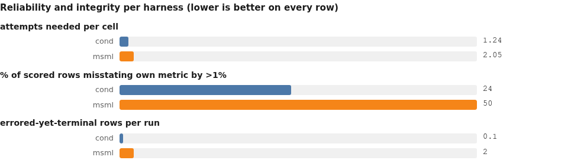

<details><summary>chart data</summary>

```chart
type: grouped
title: Reliability and integrity per harness (lower is better on every row)
row attempts needed per cell | cond=1.24 | msml=2.05
row % of scored rows misstating own metric by >1% | cond=24.0 | msml=50.0
row errored-yet-terminal rows per run | cond=0.10 | msml=2.00
```

</details>

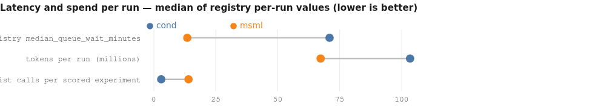

<details><summary>chart data</summary>

```chart
type: dumbbell
title: Latency and spend per run — median of registry per-run values (lower is better)
row registry median_queue_wait_minutes | cond=70.9 | msml=13.5
row tokens per run (millions) | cond=103.4 | msml=67.3
row strategist calls per scored experiment | cond=3.0 | msml=14.0
```

</details>

### The reasonfix change, per cell

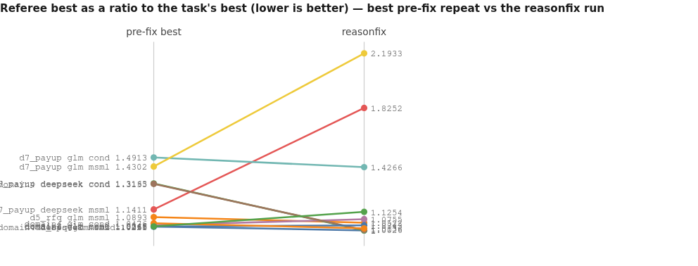

<details><summary>chart data</summary>

```chart
type: slope
title: Referee best as a ratio to the task's best (lower is better) — best pre-fix repeat vs the reasonfix run
x: pre-fix best -> reasonfix
slope d5_rfq glm cond | 1.026 | 1.0
slope d5_rfq glm msml | 1.0893 | 1.0522
slope d7_payup deepseek cond | 1.3163 | 1.0
slope d7_payup deepseek msml | 1.1411 | 1.8252
slope d7_payup glm cond | 1.4913 | 1.4266
slope d7_payup glm msml | 1.4302 | 2.1933
slope domain2 glm cond | 1.0346 | 1.0755
slope domain4 deepseek cond | 1.3135 | 1.0026
slope domain4 deepseek msml | 1.0261 | 1.0343
slope domain4 glm cond | 1.0476 | 1.0136
slope domain4 glm msml | 1.0265 | 1.1254
```

</details>

cond improves in 5 of 6 cells, msml in 1 of 5. With n=2 repeats in most cells the delta *is* the replication range — the pattern across cells, not any single arrow, is the evidence.

---

## 4. Findings, in plain language

**What cond does well.**

1. **It keeps an honest board.** cond's rows agree with an independent recompute: 24% of rows off by >1% vs msml's 50%, median deviation 3.3e-07 vs 1.08e-02, worst case 14.5% vs 1493%. The referee's own coarser "reproduced" flag agrees pre-reasonfix and stops discriminating in reasonfix, where the tighter test still separates them (cond 0/12 rows off on both models, msml 12/12 at ≤5%). *(finding #6)*
2. **Its verifier finds real problems.** In `d7r_dsv4_cond` the arbiter re-implemented the champion's features from scratch and quantified a same-day-borrow leak — 2.746 leaky vs 3.000 clean — and also caught the *critic's* clean variant being buggy. Conductor directives are cited verbatim inside experiment hypotheses ("Conductor directive d-e09d89 flags this"; "Directive d-6a403b requests a home-run attempt"), including a directive mandating that the referee-recomputed metric be written into `results/metrics.json`. *(finding #19)*
3. **It elicits about twice the engineering per experiment** from the same models: 769.5 vs 407.25 median code lines per experiment, 22.5 vs 12.5 functions, 158 vs 118.5 preserved files, 24 vs 12 report/note files — with zero unparseable Python files on either side. *(finding #15)*
4. **It survives infrastructure trouble in-process.** cond needed 1.24 attempts per cell to msml's 2.05; on the storm evening the cond runs absorbed 251-4,098 retries and finished, while four msml cells were aborted and relaunched. *(findings #3, #5)*

**What cond does badly.**

5. **Queue latency.** Registry `search.median_queue_wait_minutes` is 70.9 at the cond median vs msml's 13.5, and reaches 256.3 / 254.4 / 222.9 / 199.1 in four cond runs. A hypothesis can idle for hours before it starts. *(finding #12)*
6. **Token cost, mostly not where people assume.** In the 4.3x case (`d2_glm_cond`, 520.7M vs its msml pair's 121.5M): the strategist seat alone is 210.5M over 3,606 calls at 58,376 tokens per call; conductor+verifier are 110.0M (21.1%); 444 failed `read_file` calls cost ~25.9M (5.0%); the history was entirely uncached while each request repeated 93.28% of the previous one verbatim. Corpus-wide the extra seats are 21.8% of cond's 2,171.4M tokens. *(findings #7, #18)*
7. **Verification is scheduled, not requested, and governance is unacknowledged.** 115 verifier seats and 1,097 verification artifacts against 34 `request_verification` calls; only 11.5% of cond rows cite a directive, and those rows sit at within-run score percentile 0.463 against 0.507 for the rest — a 0.044 nudge with no dispersion computed, i.e. neither a lift nor its absence. `d7r_dsv4_cond` logged **zero** directive acknowledgements. *(findings #7, #19)*

**What msml does well.**

8. **Its completion gate is correctly designed.** `complete_research` refuses while work is outstanding — 6 of the 8 calls I inspected were refused with the blocking rows named — so msml's fast finishes are not abandonment. cond's two observed run-end gates police elapsed time (`min_runtime_hours=6.0`) and analysed-row count (`min_analyzed_before_end=20`), not outstanding work. *(finding #13)*
9. **Low latency and lower spend:** registry median queue wait 13.5 minutes, 67.3M tokens per run, shorter sessions and shorter LLM gaps at every quartile.

**What msml does badly.**

10. **The phase-2 gate can kill a healthy run.** In the archived `d2r_glm_msml.failed_phase2gate_0508`, all eight critic transcripts returned **PASS**; the builder kept re-entering the loop over the critic's optional notes under a run-time "fix all issues" instruction; the log recorded `Max fix iterations reached during critic loop — aborting Phase 2` at 04:39:03; four minutes later the supervisor reported `Phase 2 Framework Review — VERDICT: PASS`; the process exited **code=1** at 04:44:00 after 6h20m, and the cell needed two further attempts. The loop exits on a counter, not on a verdict, and the counter is fatal. *(finding #4)*
11. **Failed experiments reach the board.** 40 errored-yet-terminal rows across 20 msml runs vs 2 across 21 cond runs. Most publish null metrics, but some publish real ones: `ensemble_tsmixer_ridge` carries `error='SLURM TIMEOUT'` and `rmse_pooled 0.0224` — and is the **top entry on msml's side of pair domain4_deepseek**, inflating that margin (it did not decide the pair; the runner-up at 0.023256 would still have won). *(finding #11)*
12. **Prompt-template bug.** msml agents were sent to read `{workspace}/agenda.md` with the placeholder unexpanded 12 times, plus 11 more for `{workspace}/private/proxy_state.md` — a rendering defect, not a model error. *(finding #8)*

**Shared defects (both harnesses).**

13. **Prompts promise artifacts the pipeline doesn't write.** 959 missing-file `read_file` failures over 21 cond runs and 881 over 20 msml runs — the same order. Same two dominant families on both sides: `experiments/<exp>/debrief.md` (393 cond / 204 msml) and `experiments/<exp>/results/metrics.json` (136 / 87), both named verbatim in `adapter/phase3_reporter.md`. *(finding #8)*
14. **Reasoning-trace replay is fragile under connection failure.** 18 of 41 runs (all pre-2026-08-07 GLM/deepseek: 4 deepseek, 14 glm) sent **0%** of requests with a trace while their responses produced them. After the fix, replay is 92.4-97.1% — except `d5r_glm_cond` at 74.47%, whose 511 unanswered requests, 4,098 retries and 51 tracebacks show that a dropped response takes its trace with it. Persist the trace with the request record. *(finding #9)*

**Model behaviour.**

15. **deepseek-v4-flash is the sloppiest on tool protocol**, and it is the *model*, not the harness: it invents names under both harnesses (`cat`, `_shell_exec`, `memorro_search`, `execute`, `exec_script`, `write_debrief`, `file_write`) and alone corrupts the tool-name field with its own tool-call syntax. Both harnesses answer identically with a hard `[ERROR] Unknown tool:`; glm-5.2 invented **zero** names in 70k invocations. Rates are tiny (≤1.42 per 1k), so it is a tie-breaker. *(finding #10)*
16. **kimi-k3 buys quality with clock time.** Best median normalised quality and two of four task bests, at registry wall_hours median 18.76 h against glm's 4.78 h — and roughly half glm's tokens. *(finding #14)*

---

## 5. Corrections and retractions

- **Operator fact corrected.** "511 agent deaths in `d5r_glm_cond`" is not deaths: 511 is the count of agent-visible API error events (identical to its requests-minus-responses gap). Actual seats that issued a request and never got a reply: **11**. *(finding #5)*
- **Planning hypothesis retracted.** The plan predicted the 444 strategist `read_file` failures would be "one repeated bad path"; they are **25 distinct paths in five families**, and the same failure mode occurs at essentially the same per-run rate in msml. A single-path fix would have removed almost none of it. *(finding #8)*
- **Planning framing retracted.** The plan treated `negative results` as deliberately-logged negative findings (a virtue, "kimi msml d4 = 6"). The registry defines it as *experiments that errored yet still carry a metric* — so msml's 40-vs-2 is an integrity liability, not a scientific-honesty credit. *(finding #11)*
- **Suspicion of msml "early quitting" withdrawn.** `d4_dsv4_msml`'s "1 scored row of 15" is a referee scoring-coverage artefact; all 15 rows had finished before completion was declared, and the same run put 11 entries on the pair leaderboard. Its registry time_to_best_hours of 0.51 is real, but it is one tail of a distribution whose median cross-pair difference is -0.08 h. *(finding #13)*
- **Undeclared confound added.** The reasonfix era also switched **prompt caching** on: cache-read fraction 0.0-0.011 in all 18 pre-fix GLM/DS runs, 0.582-0.933 in all 12 reasonfix runs, 0.003-0.033 in all 11 kimi runs. Cross-era token/cost comparisons for GLM/DS are confounded. *(finding #16)*
- **Instrumentation artefact.** `d2v_k3_msml`'s apparent 50% seat-completion is not 58 dead agents: 56 of its 117 "sessions" are experiment-named transcripts with zero API calls. *(finding #5)*

---

## 6. What to change first

### `cond` — ranked
1. **Cut queue latency.** Registry median 70.9 min per run, up to 256.3; msml shows 13.5 is achievable under the same contention. *(finding #12)*
2. **Rotate or summarise the strategist session.** 210.5M tokens over 3,606 calls at 58,376 tokens/call in one run is the largest single line item in the corpus. *(finding #18)*
3. **Keep prompt caching on permanently.** cond's reasonfix runs cache 0.746-0.854 of input; its pre-fix runs cached nothing while repeating 93% of each request verbatim. *(findings #16, #18)*
4. **Make the artifact contract true.** Write `debrief.md`/`results/metrics.json` stubs (or expose a board API) — 393 + 136 dead reads chase files the prompts promise. *(finding #8)*
5. **Trim scheduled verification, keep the arbiter.** 115 verifier seats / 1,097 artifacts for 34 requests is over-provisioned; the recompute-and-arbitrate function is the part that earned its keep. *(findings #7, #19)*
6. **Make directives auditable.** 11.5% citation rate and zero acknowledgements in the run examined; require an ack or drop the ceremony. *(findings #7, #19)*
7. **Add an active-work check to run-end.** Elapsed-time and analysed-count floors do not know what is still running; msml's guard shows the shape of the fix. *(finding #13)*

### `msml` — ranked
1. **Fix the phase-2 gate.** Exit the critic loop on the first PASS; make the iteration cap a warning that proceeds with the last passing build. This bug burned 6h20m and forced two extra attempts on one cell. *(finding #4)*
2. **Quarantine errored experiments.** 40 rows finished as `done` while carrying an error, and some carried metrics onto the leaderboard, including the top entry of one pair. Mark them partial and exclude from ranking. *(finding #11)*
3. **Adopt an in-run recompute contract.** 50% of msml's rows misstate their own metric by >1%, worst case 1493%; cond's directive forcing a referee recompute into `results/metrics.json` is the mechanism to copy. *(findings #6, #19)*
4. **Substitute `{workspace}` in prompt templates.** 23 tool calls went out with the literal placeholder in the path. *(finding #8)*
5. **Reduce attempts-to-completion.** 2.05 attempts per cell, and one cell (kimi/domain4/vary) lost after four tries — improve resume-after-outage rather than relying on relaunch. *(finding #3)*
6. **Same artifact-contract fix as cond** (`debrief.md`, `metrics.json`: 204 + 87 dead reads). *(finding #8)*
7. **Trim the strategist's polling.** 14 strategist calls per scored experiment vs cond's 3, with one run at 828. *(finding #12)*

### Infrastructure (owner of the serving path)
1. **Persist reasoning traces with the request record** so replay survives dropped responses (`d5r_glm_cond`: 74.47% replay under storm vs 92.4-97.1% normally). *(finding #9)*
2. **Find out whether kimi can cache.** kimi sits at 0.003-0.033 cache-read fraction in every era it appears in, and has no cell in the caching-enabled era — so kimi's token bill may be inflated for a fixable reason. *(finding #16)*

---

## 7. What stays unresolved, and why

| question | status | why, and what would settle it |
|---|---|---|
| Is cond's advantage *caused* by reasoning replay? | **unresolved; association strong (p=0.0048)** | The reasonfix change bundles replay with prompt caching, and kimi — the era control — has no reasonfix cell. One run with replay off and caching on (or the reverse) settles it. |
| Did the reasonfix treatment move quality beyond noise in any single cell? | **unresolvable as posed** | With n=2 repeats the treatment delta and the replication range are the same number. Only the 5/6-vs-1/5 sign pattern is informative. n≥3 per cell fixes this. |
| Which model per agent seat? | **untestable in this corpus** | All 41 runs are single-model in every transcript (verified per run); the campaign's mixed-model attempts were aborted before completion. |
| Does cond's verifier improve row-level scores? | **unresolved** | Its effect is visible in integrity (finding #6) and one traced leak audit; the only row-level proxy available (directive citation) gives 0.463 vs 0.507 with no dispersion — neither a lift nor its absence. Verification was scheduled per champion, not per row, so verifier-conditioned rows cannot be isolated. |
| Is domain2 a cond win? | **no verdict possible** | The referee marks all four domain2 pairs incomparable (per-run held-out slices). Within-run bests exist (cond+kimi 0.78205 is the lowest recomputed value) but cannot serve as a cross-harness verdict. |
| Why did the reasonfix storms hit only cond's cells? | **unresolved** | Consistent with cond retrying in-process while msml attempts were aborted and relaunched (four msml reasonfix cells carry `aborted_glmdown_2144`), but launch scheduling relative to the two serving restarts is not recorded in the preserved artifacts. |
