# Traffic forecasting (domain4): cond vs msml, seven models, 19 runs — the union report

*Everything below is measured from the preserved artifacts of 19 finished runs on one task
(hourly road-occupancy forecasting, 862 sensors, 24-hour horizon, RMSE, lower is better).
Two harnesses are compared: **cond** (a conductor seat + verifier seat on top of a
strategist/worker pipeline) and **msml** (the same pipeline with no conductor and no verifier;
the strategist owns orchestration). Registry census tables are in the appendix.*

Throughout, "champion value" means a run's leading RMSE, and every cross-run champion value is
re-scored by the referee on the single validation identity all 19 runs share (the 7-origin pool
14036-14180). Registry timing quantities are quoted with their registry names.

---

## 1. Headline verdicts

| # | Verdict | Margin grade | What would change it |
|---|---|---|---|
| 1 | **Neither harness wins on quality for this task.** Five of six referee pair margins (0.000015-0.001171 RMSE) are smaller than the corpus's own run-to-run spread (0.002296); the gpt pair even flips sign when re-scored on the shared pool. | decisive-that-it's-undecidable | 3+ repeats per cell per side; margins would need to exceed ~0.002 |
| 2 | **cond's CPU/GPU routing default is right and msml's is wrong.** cond routes to GPU unless there is positive CPU evidence; msml routes to CPU whenever it finds no GPU marker. msml consequently ran 60-92% of experiments on CPU vs cond's 0-20%, and carries 24 of the corpus's 27 timeout deaths. | strong (mechanism in source + 19-run census) | a run where msml's CPU share is low and its timeouts persist |
| 3 | **msml's stop-work control is broken.** 32 `cancel_experiments` calls across nine runs cancelled **zero** rows; the guard refuses anything a worker holds. Two runs then deadlocked on `complete_research` (10 and 4 refusals). cond's `kill_experiment` succeeded 6/6. | strong (census + source) | a single successful msml cancellation anywhere in the corpus |
| 4 | **cond's verifier/analysis stage is a real capability msml lacks** — 36-153 analysis scripts per cond run vs 0-2 in msml; 1-20 verify outputs per cond run vs 0. It reproduced a reported RMSE to 1e-12 and caught a model claiming 100% explained variance where the truth is 77.1%. | strong on existence, weak on payoff | showing the same catches happening in msml some other way |
| 5 | **But verification is not integrity.** The corpus's worst self-report drift (1 of 9 rows reproducing, offsets ~1.1e-3, all optimistic) is a *cond* run with three verifier seats. | strong | a mandatory machine reproduction gate would make this measurable |
| 6 | **8 of 19 runs ran blind to their own reasoning** (all glm, all deepseek): 19-73% of responses produced reasoning, 0% of requests carried it back. Identical under both harnesses → shared serving/request-assembly defect, not an architecture choice. | decisive (full transcript census) | a post-fix run; none exists |
| 7 | **Model tier on the shared pool:** claude-opus-5 (0.021507) > claude-opus-4-8 (0.021697) > kimi-k3 (0.021847) ≈ gpt-5.6-sol (0.021898) > glm-5.2 (0.022218) > deepseek-v4-flash (0.022418). | moderate (1-6 runs per model, one task) | repeats per model |
| 8 | **kimi-k3's three runs are the corpus's longest.** registry wall_hours = 18.76, 21.56, 24.44 for them against 3.58, 4.24, 4.26, 4.53, 4.57, 5.14, 5.34, 7.28, 7.44, 8.89 for every other run with a published value. | decisive on the fact, endpoint-tied on the cause | faster serving |
| 9 | **Combination to run today: cond + claude-opus-5 or cond + gpt-5.6-sol.** If elapsed time is free, kimi-k3 is competitive; if dollars matter, glm-5.2 under either harness is $0 and within 0.001 RMSE of the leaders. | moderate | the opus-5 × cond cell was never run with a matching conductor model |
| 10 | **Four registry metrics are wrong or misleading** (tokens/tools = 0 for six runs, mid-run adapter patches inverted, completion failures undercounted, verification artifacts blind to msml). All are on the record in §14 with both values. | decisive | metric redefinition |

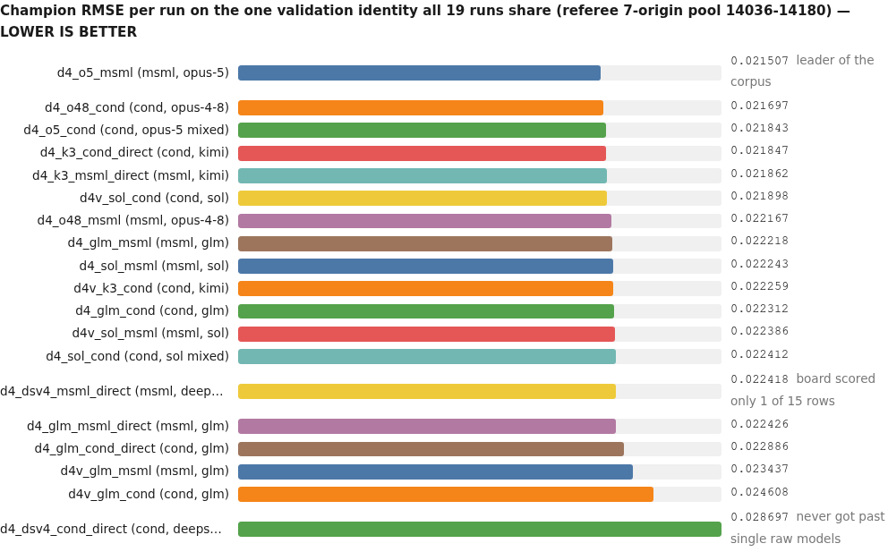

<details><summary>chart data</summary>

```chart
type: bars
title: Champion RMSE per run on the one validation identity all 19 runs share (referee 7-origin pool 14036-14180) — LOWER IS BETTER
d4_o5_msml (msml, opus-5) | 0.021507 | leader of the corpus
d4_o48_cond (cond, opus-4-8) | 0.021697
d4_o5_cond (cond, opus-5 mixed) | 0.021843
d4_k3_cond_direct (cond, kimi) | 0.021847
d4_k3_msml_direct (msml, kimi) | 0.021862
d4v_sol_cond (cond, sol) | 0.021898
d4_o48_msml (msml, opus-4-8) | 0.022167
d4_glm_msml (msml, glm) | 0.022218
d4_sol_msml (msml, sol) | 0.022243
d4v_k3_cond (cond, kimi) | 0.022259
d4_glm_cond (cond, glm) | 0.022312
d4v_sol_msml (msml, sol) | 0.022386
d4_sol_cond (cond, sol mixed) | 0.022412
d4_dsv4_msml_direct (msml, deepseek) | 0.022418 | board scored only 1 of 15 rows
d4_glm_msml_direct (msml, glm) | 0.022426
d4_glm_cond_direct (cond, glm) | 0.022886
d4v_glm_msml (msml, glm) | 0.023437
d4v_glm_cond (cond, glm) | 0.024608
d4_dsv4_cond_direct (cond, deepseek) | 0.028697 | never got past single raw models
```

</details>

---

## 2. Corpus and coverage — what exists, what does not

19 runs, one task, two harnesses, seven model identities, four eras
(`native`, `certclean`, `glm52`, `vary`). All 19 finished with exit code 0; none was
operator-stopped; no run has in-flight rows at the end. Every run had the same budget:
max 20 experiments, 6 workers, 1800 s per experiment.

**The MODEL × HARNESS cube is half empty, and that is data:**

- `cond × claude-opus-5` — exists only as a *mixed-model* run (`d4_o5_cond`: opus-5 everywhere,
  conductor pinned to claude-opus-4-7). No clean cell.
- `cond × gpt-5.6-sol` — one run, also with an opus-4-7 conductor.
- `msml × claude-opus-5`, `msml × claude-opus-4-8`, `cond × claude-opus-4-8` — one run each, no repeats.
- `msml × kimi-k3` — one run (`glm52` era only); **absent from the `vary` era** where cond has one.
- `cond × deepseek`, `msml × deepseek` — one run each, no repeats.
- opus and sol are **absent from the `glm52` era**; deepseek is **absent from `native` and `vary`**.
- `msml × BLANK/mixed-model` — **absent entirely**: only cond ever pinned a different conductor model.

Only four of twelve harness×model cells were replicated at all (cond+glm n=3, msml+glm n=3,
cond+kimi n=2, msml+sol n=2). Denominators differ wildly: terminal rows range 13-35 and
*scored* rows 1-26, so per-run rates always carry their denominator below.

Censoring to know about: the `native` and `certclean` eras preserved **no event stream**, so every
event-derived metric is absent for those six runs; the pair tables print 0.00 there, which must be
read as absence. Those runs' transcripts are gzipped, which silently truncated my own first census
pass. The registry's `lifecycle.wall_hours` is therefore published only for the thirteen runs of the
`glm52` and `vary` eras.

---

## 3. Harness — verdicts, and the governance machinery

### 3.1 Which harness, per task and overall

There is one task, so "per task" and "overall" coincide. **On quality: undecidable.**
Referee pair margins against the corpus's own noise band (largest replication spread 0.002296):

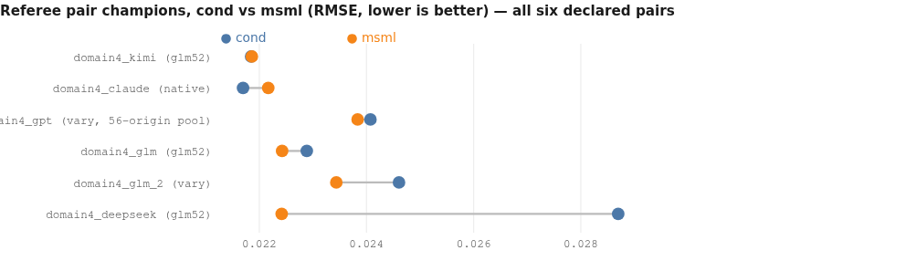

<details><summary>chart data</summary>

```chart
type: dumbbell
title: Referee pair champions, cond vs msml (RMSE, lower is better) — all six declared pairs
row domain4_kimi (glm52) | cond=0.021847 | msml=0.021862
row domain4_claude (native) | cond=0.021697 | msml=0.022167
row domain4_gpt (vary, 56-origin pool) | cond=0.024073 | msml=0.023835
row domain4_glm (glm52) | cond=0.022886 | msml=0.022426
row domain4_glm_2 (vary) | cond=0.024608 | msml=0.023437
row domain4_deepseek (glm52) | cond=0.028697 | msml=0.022418
```

</details>

Margins: kimi 0.000015 (cond), claude 0.000470 (cond), gpt 0.000238 (msml, on its own
56-origin pool — on the shared 7-origin pool cond leads by 0.000488), glm 0.000460 (msml),
glm_2 0.001171 (msml), deepseek 0.006279 (msml). Only deepseek exceeds the noise band, and that
cell is un-replicated and definition-sensitive (msml's own board scored 1 row of 15).

**On process, the verdicts are decidable.** Ranked keep / copy / fix / delete:

| Rank | Item | Owner | Verdict | Evidence |
|---|---|---|---|---|
| 1 | CPU/GPU routing default ("unknown → GPU; CPU needs positive evidence") | cond has it | **msml must copy verbatim**, incl. the CPU-library-wins clause | msml 60-92% CPU vs cond 0-20%; 24 vs 3 timeout rows; error-row rate 0.359 vs 0.028 |
| 2 | Ability to stop assigned/running work (`kill_experiment`, `park_experiment`) | cond has it | **msml must fix `cancel_experiments`** (0 successes in 32 calls) or add a kill path | 37 blocked-row messages; 14 refused `complete_research` calls |
| 3 | Verifier seat + per-experiment analysis stage | cond has it | **msml should copy**; cond should keep | 36-153 analysis scripts/run vs 0-2; verify outputs 1-20 vs 0; exact 1e-12 reproduction; 100%-vs-77.1% variance catch |
| 4 | Prescribed lineage: "cite the experiment ids that informed it" + `propose_variant` + `parent_id` | cond has it | **msml should copy both halves** (text is nearly free; msml literally cannot record lineage today) | citation rate 55-100% (cond) vs 7-69% (msml); same model, 19/20 under cond vs 1/15 under msml |
| 5 | Conductor audit function (phase rewinds, adapter fact-checking, directive channel) | cond has it | **keep, but add teeth** — advice without a gate changed 2 rows out of 13 | caught "Phase 2 was marked done without the phase ever executing"; 11 of 20 rows still ended with no debrief |
| 6 | Fast admission of experiments to execution | msml has it | **cond should fix** its admission latency | registry median_queue_wait_minutes: msml 9.5, 9.9, 10.0, 11.2, 12.2, 13.1, 17.4, 30.2, 136.5 vs cond 37.6, 50.2, 54.7, 70.5, 99.5, 137.4, 151.9, 199.1, 254.4, 256.3 |
| 7 | Embedding-backed semantic memory | msml has it | **fix before copying**: unthrottled, 295/221 gateway 429s, 204/112 degradations to full-text | endpoint census, all 19 run logs |
| 8 | Metric-key ingest (strict `rmse` lookup, no alias, no alarm) | both | **fix in both** — cost msml deepseek its whole board | 12 rows under `rmse_pooled` → 1/15 scored |
| 9 | Launcher that erases `sys.argv` | **both** (identical line in both `local_gpu.py`) | **fix in both** | 5 rows of d4v_sol_msml died in argparse before training |
| 10 | Unbudgeted full-history replay with inline base64 images | both | **fix in both** | 82-94% verbatim re-send per request; images >38% of bytes in five runs |

### 3.2 What each harness elicits from the same model

Holding the model fixed, the harness changes behaviour measurably: gpt-5.6-sol cites prior
experiment ids in 19/20 proposals under cond and 1/15 and 5/20 under msml; glm goes 28/35, 15/20,
13/20 under cond vs 8/20, 4/20, 5/17 under msml. cond's base worker/strategist adapters are
1.5-3x longer than msml's (`phase3_worker_analyze.md` 12471 vs 4246 bytes;
`phase3_worker_implement.md` 12699 vs 8492), so cond is simply telling agents more.

### 3.3 Governance deep-dive: what each seat contributed

- **Conductor (cond only, 5 sessions, 75-564 calls, 1.3-34.8M tokens).** Issued 7-32 directives
  per run, retired 1-49, annotated experiments, killed 6 rows and parked 20 across the corpus,
  and performed 2 phase rewinds in the run I read end-to-end. It caught things nothing else did:
  a phase-2 stage that never executed, phase-0 baseline numbers that were factually wrong, and a
  severed debrief channel. Its weakness is enforcement: four escalating debrief directives
  recovered two rows, and its own final accounting said "3 of 20 rows still need debriefs" while
  the workspace held 9 debriefs for 20 rows.
- **Verifier (cond only, 2-10 seats, 0.1-19.1M tokens).** Produced the only independent
  reproductions in the corpus; see §13.
- **Queue/throttle (cond).** Priority changes 1-29 per run, `set_priority`/`park` used; the cost is
  admission latency (see §10).
- **Routing (both).** The single most consequential difference (§1 verdict 2).
- **Memory (both, embeddings in msml only).** cond 98-524 memory calls with 0 failures; msml
  139-335 calls with failure rates up to 6.3%, all traceable to gateway 429s.
- **Handoff (msml).** `complete_research` lets the strategist end the run itself — cond has no such
  tool and its strategist session simply never ends cleanly (0 clean sessions in 4 cond runs).
  Good idea, but gated on "no active work", which the broken cancel turns into a deadlock.

---

## 4. Model — whole-run and per-seat

### 4.1 Tier ranking (shared 7-origin referee pool, champion value per model)

| Model | runs | champion | median of runs | note |
|---|---|---|---|---|
| claude-opus-5 | 1 (+1 mixed) | 0.021507 | 0.021507 | leading single result in the corpus |
| claude-opus-4-8 | 2 | 0.021697 | 0.021932 | both harnesses |
| mixed opus-5/sol + opus-4-7 conductor | 2 | 0.021843 | 0.022128 | cond only |
| kimi-k3 | 3 | 0.021847 | 0.021862 | longest-running cell (see §1 verdict 8) |
| gpt-5.6-sol | 3 | 0.021898 | 0.022243 | only model with dollar figures |
| glm-5.2 | 6 | 0.022218 | 0.022656 | most-replicated model; $0 |
| deepseek-v4-flash | 2 | 0.022418 | 0.025558 | last, and the only model with tool-name defects |

### 4.2 Capability read from the work products, not the scores

- **claude-opus-5** (msml) wrote the strongest debrief I read: a 25 KB document opening with a
  headline table, an explicit "vs honest zero-fit bar (#1) −5.93%", and a self-check line
  "referee file recomputation 0.021506965453983496 — **exact match to metrics.json (Δ = 0.0)**".
  Its playbook tracks budget and board state turn by turn ("Budget: **0 remaining** (20 of 20
  proposed)").
- **gpt-5.6-sol** (cond) is the most protocol-explicit: its playbook front-loads leakage controls
  (locked 56-origin tuning window, locked 28-origin referee window, "fit ... strictly before the
  cutoff"), and its debrief refuses to overclaim: "the adaptive grouping mechanism adds only a
  microscopic increment ... 0.00000440 RMSE (0.020%)".
- **glm-5.2** (cond) writes the longest playbooks (68 KB) and dense debriefs with referee-verified
  claims ("referee-verified exact to 1e-9, leak-free, CPU 3.8s").
- **kimi-k3** writes strong debriefs when it writes them — and often does not (15 and 10 promised
  debriefs never written).
- **deepseek-v4-flash** produces short but numerically honest artifacts (its 2.3 KB msml playbook
  correctly names 0.02242 as the run's leading value *even though the board scored only one row*) —
  the failure is contract compliance, not comprehension.

### 4.3 Per-seat model choice

| Seat | Recommendation | Confidence | Basis |
|---|---|---|---|
| worker / analyst | opus-5, opus-4-8, sol or glm. **Avoid deepseek**; gate kimi. | strong | deepseek: wrong metric key in 12/15 rows, 10 unwritten debriefs, all 10 non-schema tool calls. kimi: 25 unwritten debriefs across two runs. opus/sol/glm: zero unwritten debriefs in 10 runs |
| strategist | dominated by the prompt, not the model (sol 19/20 vs 1/15 for the same model under two harnesses). Among artifacts, opus-5 and sol are the most protocol-explicit. | moderate | citation census + playbook reads |
| verifier (cond only) | leans **sol or glm** (217 read_file/154 shell_exec, 47 artifacts; 290/134, 70 artifacts) over opus-4-8 (34 shell_exec, 19 artifacts) | weak-moderate | tool census by seat |
| conductor | **unresolved as a model choice** — no run varies the conductor with all else fixed. The strongest governance record I read came from an *unpinned kimi-k3* conductor, so the opus-4-7 pin is not what makes the seat work. | unresolved, with reason | seat-model census; conductor decision logs |
| builder / critic / tester / reporter | no material difference found; token shares are 0.1-4.7M and failure counts are single digits everywhere | n/a | per-seat census, all 19 runs |

---

## 5. Combination — what to run today

Ranked over every cell that exists, using the shared-pool champion value plus process risk:

1. **cond + claude-opus-5** — the pool's leading number came from opus-5 (under msml), and cond adds
   routing/lineage/verification discipline. The clean cell does not exist (the one cond opus-5 run
   has an opus-4-7 conductor and still placed third of nineteen), so this is an extrapolation.
2. **cond + gpt-5.6-sol** — 0.021898 with 20/20 rows scored, 0 execution failures, 47 verification
   artifacts, and the only cell with a dollar ledger ($88.67).
3. **msml + claude-opus-5** — the actual leading number (0.021507, 20/20 scored), but you accept the
   broken cancel path and CPU routing.
4. **cond + kimi-k3** — 0.021847 with 20/20 scored, at the elapsed cost quantified in §1 verdict 8.
5. **msml + kimi-k3** — 0.021862, and the run that deadlocked on `complete_research`.
6. **cond/msml + glm-5.2** — 0.022218-0.024608 at $0; the most replicated and most variable cell.
7. **either + deepseek-v4-flash** — last on quality and the only model with tool-calling defects.

Decision matrix — optimizing **quality**: opus-5. **Quality per dollar**: glm-5.2 ($0) or sol with
cache (95% cache-read). **Elapsed time**: registry wall_hours favours d4v_sol_msml=3.58,
d4_glm_msml=4.24, d4_dsv4_msml_direct=4.26, d4v_sol_cond=4.53, d4v_glm_cond=4.57 over
d4_k3_cond_direct=18.76, d4v_k3_cond=21.56, d4_k3_msml_direct=24.44. **Reliability of the board**:
cond (error-row rate 0.028 vs 0.359).

What would flip these: any repeat that moves a cell by >0.002 RMSE; fixing msml's routing (which
would likely erase most of the reliability gap); a clean cond×opus-5 cell.

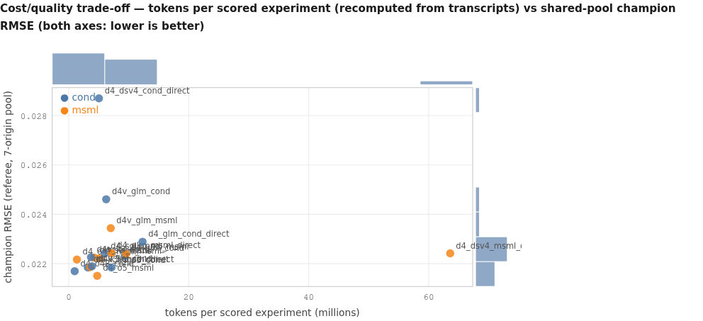

<details><summary>chart data</summary>

```chart
type: scatter
title: Cost/quality trade-off — tokens per scored experiment (recomputed from transcripts) vs shared-pool champion RMSE (both axes: lower is better)
x: tokens per scored experiment (millions)
y: champion RMSE (referee, 7-origin pool)
marginals: true
point d4_o48_cond | 0.99 | 0.021697 | cond
point d4_o48_msml | 1.36 | 0.022167 | msml
point d4_sol_msml | 4.25 | 0.022243 | msml
point d4_o5_msml | 4.75 | 0.021507 | msml
point d4_dsv4_cond_direct | 5.03 | 0.028697 | cond
point d4_glm_msml | 5.17 | 0.022218 | msml
point d4_sol_cond | 6.04 | 0.022412 | cond
point d4v_glm_cond | 6.24 | 0.024608 | cond
point d4v_glm_msml | 7.00 | 0.023437 | msml
point d4_glm_msml_direct | 7.10 | 0.022426 | msml
point d4_o5_cond | 7.11 | 0.021843 | cond
point d4_glm_cond | 9.38 | 0.022312 | cond
point d4v_sol_msml | 9.54 | 0.022386 | msml
point d4_glm_cond_direct | 12.30 | 0.022886 | cond
point d4_k3_cond_direct | 3.19 | 0.021847 | cond
point d4_k3_msml_direct | 3.56 | 0.021862 | msml
point d4v_k3_cond | 3.72 | 0.022259 | cond
point d4v_sol_cond | 3.86 | 0.021898 | cond
point d4_dsv4_msml_direct | 63.58 | 0.022418 | msml
```

</details>

The outlier at 63.58M tokens/scored is the denominator artifact, not extravagance: that run's
board scored 1 row of 15 (§14).

---

## 6. Repeatability

Only four cells were replicated. Spread of the champion value on the shared pool:

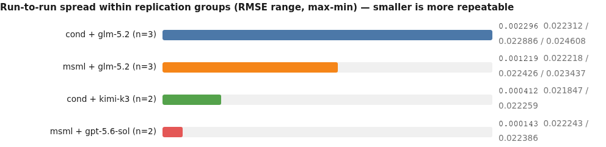

<details><summary>chart data</summary>

```chart
type: bars
title: Run-to-run spread within replication groups (RMSE range, max-min) — smaller is more repeatable
cond + glm-5.2 (n=3) | 0.002296 | 0.022312 / 0.022886 / 0.024608
msml + glm-5.2 (n=3) | 0.001219 | 0.022218 / 0.022426 / 0.023437
cond + kimi-k3 (n=2) | 0.000412 | 0.021847 / 0.022259
msml + gpt-5.6-sol (n=2) | 0.000143 | 0.022243 / 0.022386
```

</details>

Five of six pair margins are inside the largest spread; the gpt margin reverses sign under a
different shared pool. **The pair verdicts do not survive repeat spread.** On the two replicated
glm cells msml's spread is roughly half of cond's — a weak hint that msml is more repeatable, but
with n=3 per side that difference is itself inside sampling noise, and part of the glm spread is
*era* (both `vary`-era glm runs are worse than their `glm52`-era counterparts on both sides).

Search-shape spread within the glm cells: champion families differ run to run
(`ensemble_3way_20_22_8`, `nbeats_direct_head_residual`, `patchtst_residual_ar_168h` on the cond
side; `ensemble_3leg_v3`, `ensemble_patchtst_tsmixer_dl_blend`, `ensemble_5way_xgb_step` on msml's) —
msml's champions are consistently ensembles, cond's mix single models and ensembles.
Registry `search.time_to_best_hours` also swings inside a cell: d4_glm_cond=4.13,
d4_glm_cond_direct=2.63, d4v_glm_cond=1.38 on the cond side and d4_glm_msml=2.57,
d4_glm_msml_direct=1.58, d4v_glm_msml=2.81 on msml's.

---

## 7. Treatment: reasoning replay (a natural contrast, not an experiment)

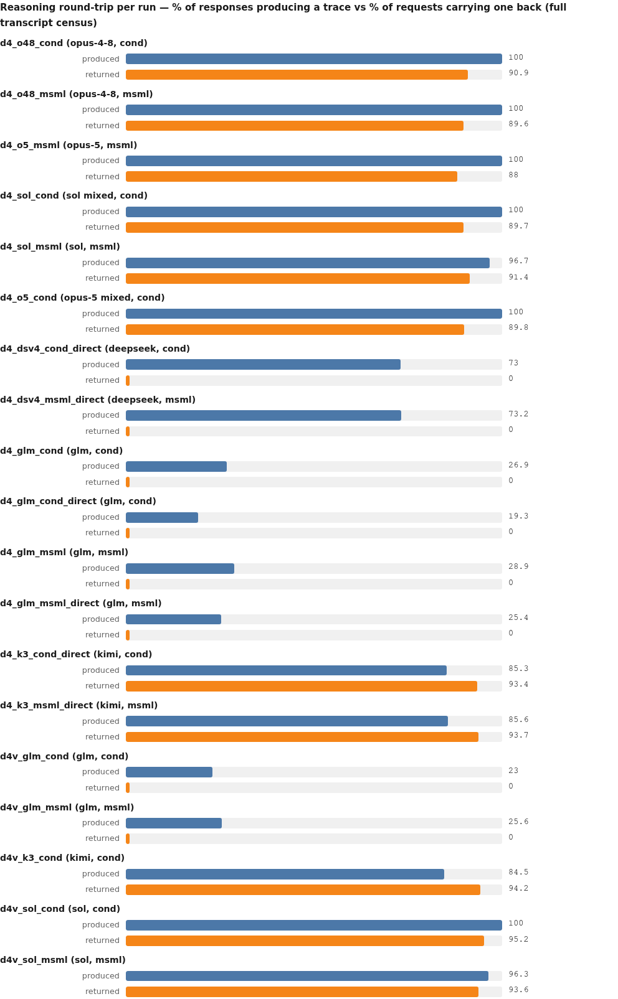

<details><summary>chart data</summary>

```chart
type: grouped
title: Reasoning round-trip per run — % of responses producing a trace vs % of requests carrying one back (full transcript census)
row d4_o48_cond (opus-4-8, cond) | produced=100.0 | returned=90.9
row d4_o48_msml (opus-4-8, msml) | produced=100.0 | returned=89.6
row d4_o5_msml (opus-5, msml) | produced=100.0 | returned=88.0
row d4_sol_cond (sol mixed, cond) | produced=100.0 | returned=89.7
row d4_sol_msml (sol, msml) | produced=96.7 | returned=91.4
row d4_o5_cond (opus-5 mixed, cond) | produced=100.0 | returned=89.8
row d4_dsv4_cond_direct (deepseek, cond) | produced=73.0 | returned=0.0
row d4_dsv4_msml_direct (deepseek, msml) | produced=73.2 | returned=0.0
row d4_glm_cond (glm, cond) | produced=26.9 | returned=0.0
row d4_glm_cond_direct (glm, cond) | produced=19.3 | returned=0.0
row d4_glm_msml (glm, msml) | produced=28.9 | returned=0.0
row d4_glm_msml_direct (glm, msml) | produced=25.4 | returned=0.0
row d4_k3_cond_direct (kimi, cond) | produced=85.3 | returned=93.4
row d4_k3_msml_direct (kimi, msml) | produced=85.6 | returned=93.7
row d4v_glm_cond (glm, cond) | produced=23.0 | returned=0.0
row d4v_glm_msml (glm, msml) | produced=25.6 | returned=0.0
row d4v_k3_cond (kimi, cond) | produced=84.5 | returned=94.2
row d4v_sol_cond (sol, cond) | produced=100.0 | returned=95.2
row d4v_sol_msml (sol, msml) | produced=96.3 | returned=93.6
```

</details>

**Census:** 8 runs blind (6 glm, 2 deepseek), 11 replaying. The observed pattern is
production-without-return — not an extractor gap that zeroes both sides — and the mechanism is
visible in the transcripts: in kimi requests the replayed assistant items carry a
`reasoning_content` field; in glm requests the same items carry only `role`/`content`/`tool_calls`.
It appears identically under both harnesses, so it is a serving/request-assembly property of the
lab GLM and deepseek endpoints.

**Which model with replay, which without?** This corpus cannot separate replay from model and era:
no post-fix glm or deepseek run exists. What can be said: the two models that ran blind are also the
two lowest-placed models; the models that replay occupy the top five places; blind runs spend 0.0%
of request bytes on retained thinking while replaying runs spend 7.6-14.3%; and per-call latency
does not separate on replay either (the blind runs are the *fastest* in the corpus, median
1.52-2.97 s per call). Treat all of this as a natural contrast, not a treatment effect, and never
quote it as "replay is worth X RMSE".

---

## 8. Reliability — interference vs harness defects vs model defects

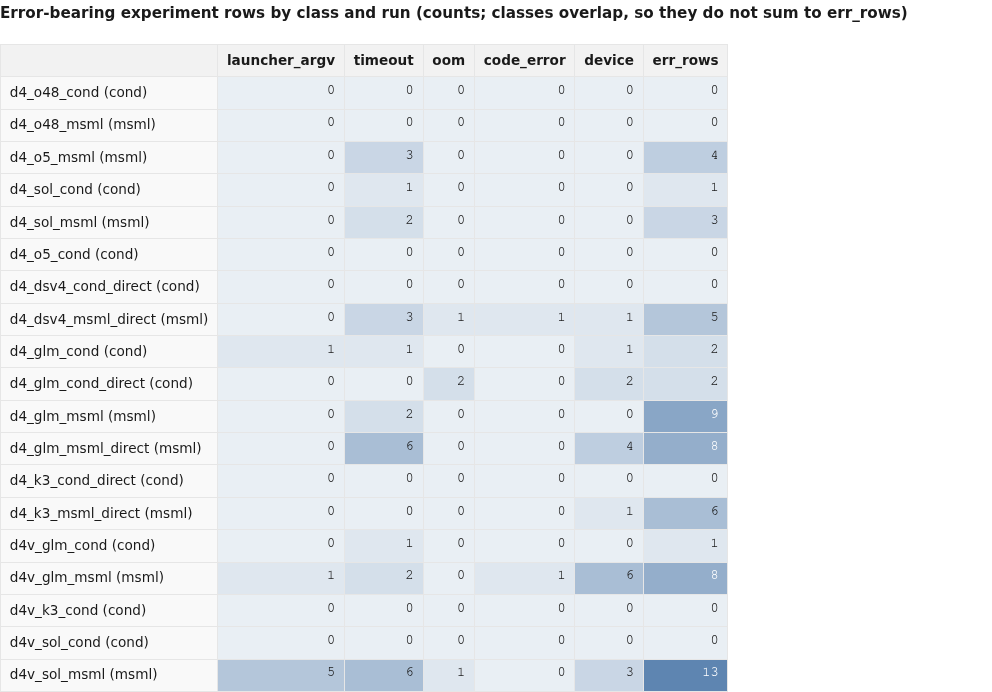

<details><summary>chart data</summary>

```chart
type: heatmap
title: Error-bearing experiment rows by class and run (counts; classes overlap, so they do not sum to err_rows)
cols: launcher_argv | timeout | oom | code_error | device | err_rows
row d4_o48_cond (cond) | 0 | 0 | 0 | 0 | 0 | 0
row d4_o48_msml (msml) | 0 | 0 | 0 | 0 | 0 | 0
row d4_o5_msml (msml) | 0 | 3 | 0 | 0 | 0 | 4
row d4_sol_cond (cond) | 0 | 1 | 0 | 0 | 0 | 1
row d4_sol_msml (msml) | 0 | 2 | 0 | 0 | 0 | 3
row d4_o5_cond (cond) | 0 | 0 | 0 | 0 | 0 | 0
row d4_dsv4_cond_direct (cond) | 0 | 0 | 0 | 0 | 0 | 0
row d4_dsv4_msml_direct (msml) | 0 | 3 | 1 | 1 | 1 | 5
row d4_glm_cond (cond) | 1 | 1 | 0 | 0 | 1 | 2
row d4_glm_cond_direct (cond) | 0 | 0 | 2 | 0 | 2 | 2
row d4_glm_msml (msml) | 0 | 2 | 0 | 0 | 0 | 9
row d4_glm_msml_direct (msml) | 0 | 6 | 0 | 0 | 4 | 8
row d4_k3_cond_direct (cond) | 0 | 0 | 0 | 0 | 0 | 0
row d4_k3_msml_direct (msml) | 0 | 0 | 0 | 0 | 1 | 6
row d4v_glm_cond (cond) | 0 | 1 | 0 | 0 | 0 | 1
row d4v_glm_msml (msml) | 1 | 2 | 0 | 1 | 6 | 8
row d4v_k3_cond (cond) | 0 | 0 | 0 | 0 | 0 | 0
row d4v_sol_cond (cond) | 0 | 0 | 0 | 0 | 0 | 0
row d4v_sol_msml (msml) | 5 | 6 | 1 | 0 | 3 | 13
```

</details>

**Named causes and counts:**

- **External interference (operator-declared, verified):** kimi serving latency. Median per-call gap
  57.5-73.2 s vs 1.5-13.6 s elsewhere; 224-270 gaps over 300 s per kimi run; summed
  request-to-response waiting across all seats 76.7-88.8 (in hour units). Log signatures:
  "API error: timed out. Retrying" ×42/×29 and "Agent stopped unexpectedly" ×20/×13/×8.
  Not attributable to either harness (identical distributions on both sides).
- **Shared-infrastructure defects:** the launcher that erases `sys.argv` (identical line in both
  harnesses' `local_gpu.py`; 5 rows lost in d4v_sol_msml, 1 each in a cond and an msml glm run);
  the embeddings-gateway 429 storms (msml-only by design, 295/221/29/27/9); the reasoning-replay
  gap (8 runs).
- **Harness defects:** msml's CPU-first routing (24 timeout rows), msml's cancel guard (0/32
  successes → 14 refused completions), msml's strict metric-key ingest with no alarm.
- **Model defects:** deepseek's 10 non-schema tool calls and metric-key substitution; kimi's and
  deepseek's unwritten debriefs (17 rows cond-side, 25 msml-side).

**Shape of the runs:** 0 dispatcher crashes and exit code 0 in all 19; 2 tracebacks total
(one msml kimi run); 0 seats died before first response anywhere; 0 capacity refusals except
27 (d4_o5_cond) and 3 (d4_o5_msml); relaunches: 1 launch everywhere except d4_dsv4_msml_direct (2)
and d4_k3_msml_direct (3).

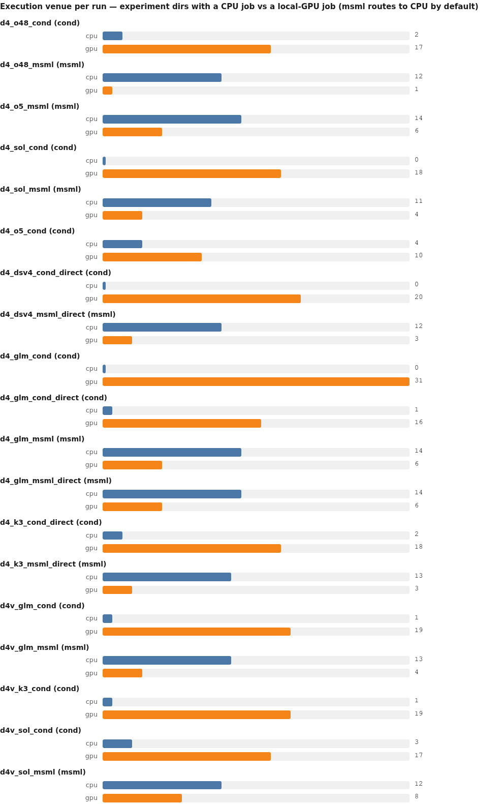

<details><summary>chart data</summary>

```chart
type: grouped
title: Execution venue per run — experiment dirs with a CPU job vs a local-GPU job (msml routes to CPU by default)
row d4_o48_cond (cond) | cpu=2 | gpu=17
row d4_o48_msml (msml) | cpu=12 | gpu=1
row d4_o5_msml (msml) | cpu=14 | gpu=6
row d4_sol_cond (cond) | cpu=0 | gpu=18
row d4_sol_msml (msml) | cpu=11 | gpu=4
row d4_o5_cond (cond) | cpu=4 | gpu=10
row d4_dsv4_cond_direct (cond) | cpu=0 | gpu=20
row d4_dsv4_msml_direct (msml) | cpu=12 | gpu=3
row d4_glm_cond (cond) | cpu=0 | gpu=31
row d4_glm_cond_direct (cond) | cpu=1 | gpu=16
row d4_glm_msml (msml) | cpu=14 | gpu=6
row d4_glm_msml_direct (msml) | cpu=14 | gpu=6
row d4_k3_cond_direct (cond) | cpu=2 | gpu=18
row d4_k3_msml_direct (msml) | cpu=13 | gpu=3
row d4v_glm_cond (cond) | cpu=1 | gpu=19
row d4v_glm_msml (msml) | cpu=13 | gpu=4
row d4v_k3_cond (cond) | cpu=1 | gpu=19
row d4v_sol_cond (cond) | cpu=3 | gpu=17
row d4v_sol_msml (msml) | cpu=12 | gpu=8
```

</details>

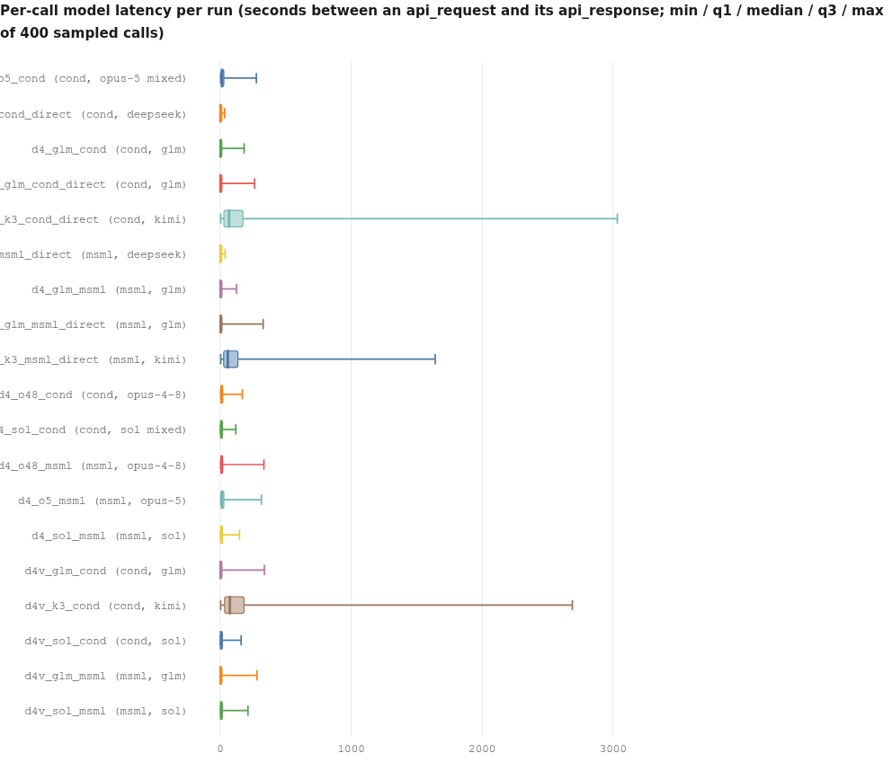

<details><summary>chart data</summary>

```chart
type: box
title: Per-call model latency per run (seconds between an api_request and its api_response; min / q1 / median / q3 / max of 400 sampled calls)
box d4_o5_cond (cond, opus-5 mixed) | 3.28 | 7.01 | 13.12 | 27.83 | 275.34
box d4_dsv4_cond_direct (cond, deepseek) | 0.15 | 0.89 | 1.52 | 3.04 | 33.44
box d4_glm_cond (cond, glm) | 0.29 | 1.02 | 2.52 | 7.91 | 182.58
box d4_glm_cond_direct (cond, glm) | 0.24 | 1.07 | 2.04 | 5.93 | 261.91
box d4_k3_cond_direct (cond, kimi) | 2.67 | 27.16 | 67.16 | 172.18 | 3031.95
box d4_dsv4_msml_direct (msml, deepseek) | 0.17 | 0.67 | 1.73 | 3.64 | 37.06
box d4_glm_msml (msml, glm) | 0.27 | 1.08 | 2.23 | 7.10 | 123.46
box d4_glm_msml_direct (msml, glm) | 0.29 | 1.23 | 2.97 | 7.10 | 327.31
box d4_k3_msml_direct (msml, kimi) | 3.19 | 26.09 | 57.52 | 135.44 | 1641.62
box d4_o48_cond (cond, opus-4-8) | 2.87 | 6.11 | 10.22 | 19.81 | 168.03
box d4_sol_cond (cond, sol mixed) | 1.73 | 4.91 | 8.06 | 13.92 | 118.00
box d4_o48_msml (msml, opus-4-8) | 2.85 | 5.82 | 9.97 | 19.55 | 333.30
box d4_o5_msml (msml, opus-5) | 3.67 | 7.02 | 13.61 | 27.39 | 314.27
box d4_sol_msml (msml, sol) | 2.05 | 5.03 | 8.18 | 16.68 | 146.41
box d4v_glm_cond (cond, glm) | 0.30 | 1.36 | 2.58 | 8.49 | 336.82
box d4v_k3_cond (cond, kimi) | 2.75 | 33.13 | 73.21 | 181.97 | 2689.06
box d4v_sol_cond (cond, sol) | 1.83 | 3.97 | 6.11 | 11.63 | 159.46
box d4v_glm_msml (msml, glm) | 0.27 | 1.36 | 2.74 | 8.34 | 280.32
box d4v_sol_msml (msml, sol) | 2.02 | 4.14 | 6.59 | 12.37 | 211.80
```

</details>

---

## 9. Cost

Dollars exist for exactly two runs, both gpt-5.6-sol in the `vary` era: **cond $88.67** vs
**msml $117.05**, with 73.4M of 77.2M (95%) and 54.8M of 66.7M (82%) tokens served from *reported*
cache. Lab-hosted glm/kimi/deepseek are $0 by construction. The four `native`-era ledgers are
**absent, not zero** — and so are their token counts (§14).

Recomputed from transcripts (the honest ledger for all 19 runs): cond median **88.4M** tokens and
**5.54M per scored experiment**; msml median **66.7M** and **5.17M per scored**. cond's extra seats
cost 5.6-31.2% of its tokens (median 16.75%) — and are largely paid for by cond scoring more rows.
Where the money goes: worker 46-84% of tokens in every run; strategist 0.9-33.5%; conductor
0.1-34.8M; verifier 1.9-19.1M.

On lab endpoints, "cache_read = 0" means **unreported, not uncached** (the serving engines
prefix-cache internally). The real cost of the 82-94% verbatim replay is metered tokens, payload
size and latency — not full recomputation. The tables' caption "flat cache-read = history
uncached" is wrong and should be retired.

---

## 10. Search dynamics and lineage

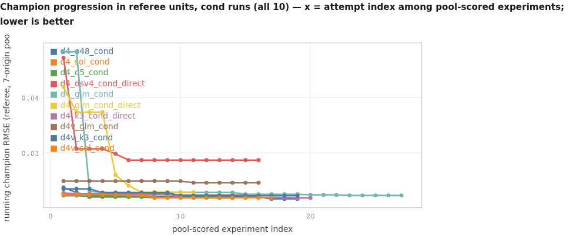

<details><summary>chart data</summary>

```chart
type: line
title: Champion progression in referee units, cond runs (all 10) — x = attempt index among pool-scored experiments; lower is better
x: pool-scored experiment index
y: running champion RMSE (referee, 7-origin pool)
series d4_o48_cond: 1,0.023755; 2,0.022817; 3,0.022183; 4,0.022183; 5,0.022183; 6,0.022183; 7,0.022183; 8,0.022072; 9,0.022072; 10,0.022072; 11,0.022072; 12,0.022072; 13,0.022072; 14,0.022072; 15,0.022072; 16,0.022039; 17,0.021697; 18,0.021697; 19,0.021697
series d4_sol_cond: 1,0.022525; 2,0.022525; 3,0.022525; 4,0.022525; 5,0.022525; 6,0.022525; 7,0.022412; 8,0.022412; 9,0.022412; 10,0.022412; 11,0.022412; 12,0.022412; 13,0.022412; 14,0.022412; 15,0.022412; 16,0.022412; 17,0.022412
series d4_o5_cond: 1,0.02229; 2,0.02229; 3,0.022027; 4,0.022027; 5,0.022027; 6,0.022027; 7,0.022027; 8,0.021883; 9,0.021883; 10,0.021883; 11,0.021883; 12,0.021883; 13,0.021843; 14,0.021843
series d4_dsv4_cond_direct: 1,0.04719; 2,0.03074; 3,0.03074; 4,0.03074; 5,0.029826; 6,0.028697; 7,0.028697; 8,0.028697; 9,0.028697; 10,0.028697; 11,0.028697; 12,0.028697; 13,0.028697; 14,0.028697; 15,0.028697; 16,0.028697
series d4_glm_cond: 1,0.04828; 2,0.04828; 3,0.023043; 4,0.022851; 5,0.022851; 6,0.022851; 7,0.022851; 8,0.022851; 9,0.022851; 10,0.022851; 11,0.022851; 12,0.022851; 13,0.022851; 14,0.022851; 15,0.022534; 16,0.022534; 17,0.022534; 18,0.022534; 19,0.022534; 20,0.02238; 21,0.02238; 22,0.02238; 23,0.022312; 24,0.022312; 25,0.022312; 26,0.022312; 27,0.022312
series d4_glm_cond_direct: 1,0.041871; 2,0.037362; 3,0.037362; 4,0.037362; 5,0.026005; 6,0.024083; 7,0.0229; 8,0.022886; 9,0.022886; 10,0.022886; 11,0.022886
series d4_k3_cond_direct: 1,0.022759; 2,0.022587; 3,0.022587; 4,0.022587; 5,0.022587; 6,0.022587; 7,0.022587; 8,0.022587; 9,0.022587; 10,0.02193; 11,0.02193; 12,0.02193; 13,0.02193; 14,0.02193; 15,0.02193; 16,0.02193; 17,0.02193; 18,0.02193; 19,0.021847; 20,0.021847
series d4v_glm_cond: 1,0.024901; 2,0.024901; 3,0.024901; 4,0.024901; 5,0.024901; 6,0.024901; 7,0.024901; 8,0.024901; 9,0.024901; 10,0.024901; 11,0.024608; 12,0.024608; 13,0.024608; 14,0.024608; 15,0.024608; 16,0.024608
series d4v_k3_cond: 1,0.023495; 2,0.023495; 3,0.023495; 4,0.022809; 5,0.022809; 6,0.022809; 7,0.022809; 8,0.022809; 9,0.022809; 10,0.022259; 11,0.022259; 12,0.022259; 13,0.022259; 14,0.022259; 15,0.022259; 16,0.022259; 17,0.022259; 18,0.022259; 19,0.022259
series d4v_sol_cond: 1,0.022429; 2,0.022429; 3,0.022429; 4,0.022429; 5,0.02241; 6,0.022318; 7,0.022318; 8,0.021898; 9,0.021898; 10,0.021898; 11,0.021898; 12,0.021898; 13,0.021898; 14,0.021898; 15,0.021898; 16,0.021898; 17,0.021898
```

</details>

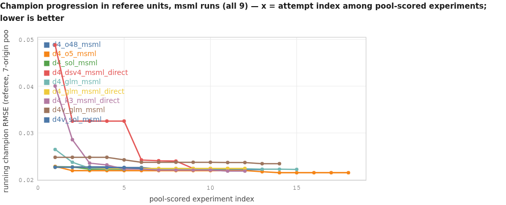

<details><summary>chart data</summary>

```chart
type: line
title: Champion progression in referee units, msml runs (all 9) — x = attempt index among pool-scored experiments; lower is better
x: pool-scored experiment index
y: running champion RMSE (referee, 7-origin pool)
series d4_o48_msml: 1,0.022799; 2,0.022743; 3,0.022743; 4,0.022743; 5,0.022627; 6,0.022627; 7,0.022297; 8,0.02229; 9,0.02229; 10,0.022179; 11,0.022179; 12,0.022179; 13,0.022167
series d4_o5_msml: 1,0.022857; 2,0.021949; 3,0.021949; 4,0.021949; 5,0.021949; 6,0.021949; 7,0.021949; 8,0.021949; 9,0.021949; 10,0.021949; 11,0.021949; 12,0.021949; 13,0.02171; 14,0.021507; 15,0.021507; 16,0.021507; 17,0.021507; 18,0.021507
series d4_sol_msml: 1,0.022717; 2,0.022717; 3,0.022275; 4,0.022275; 5,0.022243
series d4_dsv4_msml_direct: 1,0.048812; 2,0.032541; 3,0.032541; 4,0.032541; 5,0.032541; 6,0.024235; 7,0.024053; 8,0.023998; 9,0.022418; 10,0.022418; 11,0.022418
series d4_glm_msml: 1,0.026474; 2,0.023747; 3,0.022472; 4,0.022341; 5,0.022341; 6,0.022341; 7,0.022341; 8,0.022341; 9,0.022332; 10,0.022332; 11,0.022332; 12,0.022332; 13,0.022244; 14,0.022244; 15,0.022218
series d4_glm_msml_direct: 1,0.022681; 2,0.022681; 3,0.022681; 4,0.022426; 5,0.022426; 6,0.022426; 7,0.022426; 8,0.022426; 9,0.022426; 10,0.022426; 11,0.022426; 12,0.022426
series d4_k3_msml_direct: 1,0.040031; 2,0.028569; 3,0.023554; 4,0.023156; 5,0.022299; 6,0.022299; 7,0.022065; 8,0.022065; 9,0.022065; 10,0.022065; 11,0.021862; 12,0.021862
series d4v_glm_msml: 1,0.024799; 2,0.024799; 3,0.024799; 4,0.024799; 5,0.02424; 6,0.023737; 7,0.023737; 8,0.023737; 9,0.023737; 10,0.023737; 11,0.023684; 12,0.023684; 13,0.023437; 14,0.023437
series d4v_sol_msml: 1,0.022664; 2,0.022664; 3,0.022664; 4,0.022591; 5,0.022591; 6,0.022386
```

</details>

Both harnesses find most of their gain in the first third and then flatten. Two shapes stand out:
the deepseek cond run never escapes single raw models (flat at 0.0287 for 10 straight attempts),
while the deepseek msml run steps down four times to 0.0224 — that is the whole deepseek pair
margin. cond runs leave long post-improvement tails (up to 10 scored rows after the last gain);
msml usually stops within 0-2.

**Lineage.** cond rows carrying a parent link: 2-8 per run. msml: structurally impossible — its
`experiments` table has no parent column and `propose_variant` exists in 0 of its source files
(7 in cond's). Refinement win fraction where measurable (cond only): 0.25-1.0.

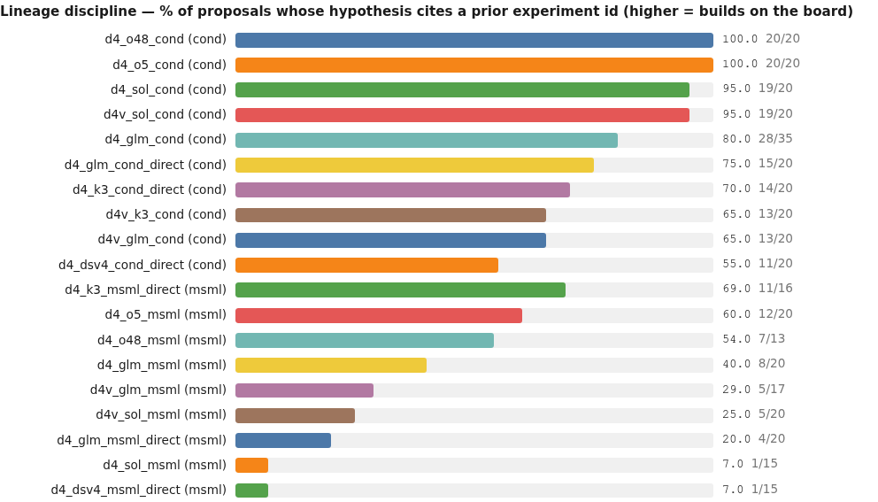

<details><summary>chart data</summary>

```chart
type: bars
title: Lineage discipline — % of proposals whose hypothesis cites a prior experiment id (higher = builds on the board)
d4_o48_cond (cond) | 100 | 20/20
d4_o5_cond (cond) | 100 | 20/20
d4_sol_cond (cond) | 95 | 19/20
d4v_sol_cond (cond) | 95 | 19/20
d4_glm_cond (cond) | 80 | 28/35
d4_glm_cond_direct (cond) | 75 | 15/20
d4_k3_cond_direct (cond) | 70 | 14/20
d4v_k3_cond (cond) | 65 | 13/20
d4v_glm_cond (cond) | 65 | 13/20
d4_dsv4_cond_direct (cond) | 55 | 11/20
d4_k3_msml_direct (msml) | 69 | 11/16
d4_o5_msml (msml) | 60 | 12/20
d4_o48_msml (msml) | 54 | 7/13
d4_glm_msml (msml) | 40 | 8/20
d4v_glm_msml (msml) | 29 | 5/17
d4v_sol_msml (msml) | 25 | 5/20
d4_glm_msml_direct (msml) | 20 | 4/20
d4_sol_msml (msml) | 7 | 1/15
d4_dsv4_msml_direct (msml) | 7 | 1/15
```

</details>

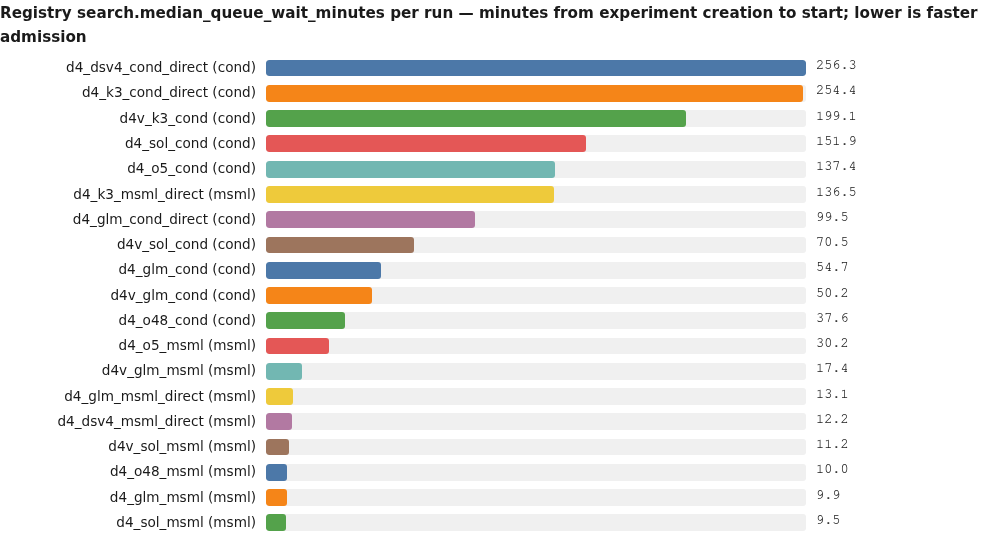

<details><summary>chart data</summary>

```chart
type: bars
title: Registry search.median_queue_wait_minutes per run — minutes from experiment creation to start; lower is faster admission
d4_dsv4_cond_direct (cond) | 256.3
d4_k3_cond_direct (cond) | 254.4
d4v_k3_cond (cond) | 199.1
d4_sol_cond (cond) | 151.9
d4_o5_cond (cond) | 137.4
d4_k3_msml_direct (msml) | 136.5
d4_glm_cond_direct (cond) | 99.5
d4v_sol_cond (cond) | 70.5
d4_glm_cond (cond) | 54.7
d4v_glm_cond (cond) | 50.2
d4_o48_cond (cond) | 37.6
d4_o5_msml (msml) | 30.2
d4v_glm_msml (msml) | 17.4
d4_glm_msml_direct (msml) | 13.1
d4_dsv4_msml_direct (msml) | 12.2
d4v_sol_msml (msml) | 11.2
d4_o48_msml (msml) | 10.0
d4_glm_msml (msml) | 9.9
d4_sol_msml (msml) | 9.5
```

</details>

My own recomputation over every DB row with both timestamps (definition: started_at − created_at)
reproduces each of those nineteen registry values exactly, and shows that the upper tails run four
to twelve times the median on the cond side.

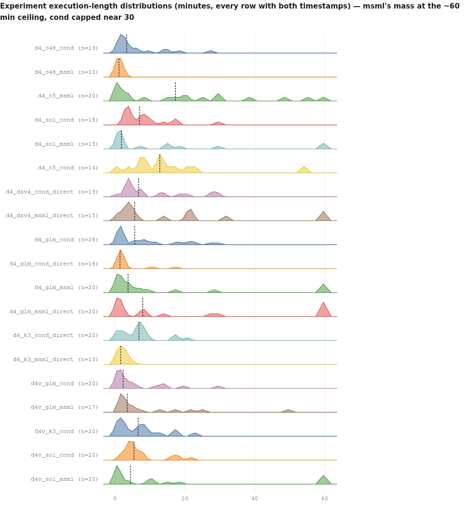

<details><summary>chart data</summary>

```chart
type: density
title: Experiment execution-length distributions (minutes, every row with both timestamps) — msml's mass at the ~60 min ceiling, cond capped near 30
series d4_o48_cond: 0.7, 0.9, 1.1, 1.2, 1.2, 1.2, 1.2, 2.8, 3.2, 3.3, 4.3, 4.4, 6.2, 6.2, 9.4, 13.9, 15.1, 18.2, 27.0
series d4_o48_msml: 0.2, 0.2, 0.2, 0.4, 0.4, 1.1, 1.1, 1.6, 1.8, 3.2
series d4_o5_msml: 0.4, 0.7, 0.9, 0.9, 0.9, 2.8, 3.3, 3.6, 8.5, 15.5, 17.3, 19.1, 20.3, 25.4, 29.8, 29.9, 38.8, 48.4, 54.7, 59.9
series d4_sol_cond: 2.5, 2.8, 3.3, 4.0, 4.2, 4.2, 4.2, 5.4, 6.7, 7.0, 8.5, 8.6, 9.5, 10.8, 13.7, 17.2, 17.4, 30.0
series d4_sol_msml: 0.7, 0.7, 0.9, 1.1, 1.3, 1.4, 1.4, 1.8, 7.0, 15.0, 15.5, 17.9, 29.9, 59.9, 59.9
series d4_o5_cond: 0.2, 3.9, 7.1, 7.4, 8.7, 9.5, 12.7, 12.8, 13.2, 15.0, 17.8, 21.1, 23.2, 53.6
series d4_dsv4_cond_direct: 0.7, 2.8, 3.7, 3.7, 4.1, 4.3, 4.3, 4.4, 5.3, 6.7, 7.0, 7.3, 12.3, 14.4, 18.1, 20.6, 26.9, 28.6, 29.9
series d4_dsv4_msml_direct: 0.7, 1.1, 3.2, 3.5, 3.5, 4.2, 5.1, 5.6, 13.7, 20.5, 21.9, 22.1, 32.0, 59.9, 60.0
series d4_glm_cond: 0.7, 0.7, 0.9, 1.1, 1.1, 1.1, 1.2, 1.2, 1.4, 1.9, 1.9, 2.0, 2.5, 4.8, 5.6, 5.8, 7.8, 8.0, 8.0, 10.9, 11.3, 17.3, 18.8, 20.5, 21.2, 22.3, 27.2, 29.9
series d4_glm_cond_direct: 0.9, 0.9, 1.1, 1.1, 1.1, 1.1, 1.2, 1.3, 1.4, 1.4, 1.8, 2.1, 2.3, 2.9, 10.9, 17.6
series d4_glm_msml: 0.2, 0.2, 0.2, 0.2, 0.7, 1.2, 1.6, 1.6, 2.8, 3.7, 3.7, 4.1, 6.4, 6.7, 9.9, 17.2, 28.7, 59.8, 59.9, 59.9
series d4_glm_msml_direct: 0.2, 0.2, 0.7, 0.7, 0.7, 1.2, 1.4, 1.4, 2.8, 7.4, 7.9, 8.6, 14.4, 27.4, 29.6, 59.8, 59.8, 59.9, 59.9, 60.0
series d4_k3_cond_direct: 0.9, 0.9, 1.0, 1.6, 2.3, 2.6, 4.0, 6.3, 6.3, 6.6, 6.8, 6.9, 7.0, 7.2, 8.2, 8.8, 9.6, 17.0, 17.5, 20.2
series d4_k3_msml_direct: 0.2, 0.2, 0.9, 0.9, 1.1, 1.4, 1.6, 3.0, 3.0, 3.2, 3.2, 3.5, 4.9
series d4v_glm_cond: 0.5, 0.7, 0.7, 0.7, 0.9, 1.3, 1.6, 1.8, 1.9, 2.0, 2.3, 3.5, 3.7, 5.3, 6.1, 12.1, 13.5, 13.5, 19.2, 30.0
series d4v_glm_msml: 1.2, 1.2, 1.4, 1.6, 1.6, 1.8, 2.5, 3.2, 3.5, 4.5, 5.3, 6.7, 12.3, 16.9, 21.5, 25.4, 49.8
series d4v_k3_cond: 0.7, 0.7, 0.9, 1.1, 1.7, 1.9, 2.6, 2.8, 3.8, 6.3, 6.6, 7.0, 7.8, 8.7, 8.7, 10.8, 12.4, 16.9, 17.7, 22.3
series d4v_sol_cond: 1.1, 2.1, 2.3, 3.5, 3.7, 3.9, 4.4, 4.8, 4.9, 5.2, 5.4, 5.5, 7.3, 7.6, 7.6, 7.8, 15.9, 16.8, 18.3, 22.1
series d4v_sol_msml: 0.5, 0.7, 0.7, 0.7, 0.7, 0.7, 0.9, 0.9, 1.1, 3.2, 4.4, 9.5, 10.1, 10.5, 14.8, 18.9, 59.8, 59.8, 60.0, 60.0
```

</details>

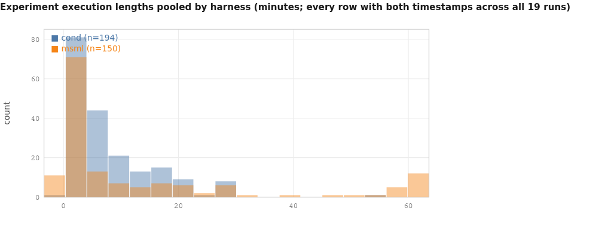

<details><summary>chart data</summary>

```chart
type: hist
title: Experiment execution lengths pooled by harness (minutes; every row with both timestamps across all 19 runs)
series cond: 0.7, 0.9, 1.1, 1.2, 1.2, 1.2, 1.2, 2.8, 3.2, 3.3, 4.3, 4.4, 6.2, 6.2, 9.4, 13.9, 15.1, 18.2, 27.0, 2.5, 2.8, 3.3, 4.0, 4.2, 4.2, 4.2, 5.4, 6.7, 7.0, 8.5, 8.6, 9.5, 10.8, 13.7, 17.2, 17.4, 30.0, 0.2, 3.9, 7.1, 7.4, 8.7, 9.5, 12.7, 12.8, 13.2, 15.0, 17.8, 21.1, 23.2, 53.6, 0.7, 2.8, 3.7, 3.7, 4.1, 4.3, 4.3, 4.4, 5.3, 6.7, 7.0, 7.3, 12.3, 14.4, 18.1, 20.6, 26.9, 28.6, 29.9, 0.7, 0.7, 0.9, 1.1, 1.1, 1.1, 1.2, 1.2, 1.4, 1.9, 1.9, 2.0, 2.5, 4.8, 5.6, 5.8, 7.8, 8.0, 8.0, 10.9, 11.3, 17.3, 18.8, 20.5, 21.2, 22.3, 27.2, 29.9, 0.9, 0.9, 1.1, 1.1, 1.1, 1.1, 1.2, 1.3, 1.4, 1.4, 1.8, 2.1, 2.3, 2.9, 10.9, 17.6, 0.9, 0.9, 1.0, 1.6, 2.3, 2.6, 4.0, 6.3, 6.3, 6.6, 6.8, 6.9, 7.0, 7.2, 8.2, 8.8, 9.6, 17.0, 17.5, 20.2, 0.5, 0.7, 0.7, 0.7, 0.9, 1.3, 1.6, 1.8, 1.9, 2.0, 2.3, 3.5, 3.7, 5.3, 6.1, 12.1, 13.5, 13.5, 19.2, 30.0, 0.7, 0.7, 0.9, 1.1, 1.7, 1.9, 2.6, 2.8, 3.8, 6.3, 6.6, 7.0, 7.8, 8.7, 8.7, 10.8, 12.4, 16.9, 17.7, 22.3, 1.1, 2.1, 2.3, 3.5, 3.7, 3.9, 4.4, 4.8, 4.9, 5.2, 5.4, 5.5, 7.3, 7.6, 7.6, 7.8, 15.9, 16.8, 18.3, 22.1
series msml: 0.2, 0.2, 0.2, 0.4, 0.4, 1.1, 1.1, 1.6, 1.8, 3.2, 0.4, 0.7, 0.9, 0.9, 0.9, 2.8, 3.3, 3.6, 8.5, 15.5, 17.3, 19.1, 20.3, 25.4, 29.8, 29.9, 38.8, 48.4, 54.7, 59.9, 0.7, 0.7, 0.9, 1.1, 1.3, 1.4, 1.4, 1.8, 7.0, 15.0, 15.5, 17.9, 29.9, 59.9, 59.9, 0.7, 1.1, 3.2, 3.5, 3.5, 4.2, 5.1, 5.6, 13.7, 20.5, 21.9, 22.1, 32.0, 59.9, 60.0, 0.2, 0.2, 0.2, 0.2, 0.7, 1.2, 1.6, 1.6, 2.8, 3.7, 3.7, 4.1, 6.4, 6.7, 9.9, 17.2, 28.7, 59.8, 59.9, 59.9, 0.2, 0.2, 0.7, 0.7, 0.7, 1.2, 1.4, 1.4, 2.8, 7.4, 7.9, 8.6, 14.4, 27.4, 29.6, 59.8, 59.8, 59.9, 59.9, 60.0, 0.2, 0.2, 0.9, 0.9, 1.1, 1.4, 1.6, 3.0, 3.0, 3.2, 3.2, 3.5, 4.9, 1.2, 1.2, 1.4, 1.6, 1.6, 1.8, 2.5, 3.2, 3.5, 4.5, 5.3, 6.7, 12.3, 16.9, 21.5, 25.4, 49.8, 0.5, 0.7, 0.7, 0.7, 0.7, 0.7, 0.9, 0.9, 1.1, 3.2, 4.4, 9.5, 10.1, 10.5, 14.8, 18.9, 59.8, 59.8, 60.0, 60.0
```

</details>

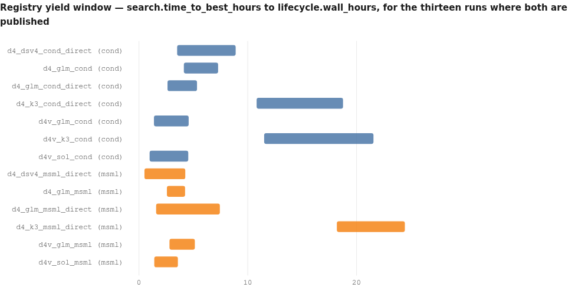

<details><summary>chart data</summary>

```chart
type: spans
title: Registry yield window — search.time_to_best_hours to lifecycle.wall_hours, for the thirteen runs where both are published
span d4_dsv4_cond_direct (cond) | 3.51 | 8.89 | cond
span d4_glm_cond (cond) | 4.13 | 7.28 | cond
span d4_glm_cond_direct (cond) | 2.63 | 5.34 | cond
span d4_k3_cond_direct (cond) | 10.82 | 18.76 | cond
span d4v_glm_cond (cond) | 1.38 | 4.57 | cond
span d4v_k3_cond (cond) | 11.51 | 21.56 | cond
span d4v_sol_cond (cond) | 0.98 | 4.53 | cond
span d4_dsv4_msml_direct (msml) | 0.51 | 4.26 | msml
span d4_glm_msml (msml) | 2.57 | 4.24 | msml
span d4_glm_msml_direct (msml) | 1.58 | 7.44 | msml
span d4_k3_msml_direct (msml) | 18.19 | 24.44 | msml
span d4v_glm_msml (msml) | 2.81 | 5.14 | msml
span d4v_sol_msml (msml) | 1.41 | 3.58 | msml
```

</details>

The six `native`/`certclean` runs are absent from that chart because the registry publishes no
`lifecycle.wall_hours` for them. Their registry `search.time_to_best_hours` values are
d4_o48_cond=1.75, d4_sol_cond=2.54, d4_o5_cond=4.95, d4_o48_msml=0.82, d4_o5_msml=3.13,
d4_sol_msml=1.4.

---

## 11. Context engineering and tool calling

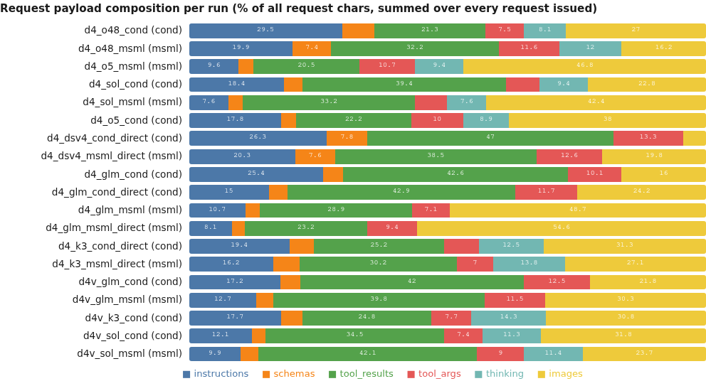

<details><summary>chart data</summary>

```chart
type: stacked
title: Request payload composition per run (% of all request chars, summed over every request issued)
row d4_o48_cond (cond) | instructions=29.5 | schemas=6.3 | tool_results=21.3 | tool_args=7.5 | thinking=8.1 | images=27.0
row d4_o48_msml (msml) | instructions=19.9 | schemas=7.4 | tool_results=32.2 | tool_args=11.6 | thinking=12.0 | images=16.2
row d4_o5_msml (msml) | instructions=9.6 | schemas=2.8 | tool_results=20.5 | tool_args=10.7 | thinking=9.4 | images=46.8
row d4_sol_cond (cond) | instructions=18.4 | schemas=3.5 | tool_results=39.4 | tool_args=6.4 | thinking=9.4 | images=22.8
row d4_sol_msml (msml) | instructions=7.6 | schemas=2.8 | tool_results=33.2 | tool_args=6.2 | thinking=7.6 | images=42.4
row d4_o5_cond (cond) | instructions=17.8 | schemas=2.9 | tool_results=22.2 | tool_args=10.0 | thinking=8.9 | images=38.0
row d4_dsv4_cond_direct (cond) | instructions=26.3 | schemas=7.8 | tool_results=47.0 | tool_args=13.3 | thinking=0.0 | images=4.4
row d4_dsv4_msml_direct (msml) | instructions=20.3 | schemas=7.6 | tool_results=38.5 | tool_args=12.6 | thinking=0.0 | images=19.8
row d4_glm_cond (cond) | instructions=25.4 | schemas=3.7 | tool_results=42.6 | tool_args=10.1 | thinking=0.0 | images=16.0
row d4_glm_cond_direct (cond) | instructions=15.0 | schemas=3.5 | tool_results=42.9 | tool_args=11.7 | thinking=0.0 | images=24.2
row d4_glm_msml (msml) | instructions=10.7 | schemas=2.8 | tool_results=28.9 | tool_args=7.1 | thinking=0.0 | images=48.7
row d4_glm_msml_direct (msml) | instructions=8.1 | schemas=2.4 | tool_results=23.2 | tool_args=9.4 | thinking=0.0 | images=54.6
row d4_k3_cond_direct (cond) | instructions=19.4 | schemas=4.6 | tool_results=25.2 | tool_args=6.6 | thinking=12.5 | images=31.3
row d4_k3_msml_direct (msml) | instructions=16.2 | schemas=5.1 | tool_results=30.2 | tool_args=7.0 | thinking=13.8 | images=27.1
row d4v_glm_cond (cond) | instructions=17.2 | schemas=3.7 | tool_results=42.0 | tool_args=12.5 | thinking=0.0 | images=21.8
row d4v_glm_msml (msml) | instructions=12.7 | schemas=3.2 | tool_results=39.8 | tool_args=11.5 | thinking=0.0 | images=30.3
row d4v_k3_cond (cond) | instructions=17.7 | schemas=4.1 | tool_results=24.8 | tool_args=7.7 | thinking=14.3 | images=30.8
row d4v_sol_cond (cond) | instructions=12.1 | schemas=2.6 | tool_results=34.5 | tool_args=7.4 | thinking=11.3 | images=31.8
row d4v_sol_msml (msml) | instructions=9.9 | schemas=3.5 | tool_results=42.1 | tool_args=9.0 | thinking=11.4 | images=23.7
```

</details>

- **Repetition:** the median request re-sends **82-94%** of the previous request's leading bytes
  (p90 94-98%). Neither harness prunes or summarizes. Median request grows to 113-325 KB;
  session growth 3.2-12.1x, with the four largest values 12.05, 10.35, 9.15 (msml) and 9.04 (cond).
- **Images:** more than 38% of all request bytes in five runs (54.6% in d4_glm_msml_direct). Plots
  ride in history for the rest of the session. Fix in both harnesses: pass plots by path.
- **Thinking:** 7.6-14.3% of bytes where reasoning is replayed; exactly 0.0% in the eight blind runs.
- **Tool-failure census (my classification, all 19 runs):** 1680 missing-path errors of 2087 total
  (80.5%), 217 other, 180 timeouts, 10 unknown-tool. Worst pair: d4_glm_cond strategist `read_file`
  ×242. Memory-tool errors show up in msml top-3 lists only (`strategist:memory_search` ×21,
  `worker:memory_store` ×4).
- **Verdict per tool:** `read_file`/`grep_file` — the dominant failure surface in both harnesses,
  fix by returning the nearest existing ancestor's listing; `memory_search` — msml-only failure
  class, needs throttling; `cancel_experiments` — broken (0/32); `complete_research` — sound idea,
  bad gate; `kill_experiment`/`park_experiment` — worked every time they were used;
  `patch_adapter_file` — worked, and is the corpus's self-correction channel.

---

## 12. Behaviour provenance

| Behaviour | Origin | Evidence |
|---|---|---|
| Proposals citing prior experiment ids | **prescribed** by cond's strategist adapter ("In every proposal, **cite the experiment ids that informed it** in the `hypothesis` field"); msml's adapter has no such line | citation rate follows the harness within one model (sol 19/20 vs 1/15) |
| Variant/lineage machinery | **harness-forced absent** in msml: `propose_variant` in 0 msml source files (7 in cond), no `parent_id` column in msml's schema | source + live DB schemas |
| Strategist "mega-sessions" | **not msml-specific** — cond's strategist is also a single session (29-1436 calls); what differs is cond's conductor loop vs msml's self-termination via `complete_research` (msml-only tool) | per-seat session census |
| Phase-0 adapter patching (10-14 files/run) | **prescribed scaffolding in both** | patch census by seat, all 19 runs |
| Mid-run adapter rewrites | **prescribed** (both ship a phase-1 supervisor reviewer); 22 supervisor patches across nine runs, every one corrective — e.g. "Phase 1 exploration verified that the baseline RMSE figures ... are factually wrong" | supervisor transcripts |
| Missing debriefs | **model-emergent** (kimi, deepseek), on both sides | 17 cond-side + 25 msml-side unwritten debriefs; 0 for opus/sol/glm |
| Non-schema tool names | **model-emergent** (deepseek only), rejected safely by both | 10 events |
| `rmse_pooled` metric key | **model-emergent** against a prescribed contract ("MUST save `results/metrics.json` with at least: rmse, mae, mase, model_path") | 12 of 15 rows |
| Shrinking the worker adapter in phase 0 | **model-emergent** (gpt-5.6-sol): 0.45x and 0.52x of the base template in the two msml sol runs, vs 0.94-1.27x for every other run | adapter-size census against base templates |

**Adapter patch audit.** Phase 0 patched 10-14 files in every run (scaffolding). Nine runs had
genuine mid-run supervisor patches (22 calls); their consequence is corrective — the run's own
baseline bars were wrong and every later agent then judged experiments against the verified bar.
No patch I read weakened a guardrail. The registry's "mid-run patched" counter does not measure
this at all (§14).

---

## 13. Code and written artifacts

- **Volume:** 5,671-39,560 total lines of experiment code per run; median 347-1,178 code lines per
  experiment; 0 AST parse failures anywhere. Comment share 1.6-10.6% (highest in the glm runs,
  lowest in d4v_sol_msml at 1.6%).
- **Analysis scripts:** 36-153 per cond run; 0 in eight of nine msml runs (2 in d4_o5_msml). This is
  the single largest artifact-shape difference and it follows the harness, not the model.
- **Verification:** cond runs hold 1-20 `verify*.out` artifacts each; msml runs hold none. Reading
  them shows genuine reproductions ("recomputed RMSE: 0.0250437661 / reported RMSE:
  0.02504376609711353 / MATCH: True") and a real catch (a model's `explained_variance_ratio`
  reporting 100% for K=5 where a full-rank SVD gives 77.120%). Five of twenty verify outputs in
  d4_glm_cond carry mismatch language, one each in d4v_glm_cond and d4v_sol_cond.
  msml is not artifact-free — d4v_sol_msml wrote 29 self-authored `analysis_verification.json`
  files — but nothing there is an independent seat's reproduction.
- **Debriefs:** mandated by both harnesses. Compliance is a model property: every opus/sol/glm run
  wrote every promised debrief; kimi and deepseek left 42 rows with a recorded `debrief_path` and
  no file (17 cond-side, 25 msml-side), plus 2 rows where the path was simply wrong.
  Quality, where present, is high across models (see §4.2).
- **Do the reproductions match the claimed numbers?** Yes where a verifier ran and checked
  (1e-12 agreement in the case I recomputed); no, systematically, in two runs where the
  self-reported metric is optimistic by ~1.06e-3 (d4_k3_cond_direct 7 rows, d4_sol_msml 6 rows).
- **Harness code defects the runs exposed:** (1) both harnesses' `local_gpu.py` writes a launcher
  that sets `sys.argv = ['run_experiment.py']`, which killed 5 rows whose entrypoints required a
  flag ("run_local.sh set sys.argv to only ['run_experiment.py'], while run_experiment.py requires
  --smoke or --full; argparse exited 2"); (2) msml's `cancel_if_unassigned` guard makes cancellation
  impossible for assigned rows; (3) msml's CPU-first router; (4) strict metric-key ingest in both;
  (5) msml's unthrottled embedding client.

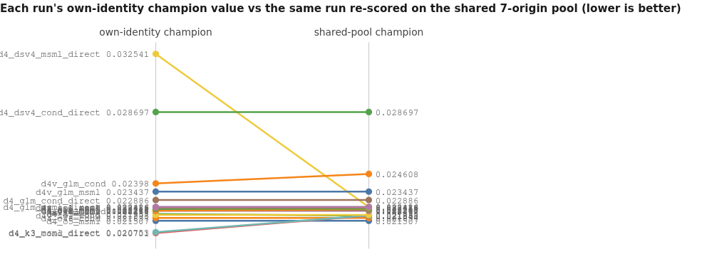

<details><summary>chart data</summary>

```chart
type: slope
title: Each run's own-identity champion value vs the same run re-scored on the shared 7-origin pool (lower is better)
x: own-identity champion -> shared-pool champion
slope d4_o5_msml | 0.021507 | 0.021507
slope d4_o48_cond | 0.021697 | 0.021697
slope d4_o5_cond | 0.021957 | 0.021843
slope d4_k3_cond_direct | 0.020701 | 0.021847
slope d4_k3_msml_direct | 0.020753 | 0.021862
slope d4v_sol_cond | 0.021898 | 0.021898
slope d4_o48_msml | 0.022167 | 0.022167
slope d4_glm_msml | 0.022218 | 0.022218
slope d4_sol_msml | 0.022243 | 0.022243
slope d4v_k3_cond | 0.022180 | 0.022259
slope d4_glm_cond | 0.022312 | 0.022312
slope d4v_sol_msml | 0.022386 | 0.022386
slope d4_sol_cond | 0.022412 | 0.022412
slope d4_dsv4_msml_direct | 0.032541 | 0.022418
slope d4_glm_msml_direct | 0.022426 | 0.022426
slope d4_glm_cond_direct | 0.022886 | 0.022886
slope d4v_glm_msml | 0.023437 | 0.023437
slope d4v_glm_cond | 0.023980 | 0.024608
slope d4_dsv4_cond_direct | 0.028697 | 0.028697
```

</details>

Caption: 13 of 19 runs are unchanged. The kimi runs' own values (0.0207) were measured on a
non-shared origin window and rise to 0.0218 on the shared pool; d4_dsv4_msml_direct's 0.0325
collapses to 0.0224 because its board only ever scored one row.

---

## 14. Measurement hygiene and the numerical-oddities register

| # | Registry says | Recomputation says | Mechanism |
|---|---|---|---|
| 1 | `efficiency.total_tokens_m` = 0 and `tokens_per_scored` = 0 for six runs; `tools.calls` = 0; `lifecycle.adapter_patch_calls` = None; `reliability.api_error_events` = None | 17.7-102.7M tokens; 11-19 adapter patch calls; thousands of tool calls | those six packs have **no events section**; event-derived metrics render absence as 0 |
| 2 | `lifecycle.wall_hours` is published only for the thirteen `glm52`/`vary` runs; the pair tables print 0.00 for the other six | those runs did run — their transcripts span multiple hours | same missing event stream |
| 3 | `lifecycle.adapter_files_patched_midrun` = 6 for d4v_k3_cond, 0 for all others | 0 supervisor patches in d4v_k3_cond (all 12 are phase-0, the last one just over two hours after the run's first transcript record, because kimi is slow); 22 supervisor patches across **nine** other runs | the metric is an mtime threshold ("modified more than 1h after run start"), not a seat attribution; and it defaults to False when run start is unknown |
| 4 | `lifecycle.completion_attempt_failures` = 0 for d4_o5_msml | 10 refused `complete_research` calls in its transcripts | event-derived, no event stream |
| 5 | `artifacts.verification_files` = None for all msml runs (reads as "0 verification artifacts") | d4v_sol_msml holds 29 `analysis_verification.json`; other msml runs 0-3 | the inventory classifier only recognizes cond's path shape. The cond-only `verify*.out` class is nevertheless real |
| 6 | `http.rate_limited` labelled "HTTP 429s" | identical counts, but 100% of them are on the **embeddings** gateway | metric is accurate, label is misleading |
| 7 | `referee.self_report_reproduced` = 26 for d4_glm_cond | my exact-match bucket (<1e-6) = 24 of 26 | different tolerance definitions; both on the record |
| 8 | `quality.best_value` = 0.020701 / 0.020753 (kimi) and 0.023980 (d4v_glm_cond) | 0.021847 / 0.021862 / 0.024608 on the shared pool | own values measured on non-shared origin windows |
| 9 | tables caption: "flat cache-read = history uncached" | lab endpoints report no cache fields at all; the engines prefix-cache internally | retire the clause (operator note) |

> **Erratum (added 2026-08-11, after publication):** the row above repeats an operator note that was later measured to be too absolute — pre-2026-08-10 ledgers DO carry cached-token fields on a minority of records (~1–6% of kimi-k3 records, ~76–91% of reasoning-replay-era GLM records). A zero on a given record still does not prove the request was uncached, but "no cache fields at all" is wrong as stated.
| 10 | `efficiency.tokens_per_scored` = 56.1M for d4_dsv4_msml_direct | 63.6M over 15 rows is 4.24M per *row*; the published figure is per *scored* row and there was one | denominator amplification of defect #6 in the findings list |
| 11 | `memory.calls` = None for six runs, `memory.records` = None for all cond runs | cond memory tool calls are visible in transcripts (98-524) | pack `memory` section exists only for msml (its store is a file-backed index) |
| 12 | registry `lifecycle.wall_hours` for d4_dsv4_msml_direct is 4.26 | my own-anchor transcript window for that run is longer | that run has 2 launches; its event stream covers only part of it — the same reason its published token total (56.1M) is below the transcript's 63.6M |

My own corrections while investigating: (a) an initial `429` grep matched MLflow UUIDs, a PID and a
char count on the cond side — the true cond count is 0; (b) I first read `cpu_enabled=True` in msml
configs as a campaign knob, but both harnesses default it True, so the CPU share difference is the
router, not the config; (c) a first reasoning census read only `*.jsonl` and undercounted the six
gzipped-transcript runs; (d) a debrief count by filesystem glob undercounted msml (some debriefs
live outside `experiments/<name>/`) — the DB-path census is the correct one; (e) I initially wrote
that debrief compliance "got worse" after the conductor's directives; precisely, 9 of 20 rows have
a debrief, the first seven finishers all do, two more were recovered by escalation, and the
conductor's own final count (3 missing) understated the true gap (about eight analyzed rows).

---

## 15. Campaign design integrity

1. **Era is an uncontrolled variable.** Four eras, and quality moves with them: both `vary`-era glm
   runs are worse than their `glm52`-era counterparts on both sides. Any cross-era comparison
   carries that unknown.
2. **Half the cube is empty and repeats are scarce** — four of twelve cells replicated, and the two
   most interesting models (opus-5, opus-4-8) have one run each.
3. **Identity discipline is inconsistent.** Four cond runs pinned the conductor to
   claude-opus-4-7; the registry records that fact three different ways (blank ×2, nominal model
   ×2). One declared pair (domain4_gpt) is therefore model-confounded at one seat.
4. **Two eras lost their event streams**, which silently zeroes about ten published metrics.
5. **Validation identities were left to the runs.** Every run chose its own origin windows;
   `quality.validation_identity_coverage` is 0.0 for all 19 runs, and only the referee's
   re-scoring makes any cross-run statement possible.
6. **Cheapest redesign that fixes it:** freeze one validation identity in the task contract and
   have the harness reject a results file that does not carry it; preserve the event stream for
   every run; record the seat→model map in the registry; run three repeats of two cells
   (cond+glm, msml+glm) in a single era before comparing anything else; and run one A/B where the
   *only* difference is msml's router patched to cond's rule — that single experiment would settle
   the biggest architectural claim in this report.

---

## Findings, with the mechanism behind each

1. **Eight runs ran blind to their own reasoning** (all glm, both deepseek): 19.3-73.2% of
   responses produced traces, 0% of requests carried them back. *Mechanism:* the replayed
   assistant items in those transcripts have no `reasoning_content` field, while kimi's do.
   Shared serving/assembly property; identical under both harnesses.
2. **msml's `cancel_experiments` never worked** — 32 calls, 37 blocked rows, 0 cancellations.
   *Mechanism:* `db.cancel_if_unassigned` refuses any row with a `worker_id`; `complete_research`
   is gated on no active work, so two runs deadlocked (10 and 4 refusals).
3. **All 429s are embeddings-gateway throttling in msml's semantic memory.** *Mechanism:* cond
   issues 0 requests to that endpoint; msml 742-2580. 204 and 112 fallbacks to full-text search.
4. **Harness quality margins are inside replication noise** (5 of 6 pairs < 0.002296; one flips
   sign under a different shared pool). *Mechanism:* run-to-run variance of the search itself.
5. **msml's CPU-first routing default is the corpus's biggest reliability defect.** *Mechanism:*
   `_is_cpu_experiment` returns CPU when it finds no GPU marker; cond returns GPU unless it finds
   positive CPU evidence. 60-92% vs 0-20% CPU share; 24 vs 3 timeout rows; error-row rate
   0.359 vs 0.028.
6. **One board was destroyed by a metric key.** *Mechanism:* 12 of 15 deepseek-msml rows wrote
   `rmse_pooled`, the ingest looks for `rmse`, nothing raised an alarm; the run's real leading
   value (0.022418) was only visible to the referee.
7. **The token ledger reads 0 for six runs that spent 17.7-102.7M tokens.** *Mechanism:*
   event-derived metrics with no event stream. Honest per-scored costs: cond 5.54M, msml 5.17M.
8. **The kimi cell is the corpus's longest because of endpoint latency**, not thrash: median
   per-call gap 57-73 s, 224-270 gaps over 300 s, identical under both harnesses; registry
   wall_hours 18.76, 21.56, 24.44.
9. **The "mid-run adapter patch" metric is inverted.** *Mechanism:* an mtime threshold instead of
   seat attribution, plus False-by-default when run start is unknown.
10. **cond's conductor detects what nothing else does but cannot enforce.** *Mechanism:* directives
    are advice; no harness gate blocks the `analyzed` transition without its debrief.
11. **cond's verifier/analysis stage is real and msml has no equivalent** (36-153 vs 0-2 analysis
    scripts; 1-20 vs 0 verify outputs; one exact 1e-12 reproduction and one substantive catch).
12. **Two artifact-discipline failures are model properties**, symmetric across harnesses: all 10
    non-schema tool calls are deepseek's; 42 promised debriefs were never written, all in kimi and
    deepseek runs.
13. **The harnesses trade admission latency against completion.** Registry
    `search.median_queue_wait_minutes` is 37.6-256.3 across cond runs and 9.5-136.5 across msml
    runs. In execution length the picture inverts: nine of ten cond runs cap at or below 30.0 min
    while 17 msml rows sit at a ~60 min ceiling.
14. **cond's lineage discipline is prescribed, not emergent** — one adapter line plus
    `propose_variant` plus a `parent_id` column; citation rate 55-100% vs 7-69%, and it moves with
    the harness inside a single model.
15. **Four cond runs are mixed-model** (conductor pinned to claude-opus-4-7), recorded three
    different ways by the registry; one declared pair is confounded at that seat.
16. **Context is 82-94% verbatim replay, with images above 38% of bytes in five runs.** Neither
    harness prunes; the cheap fix (plots by reference) belongs in both.
17. **Verification presence is not integrity:** the worst self-report drift (1 of 9 rows
    reproducing, offsets ~1.06e-3, all optimistic) is a cond run with three verifier seats.
18. **80.5% of tool failures are agents guessing file paths** (1680 of 2087), in both harnesses,
    concentrated in strategist and worker seats.

---

## What to change first

**msml (ranked):**
1. Replace `_is_cpu_experiment` with cond's rule (unknown → GPU; CPU needs positive evidence;
   CPU-library evidence wins). Biggest single reliability win available in this corpus.
2. Make stop-work actually stop work: force-terminate assigned rows, or add cond's
   `kill_experiment`/`park_experiment`. Then re-gate `complete_research`.
3. Add a verifier seat (or a mandatory per-experiment reproduction script) — the capability is
   simply missing.
4. Add lineage: a `parent_id` column, a `propose_variant` tool, and the one-line citation
   instruction in the strategist adapter.
5. Throttle the embedding client; treat "semantic memory unavailable" as a warning worth surfacing.
6. Lengthen the worker/analyze adapters toward cond's (they are 2-3x shorter, and the run whose
   phase-0 cut them by half is the one that lost 5 rows to entrypoint mismatches).

**cond (ranked):**
1. Give the conductor teeth: reject `update_experiment(status='analyzed')` when the named debrief
   does not exist; make the champion annotation and the missing-debrief count derive from disk
   rather than from the conductor's own bookkeeping.
2. Cut admission latency: registry `search.median_queue_wait_minutes` reaches 256.3 in cond while
   msml shows 9.5 is achievable on the same cluster.
3. Require the verifier to reproduce the primary metric of every row that claims the board's top
   position (the corpus's worst self-report drift happened with verifier seats running).
4. Trim the strategist's path-guessing: 242 missing-path `read_file` failures in one run.

**Shared infrastructure (ranked):**
1. Fix the launcher: stop overwriting `sys.argv`, or validate the entrypoint's argument contract
   before submission.
2. Alias/normalize the primary metric key at ingest and raise a loud board error when a finished
   row has results but no primary metric.
3. Fix reasoning replay for the lab GLM/deepseek endpoints, then re-run one cell to measure it.
4. Preserve the event stream for every run; make absent metrics read "absent", never 0.
5. Redefine `adapter_files_patched_midrun` by patching seat; relabel `HTTP 429s` as
   "embedding-gateway 429s"; teach the inventory classifier msml's verification paths.
6. Pass plots by path instead of base64 in history; add path-listing on `read_file` failure.

---

## Corrections and retractions

1. **Retracted:** "msml enabled CPU execution by campaign config (`cpu_enabled=True`) and cond did
   not." Both harnesses default `cpu_enabled=True`; the cond configs merely omit the key. The CPU
   share difference is the *router*, not the config.
2. **Corrected:** my first `429` grep reported 3-13 hits in cond runs. Those are MLflow UUIDs
   (`b3c429c0…`), a PID (`986429`) and a char count (`~439429`). True cond count: 0, exactly as the
   registry says.
3. **Corrected:** my first reasoning-replay census read only `*.jsonl` and undercounted six runs
   whose transcripts are gzipped. The corrected census is the one reported.
4. **Corrected:** a filesystem-glob debrief count showed 0-1 debriefs for two msml runs that
   actually have 16-20; the DB-path census is authoritative.
5. **Corrected:** I initially framed the d4v_k3_cond debrief timeline as "compliance got worse
   after the directives". Precisely: 9 of 20 rows have a debrief, the seven earliest finishers all
   do, two were recovered by the escalation (conductor-verified), and eleven later rows never got
   one — while the conductor's final accounting claimed only 3 were missing.
6. **Corrected:** `d4v_k3_cond` is not an adapter-drift run at all; its 12 patches are phase-0.
   The runs with genuine mid-run patches are nine others, and the registry reports 0 for all of them.

---

## Verdict robustness — could another reviewer land elsewhere?

- **"Neither harness wins on quality."** Robust. A reviewer using only the runs' self-reported
  numbers would rank kimi cond first (0.0207) and might call cond the winner; a reviewer using the
  referee's declared pairs would say msml wins 4 of 6. Both readings dissolve against the
  replication spread, which is the single most load-bearing number in this report (0.002296).
- **"cond's routing is right."** Robust; the mechanism is in both source trees and the census covers
  all 19 runs. The one way to land elsewhere: argue CPU placement was *intended* capacity expansion,
  in which case the fix is a longer CPU limit rather than the router. The 24 timeout rows make that
  reading expensive.
- **"msml's cancel is broken."** Robust: 32 attempts, 0 successes, guard quoted from source.
- **"cond's verifier is worth copying."** Weakest of the strong verdicts. It rests on existence
  counts plus two artifacts I read; a reviewer could argue msml's self-authored
  `analysis_verification.json` files serve the same purpose more cheaply. My counter is that the
  two catches I quote (a 1e-12 reproduction and a 100%-vs-77% variance error) are things no
  self-report caught anywhere in the corpus — but the finding is about existence, not about RMSE.
- **"Model tier."** Fragile at the top: opus-5, opus-4-8, kimi and sol span 0.000391, well inside
  the 0.002296 noise band. Only the bottom (deepseek last, glm second-to-last) is safe.
- **"Reasoning blindness matters."** Correlational only. The two blind models are also the two
  weakest, but era and model are confounded and no post-fix run exists.

---

## What stays unresolved, and why

| Unresolved | Why | What would settle it |
|---|---|---|
| Which harness produces better RMSE | 5 of 6 margins inside a 0.002296 noise band; only four of twelve cells replicated | 3 repeats per cell in one era |
| Conductor **model** choice | No run varies the conductor with all else fixed; the pin appears in exactly the four opus/sol cond runs | one cond run with the conductor unpinned, everything else identical |
| Whether the ~1.06e-3 self-report offsets are a window or a normalization bug | The metric scripts were not re-executed; the offsets are uniform and one-directional | re-run each run's metric script against its own preserved arrays |
| The source of msml's ~60 min execution ceiling | The configured per-experiment limit is 1800 s; the CPU path evidently uses a different one, which I did not locate in source | read the CPU executor's timeout constant |
| Whether the `read_notes_inbox" string="true` token is model emission or transcript assembly | It occurs once; the same run emitted three other invented names, which leans model | replay the raw provider response for that call |
| Whether cond's verification *causes* better outcomes | Verifier presence correlates with cond by construction, and the pair margins are inside noise | an msml run with a verifier seat added, nothing else changed |
| Whether replay of reasoning changes quality | No post-fix glm/deepseek run exists; model and era are confounded | one glm cell re-run after the replay fix |
| Dollar cost for 17 of 19 runs | Lab models are $0 by construction; four `native` ledgers are absent | price the lab endpoints, preserve ledgers |

**Dimensions examined with no material difference found:** builder / critic / tester / reporter
seat behaviour (token shares 0.1-4.7M, single-digit failures, sessions ended clean in nearly every
run); `integrity.db_file_metric_mismatches` (0-10, no harness pattern); `search.cpu_flagged_experiments`;
`agents.seats_died_before_first_response` (0 everywhere); `lifecycle.dispatcher_crashes` (0
everywhere); `memory.duplicate_fraction` (0.0 wherever measured); `code.ast_parse_failures` (0
everywhere). **Dimensions I did not examine:** `integrity.multi_realization_experiments` beyond its
counts, `search.late_gain_fraction` per model, and the `conductor.scratch_scripts` contents.

---

## Closing self-audit — my weakest claims

1. **"cond's adapters are longer, therefore cond tells agents more."** I measured base-template
   bytes and per-run bytes; I did not diff their *content* line by line for every seat. The
   citation instruction is a quoted exception where I did.
2. **"gpt-5.6-sol's phase-0 shrinks worker adapters, which contributed to the entrypoint
   failures."** Two of three sol runs shrank the adapter and the one that shrank most lost 5 rows
   in argparse. That is a plausible chain, not a demonstrated one — the launcher template is the
   proximate cause and it is identical in both harnesses.
3. **"cond scores more rows, so its extra seats pay for themselves."** This rests on median
   tokens-per-scored (5.54M vs 5.17M) across unequal denominators; with n=10 vs n=9 runs over one
   task, a 7% gap is not a robust efficiency verdict.
4. **The model tier's top four** are separated by less than the replication spread. I report the
   ordering because the mission asks for a tier, but I would not bet on positions one to four.
5. **The deepseek verdict** rests on two un-replicated runs, and its cond-vs-msml gap is partly a
   scoring artifact (1/15 board) rather than a pure quality difference.
6. **My tool-failure classification is my own definition** (keyword-ordered buckets over
   error-shaped tool results). The registry's `tools.failure_rate` uses a different population and
   reads 0 for six runs; both are on the record, and a third definition would produce a third set
   of numbers. That is exactly the trap the standard-quantity rule exists to prevent, so I have
   stated my definition wherever I depart from the registry.

---

## Appendix A — run registry (19 runs)

| run | harness | model (transcript strings) | era | rows | scored | shared-pool champion RMSE |
|---|---|---|---|---|---|---|
| d4_o48_cond | cond | claude-opus-4-8 (+opus-4-7 conductor ×75) | native | 20 | 19 | 0.021697 |
| d4_o48_msml | msml | claude-opus-4-8 | native | 13 | 13 | 0.022167 |
| d4_o5_msml | msml | claude-opus-5 | native | 20 | 20 | 0.021507 |
| d4_sol_cond | cond | gpt-5.6-sol (+opus-4-7 conductor ×121) | native | 20 | 17 | 0.022412 |
| d4_sol_msml | msml | gpt-5.6-sol | native | 15 | 12 | 0.022243 |
| d4_o5_cond | cond | claude-opus-5 (+opus-4-7 conductor ×145) | certclean | 20 | 14 | 0.021843 |
| d4_dsv4_cond_direct | cond | deepseek-v4-flash | glm52 | 20 | 14 | 0.028697 |
| d4_dsv4_msml_direct | msml | deepseek-v4-flash | glm52 | 15 | 1 | 0.022418 |
| d4_glm_cond | cond | glm-5.2 | glm52 | 35 | 26 | 0.022312 |
| d4_glm_cond_direct | cond | glm-5.2 | glm52 | 20 | 11 | 0.022886 |
| d4_glm_msml | msml | glm-5.2 | glm52 | 20 | 16 | 0.022218 |
| d4_glm_msml_direct | msml | glm-5.2 | glm52 | 20 | 13 | 0.022426 |
| d4_k3_cond_direct | cond | kimi-k3 | glm52 | 20 | 20 | 0.021847 |
| d4_k3_msml_direct | msml | kimi-k3 | glm52 | 16 | 16 | 0.021862 |
| d4v_glm_cond | cond | glm-5.2 | vary | 20 | 16 | 0.024608 |
| d4v_glm_msml | msml | glm-5.2 | vary | 17 | 14 | 0.023437 |
| d4v_k3_cond | cond | kimi-k3 | vary | 20 | 20 | 0.022259 |
| d4v_sol_cond | cond | gpt-5.6-sol (+opus-4-7 conductor ×128) | vary | 20 | 20 | 0.021898 |
| d4v_sol_msml | msml | gpt-5.6-sol | vary | 20 | 7 | 0.022386 |

## Appendix A2 — the registry's own timing values, verbatim

| run | search.time_to_best_hours | lifecycle.wall_hours | search.median_queue_wait_minutes |
|---|---|---|---|
| d4_o5_cond | 4.95 | unpublished | 137.4 |
| d4_dsv4_cond_direct | 3.51 | 8.89 | 256.3 |
| d4_glm_cond | 4.13 | 7.28 | 54.7 |
| d4_glm_cond_direct | 2.63 | 5.34 | 99.5 |
| d4_k3_cond_direct | 10.82 | 18.76 | 254.4 |
| d4_dsv4_msml_direct | 0.51 | 4.26 | 12.2 |
| d4_glm_msml | 2.57 | 4.24 | 9.9 |
| d4_glm_msml_direct | 1.58 | 7.44 | 13.1 |
| d4_k3_msml_direct | 18.19 | 24.44 | 136.5 |
| d4_o48_cond | 1.75 | unpublished | 37.6 |
| d4_sol_cond | 2.54 | unpublished | 151.9 |
| d4_o48_msml | 0.82 | unpublished | 10.0 |
| d4_o5_msml | 3.13 | unpublished | 30.2 |
| d4_sol_msml | 1.4 | unpublished | 9.5 |
| d4v_glm_cond | 1.38 | 4.57 | 50.2 |
| d4v_k3_cond | 11.51 | 21.56 | 199.1 |
| d4v_sol_cond | 0.98 | 4.53 | 70.5 |
| d4v_glm_msml | 2.81 | 5.14 | 17.4 |
| d4v_sol_msml | 1.41 | 3.58 | 11.2 |

"unpublished" = no event stream in that run's pack, so the registry has no value; the pair tables
print 0.00, which must be read as absence, not zero.

## Appendix B — MODEL × HARNESS cube, absences named

| model | cond | msml |
|---|---|---|
| claude-opus-4-8 | d4_o48_cond (native) | d4_o48_msml (native) |
| claude-opus-5 | only as mixed-model d4_o5_cond (certclean) | d4_o5_msml (native) |
| gpt-5.6-sol | d4v_sol_cond (vary), d4_sol_cond (native, mixed) | d4_sol_msml (native), d4v_sol_msml (vary) |
| kimi-k3 | d4_k3_cond_direct (glm52), d4v_k3_cond (vary) | d4_k3_msml_direct (glm52) — **absent in vary** |
| glm-5.2 | 3 runs (glm52 ×2, vary) | 3 runs (glm52 ×2, vary) |
| deepseek-v4-flash | d4_dsv4_cond_direct (glm52) | d4_dsv4_msml_direct (glm52) — **absent in native and vary** |
| mixed conductor pin | 4 cond runs | **absent entirely** |

## Appendix C — token split by seat (millions, input+output, recomputed from transcripts)

| run | worker | strategist | conductor | verifier | reporter | others | total |
|---|---|---|---|---|---|---|---|
| d4_o5_cond | 74.5 | 5.6 | 2.5 | 3.8 | 2.3 | 10.9 | 99.6 |
| d4_dsv4_cond_direct | 47.2 | 0.7 | 8.6 | 6.2 | 0.6 | 7.2 | 70.5 |
| d4_glm_cond | 112.1 | 81.7 | 20.5 | 19.1 | 2.7 | 7.8 | 243.9 |
| d4_glm_cond_direct | 73.5 | 4.9 | 34.8 | 7.4 | 1.2 | 13.5 | 135.3 |
| d4_k3_cond_direct | 42.7 | 1.3 | 8.7 | 6.4 | 1.6 | 3.1 | 63.8 |
| d4_o48_cond | 11.0 | 1.4 | 1.3 | 1.9 | 0.5 | 2.6 | 18.7 |
| d4_sol_cond | 62.9 | 28.6 | 1.9 | 3.9 | 1.4 | 4.0 | 102.7 |
| d4v_glm_cond | 65.4 | 3.0 | 11.9 | 4.8 | 2.7 | 12.1 | 99.9 |
| d4v_k3_cond | 48.5 | 1.4 | 8.8 | 10.6 | 1.0 | 4.1 | 74.4 |
| d4v_sol_cond | 58.9 | 0.9 | 0.1 | 8.5 | 4.7 | 4.1 | 77.2 |
| d4_dsv4_msml_direct | 42.3 | 11.1 | — | — | 2.6 | 7.6 | 63.6 |
| d4_glm_msml | 54.8 | 14.0 | — | — | 2.7 | 11.3 | 82.8 |
| d4_glm_msml_direct | 59.2 | 10.5 | — | — | 2.7 | 19.9 | 92.3 |
| d4_k3_msml_direct | 46.0 | 6.5 | — | — | 1.2 | 3.2 | 56.9 |
| d4_o48_msml | 12.9 | 0.5 | — | — | 0.8 | 3.5 | 17.7 |
| d4_o5_msml | 79.7 | 2.3 | — | — | 3.6 | 9.4 | 95.0 |
| d4_sol_msml | 37.6 | 8.2 | — | — | 1.9 | 3.3 | 51.0 |
| d4v_glm_msml | 78.0 | 9.9 | — | — | 1.9 | 8.1 | 97.9 |
| d4v_sol_msml | 54.2 | 7.0 | — | — | 2.0 | 3.5 | 66.7 |
