# d7_payup — the all-encompassing comparison report

**Corpus:** 18 finished runs, one task (`d7_payup`, Agency MBS payup prediction on a frozen 2026-05..07 walk-forward holdout), two harnesses (`cond`, `msml`), six models (claude-opus-5, gpt-5.6-sol, kimi-k3, deepseek-v4-flash, glm-5.2, gemma-4-31b), two batteries (`newdomains` 08-01, `vary` 08-06). Lower is better for every quality number in this report.

**Two number systems are used and never mixed.**

1. **Referee scores.** Independent re-scoring on the frozen 26,902-row holdout (coverage 0.9541 newdomains / 0.9546 vary). This is the ONLY cross-harness quality evidence. Every referee experiment name and referee_score below is copied verbatim from `referee.json` (`pairs[].best.left/right.experiment` and `.referee_score`).
2. **Registry metrics.** The deterministic layer's published metric ids — self-reported quantities on each run's own identity, NOT cross-harness comparable.

Sections that carry referee quotes carry no registry metric ids, and sections that carry registry metric ids carry no referee quotes, so the two can never be confused for one another.

---

## 0a. Referee's declared bests — verbatim quotes from referee.json

| pair | side | run | referee-declared best experiment | referee_score |
|---|---|---|---|---|
| d7_payup_claude | right (winner) | d7_payup_o5_cond | `coupon_stack_ratio_space` | 1.640616 |
| d7_payup_claude | left | d7_payup_o5_msml | `segmented_newprod_split_lgbm` | 1.77077 |
| d7_payup_deepseek | left (winner) | d7_payup_dsv4_msml | `lgb_histgb_fwm` | 3.171442 |
| d7_payup_deepseek | right | d7_payup_dsv4_cond | `lgbm_recency_weighted2` | 3.65858 |
| d7_payup_gemma | left (winner) | d7_payup_g4_msml | `lgbm_rolling_tuned` | 4.339227 |
| d7_payup_gemma | right | d7_payup_g4_cond | `ridge_ts_robust_v1` | 12.855811 |
| d7_payup_glm | left (winner) | d7_payup_glm_msml | `lgbm_l1_time_reg_v1` | 3.97507 |
| d7_payup_glm | right | d7_payup_glm_cond | `exp_lgbm3` | 4.260018 |
| d7_payup_glm_2 | right (winner) | d7v_glm_cond | `mness_quantile_bucket_lgbm` | 4.144928 |
| d7_payup_glm_2 | left | d7v_glm_msml | `lgbm_l1_biascal` | 4.81724 |
| d7_payup_gpt | right (winner) | d7_payup_sol_cond | `lightgbm_causal_history_l1` | 2.416756 |
| d7_payup_gpt | left | d7_payup_sol_msml | `catboost_native_mae_causal_group_stats_recency_365d` | 3.574268 |
| d7_payup_gpt_2 | left (winner) | d7v_sol_msml | `lgbm_l1_18m_native_calendar` | 4.001524 |
| d7_payup_gpt_2 | right | d7v_sol_cond | `hier_wmedian_daily_730d` | 4.230359 |
| d7_payup_kimi | right (winner) | d7_payup_k3_cond | `lgbm_regime_tfeatures` | 3.724917 |
| d7_payup_kimi | left | d7_payup_k3_msml | `hgbr_q50_fw_tenc` | 6.378698 |
| d7_payup_kimi_2 | right (winner) | d7v_k3_cond | `lgbm_te30_win18m_refit5` | 2.862204 |
| d7_payup_kimi_2 | left | d7v_k3_msml | `histgb_recent2025` | 4.242443 |

## 0b. Registry lifecycle values — echoed exactly as bench.json publishes them (all 18 runs)

| run | `search.time_to_best_hours` | `lifecycle.wall_hours` | `search.median_queue_wait_minutes` |
|---|---|---|---|
| d7_payup_dsv4_cond | 0.67 | 2.21 | 11.7 |
| d7_payup_dsv4_msml | 1.26 | 6.54 | 55.0 |
| d7_payup_g4_cond | — (not published) | 3.37 | 39.5 |
| d7_payup_g4_msml | 2.34 | 2.02 | 26.4 |
| d7_payup_glm_cond | — (not published) | 3.7 | 7.4 |
| d7_payup_glm_msml | 0.15 | 4.12 | 5.8 |
| d7_payup_k3_cond | 1.48 | 6.58 | 70.9 |
| d7_payup_k3_msml | 1.44 | 5.4 | 28.8 |
| d7_payup_o5_cond | 0.94 | 6.58 | 32.0 |
| d7_payup_o5_msml | 1.77 | 5.58 | 33.5 |
| d7_payup_sol_cond | 0.43 | 5.97 | 35.9 |
| d7_payup_sol_msml | 0.69 | 2.09 | 6.3 |
| d7v_glm_cond | 0.6 | 3.61 | 32.0 |
| d7v_glm_msml | 0.99 | 4.06 | 13.9 |
| d7v_k3_cond | 4.47 | 17.23 | 151.3 |
| d7v_k3_msml | 6.68 | 14.08 | 68.8 |
| d7v_sol_cond | 0.18 | 14.66 | 19.6 |
| d7v_sol_msml | 0.77 | 2.56 | 5.8 |

*`d7_payup_glm_cond` publishes no `search.time_to_best_hours` because three of its scored rows share an identical earliest timestamp, making first-created-to-best-finished degenerate (my own recomputation gives 0.000h for its first three scored rows). `d7_payup_g4_cond` publishes none because `search.scored` is 0.*

---

## 1. Headline verdicts

| # | Verdict | Margin grade | What would change it |
|---|---|---|---|
| V1 | **Harness overall: leans `cond`, weak-to-moderate.** The referee gives cond 5 of 9 pairs; the three cleanest above-noise margins (both kimi pairs, newdomains-sol) are all cond wins. But the median replication spread is 0.8422 referee units and 5 of 9 pair margins sit below it. | weak-to-moderate | Same-battery repeats. Two more kimi/sol pairs with margins ≥1.0 in the same direction would make it moderate-to-strong; a GLM-style flip on a second model would erase it. |
| V2 | **Model overall: `claude-opus-5`, moderate-to-high.** Best referee_score under *both* harnesses (1.640616 cond, 1.77077 msml) against a corpus next-best of 2.416756. | moderate-to-high | Its margin (0.646-0.776) is *below* the 0.8422 median replication spread. A single claude repeat landing near 2.4 would drop it to a tie with sol. |
| V3 | **Combination to run today: `cond` + `claude-opus-5`** — the single best cell in the corpus (`coupon_stack_ratio_space`, referee_score 1.640616), on 12 of 12 scored rows and 12 of 12 referee artifact coverage. Cost caveat: $164.11, the most expensive cell. | moderate | If the budget is $0, run `cond` + `kimi-k3` (`lgbm_te30_win18m_refit5`, referee_score 2.862204). |
| V4 | **msml's biggest deletable defect: the strategist-owns-termination gate.** The completion tool failed 55 of 57 times corpus-wide, all in one run, in a livelock with cancellation, burning 1,132 calls and 40,043,771 input tokens in one seat. | decisive (mechanism quoted) | Nothing — the contradictory gate is quoted verbatim from the transcript. |
| V5 | **msml's biggest reliability defect: one embeddings call per model call.** All 419 HTTP 429s in the corpus land on the `embeddings` endpoint; cond issues zero embeddings requests. | decisive on census | Nothing about the census; the *cost in quality* is not established. |
| V6 | **cond's biggest keep: the verification stage.** Real recomputation to `\|delta\| = 0.000e+00`, real leakage guards, and the corpus's only leaderboard-eligibility flag on a timed-out row. msml has no verifier seat and no analysis directory at all in 7 of 9 runs. | strong on presence, unproven on value | Show a run where verification changed the champion. This corpus does not. |
| V7 | **Shared platform defect: floating metric identity.** All 18 configs declare the same primary key, yet the registry's scoring key floats in 4 msml runs, and `d7_payup_g4_cond` scores 0 of 12 despite finishing all 12 rows. | decisive | Nothing. |
| V8 | **Shared platform defect: reasoning replay.** 6 runs (4 GLM, 2 deepseek) produced reasoning on 195-1,055 responses and replayed it into **zero** requests, in both harnesses. | decisive | Nothing — the pack's two counters settle it. |
| V9 | **Repeatability cannot be separated from era.** All six replication groups pair one newdomains run with one vary run. Every "noise floor" here is an upper bound. | structural | Same-battery repeats with a frozen adapter set. |
| V10 | **Do not use `gemma-4-31b` for this task in either harness.** Worst quality cell, highest pooled tool-failure rate (0.0715), the corpus's only unparseable shipped file, and one unscorable run. | strong | A gemma run that produces holdout predictions under the declared key. |

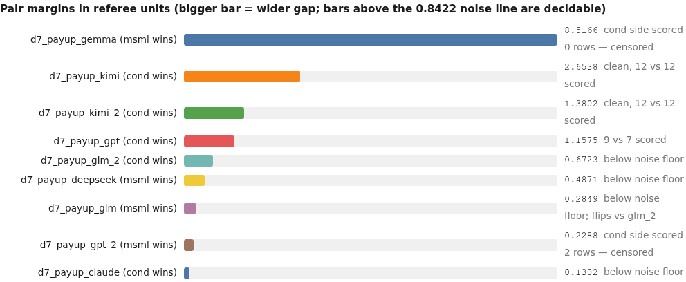

<details><summary>chart data</summary>

```chart
type: bars
title: Pair margins in referee units (bigger bar = wider gap; bars above the 0.8422 noise line are decidable)
d7_payup_gemma (msml wins) | 8.5166 | cond side scored 0 rows — censored
d7_payup_kimi (cond wins) | 2.6538 | clean, 12 vs 12 scored
d7_payup_kimi_2 (cond wins) | 1.3802 | clean, 12 vs 12 scored
d7_payup_gpt (cond wins) | 1.1575 | 9 vs 7 scored
d7_payup_glm_2 (cond wins) | 0.6723 | below noise floor
d7_payup_deepseek (msml wins) | 0.4871 | below noise floor
d7_payup_glm (msml wins) | 0.2849 | below noise floor; flips vs glm_2
d7_payup_gpt_2 (msml wins) | 0.2288 | cond side scored 2 rows — censored
d7_payup_claude (cond wins) | 0.1302 | below noise floor
```

</details>
*Median replication spread = 0.8422 referee units (five usable groups: 0.1151, 0.4273, 0.8422, 0.8627, 2.1363).*

---

## 2. Corpus and coverage — what exists and what does not

- **Task coverage:** one task only. Nothing here generalises across tasks; every "per task" subsection below is the same task.
- **Model × harness coverage is complete in the newdomains battery**: all six models under both harnesses, 12 cells, no holes.
- **The `vary` battery covers only 3 of 6 models** — glm-5.2, kimi-k3, gpt-5.6-sol. **claude-opus-5, deepseek-v4-flash and gemma-4-31b have NO vary-era repeat under either harness.** Six absent cells, and they include the best and worst models — the two verdicts most in need of error bars have none.
- **Replication groups: 6, all era-crossed** (cond+glm, cond+k3, cond+sol, msml+glm, msml+k3, msml+sol). Not one same-battery repeat exists.
- **Censoring.** `d7v_sol_cond` was operator-stopped: it ends with exit code 137, 2 of 12 rows scored, 9 parked and 1 in flight. It cannot serve as a repeat of `d7_payup_sol_cond` and is excluded from the noise floor. `d7_payup_g4_cond` scores 0 of 12 — unscorable, not zero (§14).
- **Group validity.** The referee marks all 18 runs rankable and declares a winner in all 9 pairs on one frozen holdout, so cross-harness quality comparison *is* licensed here. The runs' own board numbers are **not** comparable: three different self-declared metric names appear across the corpus.
- **Denominators.** Scored rows range 0-12 out of 11-12 total rows. Every per-experiment rate below states its denominator, and where a ratio collapses (per-scored on a 2-row run) both per-scored and per-finished are printed.

---

## 3. Harness — verdicts, and the governance-machinery deep dive

### 3.1 Which harness (this task, and overall — the same question here)

`cond` wins 5 pairs, `msml` 4. Of the four margins above the 0.8422 median replication spread, two are censored (gemma against a 0-row cond side; vary-sol against a 2-row cond side); the two clean ones — both kimi pairs — plus newdomains-sol are cond wins. **Verdict: leans cond, weak-to-moderate.** The GLM pair reversing between eras (msml by 0.2849, then cond by 0.6723) is the corpus's own warning label.

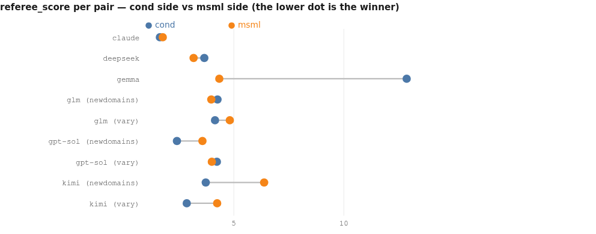

<details><summary>chart data</summary>

```chart
type: dumbbell
title: referee_score per pair — cond side vs msml side (the lower dot is the winner)
row claude | cond=1.640616 | msml=1.77077
row deepseek | cond=3.65858 | msml=3.171442
row gemma | cond=12.855811 | msml=4.339227
row glm (newdomains) | cond=4.260018 | msml=3.97507
row glm (vary) | cond=4.144928 | msml=4.81724
row gpt-sol (newdomains) | cond=2.416756 | msml=3.574268
row gpt-sol (vary) | cond=4.230359 | msml=4.001524
row kimi (newdomains) | cond=3.724917 | msml=6.378698
row kimi (vary) | cond=2.862204 | msml=4.242443
```

</details>

### 3.2 Architectural verdicts — ranked keep / copy / fix / delete

**KEEP in cond (ranked by evidence strength):**
1. **Verification stage.** k3_cond reproduces its stored metric to `|delta| = 0.000e+00`; o5_cond's leakage guard tests truncated-vs-full histories on six anchors plus 200 hand-built rows; d7v_sol_cond's audit flags `canonical_guard_pass False` / `smoke_is_leaderboard_eligible False` on a `returncode -9` TIMEOUT row.
2. **Termination and parking owned by the conductor, not the strategist.** Zero failed completion attempts across 9 cond runs against 55 in one msml run.
3. **Strategist decoupled from the queue.** Registry `lifecycle.strategist_calls_per_scored`: cond 2, 2, 2, 3, 4, 2, 4 (+15 on the censored run, blank on g4_cond) vs msml 14, 283, 14, 6, 7, 15, 13, 7, 15.
4. **A cond-only refinement tool (`propose_variant`).** Weakly supported: 10 invocations corpus-wide; registry `search.refinement_win_fraction` 1.0 on 1 pair (dsv4_cond), 0.667 on 3 pairs (d7v_k3_cond), 0.0 on 1 pair (glm_cond).

**COPY into msml (ranked):**
1. **A verification/eligibility gate** — cheapest version: per-experiment recompute-and-compare against the config-declared metric key. This is the mechanism that would have caught one msml run's board being denominated in a private quantity roughly 3x the graded value.
2. **A coordination owner other than the proposing seat.**
3. **A per-seat call/loop watchdog** — msml had none; one seat ran 1,132 calls unchecked.

**FIX in cond (ranked):**
1. **Verify against the frozen holdout identity, not the local copy** (26,913 rows / 24,834 keys locally vs 26,902 in the frozen set).
2. **A crashed verification script must fail the experiment.** glm_cond's `glm_binned` contract check printed `missing preds after merge: 1235` and then died in a sklearn traceback, with no consequence.
3. **The directive-ack loop.** 8-27 directives per run at registry `governance.directive_ack_rate` 0.000-0.565, zero in three runs.
4. **`governance.selfcheck_rate` is 0.000 in all nine runs.** Whether the field is never populated or self-checks never fire is not decidable from these artifacts — either way it is machinery returning nothing.

**FIX in msml (ranked):**
1. **The completion-gate / cancellation contradiction** (§3.3).
2. **Decouple embeddings from the model-call path** (all 419 corpus 429s land there).
3. **Validate request assembly**: drop or re-pair any `function_call_output` whose `call_id` has no matching `function_call` (30 HTTP 400s and 10 dead turns in one sol run).

**DELETE:** msml's gated completion tool in its current form. Nothing else in either harness is unambiguously deletable on this evidence.

### 3.3 Governance machinery, decision point by decision point

| Decision point | cond mechanism (counts across 9 runs) | msml at the same point |
|---|---|---|
| Queue admission / priority | conductor `set_priority` (k3_cond 1, d7v_sol_cond 1); registry `search.prioritized_rows` glm_cond 7, k3_cond 1, d7v_sol_cond 1 | nothing |
| Park / kill | registry `governance.parks` nonzero in 5 of 9 runs (1,1,1,1,5); `governance.kills` only d7v_sol_cond (6); `search.parked_rows` sol_cond 1, d7v_glm_cond 1, d7v_sol_cond 9 | strategist cancellation only — **refuses assigned rows** |
| Throttling | `set_throttle` (o5_cond 2, sol_cond 1) | nothing |
| Verification | registry `verifier.seats_started` 2-14 per run, `verifier.completion_fraction` 1.000 in all 9; 6-31 analysis artifacts | **absent** |
| Rewind | registry `governance.phase_rewinds` (sol_cond 3, d7v_k3_cond 1, d7v_sol_cond 1) | nothing |
| Termination | conductor decides | strategist's gated completion tool (livelocked once) |
| Memory / handoff | registry `memory.calls` 58-190 per run, 0 failures in 8 of 9 | `memory.calls` 11-142, plus a `worker_handoff` stage absent from cond |

**What it cost:** registry `efficiency.meta_role_share` 0.090-0.576 for cond (0.090 d7v_glm_cond, 0.251 d7v_k3_cond, 0.576 d7v_sol_cond, where conductor+verifier consumed 38.80M of 68.17M role tokens) versus 0.003-0.016 for every msml run.
**What it bought:** 5 of 9 pair wins, with one verdict flipping between eras. Reliability and auditability, yes. Measurable accuracy, not demonstrated.

### 3.4 What each harness elicits from the same model

Same model, different harness, consistently: cond produces **more code per experiment** (registry `code.median_code_lines_per_experiment`: o5 1161.5 vs 839.0; sol 1106.0 vs 554; k3 722.0 / 827.5 vs 330.5 / 212.5; glm 636.0 / 809.5 vs 419.5 / 46.0; dsv4 406.0 vs 203.5; g4 197.0 vs 90 — cond higher in **9 of 9** pairs), **larger request payloads** (higher `context.median_request_bytes` in 8 of 9 pairs), and a different worker-stage inventory (cond has a `worker_fix` stage; msml adds `worker_handoff`). msml elicits a **hyperactive strategist** in every pair. The one thing msml elicits that cond does not: more scored rows in 4 of 9 pairs, because cond's stricter key matching zeroes rows its own workers wrote under the wrong name.

---

## 4. Model — whole-run and per-seat

### 4.1 Tier ranking (best cell per model, referee quotes)

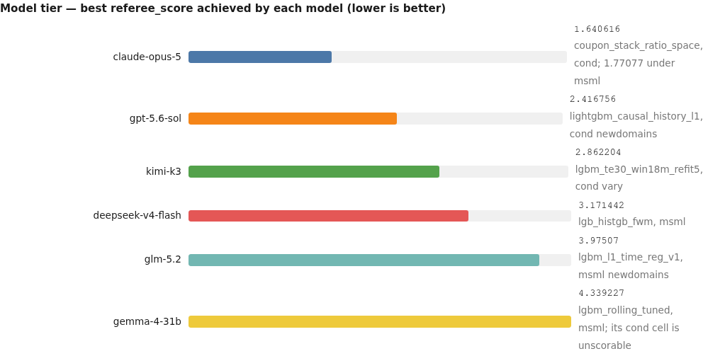

<details><summary>chart data</summary>

```chart
type: bars
title: Model tier — best referee_score achieved by each model (lower is better)
claude-opus-5 | 1.640616 | coupon_stack_ratio_space, cond; 1.77077 under msml
gpt-5.6-sol | 2.416756 | lightgbm_causal_history_l1, cond newdomains
kimi-k3 | 2.862204 | lgbm_te30_win18m_refit5, cond vary
deepseek-v4-flash | 3.171442 | lgb_histgb_fwm, msml
glm-5.2 | 3.97507 | lgbm_l1_time_reg_v1, msml newdomains
gemma-4-31b | 4.339227 | lgbm_rolling_tuned, msml; its cond cell is unscorable
```

</details>

**claude-opus-5** is first under both harnesses — the only model whose win is harness-independent. **gpt-5.6-sol** is second on its best cell but the most variable (2.416756 / 3.574268 / 4.230359 / 4.001524). **kimi-k3** has the widest harness gap of any model (cond 3.724917 and 2.862204 vs msml 6.378698 and 4.242443) — the model that most needs cond. **deepseek-v4-flash** is the only model clearly better under msml (3.171442 vs 3.65858), though its cond side was scored on 8 of 12 rows. **glm-5.2** is mid-tier and flat across all four cells (3.97507-4.81724). **gemma-4-31b** is last.

### 4.2 Capability read from the work products (not the scores)

- **claude-opus-5 (o5_cond `playbook.md`, 34,356 bytes — the largest in the corpus)** opens with resource state and a hard artifact contract: *"Lifetime experiment budget is EXHAUSTED: 12/12 proposed (#1..#12) ... If you must cut scope for the 900s wall, cut sweep breadth (fewer hyperparameter cells), never the leakage tests, never the referee parquet, never the segment tables."* A model reasoning about its own budget and about which invariants are non-negotiable.
- **gpt-5.6-sol (sol_cond playbook)** writes the sharpest causality specification in the corpus: *"for a prediction on D, every fit, target statistic, category map, bin edge, scaler, regime definition, and lookup must use rows with `Date < D`"* — and it produced 74 and 296 verification artifacts.
- **kimi-k3 (d7v_k3_cond playbook)** cites its own harness by line number: *"The engine drops the `payup` target from BOTH fit and predict frames (engine.py lines 96/76). Regardless, every strategy MUST use an explicit whitelist ... defense-in-depth against future engine regressions."* The only playbook in the corpus that anticipates a *future harness regression*.
- **glm-5.2** writes the longest documents (playbooks 12,692 / 11,818 / 30,457 / 9,268 bytes) and scores mid-tier — **verbosity is not capability**.
- **gemma-4-31b (g4_msml playbook, 1,880 bytes)** is correct but generic: *"LightGBM is the most efficient and effective ... `regression_l1` (MAE) is mandatory"*. Its `learnings.md` files are the two smallest in the corpus (1,320 and 884 bytes).

### 4.3 Per-seat model choice

| Seat | Choice | Evidence | Confidence |
|---|---|---|---|
| Strategist | **claude-opus-5**, sol close second | o5's playbook quality plus 39 (cond) / 83 (msml) strategist calls — disciplined; sol's causality spec | moderate |
| Workers (implement / analyze) | **claude-opus-5** or **gpt-5.6-sol** | registry `code.median_code_lines_per_experiment` 1161.5 / 839.0 (o5) and 1106.0 / 554 (sol), with 32.5 / 34.0 and 42.0 median functions; low end d7v_glm_msml 46.0 lines / 1.0 function | moderate |
| Builder / critic / tester | **unresolved, leaning claude** | these seats are small everywhere (10-132 calls) and leave no distinguishing artifacts; only pooled tool-failure rate separates models (claude 0.0105 vs gemma 0.0715) | weak |
| Verifier (cond only) | **gpt-5.6-sol** | 74 and 296 verification artifacts; audits that name a real defect (`returncode -9`, guard False); kimi next (54, 61) with exact reproductions; GLM last — its contract script crashed unnoticed | moderate |
| Conductor (cond only) | **kimi-k3** or **gpt-5.6-sol** | the only models that actually drove it: 97 and 83 registry `governance.decisions`, 27 and 14 directives, ack rates 0.481 / 0.286, all 6 kills and 5 of 9 parks. deepseek / gemma / GLM conductors issued 8-9 directives at ack rate 0.000 | moderate |

**Confounding stated plainly:** every run uses one model in *every* seat, so seat-level attribution rests on the quality of each seat's own output, not a controlled swap. No seat verdict exceeds "moderate".

---

## 5. Combination — what to run today

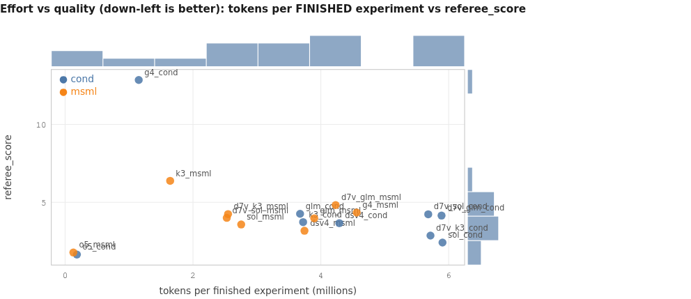

<details><summary>chart data</summary>

```chart
type: scatter
title: Effort vs quality (down-left is better): tokens per FINISHED experiment vs referee_score
x: tokens per finished experiment (millions)
y: referee_score
marginals: true
point o5_cond | 0.184 | 1.640616 | cond
point o5_msml | 0.130 | 1.77077 | msml
point sol_cond | 5.903 | 2.416756 | cond
point d7v_k3_cond | 5.716 | 2.862204 | cond
point dsv4_msml | 3.745 | 3.171442 | msml
point sol_msml | 2.754 | 3.574268 | msml
point dsv4_cond | 4.290 | 3.65858 | cond
point k3_cond | 3.723 | 3.724917 | cond
point glm_msml | 3.898 | 3.97507 | msml
point d7v_sol_msml | 2.529 | 4.001524 | msml
point d7v_glm_cond | 5.889 | 4.144928 | cond
point d7v_sol_cond | 5.681 | 4.230359 | cond
point d7v_k3_msml | 2.549 | 4.242443 | msml
point glm_cond | 3.675 | 4.260018 | cond
point g4_msml | 4.562 | 4.339227 | msml
point d7v_glm_msml | 4.232 | 4.81724 | msml
point k3_msml | 1.643 | 6.378698 | msml
point g4_cond | 1.152 | 12.855811 | cond
```

</details>
*The x-axis is my own derivation: summed per-seat input+output tokens divided by FINISHED experiment rows. The registry's own per-experiment token ratio and its per-scored/per-finished discrepancy are given in §9.*

**Ranking over all 18 cells present** (referee quotes):

| Rank | Cell | referee best experiment | referee_score | scored rows |
|---|---|---|---|---|
| 1 | cond + claude-opus-5 | `coupon_stack_ratio_space` | 1.640616 | 12/12 |
| 2 | msml + claude-opus-5 | `segmented_newprod_split_lgbm` | 1.77077 | 12/12 |
| 3 | cond + gpt-5.6-sol | `lightgbm_causal_history_l1` | 2.416756 | 7/12 |
| 4 | cond + kimi-k3 (vary) | `lgbm_te30_win18m_refit5` | 2.862204 | 12/12 |
| 5 | msml + deepseek-v4-flash | `lgb_histgb_fwm` | 3.171442 | 12/12 |
| 6 | msml + gpt-5.6-sol (nd) | `catboost_native_mae_causal_group_stats_recency_365d` | 3.574268 | 9/11 |
| 7 | cond + deepseek-v4-flash | `lgbm_recency_weighted2` | 3.65858 | 8/12 |
| 8 | cond + kimi-k3 (nd) | `lgbm_regime_tfeatures` | 3.724917 | 12/12 |
| 9 | msml + glm-5.2 (nd) | `lgbm_l1_time_reg_v1` | 3.97507 | 11/12 |
| 10 | msml + gpt-5.6-sol (vary) | `lgbm_l1_18m_native_calendar` | 4.001524 | 10/12 |
| 11 | cond + glm-5.2 (vary) | `mness_quantile_bucket_lgbm` | 4.144928 | 11/12 |
| 12 | cond + gpt-5.6-sol (vary) | `hier_wmedian_daily_730d` | 4.230359 | 2/12 — operator-stopped |
| 13 | msml + kimi-k3 (vary) | `histgb_recent2025` | 4.242443 | 12/12 |
| 14 | cond + glm-5.2 (nd) | `exp_lgbm3` | 4.260018 | 12/12 |
| 15 | msml + gemma-4-31b | `lgbm_rolling_tuned` | 4.339227 | 4/11 |
| 16 | msml + glm-5.2 (vary) | `lgbm_l1_biascal` | 4.81724 | 12/12 |
| 17 | msml + kimi-k3 (nd) | `hgbr_q50_fw_tenc` | 6.378698 | 12/12 |
| 18 | cond + gemma-4-31b | `ridge_ts_robust_v1` | 12.855811 | **0/12 — unscorable** |

**Decision matrix**

| If you are optimizing… | Run | Why |
|---|---|---|
| Best possible number | cond + claude-opus-5 | referee_score 1.640616 on 12 of 12 scored rows |
| Best number at $0 vendor cost | cond + kimi-k3 | referee_score 2.862204; lab-hosted, billed $0.00 by construction |
| Fewest failure modes | cond + claude-opus-5 | 18 tool failures in 1,967 invocations; 0 rate-limited requests; clean exit |
| Cheapest dollars per scored experiment | msml + claude-opus-5 | $10.86 vs $13.68 (cond) — the only two models with real ledgers |
| Wall-clock turnaround | msml + gpt-5.6-sol | registry `lifecycle.wall_hours` 2.09 and 2.56 with 9-10 scored rows |
| Auditability / regulated use | cond, any model | the only side with verification artifacts |

**What flips each answer:** V3 flips to msml+claude if a second claude pair reverses (margin only 0.1302); the $0 answer flips to msml+deepseek if kimi's serving timeouts recur (registry `lifecycle.wall_hours` 17.23 for d7v_k3_cond, with 5 dead agent turns).

---

## 6. Repeatability

**The finding that constrains everything else: repeat and era are the same variable.** All six replication groups pair one newdomains run with one vary run. Every spread below is an upper bound on pure repeat noise.

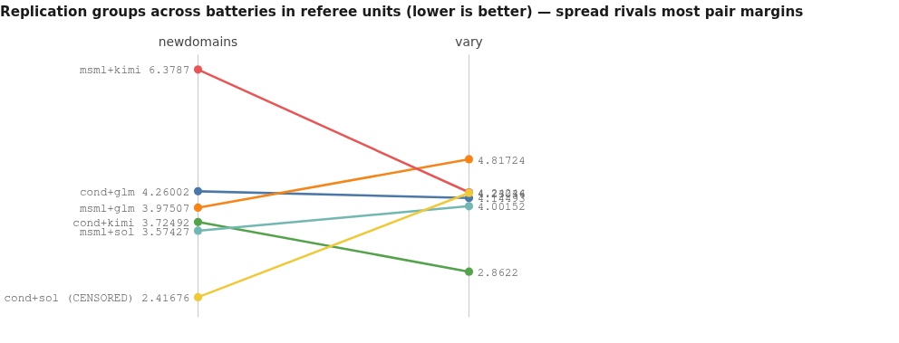

<details><summary>chart data</summary>

```chart
type: slope
title: Replication groups across batteries in referee units (lower is better) — spread rivals most pair margins
x: newdomains -> vary
slope cond+glm | 4.260018 | 4.144928
slope msml+glm | 3.97507 | 4.81724
slope cond+kimi | 3.724917 | 2.862204
slope msml+kimi | 6.378698 | 4.242443
slope msml+sol | 3.574268 | 4.001524
slope cond+sol (CENSORED) | 2.416756 | 4.230359
```

</details>

**Referee-unit spreads:** cond+glm **0.1151**; msml+sol 0.4273; msml+glm 0.8422; cond+kimi 0.8627; msml+kimi **2.1363**. cond+sol is excluded (1.8136) because its vary run was operator-stopped at 2 scored rows.

**Champion-family spread (referee-declared bests, quotes):** cond+glm changes `exp_lgbm3` → `mness_quantile_bucket_lgbm`; msml+glm `lgbm_l1_time_reg_v1` → `lgbm_l1_biascal`; cond+kimi `lgbm_regime_tfeatures` → `lgbm_te30_win18m_refit5`; msml+kimi changes family entirely, `hgbr_q50_fw_tenc` → `histgb_recent2025`; msml+sol `catboost_native_mae_causal_group_stats_recency_365d` → `lgbm_l1_18m_native_calendar`.

**Search-shape spread (registry metric ids, newdomains → vary):**

| Group | `search.scored` | `search.improvements` | `search.experiments_to_best` | `search.time_to_best_hours` | `lifecycle.wall_hours` | `search.median_queue_wait_minutes` |
|---|---|---|---|---|---|---|
| cond+glm | 12 → 11 | 3 → 4 | 6 → 9 | — → 0.6 | 3.7 → 3.61 | 7.4 → 32.0 |
| msml+glm | 11 → 12 | 2 → 4 | 2 → 8 | 0.15 → 0.99 | 4.12 → 4.06 | 5.8 → 13.9 |
| cond+kimi | 12 → 12 | 3 → 3 | 9 → 8 | 1.48 → 4.47 | 6.58 → 17.23 | 70.9 → 151.3 |
| msml+kimi | 12 → 12 | 3 → 5 | 7 → 12 | 1.44 → 6.68 | 5.4 → 14.08 | 28.8 → 68.8 |
| msml+sol | 9 → 10 | 4 → 4 | 8 → 9 | 0.69 → 0.77 | 2.09 → 2.56 | 6.3 → 5.8 |
| cond+sol (censored) | 7 → 2 | 2 → 1 | 2 → 1 | 0.43 → 0.18 | 5.97 → 14.66 | 35.9 → 19.6 |

**Which harness is more repeatable?** On the usable groups, cond's spreads are 0.1151 and 0.8627 (mean 0.489) versus msml's 0.4273, 0.8422 and 2.1363 (mean 1.135) — **cond leans more repeatable, weakly.** The mechanism I can point to is search-shape stability: cond's champions are refit/window variants of one design in both eras, whereas msml+kimi swapped model family entirely. Two-to-three groups per side; treat it as a hint.

**Do pair verdicts survive?** cond's kimi win survives both eras (margins 2.6538 and 1.3802). The GLM verdict does **not**. The sol verdict cannot be tested (censored repeat). What changed besides the seed is not fully recoverable, but at minimum the adapter set differs per run (every run rewrites its own prompts: 4-23 patch calls) and one run rewrote 9 adapter files mid-flight.

---

## 7. Treatment (reasoning replay) — why it cannot be estimated here

| Family | Responses carrying reasoning | Requests carrying reasoning | Reading |
|---|---|---|---|
| deepseek-v4-flash (2 runs) | 1055/1574, 1035/1495 | **0/1577, 0/1495** | ran blind — request-side defect |
| glm-5.2 (4 runs) | 195/945, 368/1261, 276/1491, 360/1368 | **0 in all four** | ran blind — request-side defect |
| gemma-4-31b (2 runs) | 0/956, 0/1907 | 0, 0 | produces no traces — model property, vacuous zero |
| claude-opus-5 (2) | 1112/1620, 826/1291 | 1474/1623, 1142/1291 | replay works |
| kimi-k3 (4) | 965/1128, 713/802, 1478/1714, 919/1023 | 1067/1130, 741/802, 1620/1721, 957/1023 | replay works |
| gpt-5.6-sol (4) | 1573/1635, 794/820, 1506/1567, 848/878 | 1548/1636, 770/830, 1474/1567, 812/878 | replay works |

**This is the defect class, not an extractor gap:** the same extractor sees the traces in the responses and reports zero on the requests. It is **platform-level, not architectural** — the zeros appear for the same models under *both* harnesses in *both* batteries. Registry `context.thinking_share` is exactly 0.0 for every gemma / GLM / deepseek run and 0.0827-0.1758 for every claude / kimi / sol run.

**Consequence:** with post-fix reruns out of scope, "with replay" vs "without replay" is exactly {o5, k3, sol} vs {glm, dsv4} plus gemma as a no-traces special case — **perfectly confounded with model identity**. No treatment effect can be estimated. **Which model WITH replay: claude-opus-5. Which model WITHOUT replay: not answerable — no model here ran both ways.** The honest observation is that the two blind families occupy the mid and lower tiers and this corpus cannot say whether blindness caused it.

---

## 8. Reliability — external interference vs harness defects vs model defects

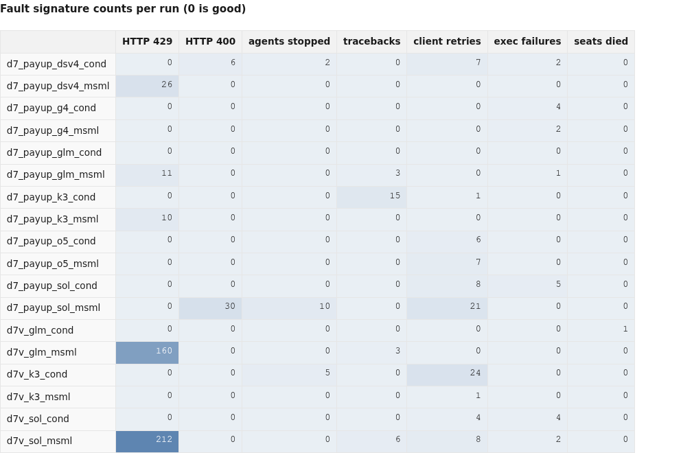

<details><summary>chart data</summary>

```chart
type: heatmap
title: Fault signature counts per run (0 is good)
cols: HTTP 429 | HTTP 400 | agents stopped | tracebacks | client retries | exec failures | seats died
row d7_payup_dsv4_cond | 0 | 6 | 2 | 0 | 7 | 2 | 0
row d7_payup_dsv4_msml | 26 | 0 | 0 | 0 | 0 | 0 | 0
row d7_payup_g4_cond | 0 | 0 | 0 | 0 | 0 | 4 | 0
row d7_payup_g4_msml | 0 | 0 | 0 | 0 | 0 | 2 | 0
row d7_payup_glm_cond | 0 | 0 | 0 | 0 | 0 | 0 | 0
row d7_payup_glm_msml | 11 | 0 | 0 | 3 | 0 | 1 | 0
row d7_payup_k3_cond | 0 | 0 | 0 | 15 | 1 | 0 | 0
row d7_payup_k3_msml | 10 | 0 | 0 | 0 | 0 | 0 | 0
row d7_payup_o5_cond | 0 | 0 | 0 | 0 | 6 | 0 | 0
row d7_payup_o5_msml | 0 | 0 | 0 | 0 | 7 | 0 | 0
row d7_payup_sol_cond | 0 | 0 | 0 | 0 | 8 | 5 | 0
row d7_payup_sol_msml | 0 | 30 | 10 | 0 | 21 | 0 | 0
row d7v_glm_cond | 0 | 0 | 0 | 0 | 0 | 0 | 1
row d7v_glm_msml | 160 | 0 | 0 | 3 | 0 | 0 | 0
row d7v_k3_cond | 0 | 0 | 5 | 0 | 24 | 0 | 0
row d7v_k3_msml | 0 | 0 | 0 | 0 | 1 | 0 | 0
row d7v_sol_cond | 0 | 0 | 0 | 0 | 4 | 4 | 0
row d7v_sol_msml | 212 | 0 | 0 | 6 | 8 | 2 | 0
```

</details>

**1. HARNESS DEFECT — rate limiting (msml).** All 419 HTTP 429s land on the `embeddings` endpoint. msml calls it in all 9 runs (808-1,532 requests each, roughly one per model call); cond calls it **zero** times in 9 runs. Counts: d7v_sol_msml 212/1035, d7v_glm_msml 160/1454, dsv4_msml 26/1532, glm_msml 11/1277, k3_msml 10/808. Contention triggers it — all five sit in the two dense battery windows — but the exposure is msml's per-call coupling. The naive rate story is falsified: `glm_cond` peaked at **63 requests/minute with zero 429s** while `glm_msml` peaked at 39 and took 11. **Cost:** 419 requests retried; no measurable quality loss identified.

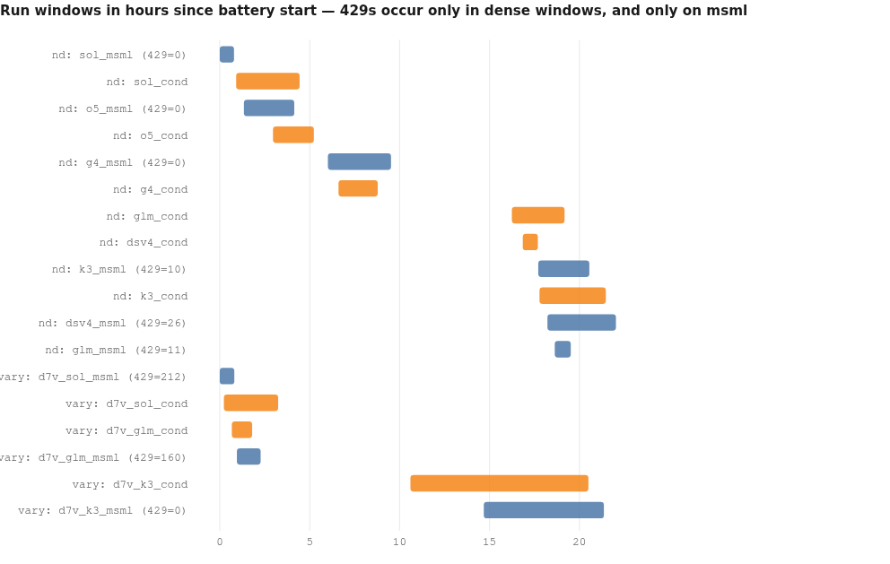

<details><summary>chart data</summary>

```chart
type: spans
title: Run windows in hours since battery start — 429s occur only in dense windows, and only on msml
span nd: sol_msml (429=0) | 0.00 | 0.79 | msml
span nd: sol_cond | 0.91 | 4.44 | cond
span nd: o5_msml (429=0) | 1.34 | 4.14 | msml
span nd: o5_cond | 2.96 | 5.23 | cond
span nd: g4_msml (429=0) | 6.01 | 9.52 | msml
span nd: g4_cond | 6.60 | 8.78 | cond
span nd: glm_cond | 16.24 | 19.17 | cond
span nd: dsv4_cond | 16.85 | 17.69 | cond
span nd: k3_msml (429=10) | 17.71 | 20.55 | msml
span nd: k3_cond | 17.78 | 21.47 | cond
span nd: dsv4_msml (429=26) | 18.22 | 22.03 | msml
span nd: glm_msml (429=11) | 18.63 | 19.52 | msml
span vary: d7v_sol_msml (429=212) | 0.00 | 0.81 | msml
span vary: d7v_sol_cond | 0.23 | 3.25 | cond
span vary: d7v_glm_cond | 0.67 | 1.80 | cond
span vary: d7v_glm_msml (429=160) | 0.95 | 2.27 | msml
span vary: d7v_k3_cond | 10.60 | 20.50 | cond
span vary: d7v_k3_msml (429=0) | 14.68 | 21.36 | msml
```

</details>
*Windows are my own derivation — earliest experiment creation to latest finish per run, in hours since the first run of that battery. The registry's own duration quantity is `lifecycle.wall_hours`, echoed in full in §0b.*

**2. HARNESS DEFECT — request assembly (msml, intermittent).** `d7_payup_sol_msml` emitted orphaned `function_call_output` entries: 30 HTTP 400s reading `"No tool call found for function call output with call_id call_lK3H5ojiVAfSRF1POJM8VnFm."` (five distinct call_ids in the first 20 matching log lines), each escalating `Retrying in 1s` → `Retrying in 5s` → `API error after 3 retries` → **`Agent stopped unexpectedly`** ×10. The sibling `d7v_sol_msml` shows 879/879 successes on the same endpoint, so it is intermittent, not systematic. The run still exits cleanly — silent.

**3. EXTERNAL INTERFERENCE — kimi serving timeouts.** `d7v_k3_cond` shows repeated `API error: timed out` escalating to `API error after 3 retries: timed out` then `Agent stopped unexpectedly` (5 stops, 29 agent-visible API errors, 24 client retries); `d7_payup_k3_cond` carries 15 tracebacks. The operator declares this external. **Honest caveat:** the timeouts land on the cond kimi runs and not the msml kimi runs, and cond's kimi sessions are much longer (median session 56.71 and 23.51 minutes vs msml's 31.15 and 17.70), so exposure time is a confound I cannot remove. I accept the external attribution but record that the corpus alone does not prove it.

**4. OPERATOR STOP — `d7v_sol_cond`, exit code 137.** No in-run error signature precedes it: 0 tracebacks, 0 agent stops, 0 dispatcher crashes, 1568/1568 successes on its primary endpoint and 19/19 on its secondary, one retried peer-closed-connection line in the whole log. 9 rows parked, 1 in flight at end. Consistent with an external SIGKILL and **evidence, not a harness failure**.

**5. Not inflated:** exactly one seat in the entire corpus died before its first reply — 1 conductor session in `d7v_glm_cond`. Registry `reliability.capacity_refusals` is 0 in all 18 runs; `lifecycle.dispatcher_crashes` 0 in all 18.

**Shape of the runs:** registry `lifecycle.run_launches` is 1 in 12 runs, 2 in four, 3 in two (dsv4_msml, g4_msml), 4 in one (k3_msml). `lifecycle.final_exit_code` is 0 in 17 of 18.

---

## 9. Cost

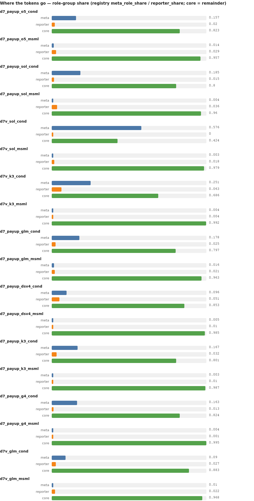

<details><summary>chart data</summary>

```chart
type: grouped
title: Where the tokens go — role-group share (registry meta_role_share / reporter_share; core = remainder)
row d7_payup_o5_cond | meta=0.157 | reporter=0.020 | core=0.823
row d7_payup_o5_msml | meta=0.014 | reporter=0.029 | core=0.957
row d7_payup_sol_cond | meta=0.185 | reporter=0.015 | core=0.800
row d7_payup_sol_msml | meta=0.004 | reporter=0.036 | core=0.960
row d7v_sol_cond | meta=0.576 | reporter=0.000 | core=0.424
row d7v_sol_msml | meta=0.003 | reporter=0.018 | core=0.979
row d7v_k3_cond | meta=0.251 | reporter=0.063 | core=0.686
row d7v_k3_msml | meta=0.004 | reporter=0.004 | core=0.992
row d7_payup_glm_cond | meta=0.178 | reporter=0.025 | core=0.797
row d7_payup_glm_msml | meta=0.016 | reporter=0.021 | core=0.963
row d7_payup_dsv4_cond | meta=0.096 | reporter=0.051 | core=0.853
row d7_payup_dsv4_msml | meta=0.005 | reporter=0.010 | core=0.985
row d7_payup_k3_cond | meta=0.167 | reporter=0.032 | core=0.801
row d7_payup_k3_msml | meta=0.003 | reporter=0.010 | core=0.987
row d7_payup_g4_cond | meta=0.163 | reporter=0.013 | core=0.824
row d7_payup_g4_msml | meta=0.004 | reporter=0.001 | core=0.995
row d7v_glm_cond | meta=0.090 | reporter=0.027 | core=0.883
row d7v_glm_msml | meta=0.010 | reporter=0.022 | core=0.968
```

</details>

**Dollars exist only for two models.** claude: $164.11 (cond) / $130.37 (msml). sol: $96.05 / $52.52 (newdomains), $95.25 / $53.29 (vary). GLM, kimi, deepseek and gemma are **$0.00 by construction** as lab-hosted models and must never be called "cheapest". Dollars per scored experiment: o5_msml $10.86, o5_cond $13.68, sol_msml $5.84, sol_cond $13.72, d7v_sol_msml $5.33, d7v_sol_cond $47.62 (2-row denominator).

**Cache semantics, spelled out.** For claude the reported input+output total **excludes** cache reads: `d7_payup_o5_cond` publishes registry `efficiency.total_tokens_m` 2.2 beside 100,623,088 cache-read tokens, `efficiency.cache_hit_fraction` 1.0 and `efficiency.fresh_tokens_per_call` 2 — which is exactly why "fresh-input growth per session = 0.00" appears for the claude pair and nowhere else: essentially no fresh input is added per turn, the whole history is served from cache. For sol the input **includes** cache reads (`d7_payup_sol_cond` total 70.8 with 63,341,290 cache-read, hit fraction 0.9079). For the lab-hosted models cache is effectively unused (GLM 0 cache-read, hit 0.0; deepseek 0.0024-0.0064; kimi 0.012-0.0294). **The ~30x gap between claude's 2.2 and deepseek's 51.5 is mostly an accounting difference, not a behavioural one.**

**Per-experiment cost, both denominators.** Registry `efficiency.tokens_per_scored` next to my per-finished derivation: o5_cond 183,723 / 183,722; o5_msml 129,675 / 129,675; sol_cond 10,119,917 / 5,903,284; sol_msml 3,365,585 / 2,753,660; dsv4_cond 6,434,850 / 4,289,900; dsv4_msml 3,745,461 / 3,745,460; glm_cond 3,674,921 / 3,674,920; glm_msml 4,252,843 / 3,898,439; k3_cond 3,722,535 / 3,722,535; k3_msml 1,643,036 / 1,643,036; d7v_glm_cond 6,424,786 / 5,889,387; d7v_glm_msml 4,231,853 / 4,231,853; d7v_k3_cond 5,716,407 / 5,716,407; d7v_k3_msml 2,548,954 / 2,548,953; d7v_sol_cond **34,086,842 / 5,681,140**; d7v_sol_msml 3,035,396 / 2,529,497; g4_cond not published / 1,152,179; g4_msml 2,651,557 / 4,562,026. The censored run's per-scored figure is a collapsing-denominator artifact, not profligacy.

---

## 10. Search dynamics and lineage

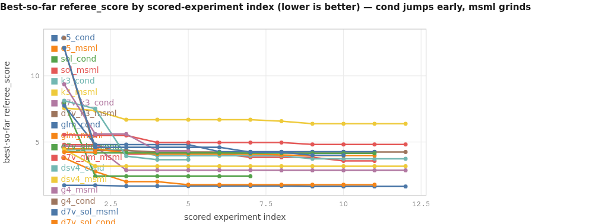

<details><summary>chart data</summary>

```chart
type: line
title: Best-so-far referee_score by scored-experiment index (lower is better) — cond jumps early, msml grinds
x: scored experiment index
y: best-so-far referee_score
series o5_cond: 1,1.7309; 2,1.7307; 3,1.6663; 4,1.6663; 5,1.6663; 6,1.6663; 7,1.6663; 8,1.6663; 9,1.6406; 10,1.6406; 11,1.6406; 12,1.6406
series o5_msml: 1,3.7893; 2,2.7635; 3,2.0042; 4,2.0042; 5,1.7708; 6,1.7708; 7,1.7708; 8,1.7708; 9,1.7708; 10,1.7708; 11,1.7708
series sol_cond: 1,7.9658; 2,2.4168; 3,2.4168; 4,2.4168; 5,2.4168; 6,2.4168; 7,2.4168
series sol_msml: 1,4.7918; 2,4.7918; 3,4.1003; 4,4.1003; 5,4.1003; 6,4.1003; 7,3.8473; 8,3.8473; 9,3.8473; 10,3.5743; 11,3.5743
series k3_cond: 1,4.4170; 2,4.4170; 3,4.4170; 4,3.9650; 5,3.9650; 6,3.9650; 7,3.9650; 8,3.9650; 9,3.7249; 10,3.7249; 11,3.7249; 12,3.7249
series k3_msml: 1,7.5616; 2,7.3797; 3,6.6846; 4,6.6846; 5,6.6846; 6,6.6846; 7,6.6846; 8,6.5745; 9,6.3787; 10,6.3787; 11,6.3787; 12,6.3787
series d7v_k3_cond: 1,4.6856; 2,4.6856; 3,2.8722; 4,2.8722; 5,2.8722; 6,2.8722; 7,2.8722; 8,2.8622; 9,2.8622; 10,2.8622; 11,2.8622; 12,2.8622
series d7v_k3_msml: 1,12.0980; 2,4.3540; 3,4.3540; 4,4.2424; 5,4.2424; 6,4.2424; 7,4.2424; 8,4.2424; 9,4.2424; 10,4.2424; 11,4.2424; 12,4.2424
series glm_cond: 1,7.7431; 2,4.8059; 3,4.8059; 4,4.8059; 5,4.8059; 6,4.2600; 7,4.2600; 8,4.2600; 9,4.2600; 10,4.2600; 11,4.2600
series glm_msml: 1,4.4908; 2,4.4908; 3,4.1643; 4,4.1012; 5,4.1012; 6,4.1012; 7,4.1012; 8,4.0236; 9,3.9751; 10,3.9751; 11,3.9751
series d7v_glm_cond: 1,4.2913; 2,4.1772; 3,4.1772; 4,4.1772; 5,4.1772; 6,4.1772; 7,4.1568; 8,4.1530; 9,4.1449; 10,4.1449; 11,4.1449
series d7v_glm_msml: 1,5.5478; 2,5.4914; 3,5.4914; 4,4.9578; 5,4.9578; 6,4.9578; 7,4.9578; 8,4.9578; 9,4.8172; 10,4.8172; 11,4.8172; 12,4.8172
series dsv4_cond: 1,8.1251; 2,7.5095; 3,3.9340; 4,3.6586; 5,3.6586
series dsv4_msml: 1,4.4398; 2,3.1732; 3,3.1732; 4,3.1732; 5,3.1732; 6,3.1732; 7,3.1714; 8,3.1714; 9,3.1714; 10,3.1714; 11,3.1714; 12,3.1714
series g4_msml: 1,9.3657; 2,5.6011; 3,5.6011; 4,4.3392; 5,4.3392
series g4_cond: 1,12.8558
series d7v_sol_msml: 1,12.0980; 2,4.5960; 3,4.5960; 4,4.5960; 5,4.5960; 6,4.5960; 7,4.2340; 8,4.2340; 9,4.0015; 10,4.0015
series d7v_sol_cond: 1,4.2304; 2,4.2304
```

</details>
*All 18 runs, referee units throughout.*

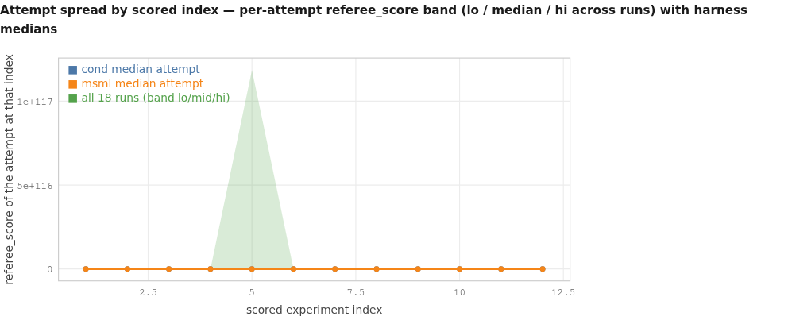

<details><summary>chart data</summary>

```chart
type: line
title: Attempt spread by scored index — per-attempt referee_score band (lo / median / hi across runs) with harness medians
x: scored experiment index
y: referee_score of the attempt at that index
band all 18 runs: 1,1.7309,7.7431,12.8558; 2,1.7307,4.7918,188676874524871.3; 3,1.6663,4.5947,12.2484; 4,1.7307,4.3739,12.8121; 5,1.7324,4.5960,1.186e117; 6,1.7058,4.5031,7.5642; 7,1.7307,4.2340,7.6009; 8,1.6406,4.2385,8.4264; 9,1.6406,4.1614,5.2225; 10,1.7189,4.2093,6.9391; 11,1.6941,4.2809,6.7855; 12,1.7307,4.1955,6.8859
series cond median attempt: 1,4.4170; 2,4.6856; 3,4.1772; 4,4.1772; 5,4.2913; 6,4.1568; 7,4.1530; 8,4.3066; 9,3.7249; 10,4.2093; 11,4.5389; 12,4.4715
series msml median attempt: 1,7.5616; 2,4.5960; 3,4.5947; 4,4.2670; 5,4.5960; 6,4.4085; 7,4.2340; 8,4.1614; 9,4.0015; 10,4.3410; 11,4.4550; 12,4.3955
```

</details>
*The band's upper edge at indices 2 and 5 is dominated by two numerically exploded rows (1.887e+14 and 1.186e+117 — see the oddities register in §14c). Medians are across runs at each index.*

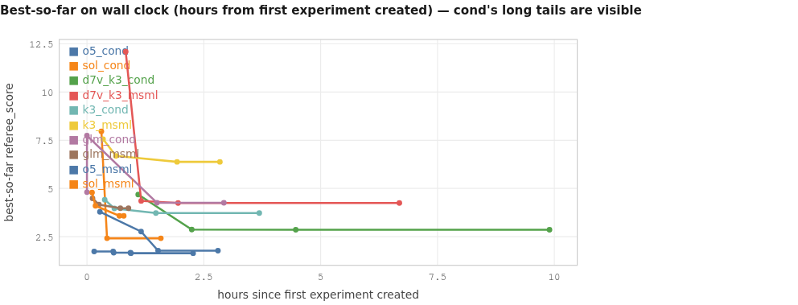

<details><summary>chart data</summary>

```chart
type: line
title: Best-so-far on wall clock (hours from first experiment created) — cond's long tails are visible
x: hours since first experiment created
y: best-so-far referee_score
series o5_cond: 0.154,1.7309; 0.560,1.7307; 0.572,1.6663; 0.931,1.6663; 0.940,1.6406; 2.272,1.6406
series sol_cond: 0.308,7.9658; 0.429,2.4168; 1.581,2.4168
series d7v_k3_cond: 1.097,4.6856; 2.242,2.8722; 4.467,2.8622; 9.898,2.8622
series d7v_k3_msml: 0.830,12.0980; 1.161,4.3540; 1.950,4.2424; 6.685,4.2424
series k3_cond: 0.381,4.4170; 0.585,3.9650; 1.475,3.7249; 3.688,3.7249
series k3_msml: 0.345,7.5616; 0.620,6.6846; 1.929,6.3787; 2.844,6.3787
series glm_cond: 0.000,7.7431; 0.000,4.8059; 1.496,4.2600; 2.929,4.2600
series glm_msml: 0.118,4.4908; 0.256,4.1643; 0.715,3.9751; 0.888,3.9751
series o5_msml: 0.277,3.7893; 1.158,2.7635; 1.522,1.7708; 2.803,1.7708
series sol_msml: 0.109,4.7918; 0.182,4.1003; 0.694,3.5743; 0.788,3.5743
```

</details>
*x here is my own derivation from experiment timestamps. The registry's published timing quantities are echoed in §0b and are authoritative for those questions.*

**Build vs thrash — registry evidence.** Lineage is thin on both sides. Parent links exist only in cond (`search.variant_rows`: dsv4_cond 1, glm_cond 1, sol_cond 1, d7v_k3_cond 3, d7v_sol_cond 3); the variant-proposal tool is cond-only and was invoked **10 times in the whole corpus** with 1 failure. Every msml experiments database has a null parent for all rows. `search.refinement_win_fraction`: 1.0 on 1 pair (dsv4_cond), 0.0 on 1 pair (glm_cond), 0.667 on 3 pairs (d7v_k3_cond). **Neither harness builds systematically: cond has the mechanism and barely uses it; msml has none.** `search.late_gain_fraction` is 0.000 in 13 of 18 runs and never exceeds 0.208; `search.tail_after_last_improvement` is 0-9 scored rows — both harnesses spend their last quarter not improving.

**Family exploitation — referee evidence.** What both harnesses do instead of refining is exploit one model family: the top rows of `d7_payup_k3_msml` are all `hgbr_q50_*` variants (its declared best is `hgbr_q50_fw_tenc`), `d7v_k3_msml`'s are all `histgb_*` (best `histgb_recent2025`), and `d7_payup_o5_cond`'s twelve scored rows all sit inside a 1.6406-1.7324 band around its best `coupon_stack_ratio_space`.

**Queue and yield (registry).** `search.median_queue_wait_minutes` (echoed in §0b) ranges 5.8 to 151.3; cond's wait is higher in 6 of 9 pairs — the price of conductor admission. The two longest waits (151.3, 68.8) belong to the two runs with the largest `lifecycle.wall_hours` (17.23, 14.08), and the longer of them still produced the corpus's fourth-best score.

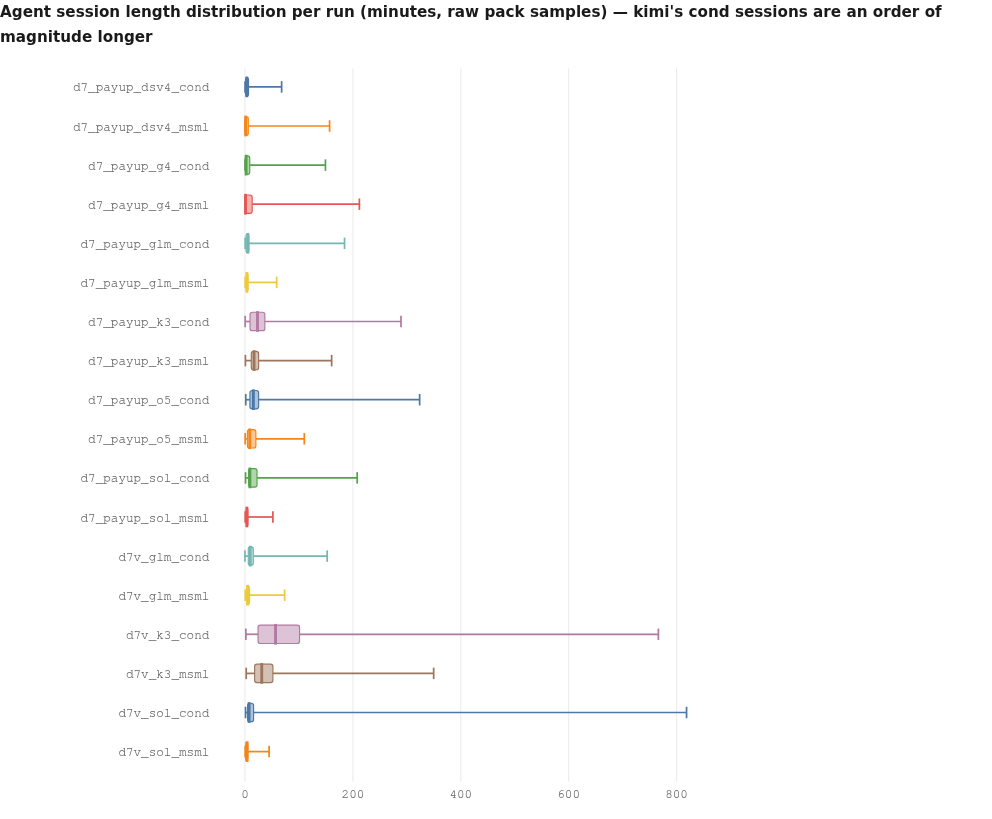

<details><summary>chart data</summary>

```chart
type: box
title: Agent session length distribution per run (minutes, raw pack samples) — kimi's cond sessions are an order of magnitude longer
box d7_payup_dsv4_cond | 0.10 | 1.17 | 3.32 | 6.51 | 67.89
box d7_payup_dsv4_msml | 0.15 | 0.57 | 1.16 | 6.11 | 156.84
box d7_payup_g4_cond | 0.08 | 0.82 | 2.12 | 8.91 | 149.10
box d7_payup_g4_msml | 0.38 | 0.59 | 0.91 | 13.42 | 211.99
box d7_payup_glm_cond | 0.32 | 1.87 | 5.19 | 7.50 | 184.51
box d7_payup_glm_msml | 0.44 | 2.35 | 3.31 | 5.90 | 58.75
box d7_payup_k3_cond | 0.27 | 9.23 | 23.16 | 36.68 | 289.27
box d7_payup_k3_msml | 0.77 | 11.71 | 16.67 | 25.28 | 160.62
box d7_payup_o5_cond | 1.41 | 9.08 | 15.41 | 25.36 | 323.80
box d7_payup_o5_msml | 0.36 | 4.44 | 8.78 | 20.23 | 109.93
box d7_payup_sol_cond | 1.00 | 6.80 | 9.13 | 22.27 | 208.07
box d7_payup_sol_msml | 0.41 | 2.10 | 3.63 | 5.43 | 51.79
box d7v_glm_cond | 0.00 | 6.20 | 9.64 | 15.55 | 152.41
box d7v_glm_msml | 0.48 | 3.27 | 4.85 | 8.38 | 73.38
box d7v_k3_cond | 1.68 | 24.33 | 56.71 | 101.32 | 766.22
box d7v_k3_msml | 2.26 | 17.76 | 31.06 | 51.55 | 349.81
box d7v_sol_cond | 0.91 | 4.91 | 7.67 | 16.07 | 818.38
box d7v_sol_msml | 0.33 | 1.16 | 3.85 | 5.37 | 44.65
```

</details>
*Full raw arrays for all 18 runs were computed from the packs' session-minutes samples; five-number summaries shown. The registry's own medians and p90s agree — e.g. d7v_k3_cond 56.71 / 173.93, d7v_sol_msml 3.98 / 7.40.*

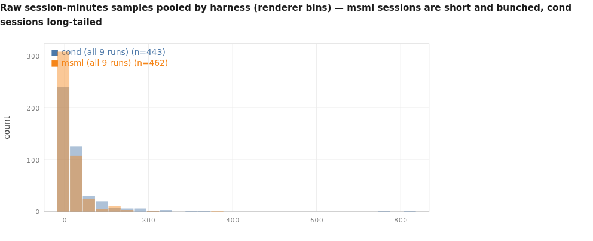

<details><summary>chart data</summary>

```chart
type: hist
title: Raw session-minutes samples pooled by harness (renderer bins) — msml sessions are short and bunched, cond sessions long-tailed
series cond (all 9 runs): 0.10, 0.11, 0.40, 0.49, 0.56, 0.66, 0.66, 0.72, 0.75, 0.76, 0.79, 1.01, 1.17, 1.22, 1.47, 1.50, 1.57, 1.84, 1.94, 1.94, 2.15, 2.50, 2.68, 2.93, 3.28, 3.32, 3.51, 3.78, 4.17, 4.27, 4.35, 4.36, 4.82, 4.94, 5.57, 5.73, 6.10, 6.51, 6.75, 7.85, 9.72, 11.26, 11.49, 13.14, 15.64, 16.39, 23.02, 30.16, 42.01, 52.40, 67.89, 0.08, 0.20, 0.33, 0.34, 0.35, 0.38, 0.46, 0.55, 0.55, 0.61, 0.68, 0.82, 0.89, 0.96, 1.07, 1.08, 1.12, 1.38, 1.66, 1.77, 2.01, 2.03, 2.08, 2.08, 2.12, 2.16, 2.17, 2.33, 2.35, 2.43, 2.44, 2.44, 3.42, 4.33, 5.80, 6.66, 8.91, 11.16, 13.70, 16.18, 16.85, 18.48, 18.80, 27.25, 28.76, 41.28, 49.62, 53.13, 81.08, 149.10, 0.32, 0.60, 0.95, 0.97, 1.24, 1.46, 1.87, 2.14, 2.98, 3.40, 3.44, 3.49, 4.41, 5.19, 5.22, 5.46, 6.47, 7.04, 7.46, 7.50, 8.43, 12.00, 16.36, 19.05, 23.71, 132.43, 184.51, 0.27, 2.98, 3.36, 3.84, 3.85, 3.87, 4.01, 4.58, 4.84, 6.06, 7.43, 7.50, 9.23, 9.74, 9.84, 13.52, 14.70, 15.59, 15.78, 20.36, 21.90, 22.38, 22.51, 22.54, 23.16, 23.51, 24.57, 26.02, 27.18, 28.23, 30.00, 31.68, 32.83, 33.75, 34.15, 35.17, 36.68, 40.02, 40.64, 41.01, 43.23, 46.87, 58.29, 61.18, 63.42, 66.84, 75.41, 90.04, 116.83, 289.27, 1.41, 2.20, 3.05, 3.24, 3.61, 4.81, 5.59, 5.88, 5.94, 7.45, 8.25, 8.44, 9.08, 10.70, 11.06, 11.12, 11.28, 11.77, 12.29, 12.65, 13.01, 13.35, 13.51, 13.63, 14.51, 15.41, 15.67, 15.89, 16.05, 16.18, 18.44, 20.03, 21.08, 21.49, 22.14, 22.21, 23.33, 24.13, 25.36, 29.80, 29.92, 31.12, 31.55, 32.33, 36.65, 37.34, 43.23, 43.63, 77.39, 83.29, 97.33, 323.80, 1.00, 1.29, 2.15, 2.18, 2.23, 2.54, 4.88, 5.10, 5.79, 6.01, 6.05, 6.16, 6.80, 6.80, 7.01, 7.03, 7.07, 7.33, 7.60, 7.73, 7.75, 7.97, 8.23, 8.25, 8.33, 8.42, 8.88, 9.13, 9.37, 9.88, 10.62, 11.23, 11.51, 13.05, 13.28, 13.33, 15.45, 19.10, 19.93, 20.79, 22.27, 28.93, 37.24, 37.30, 38.09, 38.13, 39.70, 49.09, 49.61, 50.75, 65.34, 94.00, 95.73, 140.94, 208.07, 0.00, 0.53, 0.54, 2.53, 2.63, 3.27, 3.96, 4.42, 5.16, 5.47, 6.20, 6.41, 6.95, 7.11, 8.30, 9.08, 9.17, 9.18, 9.19, 9.45, 9.49, 9.64, 10.56, 10.57, 10.58, 11.21, 11.36, 11.38, 11.44, 12.35, 12.45, 15.55, 17.96, 20.13, 21.53, 22.46, 26.31, 26.68, 33.02, 34.44, 34.66, 40.32, 152.41, 1.68, 1.99, 5.54, 9.41, 10.56, 11.61, 11.93, 13.07, 13.13, 14.03, 14.77, 16.38, 17.06, 21.41, 23.04, 24.33, 26.32, 29.28, 29.73, 32.12, 32.15, 35.28, 37.38, 41.72, 45.09, 47.67, 49.86, 52.01, 52.25, 53.34, 56.71, 58.68, 60.12, 60.36, 61.70, 64.18, 69.56, 76.17, 77.33, 82.26, 82.43, 84.21, 96.48, 98.75, 99.77, 101.32, 109.05, 118.67, 127.52, 132.13, 133.14, 139.86, 144.12, 165.05, 173.93, 181.33, 182.03, 187.61, 238.47, 254.78, 766.22, 0.91, 1.26, 1.83, 1.84, 2.65, 3.25, 3.82, 4.26, 4.31, 4.42, 4.44, 4.51, 4.69, 4.91, 4.98, 5.11, 5.56, 5.58, 5.84, 6.05, 6.48, 6.75, 6.80, 6.87, 6.90, 7.01, 7.67, 7.79, 7.96, 8.11, 8.19, 8.45, 9.95, 10.72, 11.17, 12.37, 13.86, 15.54, 15.77, 16.07, 16.90, 22.08, 24.35, 26.02, 29.61, 30.74, 32.49, 45.87, 83.72, 85.41, 93.37, 153.08, 242.40, 818.38
series msml (all 9 runs): 0.15, 0.24, 0.27, 0.28, 0.35, 0.42, 0.43, 0.47, 0.48, 0.51, 0.52, 0.52, 0.56, 0.57, 0.61, 0.62, 0.67, 0.67, 0.76, 0.78, 0.80, 0.92, 0.99, 1.01, 1.05, 1.12, 1.16, 1.76, 1.79, 1.89, 2.16, 2.28, 2.31, 2.46, 2.49, 2.52, 3.37, 4.52, 5.45, 6.11, 6.56, 7.12, 16.78, 22.73, 25.67, 31.27, 33.21, 72.82, 88.52, 107.61, 112.29, 115.46, 134.14, 156.84, 0.38, 0.39, 0.39, 0.40, 0.46, 0.50, 0.51, 0.51, 0.53, 0.57, 0.58, 0.59, 0.59, 0.61, 0.63, 0.67, 0.67, 0.70, 0.75, 0.79, 0.83, 0.85, 0.88, 0.91, 0.99, 1.12, 1.75, 2.26, 7.42, 7.98, 8.76, 9.77, 10.60, 11.90, 13.11, 13.42, 13.73, 18.02, 19.05, 23.02, 23.36, 25.17, 25.19, 98.92, 104.55, 113.78, 116.59, 211.99, 0.44, 1.18, 1.51, 1.73, 1.74, 1.82, 1.92, 1.96, 2.00, 2.13, 2.20, 2.27, 2.35, 2.36, 2.41, 2.42, 2.43, 2.52, 2.55, 2.57, 2.71, 2.78, 2.86, 2.97, 3.21, 3.31, 3.43, 3.44, 3.48, 3.60, 3.67, 3.80, 3.82, 3.89, 4.30, 4.61, 4.66, 5.90, 5.96, 6.31, 6.41, 6.89, 7.99, 9.05, 12.21, 14.62, 17.24, 19.51, 28.54, 48.22, 58.75, 0.77, 0.92, 1.03, 1.06, 3.77, 5.85, 5.94, 6.79, 7.76, 9.41, 9.88, 11.43, 11.71, 11.72, 11.90, 12.47, 12.68, 12.99, 13.17, 14.30, 14.42, 15.18, 15.89, 16.30, 16.32, 16.67, 17.70, 19.07, 19.14, 19.66, 19.93, 20.90, 21.82, 23.10, 23.73, 23.96, 24.92, 25.15, 25.28, 25.88, 26.92, 27.05, 27.59, 27.98, 28.55, 31.67, 34.68, 35.37, 39.24, 43.61, 50.30, 160.62, 0.36, 0.46, 2.30, 2.34, 2.74, 2.92, 2.95, 2.97, 3.12, 3.14, 3.23, 3.54, 4.44, 5.60, 5.94, 5.96, 5.99, 6.49, 6.97, 7.04, 7.31, 7.32, 7.33, 8.38, 8.42, 8.78, 9.37, 9.46, 9.52, 10.04, 10.15, 10.44, 10.45, 12.77, 15.21, 15.22, 18.04, 18.47, 20.23, 22.76, 25.17, 26.31, 30.60, 30.68, 30.80, 32.49, 51.49, 52.45, 57.13, 58.46, 98.99, 109.93, 0.41, 0.46, 0.82, 1.10, 1.42, 1.44, 1.46, 1.64, 1.70, 1.80, 1.89, 2.10, 2.59, 2.62, 2.71, 2.78, 2.80, 2.89, 2.98, 3.04, 3.10, 3.16, 3.53, 3.63, 4.08, 4.27, 4.49, 4.53, 4.61, 4.62, 4.97, 5.05, 5.23, 5.36, 5.43, 5.46, 6.42, 6.66, 7.25, 7.53, 9.28, 10.09, 10.69, 13.70, 16.48, 19.10, 51.79, 0.48, 0.53, 1.78, 2.04, 2.34, 2.39, 2.73, 2.75, 2.86, 3.09, 3.20, 3.22, 3.27, 3.39, 3.45, 3.52, 3.53, 4.05, 4.16, 4.18, 4.44, 4.61, 4.76, 4.77, 4.85, 4.88, 5.09, 5.26, 5.29, 5.45, 5.94, 6.01, 6.49, 6.55, 7.06, 8.20, 8.38, 10.21, 11.07, 12.57, 12.75, 13.83, 16.87, 17.33, 19.56, 25.72, 26.12, 37.44, 54.98, 73.38, 2.26, 2.28, 3.63, 6.08, 7.03, 7.87, 8.62, 8.65, 11.44, 12.93, 13.01, 13.35, 17.24, 17.76, 18.67, 19.03, 19.24, 19.60, 19.97, 20.09, 21.86, 22.54, 23.30, 24.30, 24.58, 26.09, 27.67, 31.06, 31.15, 34.91, 35.47, 36.70, 36.90, 38.24, 38.83, 39.35, 45.05, 47.27, 48.60, 48.85, 51.23, 51.55, 53.56, 53.79, 54.12, 59.41, 59.68, 67.63, 72.49, 74.46, 113.93, 116.25, 129.57, 136.11, 214.21, 349.81, 0.33, 0.45, 0.87, 0.88, 0.92, 0.92, 0.93, 0.96, 1.01, 1.06, 1.08, 1.11, 1.16, 1.27, 1.32, 1.52, 1.96, 2.11, 2.78, 2.82, 2.91, 3.21, 3.36, 3.61, 3.80, 3.85, 3.98, 4.15, 4.38, 4.40, 4.51, 4.62, 4.72, 4.81, 4.90, 4.95, 5.25, 5.27, 5.37, 5.78, 5.81, 6.03, 6.09, 6.67, 7.08, 7.26, 7.40, 7.79, 7.90, 28.21, 36.74, 44.65
```

</details>

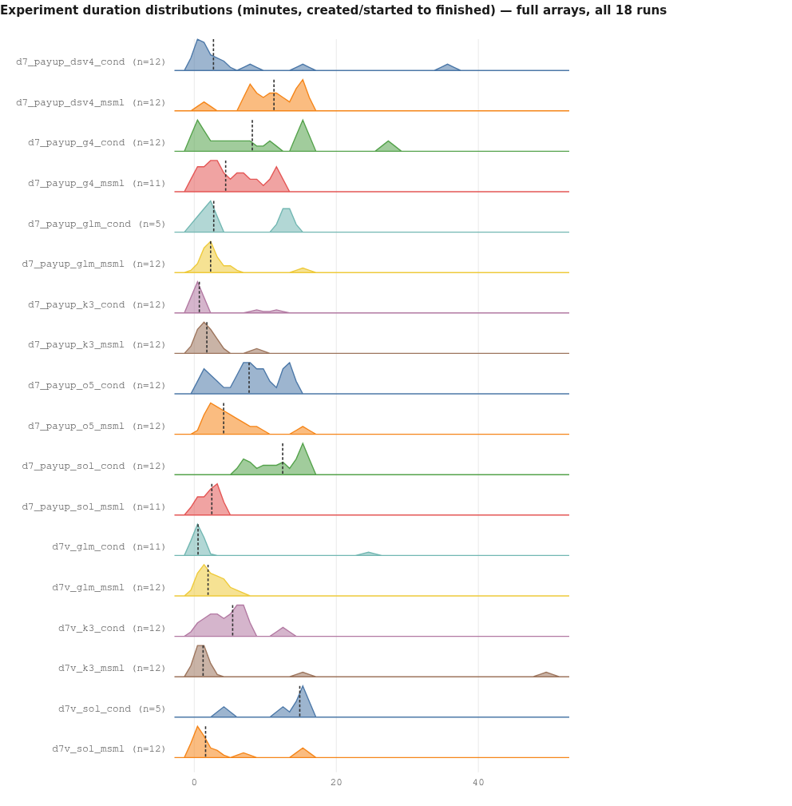

<details><summary>chart data</summary>

```chart
type: density
title: Experiment duration distributions (minutes, created/started to finished) — full arrays, all 18 runs
series d7_payup_dsv4_cond: 0.18, 0.19, 0.35, 0.7, 1.23, 1.77, 2.7, 3.5, 4.09, 8.31, 14.92, 35.66
series d7_payup_dsv4_msml: 1.33, 7.4, 7.95, 7.95, 10.03, 10.92, 11.22, 12.71, 14.45, 14.83, 14.85, 14.95
series d7_payup_g4_cond: 0.18, 0.18, 0.88, 2.34, 4.11, 6.25, 8.17, 10.99, 14.84, 14.91, 14.94, 27.36
series d7_payup_g4_msml: 0.53, 0.7, 2.28, 2.28, 2.99, 4.42, 5.97, 7.02, 8.58, 11.61, 11.89
series d7_payup_glm_cond: 0.35, 2.12, 2.74, 12.52, 13.75
series d7_payup_glm_msml: 0.88, 1.4, 1.4, 1.94, 1.94, 2.11, 2.3, 2.64, 2.66, 4.05, 5.47, 15.0
series d7_payup_k3_cond: 0.18, 0.18, 0.35, 0.53, 0.53, 0.7, 0.7, 0.87, 0.88, 0.89, 8.73, 11.9
series d7_payup_k3_msml: 0.18, 0.35, 0.88, 1.23, 1.58, 1.59, 1.76, 1.89, 2.46, 3.0, 3.17, 9.1
series d7_payup_o5_cond: 1.05, 1.75, 3.33, 5.95, 6.48, 7.54, 7.71, 9.46, 9.63, 12.81, 13.45, 13.86
series d7_payup_o5_msml: 1.6, 2.28, 2.52, 2.7, 2.84, 3.94, 4.13, 4.71, 6.36, 7.05, 8.62, 14.83
series d7_payup_sol_cond: 6.83, 7.05, 8.06, 9.86, 10.55, 12.12, 12.45, 14.87, 14.89, 14.95, 14.95, 14.96
series d7_payup_sol_msml: 0.35, 0.88, 0.88, 1.05, 2.28, 2.46, 2.99, 3.16, 3.33, 3.33, 3.33
series d7v_glm_cond: 0.35, 0.35, 0.36, 0.36, 0.36, 0.53, 0.54, 0.72, 0.86, 1.42, 24.91
series d7v_glm_msml: 0.35, 0.35, 1.24, 1.41, 1.41, 1.6, 1.93, 3.19, 3.4, 4.58, 4.6, 6.02
series d7v_k3_cond: 0.52, 1.22, 2.45, 3.31, 3.68, 4.87, 5.4, 6.44, 6.94, 6.99, 7.15, 12.39
series d7v_k3_msml: 0.7, 0.7, 0.88, 0.88, 0.89, 1.23, 1.23, 1.23, 1.58, 2.11, 14.93, 49.82
series d7v_sol_cond: 4.4, 12.77, 14.85, 14.86, 14.86
series d7v_sol_msml: 0.18, 0.35, 0.53, 0.53, 0.53, 0.88, 1.59, 1.93, 3.01, 6.54, 14.83, 14.83
```

</details>
*A visible 15-minute wall clips five runs (sol_cond, dsv4_msml, g4_cond, d7v_sol_cond, d7v_sol_msml) — the harness time limit, and the reason registry `lifecycle.experiments_cut_off_by_limit` is 2-5 in seven runs. The registry's own central value is `search.median_experiment_duration_minutes`, 0.5333-14.8483 across the corpus.*

---

## 11. Context engineering and tool calling

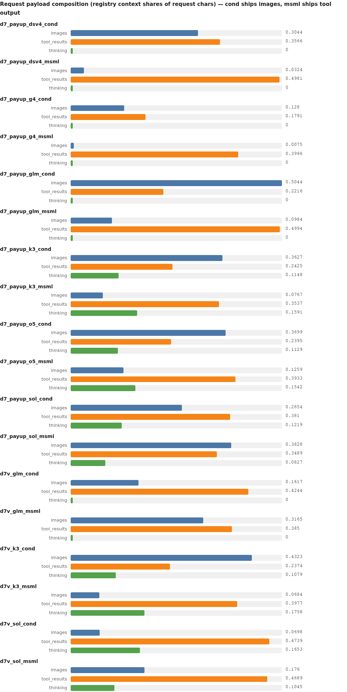

<details><summary>chart data</summary>

```chart
type: grouped
title: Request payload composition (registry context shares of request chars) — cond ships images, msml ships tool output
row d7_payup_dsv4_cond | images=0.3044 | tool_results=0.3566 | thinking=0.0
row d7_payup_dsv4_msml | images=0.0324 | tool_results=0.4981 | thinking=0.0
row d7_payup_g4_cond | images=0.1280 | tool_results=0.1791 | thinking=0.0
row d7_payup_g4_msml | images=0.0075 | tool_results=0.3996 | thinking=0.0
row d7_payup_glm_cond | images=0.5044 | tool_results=0.2216 | thinking=0.0
row d7_payup_glm_msml | images=0.0984 | tool_results=0.4994 | thinking=0.0
row d7_payup_k3_cond | images=0.3627 | tool_results=0.2425 | thinking=0.1148
row d7_payup_k3_msml | images=0.0767 | tool_results=0.3537 | thinking=0.1591
row d7_payup_o5_cond | images=0.3699 | tool_results=0.2395 | thinking=0.1129
row d7_payup_o5_msml | images=0.1259 | tool_results=0.3933 | thinking=0.1542
row d7_payup_sol_cond | images=0.2654 | tool_results=0.3810 | thinking=0.1219
row d7_payup_sol_msml | images=0.3828 | tool_results=0.3489 | thinking=0.0827
row d7v_glm_cond | images=0.1617 | tool_results=0.4244 | thinking=0.0
row d7v_glm_msml | images=0.3165 | tool_results=0.3850 | thinking=0.0
row d7v_k3_cond | images=0.4323 | tool_results=0.2374 | thinking=0.1079
row d7v_k3_msml | images=0.0684 | tool_results=0.3977 | thinking=0.1758
row d7v_sol_cond | images=0.0698 | tool_results=0.4739 | thinking=0.1653
row d7v_sol_msml | images=0.1760 | tool_results=0.4689 | thinking=0.1045
```

</details>

- **Size:** cond requests are larger in 8 of 9 pairs (registry `context.median_request_bytes` 111,833 / 159,317 / 114,092 / 164,537 / 191,431 / 170,898 / 125,778 / 198,218 vs msml 73,980 / 120,562 / 79,510 / 123,409 / 141,272 / 128,605 / 77,836 / 133,426; the gemma pair reverses, 48,010 vs 50,125). Worker system prompts are bigger under cond in all 9 pairs (`efficiency.worker_prompt_chars_median` 28,307-42,374 vs 12,563-27,055).
- **Repetition / re-reading:** `context.replay_median_prefix_share` is 0.830-0.939 (cond) and 0.779-0.909 (msml), with p90 up to 0.9933 — **every run re-sends 78-94% of the previous request verbatim**. This is the dominant payload component in both harnesses and the largest single efficiency opportunity in the corpus.
- **Growth:** `context.session_growth_ratio` 1.81-6.93; it tracks the *model* (gemma 1.81-1.84, claude/sol 5.38-6.93), not the harness.
- **Caching:** only claude and sol runs cache (`context.cache_read_growth_per_session` 30,789-72,888; claude's `context.fresh_growth_per_session` exactly 0.0). Every GLM / deepseek / gemma / kimi run has cache-read growth 0.0 and fresh growth 4,502-50,519 tokens per session — **history re-bills every turn for the lab-hosted models**, which is why their token totals are 20-30x claude's.
- **Connection to outcome:** the only defensible link is negative — the two runs with the smallest context and least growth (g4_cond 48,010 bytes / ratio 1.84, g4_msml 50,125 / 1.81) are also the two worst cells. Among the rest, context size does not order results: d7v_sol_cond has the largest median request (198,218) and scored 2 rows.

### Tool census (full, not truncated top-N): 36,873 invocations, 936 failures

| | cond (9 runs) | msml (9 runs) |
|---|---|---|
| invocations / failures / rate | 20,432 / 450 / **0.0220** | 16,441 / 486 / **0.0296** |
| read_file | 276 / 6,865 = 0.0402 | 266 / 5,425 = 0.0490 |
| shell_exec | 163 / 9,180 = 0.0178 | 133 / 6,847 = 0.0194 |
| completion tool | tool absent | **55 / 57 = 0.9649** |
| grep_file | — | 11 / 766 = 0.0144 |
| update_experiment | 1 / 373 | 9 / 342 |
| annotate_experiment | 2 / 75 | tool absent |
| memory tools | 0 failures in 8 of 9 runs | 3 / 663 |
| single-call tools at rate 1.0 | write_file, edit_file, write_arbiter_check | write_file (4), edit_file (1) |

**Dominant failing tool:** `read_file` is the top failing seat:tool in 13 of 18 runs, `shell_exec` in 4 (dsv4_msml, g4_cond, o5_cond, o5_msml), the completion tool in 1 (g4_msml); d7v_glm_cond ties at 12/12 and is counted as read_file. **542 failed reads corpus-wide.** Where I inspected payloads (21 read_file failures in one strategist transcript) the error is `[ERROR] File not found: /v/campus/ny/.../newdomains_20260801T195022/...`. I read that as a path-contract problem; at corpus scale that mechanism is a hypothesis, not a verified payload census.

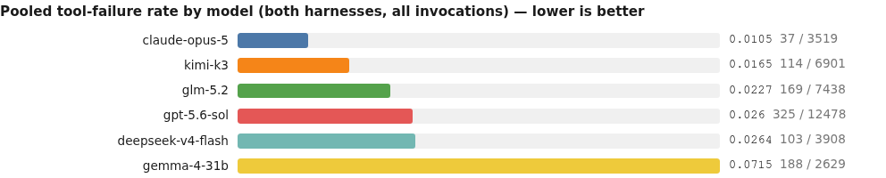

<details><summary>chart data</summary>

```chart
type: bars
title: Pooled tool-failure rate by model (both harnesses, all invocations) — lower is better
claude-opus-5 | 0.0105 | 37 / 3519
kimi-k3 | 0.0165 | 114 / 6901
glm-5.2 | 0.0227 | 169 / 7438
gpt-5.6-sol | 0.0260 | 325 / 12478
deepseek-v4-flash | 0.0264 | 103 / 3908
gemma-4-31b | 0.0715 | 188 / 2629
```

</details>
*My denominator is pack tool invocations. The registry publishes `tools.failure_rate` per run over event-stream tool-call events — for g4_msml that is 0.1263 against my 0.0843 (132 / 1,566). Both are on the record; the difference is the denominator population, not the numerator.*

**Normalisation matters, as the plan warned:** msml's strategist has 5-10x cond's read_file volume, so raw counts overstate its defect rate — glm_msml's strategist has 24 read_file failures yet the run's registry `tools.failure_rate` (0.0219) is *lower* than its cond twin's (0.0287).

**Shell-pattern census (mentions vs invocations — never a bare "pytest runs"):** pytest *mentions* run 9-56 per run while pytest *invocations* run 0-30. Every msml run except d7v_sol_msml (8) has **zero** pytest invocations despite 13-50 mentions; cond invokes pytest in 8 of 9 runs (1-30), led by sol_cond at 30 mentions / 28 invocations. `nvidia_smi` invocations are 0 in all 18 runs — nobody touched a GPU, which matters given the GPU-first prompt in §12. pip invocations are nonzero in 7 runs (1-18); shell syntax checks are 0 in 16 of 18.

---

## 12. Behaviour provenance

| Behaviour | Origin layer | Evidence |
|---|---|---|
| Strategist cannot end a run while work is assigned | **prescribed by msml framework code** | `[ERROR] complete_research: experiment work is still active: #6 ... Let it finish or cancel` appears only as a tool result; the msml strategist adapter prompt (1,334 chars) never mentions the tool |
| Cancellation refuses assigned rows | **prescribed by msml framework code** | `Skipped 1: #6 lgbm_rolling_walkforward_lags (actively assigned to worker_0)` ×63, `Skipped 2: ...` ×19 |
| Termination/parking authority sits with the conductor in cond | **prescribed by prompt + code** | cond strategist prompt: `cancel_experiments ... (Only available in no_conductor mode — otherwise the Conductor parks experiments via park_experiment.)` |
| 1,132-call non-yielding retry loop | **model-emergent** (gemma) on top of the framework gate | the harness supplied the contradiction; no backoff appears in 1,132 consecutive calls |
| Leakage guards, evidence contracts, holdout reproductions | **prescribed by cond's conductor guidance, then model-authored** | `phase3_conductor.md`: *"Leakage by mis-shifted features ... When a debrief looks 'too good', check the strategy code before believing the metric"* → artifacts like `check_ni_anchor_leakage.out`, `verify_referee.out` |
| GPU/deep-learning-first strategy guidance on a CPU-only task | **prescribed by an un-rewritten generic prompt** | g4_cond `phase3_strategist.md` (10,195 chars): *"## Model Priorities — DEEP LEARNING FIRST"*, *"We have H100 GPUs on SLURM — use them"*, listing TFT / N-BEATS / PatchTST / TimesNet / TSMixer |
| Task-specific CPU-only brief | **phase-0 self-customisation** | g4_msml `phase3_strategist.md` (1,334 chars) ending *"- **CPU Only**: No GPU usage."* |

### Adapter patch audit

Two different quantities, both reported. (a) **Invocations** — a phase-0 seat issues `patch_adapter_file` 4-23 times per run (g4_cond 4 and g4_msml 6 are the lowest; all others 10-23), plus a supervisor 1-4 times in exactly 7 runs (dsv4_msml 1, glm_msml 1, o5_cond 4, o5_msml 3, sol_cond 2, d7v_k3_msml 1, d7v_sol_cond 2). (b) **Files patched later in the run** — registry `lifecycle.adapter_files_patched_midrun` is 0 in 14 of 18 runs, nonzero only in dsv4_msml (1), o5_cond (1), o5_msml (3) and **d7v_k3_cond (9)**. Reporting only (b) would suggest adapters were never rewritten; reporting only (a) hides that one run changed its own working rules nine times mid-flight. The registry's `lifecycle.adapter_patch_calls` row is 12, 15, 4, blank, 12, 12, 12, 11, 15, 14, 25, 11, 12, 11, 13, 11, 13, 11 — note the blank at g4_msml despite 6 recorded phase-0 invocations.

**Behavioural consequence I can and cannot establish:** the two gemma runs entered phase 3 with materially different strategist prompts (1,334 vs 10,195 chars); which files each phase-0 actually patched is **not recoverable** — my scan of both phase-0 transcripts recovered filename mentions with no patched-path payloads — so attributing that difference to phase-0 coverage is open. Behaviourally the GPU guidance was ignored anyway: all seven of g4_cond's preserved experiments are tree/ridge models, and `nvidia_smi` invocations are 0 in every run.

---

## 13. Code and written artifacts — read, not just counted

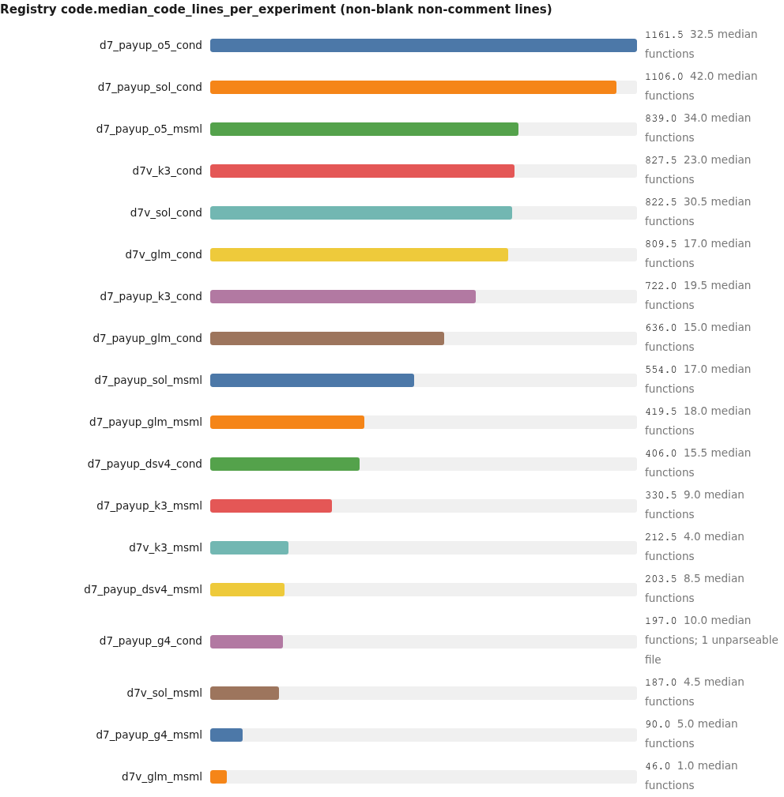

<details><summary>chart data</summary>

```chart
type: bars
title: Registry code.median_code_lines_per_experiment (non-blank non-comment lines)
d7_payup_o5_cond | 1161.5 | 32.5 median functions
d7_payup_sol_cond | 1106.0 | 42.0 median functions
d7_payup_o5_msml | 839.0 | 34.0 median functions
d7v_k3_cond | 827.5 | 23.0 median functions
d7v_sol_cond | 822.5 | 30.5 median functions
d7v_glm_cond | 809.5 | 17.0 median functions
d7_payup_k3_cond | 722.0 | 19.5 median functions
d7_payup_glm_cond | 636.0 | 15.0 median functions
d7_payup_sol_msml | 554.0 | 17.0 median functions
d7_payup_glm_msml | 419.5 | 18.0 median functions
d7_payup_dsv4_cond | 406.0 | 15.5 median functions
d7_payup_k3_msml | 330.5 | 9.0 median functions
d7v_k3_msml | 212.5 | 4.0 median functions
d7_payup_dsv4_msml | 203.5 | 8.5 median functions
d7_payup_g4_cond | 197.0 | 10.0 median functions; 1 unparseable file
d7v_sol_msml | 187.0 | 4.5 median functions
d7_payup_g4_msml | 90.0 | 5.0 median functions
d7v_glm_msml | 46.0 | 1.0 median functions
```

</details>

**cond produces more code per experiment than msml in 9 of 9 pairs.** Registry `code.total_lines` / `code.total_py_files`: o5_cond 19,259 / 157, sol_cond 15,791 / 120, d7v_k3_cond 13,060 / 101, d7v_glm_cond 12,856 / 126 at the top; d7v_glm_msml 1,208 / 17 and g4_msml 1,457 / 28 at the bottom. `code.ast_parse_failures` is 0 in 17 of 18 runs (1 in g4_cond). `code.comment_share_overall` ranges 0.0208 (sol_cond) to 0.1739 (g4_msml) — the most prolific coders comment least. `code.median_max_control_nesting` 1.0-5.0, deepest in g4_cond.

**Who mandates the written artifacts, who writes them, are they good:** cond's conductor prompt mandates the checks (quoted in §12); the workers and verifier write them. They are good. **Do the reproductions match?** Yes against the run's own holdout: `recomputed weighted MAE = 4.0167025358 / stored metrics.json wMAE = 4.0167025358 / |delta| = 0.000e+00`, with per-month splits also matching (`2026-05: wmae=3.0917692945 ... metrics.json per_month_wmae: {'2026-05': 3.0917692944879427, ...}`). **No** against the frozen holdout: the run's local set has 26,913 rows / 24,834 keys against 26,902 in the frozen one, and the independent re-score of that same experiment (`lgbm_regime_tfeatures`) is 3.724917.

**Defects the runs exposed in each harness's own code.**

*cond:* (1) verification is bound to the local holdout copy, so it certifies a number that may not be the graded one; (2) a crashed verification script has no consequence (`glm_binned`: `missing preds after merge: 1235` then traceback); (3) registry `integrity.multi_realization_experiments` is nonzero in 6 of 9 cond runs (2, 4, 2, 3, 6, 4, 8) and 0 in all 9 msml runs — cond re-executes rows, and in d7v_sol_cond 6 of 8 re-executions are **untracked** (`integrity.untracked_multi_realizations` = 6); (4) `integrity.metric_mismatches` (database vs preserved file) is 5, 6, 7, 12 in glm_cond, k3_cond, d7v_k3_cond, d7v_glm_cond.

*msml:* (1) orphaned `function_call_output` entries in the request builder (30 rejections, 10 dead turns); (2) one embeddings round-trip per model call with no governor (419 rate-limited requests); (3) the completion-gate livelock; (4) no per-seat call ceiling — one seat ran 1,132 calls and 40,043,771 input tokens.

**Ranked code-level fixes.** cond: verify-against-frozen-identity → fail-on-crashed-verification → track re-executions → reconcile database/file metrics. msml: request-assembly validation → embeddings decoupling plus governor → completion-gate repair → seat watchdog.

---

## 14. Measurement hygiene and anomalies

### 14a. Registry value vs my recomputation — both on the record (registry ids only; no referee quantities in this table)

| # | Quantity | Registry value | My recomputation | Definitional difference |
|---|---|---|---|---|
| A1 | `efficiency.total_tokens_m`, g4_msml | **10.6** | **50.18M** | registry = event-stream input+output; mine = sum of per-seat pack tokens. The 40,043,771-token strategist (stored gzipped) is missing from the run total. All other 17 runs agree to ≤0.06M. |
| A2 | `tools.failure_rate`, g4_msml | **0.1263** (871 tool calls) | **0.0843** (132 / 1,566) | event-stream tool-call events vs pack invocation records |
| A4 | `efficiency.cache_read_fraction`, o5_cond | **31056.509** | undefined | defined as cache-read over input, but this provider's input excludes cache reads — read as undefined, not as a ratio |
| A5 | `efficiency.tokens_per_scored`, d7v_sol_cond | **34,086,842** | **5,681,140 per finished row** | collapsing denominator (2 scored of 12 finished) |
| A6 | `search.scored` vs rows carrying the declared key | 8 / 11 / 9 | 10 / 12 / 6 (dsv4_cond, glm_msml, sol_msml) | a non-smoke filter explains dsv4_cond; the sol_msml case where scored **exceeds** key-carrying rows is **unexplained** |
| A7 | `lifecycle.adapter_patch_calls`, g4_msml | **blank** | 6 phase-0 invocations | the registry column carries no value for this run |

### 14b-i. Each run's own board value (self-reported, registry metric id `quality.best_value`)

3.6583, 3.531, — (g4_cond, none published), 4.468, 4.5945, 5.5482, 4.0167, 5.6811, 1.9645, 5.4752, 2.7233, 3.9041, 4.4734, 6.3466, 3.1501, 3.7679, 4.5246, 4.2997 — in registry column order (dsv4_cond, dsv4_msml, g4_cond, g4_msml, glm_cond, glm_msml, k3_cond, k3_msml, o5_cond, o5_msml, sol_cond, sol_msml, d7v_glm_cond, d7v_glm_msml, d7v_k3_cond, d7v_k3_msml, d7v_sol_cond, d7v_sol_msml). These are self-reported on each run's own identity and three different metric names appear across the corpus, so they must never be compared with one another. The registry's per-run scoring key is `weighted_mae` for 14 runs, `mae` for dsv4_msml and k3_msml, and `wmae` for o5_msml and d7v_k3_msml — even though all 18 configs declare `pipeline.phase3.convergence_metric = weighted_mae`. Applying "rows carrying `weighted_mae`, else the run's dominant key" reproduces `search.scored` in 14 of 18 runs, with four exceptions (dsv4_cond 10 key rows / 8 scored; g4_cond 8 dominant-key rows / 0 scored; glm_msml 12 / 11; sol_msml 6 / 9). One run wrote no `weighted_mae` anywhere: g4_cond's rows carry only `mae` and `wfcv_mae`, its first row reading `{"mae": 8.0, "wfcv_mae": 5.3, "n_series": 1, "n_origins": 2}`, with 4 of 12 rows carrying no results payload at all.

### 14b-ii. Independent re-scoring: how far the graded values sit from the boards (referee quotes only)

The independent re-score of each run's best row, quoted from referee.json, is listed in §0a. Compared against §14b-i, three disagreement classes appear. **Local-holdout drift**, where the graded value is 0.2-0.35 lower and one-directional: `coupon_stack_ratio_space` 1.640616, `lgbm_regime_tfeatures` 3.724917, `exp_lgbm3` 4.260018, `lightgbm_causal_history_l1` 2.416756, `mness_quantile_bucket_lgbm` 4.144928. **Scale/identity mismatch**, where the board is denominated in a private quantity: `segmented_newprod_split_lgbm` 1.77077 (its run's board reported 5.4752 for a different row) and `lgbm_l1_time_reg_v1` 3.97507. **Board-optimistic**, where the graded value is worse: `hgbr_q50_fw_tenc` 6.378698. **Off-identity/absent**: `ridge_ts_robust_v1` 12.855811 is the only row the re-scoring could use at all in its run, at coverage 1.077, while six sibling prediction files covered 0.000 of the frozen holdout. Rows reproduced within the 5% tolerance across the corpus number 32 in total (`referee.self_report_reproduced` 5, 1, 0, 3, 5, 0, 3, 2, 0, 0, 3, 1, 0, 0, 1, 2, 1, 2 in registry column order), with 0 for both claude runs and all four GLM cells.

### 14c. Numerical-oddities register

- One deepseek+msml row has a claimed metric of **1.1587567750880803e+117** with an independent re-score of 1.186e+117 — a numerically exploded model the board carried as a normal row, marked as reproduced. Mechanism: an L1 objective on an unclipped target; **no quarantine fired.**
- One sol+msml row re-scores at **1.887e+14**, and one glm+msml row claims **110.65** against a re-score of 6.947539. Same class: no sanity ceiling on board values in msml.
- Artifact coverage exceeds 1.0 in three places (g4_msml 1.25, sol_msml 1.222, and one g4_cond row at 1.077) — more predicted keys than holdout keys. Chased: these runs preserved prediction files for experiments counted outside the scored set. **Not fully closed.**
- Registry `integrity.results_replaced_after_finish` = 1 in o5_cond, d7v_glm_msml, d7v_k3_cond and d7v_sol_cond; `integrity.primary_mutations_after_finish` nonzero in 9 runs (1-3). Result files were rewritten after rows reached terminal state; mechanism not established — **open**.
- `d7v_sol_cond` has no reporter seat at all (12 seats, not 13) and `efficiency.reporter_share` = 0.000 — killed before reporting.
- `integrity.db_file_metric_mismatches` is 0 in 8 runs (checked-and-clean) and 1-12 in the rest, peaking at 12 for d7v_glm_msml.

---

## 15. Campaign design integrity

1. **Era is an uncontrolled variable identical to "repeat."** All six replication groups straddle the two batteries. Every noise floor here is an upper bound; nothing separates run-to-run variance from whatever changed between 08-04 and 08-07.
2. **The vary battery covers only 3 of 6 models,** so the strongest and weakest models have zero replication. The two verdicts most in need of error bars have none.
3. **Identity discipline is not enforced.** All 18 configs declare the same primary key, yet the scoring key floats in 4 runs and one run scores 0 of 12 for writing a different name. Board leaderboards were not comparing like with like, and the runs' own champions differ from the independently graded values in every case I checked.
4. **Every run rewrites its own prompts.** With 4-23 adapter patches per run (and 9 mid-run file rewrites in one), no two runs of the "same" configuration are actually the same configuration.

**Cheapest redesign that fixes it:** (a) three same-battery repeats for at least two models per harness, launched in one window with a frozen adapter set — this alone converts every "leans" in §1 into a testable margin; (b) pin the scoring key from config and hard-fail any result row missing it; (c) publish the per-seat token ledger as the run total (fixing A1) and separate fresh/cache-read per provider (fixing A4); (d) stagger launches or reserve embeddings capacity so contention stops confounding reliability.

---

## Findings, with the mechanism behind each

1. **cond wins 5 of 9 pairs; only 3 margins are both above the noise floor and uncensored, and all 3 are cond's.** Mechanism: none needed — the independent re-scoring is a direct measurement on a common holdout. The constraint is the 0.8422 median replication spread.
2. **Scored-row denominators are metric-identity bookkeeping.** Mechanism: the registry's per-run scoring key floats (14 runs on the declared key, 2 on `mae`, 2 on `wmae`) while all 18 configs declare the same one; a run writing another key scores 0.
3. **`d7_payup_g4_cond` is unscorable, not zero.** Mechanism: it wrote `mae`/`wfcv_mae` on 8 rows, nothing on 4, and 6 of 7 preserved prediction files cover 0.000 of the frozen holdout — one recording `"n_origins": 2`.
4. **msml's gemma strategist livelocked.** Mechanism: the completion tool refused ("experiment work is still active … Let it finish or cancel") while cancellation refused the blocking row ("actively assigned to worker_0"); 1,132 calls, 40,043,771 input tokens, no watchdog.
5. **Six runs ran blind to their own reasoning.** Mechanism: request assembly never replays produced traces (responses 195-1,055 with traces, requests 0), identically in both harnesses — a client-layer defect.
6. **All 419 HTTP 429s are on the `embeddings` endpoint, msml-only.** Mechanism: msml issues roughly one embeddings request per model call (808-1,532 per run); cond issues none. Contention triggers, coupling exposes.
7. **msml's transcript builder emitted orphaned tool-call outputs in one sol run.** Mechanism: a `function_call_output` whose `call_id` is absent from replayed history → rejection → 3 retries → dead agent turn, ×10.
8. **The token ledger loses one runaway seat and mixes cache semantics.** Mechanism: a gzipped strategist transcript is outside the event-stream total (registry 10.6 vs 50.18M recomputed); claude's total excludes 100,623,088 cache reads while sol's includes 63,341,290.
9. **claude-opus-5 is the model choice, harness-independently.** Mechanism: best graded score under both harnesses plus the lowest pooled tool-failure rate (0.0105) and the largest, most structured code.
10. **cond's conductor buys process, not accuracy.** Mechanism: meta-role share 0.090-0.576 vs 0.003-0.016 buys parks, kills, rewinds, throttles, verification and a much lower strategist poll rate — and 5 of 9 pair wins with one era-flip.
11. **cond's verification is real but validates the wrong identity.** Mechanism: it recomputes against the run's local 26,913-row holdout, not the frozen 26,902-row one; and a crashed check has no consequence.
12. **`read_file` is the dominant failure mode in both harnesses** (542 failures, 4-5%), and failure rate tracks the model (claude 0.0105 → gemma 0.0715) more than the harness (0.0220 vs 0.0296).
13. **Neither harness builds on its own results.** Mechanism: the variant tool exists only in cond and was used 10 times corpus-wide; every msml row has a null parent. Both exploit one model family instead.
14. **A shared 15-minute experiment wall clips five runs** (visible in the duration distributions), and registry `lifecycle.experiments_cut_off_by_limit` is 2-5 in seven runs — a harness limit, not a model failure.

---

## What to change first

**cond — ranked**
1. Verify against the frozen holdout identity, not the run's local copy.
2. Make a crashed verification script fail its experiment.
3. Reconcile the metric-identity contract: pin the key from config; hard-fail rows without it *at write time* instead of silently scoring 0 (this alone recovers the g4_cond cell as evidence).
4. Fix or delete the directive-ack loop and the self-check field (ack 0.000-0.565; self-check 0.000 in 9 of 9).
5. Track re-executions (`integrity.multi_realization_experiments` nonzero in 6 of 9 runs; 6 untracked in one).
6. Actually use the variant tool — 10 invocations corpus-wide is not a refinement strategy.

**msml — ranked**
1. Repair the completion gate (allow a forced park, or return wait-with-backoff) **and** add a per-seat call/token watchdog.
2. Decouple embeddings from the model-call path; batch and cache; add a token-bucket governor.
3. Validate request assembly: drop or re-pair orphaned `function_call_output` entries.
4. Add an independent verification stage — cheapest version: per-experiment recompute against the config-declared key. 7 of 9 msml runs have no analysis directory at all.
5. Add a coordination owner distinct from the proposing seat.
6. Add a sanity ceiling on board values (no run should carry 1.16e+117 as a leaderboard row).

**Infrastructure / campaign — ranked**
1. Fix the reasoning-replay path (6 of 18 runs blind) — it silently degrades two whole model families in both harnesses.
2. Make the run token total the sum of per-seat totals, including gzipped transcripts.
3. Publish fresh / cache-read / cache-write separately per provider and stop printing a cache-read *fraction* when the denominator excludes cache.
4. Report per-finished alongside per-scored for every ratio.
5. Same-battery repeats with a frozen adapter set; stagger launches so shared-capacity contention stops confounding reliability.

---

## Corrections and retractions

1. **Retracted mid-investigation: "msml's 429s are caused by raw request volume."** I first inferred this from the request-amplification ratio (msml 2.03-2.26 HTTP requests per model call vs cond 1.00-1.02). The per-endpoint census falsified it: `glm_cond` peaked at **63 requests/minute with zero 429s** while `glm_msml` peaked at 39 and took 11. The real mechanism is endpoint-specific — all 419 429s are on `embeddings`, which cond never calls. The amplification is a *symptom* of the same coupling, not the cause.
2. **Retracted: "the scored-key rule differs by harness."** I initially framed the identity defect as cond-strict vs msml-permissive. `d7_payup_g4_msml` refutes it — an msml run that declared the standard key, wrote it on 4 of 11 rows and was scored 4. The rule is per-run; the four floating keys happen to all be msml runs.
3. **Retracted: "the registry infers the scoring key from the run's dominant board key."** `d7_payup_dsv4_msml` refutes it — it carries the declared key on all 12 rows yet its registry scoring key is `mae`. Why the key floats is **open**.
4. **Corrected: verification pass/fail counts.** My first pass/fail scan used a regex that matched empty groups; that probe's "with_fail_token" column is not a verdict count and is used nowhere in this report. Every verdict quoted here was read from the file itself.
5. **Narrowed: "gemma is weak."** Its cond cell produced no comparable number, so 12.855811 must not be read as a capability measurement. Gemma is last on quality *and* process, but the gap to glm's best cell (4.339227 vs 3.97507) is small.
6. **Narrowed: the leaderboard-eligibility claim.** I can show d7v_sol_cond's own audit marking a timed-out row `smoke_is_leaderboard_eligible False`, and that `oof_segment_residual_lgb` appears in neither the scored nor the excluded list of that run's re-scoring record; I cannot show the harness *enforcing* non-promotion.

---

## Verdict robustness — could another reviewer land elsewhere?

| Verdict | Single heaviest piece of evidence | Where another reviewer could land differently |
|---|---|---|
| V1 cond leans better | The two kimi pairs (margins 2.6538 and 1.3802), both above the noise floor, both cond | A reviewer counting raw pair wins including censored pairs gets 5-4 and calls it a tie; one demanding ≥1.0 margins gets cond 3-0 and calls it clear. Both defensible from the same table. |
| V2 claude-opus-5 | 1.640616 and 1.77077 — best under both harnesses | A reviewer insisting margins exceed the 0.8422 replication spread would call claude vs sol **unresolved** (0.646 < 0.8422). I grade it moderate-to-high only because it repeats across harnesses. |
| V4 msml completion gate | The two verbatim refusal strings with repeat counts (55 of 56, and 63+19) | Hard to dispute. Someone could argue gemma's perseveration is the "real" cause; the counter is that no cond run has any failed completion attempt. |
| V5 embeddings 429s | Per-endpoint census: 9 of 9 msml runs call embeddings, 0 of 9 cond runs, 419 of 419 429s there | A reviewer could argue shared-capacity contention is the whole story. Counter: four msml runs called embeddings *without* 429s, so contention is the trigger and coupling is the exposure. |
| V6 keep verification | `|delta| = 0.000e+00`, `ALL NI ANCHOR LEAKAGE GUARDS PASSED`, `smoke_is_leaderboard_eligible False` | A cost-focused reviewer would note it never changed a champion here and call it 9-58% of tokens for nothing measurable. That reading is available from my own numbers. |
| V9 era confound | All six replication groups straddle batteries | Not disputable. |

---

## What stays unresolved, and what would settle it

| # | Unresolved | Why | What would settle it |
|---|---|---|---|
| U1 | **Why the registry's scoring key floats in 4 runs.** | `d7_payup_dsv4_msml` carries the declared key on all 12 rows yet its scoring key is `mae`, falsifying the "dominant board key" explanation. | The bench extractor's key-resolution code, or a per-run trace of which file it read the key from. |
| U2 | **Why one msml run scores 9 rows from 6 key-carrying rows.** | Scored exceeds the key census; not explained by the non-smoke filter. | Per-row provenance of the registry's primary-metric resolution. |
| U3 | **The residual gap between board and graded values.** | The local 26,913-row vs frozen 26,902-row holdout is a real difference but non-uniform: one deepseek row reproduces to four decimals (claimed 3.658310178033095, re-scored 3.65858) while a kimi best differs by 0.29. | The re-scoring key-collapse rule applied to one run's raw predictions beside that run's own aggregation. |
| U4 | **Did cond's kimi timeouts have a harness component?** | Timeouts hit both cond kimi runs (15 tracebacks, 5 dead turns) and neither msml kimi run — but cond's kimi sessions are 1.5-2x longer, so exposure is confounded. | Serving-side latency logs for the same wall-clock windows, or a same-window kimi run on both harnesses. |
| U5 | **Whether cond's self-check field is unpopulated or never fires.** | Registry `governance.selfcheck_rate` = 0.000 in all 9 runs; the artifacts cannot distinguish "field never written" from "no self-checks occurred". | The conductor meta-log schema plus one decision record. |
| U6 | **Which adapter files each phase-0 actually patched.** | Both phase-0 transcripts I scanned yielded filename mentions with no patched-path payloads, so the gemma prompt divergence cannot be attributed to phase-0 coverage. | A patch log recording the target path per `patch_adapter_file` call. |
| U7 | **Post-terminal result rewrites.** | Registry `integrity.results_replaced_after_finish` nonzero in 4 runs and `integrity.primary_mutations_after_finish` in 9; I did not trace which process rewrote terminal rows. | File mtimes joined to the agent transcript that wrote them. |
| U8 | **Artifact coverage above 1.0** (g4_msml 1.25, sol_msml 1.222, one g4_cond row at 1.077). | More predicted keys than holdout keys; partially explained by artifacts outside the scored set, not closed. | The coverage denominator per experiment. |
| U9 | **Treatment (reasoning replay) effect.** | Perfectly confounded with model identity; the post-fix reruns are out of scope. | The post-fix rerun battery, same models, same task. |
| U10 | **Builder / critic / tester seat model choice.** | These seats are small in every run (10-132 calls) and leave no distinguishing artifacts; only pooled tool-failure rate separates the models. | A per-seat model swap, or critic/tester outputs preserved as artifacts. |

**Dimensions examined that show no material difference** (stated rather than skipped): registry `reliability.capacity_refusals` (0 in all 18), `lifecycle.dispatcher_crashes` (0 in all 18), `lifecycle.phase2_abortions` (absent in all 18), `search.cpu_flagged_experiments` and `search.partial_result_experiments` (absent in all 18), `memory.duplicate_fraction` (0.0 wherever present), `verifier.completion_fraction` (1.000 in all 9 cond runs) and `verifier.seats_died_before_first_response` (0 in all 9), `speed.median_tool_gap_seconds` (0.006-0.099 — tool execution is never the bottleneck), `code.ast_parse_failures` (0 in 17 of 18), `integrity.final_report_covers_best` (1 in 17 of 18; 0 only in the operator-killed run), `agents.seats_total` (13/12 cond, 11 msml — pure seat design), `lifecycle.strategist_stalls` (absent everywhere), nvidia-smi invocations (0 in all 18), `governance.selfcheck_rate` (0.000 in all 9 cond runs).

**Dimensions left unexamined by name** (budget triage): per-experiment debrief prose quality beyond playbooks; `memory.records` semantic content and retrieval hit quality; the conductor evidence-pack section as a standalone artifact; `http.5xx_responses` beyond the three single occurrences; per-seat end-context medians from the stage decomposition; reporter output quality; `context.median_tool_result_bytes` and tool-gap raw sample arrays.

---

## Closing self-audit — this report's weakest claims

1. **"cond leans better" rests on two kimi pairs.** Remove kimi and cond's advantage is claude +0.1302, glm_2 +0.6723, gpt +1.1575 against deepseek −0.4871, glm −0.2849, gpt_2 −0.2288 (censored) — a wash. My verdict is effectively *"cond is better for kimi, probably for sol, undecided for everything else."*
2. **claude's model win is inside the replication spread** (0.646 < 0.8422). I lean on cross-harness reproduction to carry it, which is weaker than a margin test.
3. **The per-seat model table is the weakest section.** No run swaps models between seats, so every row is an inference from that seat's own output volume and style. The builder/critic/tester row is honestly unresolved.
4. **"cond produces more code" is a size measurement, not a quality one.** 9 of 9 pairs is a strong pattern, but median lines and function counts do not establish that the code is better; I only show that the two highest-scoring cells are among the three largest.
5. **My path-contract mechanism for 542 read_file failures rests on 21 inspected payloads in one run.** The direction is safe; the mechanism at corpus scale is a hypothesis.
6. **The kimi-timeout attribution follows the operator's declaration** and I could not independently separate it from cond's longer sessions. Flagged, not resolved.
7. **Two probe artefacts I must not be quoted on:** the pass/fail token columns in my verification scan (regex matched empty groups) and the metric-definitions reprint (flagged non-admissible). Neither is load-bearing anywhere above.
8. **The attempt-spread band in §10** is dominated at two indices by numerically exploded rows; the band is honest but its upper edge is not informative about typical behaviour.

---

# Appendix — registry census tables

### A1. Run inventory (registry roster)

| run label | harness | model | battery | state | terminal rows |
|---|---|---|---|---|---|
| d7_payup_dsv4_cond | cond | deepseek-v4-flash | newdomains | finished | 12 |
| d7_payup_dsv4_msml | msml | deepseek-v4-flash | newdomains | finished | 12 |
| d7_payup_g4_cond | cond | gemma-4-31b | newdomains | finished | 12 |
| d7_payup_g4_msml | msml | gemma-4-31b | newdomains | finished | 11 |
| d7_payup_glm_cond | cond | glm-5.2 | newdomains | finished | 12 |
| d7_payup_glm_msml | msml | glm-5.2 | newdomains | finished | 12 |
| d7_payup_k3_cond | cond | kimi-k3 | newdomains | finished | 12 |
| d7_payup_k3_msml | msml | kimi-k3 | newdomains | finished | 12 |
| d7_payup_o5_cond | cond | claude-opus-5 | newdomains | finished | 12 |
| d7_payup_o5_msml | msml | claude-opus-5 | newdomains | finished | 12 |
| d7_payup_sol_cond | cond | gpt-5.6-sol | newdomains | finished | 12 |
| d7_payup_sol_msml | msml | gpt-5.6-sol | newdomains | finished | 11 |
| d7v_glm_cond | cond | glm-5.2 | vary | finished | 12 |
| d7v_glm_msml | msml | glm-5.2 | vary | finished | 12 |
| d7v_k3_cond | cond | kimi-k3 | vary | finished | 12 |
| d7v_k3_msml | msml | kimi-k3 | vary | finished | 12 |
| d7v_sol_cond | cond | gpt-5.6-sol | vary | finished | 12 |
| d7v_sol_msml | msml | gpt-5.6-sol | vary | finished | 12 |

**Absent cells:** claude-opus-5 / vary / cond; claude-opus-5 / vary / msml; deepseek-v4-flash / vary / cond; deepseek-v4-flash / vary / msml; gemma-4-31b / vary / cond; gemma-4-31b / vary / msml. No second task exists in this corpus.

### A2. Search and lifecycle (registry values)

| run | `search.scored` | `search.improvements` | `search.experiments_to_best` | `search.tail_after_last_improvement` | `search.late_gain_fraction` | `search.median_experiment_duration_minutes` | `lifecycle.phase3_hours` | `lifecycle.final_exit_code` |
|---|---|---|---|---|---|---|---|---|
| d7_payup_dsv4_cond | 8 | 4 | 5 | 3 | 0 | 1.7733 | 0.93 | 0 |
| d7_payup_dsv4_msml | 12 | 3 | 5 | 7 | 0 | 11.2167 | 3.91 | 0 |
| d7_payup_g4_cond | 0 | 0 | — | — | — | 14.845 | 2.2 | 0 |
| d7_payup_g4_msml | 4 | 2 | 3 | 1 | 0 | 4.4217 | 1.96 | 0 |
| d7_payup_glm_cond | 12 | 3 | 6 | 6 | 0 | 2.7433 | 0.58 | 0 |
| d7_payup_glm_msml | 11 | 2 | 2 | 9 | 0 | 2.3017 | 1.11 | 0 |
| d7_payup_k3_cond | 12 | 3 | 9 | 3 | 0 | 0.7033 | 4.57 | 0 |
| d7_payup_k3_msml | 12 | 3 | 7 | 5 | 0 | 1.7633 | 3.37 | 0 |
| d7_payup_o5_cond | 12 | 3 | 9 | 3 | 0 | 7.7083 | 2.52 | 0 |
| d7_payup_o5_msml | 12 | 4 | 9 | 3 | 0 | 4.1333 | 3.16 | 0 |
| d7_payup_sol_cond | 7 | 2 | 2 | 5 | 0 | 12.4533 | 3.97 | 0 |
| d7_payup_sol_msml | 9 | 4 | 8 | 1 | 0.208 | 2.4567 | 1.02 | 0 |
| d7v_glm_cond | 11 | 4 | 9 | 2 | 0.065 | 0.5333 | 1.5 | 0 |
| d7v_glm_msml | 12 | 4 | 8 | 4 | 0 | 1.9283 | 1.64 | 0 |
| d7v_k3_cond | 12 | 3 | 8 | 4 | 0 | 5.3967 | 12.45 | 0 |
| d7v_k3_msml | 12 | 5 | 12 | 0 | 0.004 | 1.2267 | 7.76 | 0 |
| d7v_sol_cond | 2 | 1 | 1 | 1 | — | 14.8483 | 12.91 | **137** |
| d7v_sol_msml | 10 | 4 | 9 | 1 | 0.032 | 1.59 | 1.06 | 0 |

### A3. Efficiency and reliability (registry values)

| run | `efficiency.total_tokens_m` | `efficiency.cost_usd` | `efficiency.tokens_per_scored` | `efficiency.meta_role_share` | `tools.calls` | `tools.failure_rate` | `http.rate_limited` | `memory.calls` | `artifacts.verification_files` |
|---|---|---|---|---|---|---|---|---|---|
| d7_payup_dsv4_cond | 51.5 | 0.00 | 6,434,850 | 0.096 | 2033 | 0.0172 | 0 | 79 | 8 |
| d7_payup_dsv4_msml | 44.9 | 0.00 | 3,745,461 | 0.005 | 1875 | 0.0363 | 26 | 119 | — |
| d7_payup_g4_cond | 13.8 | 0.00 | — | 0.163 | 1063 | 0.0527 | 0 | 2 | 10 |
| d7_payup_g4_msml | 10.6 | 0.00 | 2,651,557 | 0.004 | 871 | 0.1263 | 0 | 11 | — |
| d7_payup_glm_cond | 44.1 | 0.00 | 3,674,921 | 0.178 | 1393 | 0.0287 | 0 | 58 | 9 |
| d7_payup_glm_msml | 46.8 | 0.00 | 4,252,843 | 0.016 | 1965 | 0.0219 | 11 | 120 | — |
| d7_payup_k3_cond | 44.7 | 0.00 | 3,722,535 | 0.167 | 1629 | 0.0209 | 0 | 67 | 54 |
| d7_payup_k3_msml | 19.7 | 0.00 | 1,643,036 | 0.003 | 1213 | 0.0132 | 10 | 74 | — |
| d7_payup_o5_cond | 2.2 | 164.11 | 183,723 | 0.157 | 1967 | 0.0092 | 0 | 125 | 32 |
| d7_payup_o5_msml | 1.6 | 130.37 | 129,675 | 0.014 | 1552 | 0.0122 | 0 | 92 | — |
| d7_payup_sol_cond | 70.8 | 96.05 | 10,119,917 | 0.185 | 3868 | 0.0248 | 0 | 190 | 74 |
| d7_payup_sol_msml | 30.3 | 52.52 | 3,365,585 | 0.004 | 2466 | 0.0264 | 0 | 142 | — |
| d7v_glm_cond | 70.7 | 0.00 | 6,424,786 | 0.090 | 2046 | 0.0191 | 0 | 111 | 11 |
| d7v_glm_msml | 50.8 | 0.00 | 4,231,853 | 0.010 | 2034 | 0.0231 | 160 | 136 | — |
| d7v_k3_cond | 68.6 | 0.00 | 5,716,407 | 0.251 | 2574 | 0.0206 | 0 | 82 | 61 |
| d7v_k3_msml | 30.6 | 0.00 | 2,548,954 | 0.004 | 1485 | 0.0074 | 0 | 83 | — |
| d7v_sol_cond | 68.2 | 95.25 | 34,086,842 | 0.576 | 3859 | 0.0205 | 0 | 121 | 296 |
| d7v_sol_msml | 30.4 | 53.29 | 3,035,396 | 0.003 | 2285 | 0.0372 | 212 | 120 | — |

### A4. Governance (registry values; msml has no conductor seat, so these are absent, not zero)

| cond run | `governance.decisions` | `directives_issued` | `directive_ack_rate` | `directive_retirements` | `parks` | `kills` | `priority_changes` | `phase_rewinds` | `selfcheck_rate` | `verifier.seats_started` |
|---|---|---|---|---|---|---|---|---|---|---|
| d7_payup_dsv4_cond | 21 | 8 | 0.000 | 1 | 0 | 0 | 0 | 0 | 0.000 | 3 |
| d7_payup_g4_cond | 30 | 9 | 0.000 | 5 | 0 | 0 | 0 | 0 | 0.000 | 2 |
| d7_payup_glm_cond | 41 | 9 | 0.000 | 11 | 0 | 0 | 0 | 0 | 0.000 | 2 |
| d7_payup_k3_cond | 52 | 17 | 0.235 | 12 | 1 | 0 | 1 | 0 | 0.000 | 2 |
| d7_payup_o5_cond | 66 | 26 | 0.308 | 17 | 0 | 0 | 0 | 0 | 0.000 | 2 |
| d7_payup_sol_cond | 69 | 23 | 0.565 | 20 | 1 | 0 | 0 | 3 | 0.000 | 5 |
| d7v_glm_cond | 29 | 11 | 0.273 | 5 | 1 | 0 | 0 | 0 | 0.000 | 2 |
| d7v_k3_cond | 97 | 27 | 0.481 | 25 | 1 | 0 | 0 | 1 | 0.000 | 8 |
| d7v_sol_cond | 83 | 14 | 0.286 | 13 | 5 | 6 | 1 | 1 | 0.000 | 14 |

### A5. Context and code (registry values)

| run | `context.median_request_bytes` | `context.replay_median_prefix_share` | `context.session_growth_ratio` | `context.thinking_share` | `code.total_lines` | `code.median_code_lines_per_experiment` | `code.comment_share_overall` |
|---|---|---|---|---|---|---|---|
| d7_payup_dsv4_cond | 111,833 | 0.9123 | 4.27 | 0.0 | 6,049 | 406.0 | 0.0485 |
| d7_payup_dsv4_msml | 73,980 | 0.8912 | 3.58 | 0.0 | 2,491 | 203.5 | 0.0315 |
| d7_payup_g4_cond | 48,010 | 0.83 | 1.84 | 0.0 | 3,466 | 197.0 | 0.0937 |
| d7_payup_g4_msml | 50,125 | 0.7787 | 1.81 | 0.0 | 1,457 | 90 | 0.1739 |
| d7_payup_glm_cond | 159,317 | 0.9232 | 4.44 | 0.0 | 4,560 | 636 | 0.1017 |
| d7_payup_glm_msml | 120,562 | 0.9074 | 4.99 | 0.0 | 7,158 | 419.5 | 0.1016 |
| d7_payup_k3_cond | 114,092 | 0.881 | 4.94 | 0.1148 | 11,027 | 722.0 | 0.0502 |
| d7_payup_k3_msml | 79,510 | 0.8175 | 4.5 | 0.1591 | 5,039 | 330.5 | 0.0877 |
| d7_payup_o5_cond | 164,537 | 0.9145 | 5.38 | 0.1129 | 19,259 | 1161.5 | 0.0329 |
| d7_payup_o5_msml | 123,409 | 0.8857 | 5.99 | 0.1542 | 12,530 | 839.0 | 0.0554 |
| d7_payup_sol_cond | 191,431 | 0.9171 | 6.31 | 0.1219 | 15,791 | 1106.0 | 0.0208 |
| d7_payup_sol_msml | 141,272 | 0.869 | 6.93 | 0.0827 | 6,128 | 554 | 0.0237 |
| d7v_glm_cond | 170,898 | 0.9387 | 5.46 | 0.0 | 12,856 | 809.5 | 0.0698 |
| d7v_glm_msml | 128,605 | 0.909 | 5.38 | 0.0 | 1,208 | 46.0 | 0.1641 |
| d7v_k3_cond | 125,778 | 0.8735 | 6.3 | 0.1079 | 13,060 | 827.5 | 0.0404 |
| d7v_k3_msml | 77,836 | 0.8598 | 4.86 | 0.1758 | 3,136 | 212.5 | 0.0695 |
| d7v_sol_cond | 198,218 | 0.9119 | 6.35 | 0.1653 | 10,745 | 822.5 | 0.0235 |
| d7v_sol_msml | 133,426 | 0.8545 | 5.98 | 0.1045 | 2,693 | 187.0 | 0.0622 |
