# The union report: cond vs msml, seven models, five tasks, 75 runs

## 0. How to read this report

Every number below comes from a probe run in this session over the whole corpus (75 runs), from the referee's own re-scoring, or from a file I opened and quote. Where the deterministic registry publishes a value that overlaps something I recomputed, **both appear side by side**; the registry's per-run timing metrics for all 75 runs are listed in Appendix A1. Quality is only ever compared inside a validation identity the referee marked comparable; process measures (reliability, discipline, cost, latency) are compared freely.

Two facts frame everything:

* **Quality differences between the harnesses are almost all smaller than the noise between repeats of the same cell.** Only 7 of 27 comparable pair margins clear their own cell's repeat spread.
* **The strongest signals in this corpus are process signals**, and they are large: a verification stage that exists in one harness and not the other, a memory design that throttles, a client retry policy that kills agents, and a shared infrastructure defect that wasted ~85% of the configured experiment parallelism in *both* harnesses.

---

## 1. Headline verdicts

| # | Verdict | Grade | What would change it |
|---|---|---|---|
| 1 | **Neither harness is quality-better overall.** cond wins 15 of 27 comparable pairs, msml 12; only 7 margins clear same-cell repeat noise, and they point both ways. | strong (full population) | 3+ repeats per cell on d7_payup/domain4; today their noise is 54.57% / 26.85% of the metric |
| 2 | **cond's verifier triad is the single best mechanism in either harness — copy it into msml.** 36 of 38 cond runs, 58 candidates, 95 proof notebooks, 27 arbiter verdicts; msml has none. It caught a headline result that was 0.0943 MAE inflated by an unstable sort. cond's claimed numbers reproduce 84.92% vs msml's 71.96%. | strong | evidence that a cheap self-check gives the same reproduction rate |
| 3 | **msml's embeddings-backed memory is the biggest self-inflicted fault — fix it.** All 37 msml runs call a remote embedding endpoint (76,268 calls); 21 runs hit 1,678 HTTP 429s producing 945 silent "Semantic memory search unavailable; using full text" degradations. cond: 0 calls, 0 429s. | strong | a batched/cached embedding path; the retrieval-quality benefit is unmeasured in this corpus |
| 4 | **Both harnesses waste ~85-91% of their configured experiment parallelism.** 6 workers configured in all 75 runs; realized time-weighted concurrency 0.70 (cond) / 0.55 (msml). This, not scheduling policy, is why cond's admission latency (created→started, recomputed from experiments.db) has a median of 47.91 minutes against msml's 11.74. | strong | per-worker slot telemetry (absent) would identify the cause |
| 5 | **cond's client turns a serving outage into mass agent death — fix the retry policy.** 511 "API error after 3 retries: Connection error." lines in d5r_glm_cond, 505 immediately followed by "Agent stopped unexpectedly". | strong | jittered backoff + resume-from-transcript |
| 6 | **msml's completion gate is a good idea, badly implemented.** complete_research refuses correctly but as a hard error: 55/56 failures (gemma), 24/25 (opus-5 on d6_cuda), 10/10 (opus-5 on domain4). | strong | return structured "not yet, here is what blocks you" + attempt limiter |
| 7 | **Model choice: claude-opus-5 first where dollars allow, gemma-4-31b never.** opus-5 holds the best run on every task where it has a pair-identity score; gemma is worst of 7 models on tool-failure rate (0.0895) and scored fraction (0.182). | strong for the extremes, weak in the middle | the middle four models sit inside replication noise |
| 8 | **Reasoning replay was genuinely broken for GLM/deepseek and is genuinely fixed** (request-side reasoning 0% → 90.3%/95.5%), but the quality gain is not measurable and the fix costs ~4x per-call latency. | mechanism strong, quality weak | repeats within one era, without an outage in the middle |
| 9 | **A quarter of the campaign's comparisons are model-confounded or identity-limited by design**: 8 cond runs ran a claude-opus-4-7 conductor under another model's name; 3 runs had no model recorded at all; 7 domain2 pairs are unrankable. | strong | pin every seat to the run's model; freeze one holdout per task |

---

## 2. Corpus and coverage — what exists and what does not

75 runs, 2 harnesses (cond 38, msml 37), 7 models, 5 tasks, 6 eras. The registry census is Appendix A; the registry's per-run timing metrics are Appendix A1. This section states what is *missing*, because a missing cell is data.

**Never run (named absences).** d6_cuda has only claude-opus-5 and gpt-5.6-sol — no glm, kimi, deepseek, gemma, opus-4-8. d5_rfq has no deepseek, gemma or opus-4-8. domain2/domain4 have no gemma. gemma-4-31b exists only on d7_payup (2 runs); claude-opus-4-8 only on domain2/domain4 (4 runs). claude-opus-5 has **no cond run on domain4 in the same era as its msml run** (certclean cond vs native msml) and **no domain4 pair-identity score at all**.

**Censoring.** `d6_cuda_sol_msml` is the only non-finished run (registry state `unknown`, 5 db rows, 0 terminal, `empty_db`) — yet it is the most expensive run in the corpus ($773.27) and the referee still re-scored 5 of its artifacts, so it appears in the d6_cuda_gpt pair. `d7v_sol_cond` ended with exit code 137 (SIGKILL; the killing agent is not identified in the logs) with 2 scored experiments of 12 rows. `d2v_glm_cond` finished with 20 db rows but only 4 terminal and referee artifact coverage 0.05.

**Group validity.** The mission's domain4 replication group "cond + ''" joins two *different* models and is deleted (finding 1). Eight cond runs are model-confounded at the conductor seat (finding 2).

**Denominators.** Registry `search.scored` equals the referee's per-run `scored_experiments` counter in all 75 runs. The referee's own experiment list disagrees with that counter in 21 runs, which is definitional, not corruption (finding 8).

---

## 3. Harness — verdicts, mechanisms, and the governance deep-dive

### 3.1 Quality per task, calibrated against replication noise

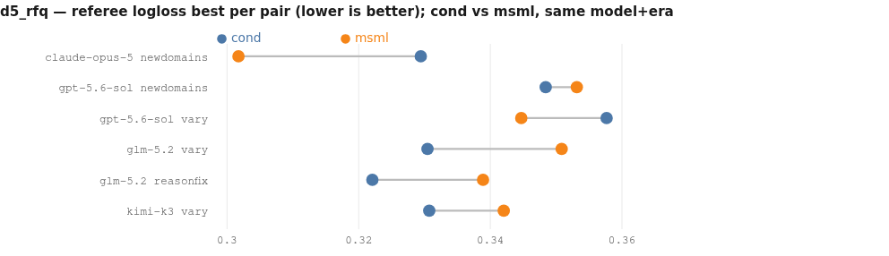

<details><summary>chart data</summary>

```chart
type: dumbbell
title: d5_rfq — referee logloss best per pair (lower is better); cond vs msml, same model+era
row claude-opus-5 newdomains | cond=0.329428 | msml=0.301737
row gpt-5.6-sol newdomains | cond=0.348412 | msml=0.353141
row gpt-5.6-sol vary | cond=0.357661 | msml=0.344700
row glm-5.2 vary | cond=0.330448 | msml=0.350845
row glm-5.2 reasonfix | cond=0.322081 | msml=0.338886
row kimi-k3 vary | cond=0.330717 | msml=0.342039
```

</details>

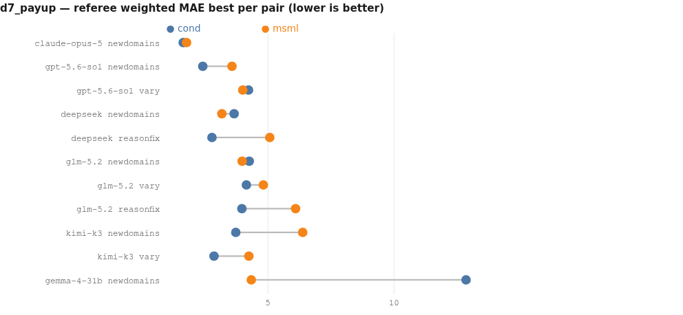

<details><summary>chart data</summary>

```chart
type: dumbbell
title: d7_payup — referee weighted MAE best per pair (lower is better)
row claude-opus-5 newdomains | cond=1.640616 | msml=1.770770
row gpt-5.6-sol newdomains | cond=2.416756 | msml=3.574268
row gpt-5.6-sol vary | cond=4.230359 | msml=4.001524
row deepseek newdomains | cond=3.658580 | msml=3.171442
row deepseek reasonfix | cond=2.779368 | msml=5.072812
row glm-5.2 newdomains | cond=4.260018 | msml=3.975070
row glm-5.2 vary | cond=4.144928 | msml=4.817240
row glm-5.2 reasonfix | cond=3.965152 | msml=6.095922
row kimi-k3 newdomains | cond=3.724917 | msml=6.378698
row kimi-k3 vary | cond=2.862204 | msml=4.242443
row gemma-4-31b newdomains | cond=12.855811 | msml=4.339227
```

</details>

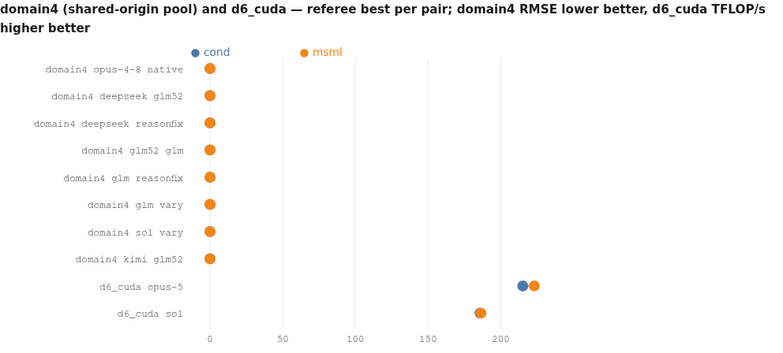

<details><summary>chart data</summary>

```chart
type: dumbbell
title: domain4 (shared-origin pool) and d6_cuda — referee best per pair; domain4 RMSE lower better, d6_cuda TFLOP/s higher better
row domain4 opus-4-8 native | cond=0.021697 | msml=0.022167
row domain4 deepseek glm52 | cond=0.028697 | msml=0.022418
row domain4 deepseek reasonfix | cond=0.021904 | msml=0.022597
row domain4 glm52 glm | cond=0.022886 | msml=0.022426
row domain4 glm reasonfix | cond=0.022144 | msml=0.024587
row domain4 glm vary | cond=0.024608 | msml=0.023437
row domain4 sol vary | cond=0.024073 | msml=0.023835
row domain4 kimi glm52 | cond=0.021847 | msml=0.021862
row d6_cuda opus-5 | cond=215.033 | msml=222.953
row d6_cuda sol | cond=185.640 | msml=186.284
```

</details>

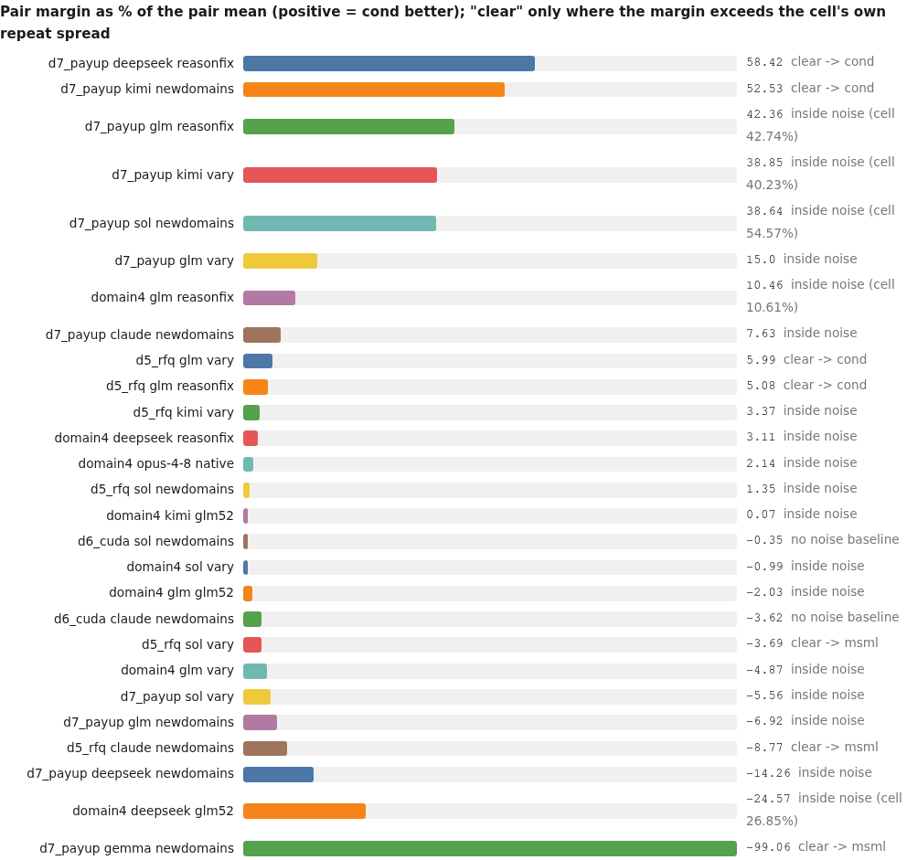

<details><summary>chart data</summary>

```chart
type: bars
title: Pair margin as % of the pair mean (positive = cond better); "clear" only where the margin exceeds the cell's own repeat spread
d7_payup deepseek reasonfix | 58.42 | clear -> cond
d7_payup kimi newdomains | 52.53 | clear -> cond
d7_payup glm reasonfix | 42.36 | inside noise (cell 42.74%)
d7_payup kimi vary | 38.85 | inside noise (cell 40.23%)
d7_payup sol newdomains | 38.64 | inside noise (cell 54.57%)
d7_payup glm vary | 15.00 | inside noise
domain4 glm reasonfix | 10.46 | inside noise (cell 10.61%)
d7_payup claude newdomains | 7.63 | inside noise
d5_rfq glm vary | 5.99 | clear -> cond
d5_rfq glm reasonfix | 5.08 | clear -> cond
d5_rfq kimi vary | 3.37 | inside noise
domain4 deepseek reasonfix | 3.11 | inside noise
domain4 opus-4-8 native | 2.14 | inside noise
d5_rfq sol newdomains | 1.35 | inside noise
domain4 kimi glm52 | 0.07 | inside noise
d6_cuda sol newdomains | -0.35 | no noise baseline
domain4 sol vary | -0.99 | inside noise
domain4 glm glm52 | -2.03 | inside noise
d6_cuda claude newdomains | -3.62 | no noise baseline
d5_rfq sol vary | -3.69 | clear -> msml
domain4 glm vary | -4.87 | inside noise
d7_payup sol vary | -5.56 | inside noise
d7_payup glm newdomains | -6.92 | inside noise
d5_rfq claude newdomains | -8.77 | clear -> msml
d7_payup deepseek newdomains | -14.26 | inside noise
domain4 deepseek glm52 | -24.57 | inside noise (cell 26.85%)
d7_payup gemma newdomains | -99.06 | clear -> msml
```

</details>

Task verdicts: **d5_rfq** — harness choice depends on the model (cond clearly better for glm-5.2 in *both* replicates; msml clearly better for claude-opus-5 and for sol in the vary era). **d7_payup** — 7-4 to cond but only two margins clear noise; no task verdict. **domain4** — 4-4, everything inside noise. **d6_cuda** — 0-2 msml on two unreplicated pairs, one of which is the unfinished run; a pilot, not a verdict. **domain2** — the referee refuses all 7 pairs ("bits-per-byte domain: each run validates on its own held-out slice").

### 3.2 Architectural verdicts, ranked

**KEEP / COPY (cond → msml)**

1. **Verifier triad with an empowered arbiter.** 58 candidate directories, 95 proof notebooks, 27 ARBITER_VERDICT.md across 36 of 38 cond runs; msml 0 in all 37. Quality read, not counted: the d7v_sol_cond arbiter reproduces the claimed number bit-for-bit ("independently reproduces **3.0367074677** row-level `curr_face`-weighted MAE, with mean and maximum prediction difference **0.0**"), then shows "about **0.0943 MAE** of the headline depends on a future-batch-sensitive training permutation" and refuses the promotion. The d5_rfq_o5_cond arbiter states "I did not arbitrate on assertion. I re-derived the load-bearing quantities myself". Board-level effect: 84.92% of cond's claimed numbers reproduce vs 71.96% for msml (paired: cond 7, msml 2, 18 ties, 9 cells with no claimed numbers).
2. **A completion contract** (msml's `complete_research` with its evidence requirement) — cond has no equivalent gate and simply stops.

**FIX**

3. **msml memory:** cache/batch the embeddings, surface the fallback (finding 4).
4. **cond retry policy:** 3 retries → seat death (finding 5).
5. **cond admission depth:** median max pending 12, max 61, against realized concurrency ~1.
6. **msml OpenAI-Responses request assembly:** "No tool call found for function call output with call_id" 174x in d6_cuda_sol_msml, 30x in d7_payup_sol_msml, 0 in every cond run — the signature accompanying a $773, 0-terminal-row runaway.
7. **msml completion gate ergonomics** (hard error → structured refusal).
8. **Shared:** the experiment-loop concurrency gap (6 configured, ~1 realized).

**DELETE / DOWN-SCOPE**

9. cond's unbounded backlog: nothing in the corpus shows a benefit of a 61-deep queue; parks and priority changes act on a backlog that is mostly waiting.
10. `efficiency.total_tokens_m` as a cost proxy (finding 14).

**UNRESOLVED** — whether cond's conductor *improves outcomes*: in 8 runs it was a different model (opus-4-7), and in the rest its actions (directives, parks, priorities) cannot be causally separated from the run's other seats. What is measurable is its price: governance seats take a median **17.25%** of run tokens in cond vs **0.40%** in msml, cond>msml in **36/36** pairs.

### 3.3 What each harness elicits from the same model

Paired over the 36 same-era/task/model cells (registry metrics, median and sign-count):

| dimension | cond | msml | cond>msml |
|---|---|---|---|
| distinct tools used | 29 | 16 | 36/36 |
| governance token share | 0.1725 | 0.0040 | 36/36 |
| worker prompt chars (median) | 36,494 | 23,338 | 36/36 |
| py files written | 111.5 | 45 | 34/36 |
| code lines per experiment | 825 | 477 | 29/36 |
| strategist calls per scored experiment | 4 | 17 | 4/35 |
| tool failure rate | 0.0146 | 0.0259 | 7/36 |
| HTTP 429s | 0 | 7.5 | 0/36 |
| HTTP requests total | 1,743 | 3,023 | 3/36 |
| median request bytes | 154,894 | 131,016 | 30/36 |
| scored fraction | 0.8835 | 0.9200 | 12/36 |
| median experiment duration (min) | 5.3967 | 2.3017 | 27/35 |

The registry's own per-run `time_to_best_hours`, `wall_hours` and `median_queue_wait_minutes` are published in Appendix A1 for every run; the paired sign counts on those three are cond-longer in 20 of 33, 19 of 36 and 31 of 35 respectively.

Read plainly: cond makes the same model *write more code, carry bigger prompts, and wait longer before an experiment starts*; msml makes the same model *plan more often per experiment and finish a higher fraction of its board*, at the price of more tool failures and all of the corpus's throttling.

### 3.4 Governance machinery, decision point by decision point

* **Admission & prioritisation.** cond: conductor pre-admits (median max pending 12, max 61 in d2_glm_cond), then `set_priority` (up to 67 calls), `park_experiment` (up to 84), `unpark_experiment`. msml: strategist proposes just-in-time (depth 5) and can only `cancel_experiments`. With ~1 realized concurrency this is the whole admission-latency story.
* **Throttling.** cond's `issue_directive`/`retire_directive` traffic is large (d2_glm_cond: 39 issued, 172 retired) but directive **ack rates are low** (0.0 in 10 cond runs) — the machinery talks more than the seats listen.
* **Verification.** cond only; see 3.2. msml's `verification_files` appear in 4 runs (19, 12, 31, 2 files) as model-initiative side products, with no verify/ tree.
* **Termination.** cond `kill_experiment` (6 in d7v_sol_cond) and parks; msml the completion contract. The gemma msml run shows the failure mode of a hard gate: `cancel_experiments` ×117 and `complete_research` ×56 (55 failures).
* **Memory.** msml semantic (embeddings, throttled); cond literal (0 embedding calls). No quality comparison of retrieval is possible from these artifacts — recorded as unresolved.
* **Handoff / lineage.** `propose_variant` exists **only** in cond seats; msml has no variant tool. cond's variant lineage (median variant_rows 7.5-8 for glm/opus-5) vs msml's near-flat lineage is therefore **harness-forced**, not a model habit.

---

## 4. Model — whole-run and per-seat

### 4.1 Tier ranking (referee units, pair identity)

* **Tier 1: claude-opus-5.** Best run on d5_rfq (0.301737, msml), d6_cuda (222.953, msml) and d7_payup (1.640616, cond — 32.1% below the next model, gpt-5.6-sol at 2.416756). Also the lowest own-identity domain2 val_bpb in the corpus (0.7683820402666105) — *not rankable* across runs, quoted as a within-run fact. Caveat: on d5_rfq it is third overall and second within cond (0.329428), behind glm-5.2 reasonfix (0.322081); on domain4 it has no pair-identity score.
* **Tier 2 (unseparated): gpt-5.6-sol, glm-5.2, kimi-k3, deepseek-v4-flash.** Task-dependent and inside noise. On d5_rfq glm (0.322081) and kimi (0.330717) beat sol (0.348412 / 0.357661) — sol is last on that task in both harnesses. On domain4 the top six runs span 0.021697-0.022167 (2.2%) across four different models against a 26.85% replication spread.
* **Tier 3: claude-opus-4-8** — only 4 runs (domain2/domain4); holds the best domain4 pair score (0.021697) but with a 21.69% strategist read_file failure rate.
* **Floor: gemma-4-31b** (finding 12): worst of seven on tool failure rate (0.0895) and scored fraction (0.182); 40/62 = 64.52% strategist read_file failures; 56 `complete_research` attempts with 55 failures; cond run scored 0 on its own board.

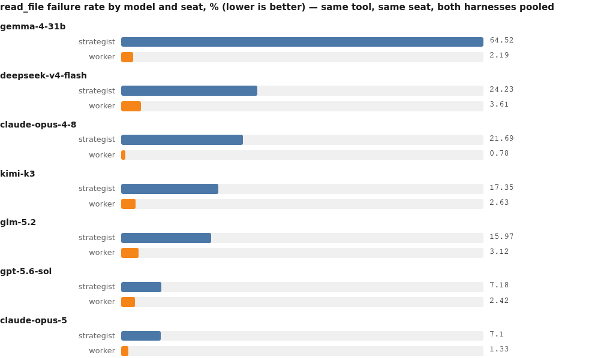

<details><summary>chart data</summary>

```chart
type: grouped
title: read_file failure rate by model and seat, % (lower is better) — same tool, same seat, both harnesses pooled
row gemma-4-31b | strategist=64.52 | worker=2.19
row deepseek-v4-flash | strategist=24.23 | worker=3.61
row claude-opus-4-8 | strategist=21.69 | worker=0.78
row kimi-k3 | strategist=17.35 | worker=2.63
row glm-5.2 | strategist=15.97 | worker=3.12
row gpt-5.6-sol | strategist=7.18 | worker=2.42
row claude-opus-5 | strategist=7.10 | worker=1.33
```

</details>

### 4.2 Per-seat model choice, read from the work products

| seat | choice | evidence |
|---|---|---|
| **strategist** | claude-opus-5 or gpt-5.6-sol | the planning seat is where path discipline decides the run: 7.1%/7.2% read_file failure vs 16-65% for the rest; the dominant corpus-wide failure class is exactly this (cond 687/7339, msml 1061/7583) |
| **workers / builder** | any mid-tier, incl. lab models | worker read_file 0.78-3.61% and shell_exec 0.69%/0.97% for every model — this seat is cheap |
| **critic / verifier** | claude-opus-5; glm-5.2 as the $0 substitute | the two arbiter verdicts read in depth do genuine independent re-derivation; glm's 19,036-byte debrief refutes its own headline ("the entire +0.25 gain comes from the interaction features") |
| **reporter** | tracks the tier (median report bytes: opus-5 19,266; glm 18,086; sol 15,242; kimi 9,959; gemma 4,803) | artifact census over all 75 runs |
| **conductor** | **unresolved** — 8 cond runs pinned it to claude-opus-4-7, so the seat's model was never a controlled variable |

### 4.3 Capability read from artifacts (not scores)

* claude-opus-5, d7_payup, `coupon_stack_ratio_space` (23,274 bytes): "**Holdout wMAE 1.964490146572335 — best single scored artifact on the board**", then an explicit falsification with the sign reversed, a date-block bootstrap SE (0.0053, t = −1.02) declaring its own blend "inside noise", and complementarity analysis.
* glm-5.2, d7_payup reasonfix, `ridge_mness_interact` (19,036 bytes): "the entire +0.25 gain comes from the interaction features. The weight-normalization + alpha fix — the experiment's headline "implementation fix" — contributes ≈0.000 to the metric."
* gemma-4-31b, d7_payup, `mlp_shallow_ts_v1` (3,800 bytes): competent structure, but its own diagnosis is "`analysis/check_coverage.out` shows the model produced only **223 predictions**".

Artifact volume by model median (playbook / debriefs / debrief bytes / report bytes): opus-5 25,572 / 16.5 / 14,626 / 19,266 · opus-4-8 14,542 / 16.5 / 5,417 / 8,781 · glm 14,198 / 17 / 11,696 / 18,086 · sol 10,345 / 17 / 14,139 / 15,242 · kimi 7,537 / 11 / 5,987 / 9,959 · deepseek 3,378 / 11 / 5,001 / 8,227 · gemma 2,016 / 10 / 2,434 / 4,803.

---

## 5. Combination — what to run today

| rank | task | combination | margin / basis | flips if |
|---|---|---|---|---|
| 1 | d5_rfq | **cond + glm-5.2 (with replay)** = 0.322081 | the only harness verdict clear of noise in the corpus (cond > msml for glm in *both* replicates, +5.08%/+5.99% vs 2.56-3.47% cell spread) | if best-absolute matters and dollars exist: msml + claude-opus-5 (0.301737 at $166.74) |
| 2 | d7_payup | **cond + claude-opus-5** = 1.640616 ($164.11) | 32.1% ahead of the field, but inside d7's 54.57% noise | more repeats; the cond/msml gap here is not resolvable |
| 3 | d6_cuda | **msml + claude-opus-5** = 222.953 | +3.62% over cond on a single pair, no repeats | any repeat could reverse it |
| 4 | domain4 | **any of** cond+opus-4-8 (0.021697), cond/msml+kimi (0.021847/0.021862), cond+deepseek-reasonfix (0.021904), cond+glm-reasonfix (0.022144) | 2.2% band inside 26.85% noise → choose on cost: three of these are $0 lab models vs $135.13 for opus-4-8 | nothing available today |
| 5 | domain2 | **no recommendation** | validation identity forbids cross-run ranking | a frozen shared holdout |

**Decision matrix.** Optimising *best possible number*: claude-opus-5, harness per task above. Optimising *dollars*: glm-5.2 or kimi-k3 in either harness ($0 metered), accepting mid-pack scores. Optimising *trust in the number*: cond, for the verifier triad and the higher self-report reproduction rate. Optimising *elapsed time*: msml, whose per-run registry timings in Appendix A1 are consistently the shorter side of each pair — but fix concurrency first and this axis changes.

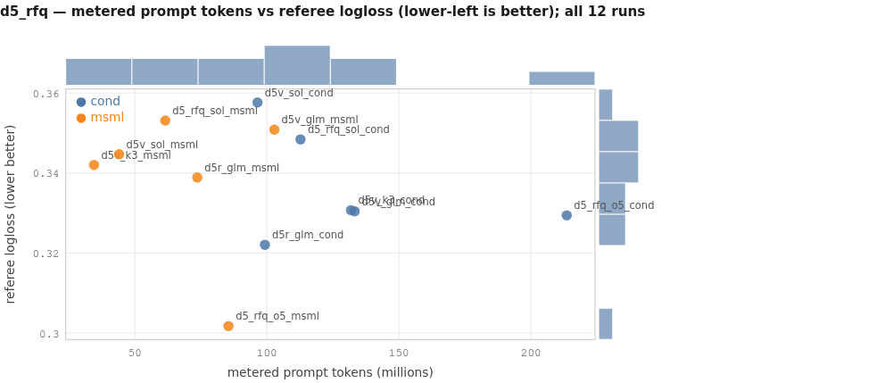

<details><summary>chart data</summary>

```chart
type: scatter
title: d5_rfq — metered prompt tokens vs referee logloss (lower-left is better); all 12 runs
x: metered prompt tokens (millions)
y: referee logloss (lower better)
marginals: true
point d5_rfq_o5_cond | 213.5 | 0.329428 | cond
point d5_rfq_sol_cond | 112.7 | 0.348412 | cond
point d5v_glm_cond | 133.2 | 0.330448 | cond
point d5v_k3_cond | 131.8 | 0.330717 | cond
point d5v_sol_cond | 96.4 | 0.357661 | cond
point d5r_glm_cond | 99.2 | 0.322081 | cond
point d5_rfq_o5_msml | 85.4 | 0.301737 | msml
point d5_rfq_sol_msml | 61.5 | 0.353141 | msml
point d5v_glm_msml | 102.8 | 0.350845 | msml
point d5v_k3_msml | 34.5 | 0.342039 | msml
point d5v_sol_msml | 44.0 | 0.344700 | msml
point d5r_glm_msml | 73.6 | 0.338886 | msml
```

</details>

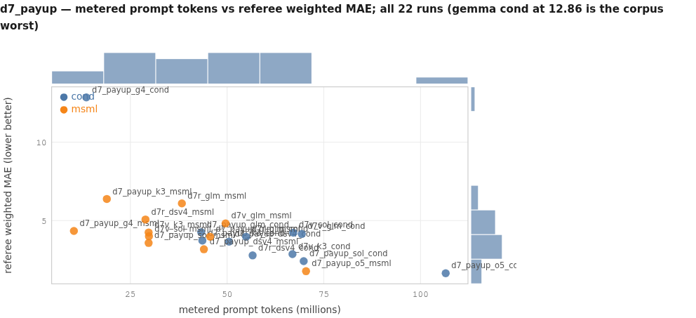

<details><summary>chart data</summary>

```chart
type: scatter
title: d7_payup — metered prompt tokens vs referee weighted MAE; all 22 runs (gemma cond at 12.86 is the corpus worst)
x: metered prompt tokens (millions)
y: referee weighted MAE (lower better)
marginals: true
point d7_payup_o5_cond | 106.5 | 1.640616 | cond
point d7_payup_sol_cond | 69.8 | 2.416756 | cond
point d7r_dsv4_cond | 56.6 | 2.779368 | cond
point d7v_k3_cond | 66.9 | 2.862204 | cond
point d7_payup_k3_cond | 43.6 | 3.724917 | cond
point d7_payup_dsv4_cond | 50.5 | 3.658580 | cond
point d7r_glm_cond | 54.9 | 3.965152 | cond
point d7v_glm_cond | 69.3 | 4.144928 | cond
point d7v_sol_cond | 67.1 | 4.230359 | cond
point d7_payup_glm_cond | 43.3 | 4.260018 | cond
point d7_payup_g4_cond | 13.6 | 12.855811 | cond
point d7_payup_o5_msml | 70.4 | 1.770770 | msml
point d7_payup_dsv4_msml | 44.0 | 3.171442 | msml
point d7_payup_sol_msml | 29.7 | 3.574268 | msml
point d7_payup_glm_msml | 45.6 | 3.975070 | msml
point d7v_sol_msml | 29.8 | 4.001524 | msml
point d7v_k3_msml | 29.7 | 4.242443 | msml
point d7_payup_g4_msml | 10.4 | 4.339227 | msml
point d7v_glm_msml | 49.6 | 4.817240 | msml
point d7r_dsv4_msml | 28.9 | 5.072812 | msml
point d7r_glm_msml | 38.3 | 6.095922 | msml
point d7_payup_k3_msml | 18.9 | 6.378698 | msml
```

</details>

No positive token→quality relationship is visible in either task; the extreme case runs the other way (the corpus's largest context consumer, d6_cuda_sol_msml at 606.9M metered tokens, produced 0 terminal rows).

---

## 6. Repeatability

Eight (task, model) cells have repeats on both sides. The tighter side splits **4-4**. Medians over all eight cells: cond 18.40%, msml 10.24%; dropping the one cell that contains the SIGKILLed run (d7_payup gpt-5.6-sol) from **both** sides: cond 10.61%, msml 9.20%. There is no harness separation that survives removing one censored cell.

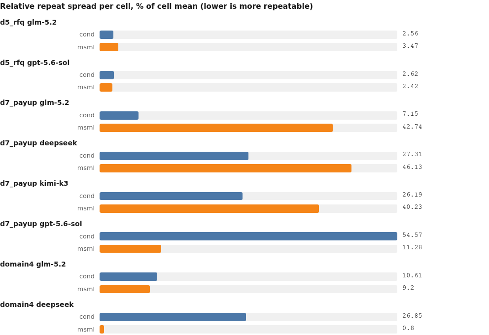

<details><summary>chart data</summary>

```chart
type: grouped
title: Relative repeat spread per cell, % of cell mean (lower is more repeatable)
row d5_rfq glm-5.2 | cond=2.56 | msml=3.47
row d5_rfq gpt-5.6-sol | cond=2.62 | msml=2.42
row d7_payup glm-5.2 | cond=7.15 | msml=42.74
row d7_payup deepseek | cond=27.31 | msml=46.13
row d7_payup kimi-k3 | cond=26.19 | msml=40.23
row d7_payup gpt-5.6-sol | cond=54.57 | msml=11.28
row domain4 glm-5.2 | cond=10.61 | msml=9.20
row domain4 deepseek | cond=26.85 | msml=0.80
```

</details>

Spread is a **task** property: d5_rfq 2.4-3.5%, domain4 0.8-26.9%, d7_payup 7.2-54.6%. Champion families do not replicate either — the three d7_payup glm cond repeats crowned `exp_lgbm3`, `mness_quantile_bucket_lgbm` and `xgb_quantile_q05`. Registry time_to_best_hours is equally unstable inside a cell: for cond glm on domain2 the three repeats report 12.77, 5.31 and 5.41; for msml glm on domain2 they report 1.96, 2.43 and 2.62.

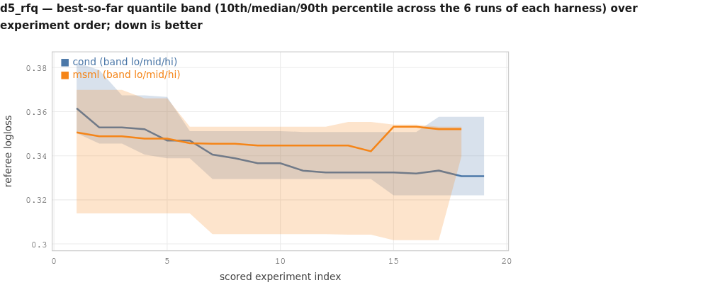

<details><summary>chart data</summary>

```chart
type: line
title: d5_rfq — best-so-far quantile band (10th/median/90th percentile across the 6 runs of each harness) over experiment order; down is better
x: scored experiment index
y: referee logloss
band cond: 1,0.350321,0.361513,0.382305; 2,0.345507,0.352821,0.378861; 3,0.345507,0.352821,0.367399; 4,0.340551,0.352084,0.367399; 5,0.338889,0.346909,0.36664; 6,0.338889,0.346909,0.351185; 7,0.329428,0.340551,0.351185; 8,0.329428,0.338889,0.351185; 9,0.329428,0.336588,0.351185; 10,0.329428,0.336588,0.351185; 11,0.329428,0.333272,0.350783; 12,0.329428,0.33245,0.350783; 13,0.329428,0.33245,0.350783; 14,0.329428,0.33245,0.35076; 15,0.322081,0.33245,0.35076; 16,0.322081,0.331919,0.35076; 17,0.322081,0.333272,0.357661; 18,0.322081,0.330717,0.357661; 19,0.322081,0.330717,0.357661
band msml: 1,0.313841,0.350614,0.369851; 2,0.313841,0.348797,0.369851; 3,0.313841,0.348797,0.369851; 4,0.313841,0.347783,0.366043; 5,0.313841,0.347783,0.366043; 6,0.313841,0.345728,0.353141; 7,0.304456,0.345433,0.353141; 8,0.304456,0.345433,0.353141; 9,0.304456,0.344656,0.353141; 10,0.304456,0.344656,0.353141; 11,0.304456,0.344656,0.353141; 12,0.304456,0.344656,0.353141; 13,0.304174,0.344656,0.355324; 14,0.304174,0.342039,0.355324; 15,0.301737,0.353141,0.35415; 16,0.301737,0.353141,0.35415; 17,0.301737,0.352064,0.353141; 18,0.339666,0.352064,0.353141
```

</details>

Caption: the band narrows as runs drop out (shorter runs stop contributing), which is why the msml median rises after index 14 — the surviving runs are the weaker ones. Read the 10th-percentile line, not the median tail.

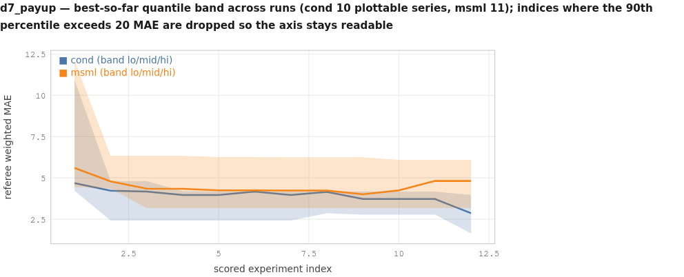

<details><summary>chart data</summary>

```chart
type: line
title: d7_payup — best-so-far quantile band across runs (cond 10 plottable series, msml 11); indices where the 90th percentile exceeds 20 MAE are dropped so the axis stays readable
x: scored experiment index
y: referee weighted MAE
band cond: 1,4.230359,4.685605,10.92211; 2,2.416756,4.230359,4.805948; 3,2.416756,4.177196,4.805948; 4,2.416756,3.964984,4.191213; 5,2.416756,3.964984,4.191213; 6,2.416756,4.172542,4.191213; 7,2.416756,3.964984,4.172542; 8,2.862204,4.152972,4.191213; 9,2.779368,3.724917,4.172542; 10,2.779368,3.724917,4.172542; 11,2.779368,3.724917,4.172542; 12,1.640616,2.862204,3.965152
band msml: 1,4.43985,5.601142,12.098022; 2,4.354015,4.791756,6.343837; 3,3.173246,4.354015,6.343837; 4,3.173246,4.339227,6.343837; 5,3.173246,4.242443,6.258611; 6,3.173246,4.242443,6.258611; 7,3.171442,4.234013,6.251839; 8,3.171442,4.234013,6.251839; 9,3.171442,4.001524,6.251839; 10,3.171442,4.242443,6.095922; 11,3.171442,4.81724,6.095922; 12,3.171442,4.81724,6.095922
```

</details>

---

## 7. Treatment: reasoning replay

**Round-trip census (all 75 runs, both sides).** Pre-fix GLM and deepseek sent **zero** requests carrying reasoning while producing it in responses: glm 0/17,445 (glm52), 0/2,206 (newdomains), 0/16,780 (vary) with response shares 23.8%/25.5%/21.5%; deepseek 0/5,074 and 0/3,072 with 73.1%/68.1%. Post-fix: glm 10,959/12,132 = 90.3% requests, 94.5% responses; deepseek 5,451/5,708 = 95.5%, 80.2%. Control: kimi 93.5%/93.6%/93.8% across its three eras. gemma: 0% on both sides — it produced no reasoning at all.

Residual ambiguity, stated: GLM's *response-side* share also jumps from ~22-25% to 94.5% in the same era, so part of the pre-fix response number is likely extractor loss. The request-side zero is unambiguous; the 22% is not a safe measure of how often GLM thought.

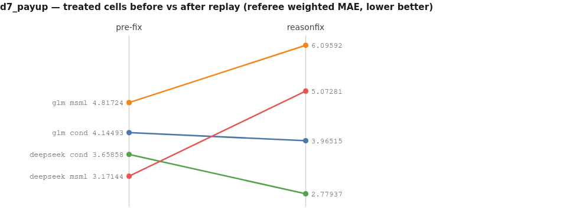

<details><summary>chart data</summary>

```chart
type: slope
title: d7_payup — treated cells before vs after replay (referee weighted MAE, lower better)
x: pre-fix -> reasonfix
slope glm cond | 4.144928 | 3.965152
slope glm msml | 4.817240 | 6.095922
slope deepseek cond | 3.658580 | 2.779368
slope deepseek msml | 3.171442 | 5.072812
```

</details>

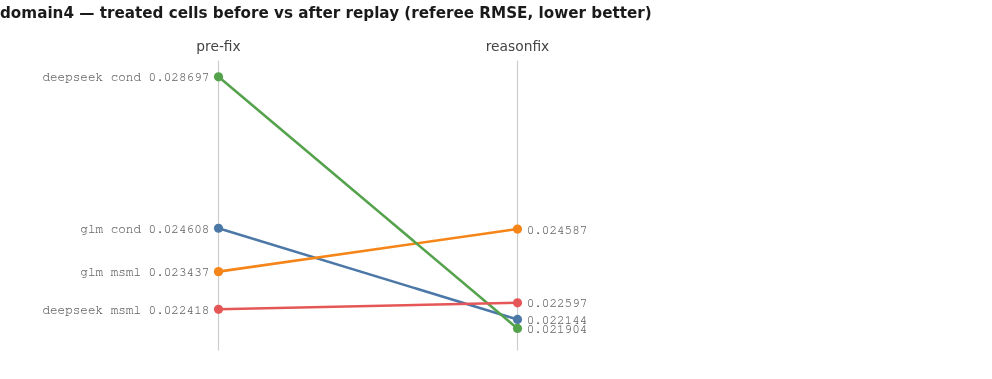

<details><summary>chart data</summary>

```chart
type: slope
title: domain4 — treated cells before vs after replay (referee RMSE, lower better)
x: pre-fix -> reasonfix
slope glm cond | 0.024608 | 0.022144
slope glm msml | 0.023437 | 0.024587
slope deepseek cond | 0.028697 | 0.021904
slope deepseek msml | 0.022418 | 0.022597
```

</details>

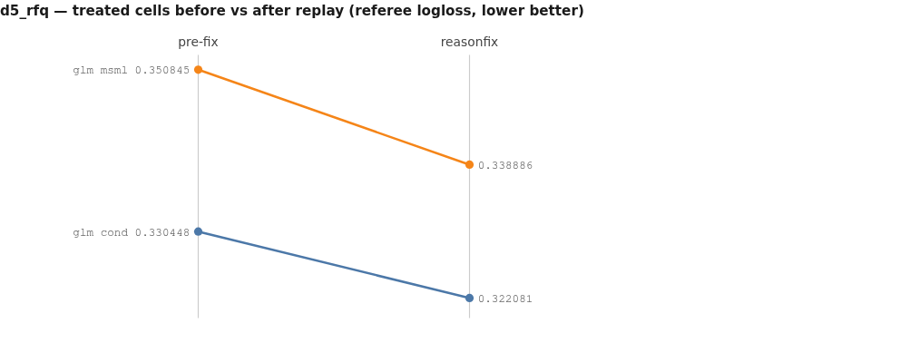

<details><summary>chart data</summary>

```chart
type: slope
title: d5_rfq — treated cells before vs after replay (referee logloss, lower better)
x: pre-fix -> reasonfix
slope glm cond | 0.330448 | 0.322081
slope glm msml | 0.350845 | 0.338886
```

</details>

Five of five cond cells improved; four of five msml cells worsened. Bracketing: kimi's *untreated* era drift is the same size (d7_payup cond 3.724917 → 2.862204; msml 6.378698 → 4.242443), and d7/domain4 noise is 54.57%/26.85%. Interference bracket: the improving cond cells absorbed 1,543 / 102 / 96 / 98 agent-visible API errors.

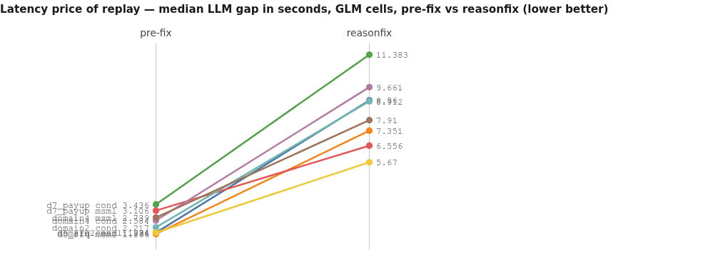

<details><summary>chart data</summary>

```chart
type: slope
title: Latency price of replay — median LLM gap in seconds, GLM cells, pre-fix vs reasonfix (lower better)
x: pre-fix -> reasonfix
slope d5_rfq cond | 1.936 | 8.960
slope d5_rfq msml | 1.866 | 7.351
slope d7_payup cond | 3.436 | 11.383
slope d7_payup msml | 3.106 | 6.556
slope domain2 cond | 2.217 | 8.912
slope domain2 msml | 1.940 | 5.670
slope domain4 cond | 2.584 | 9.661
slope domain4 msml | 2.739 | 7.910
```

</details>

**Which model with replay, which without:** use glm-5.2 and deepseek-v4-flash **with** replay (a model blind to its own reasoning is indefensible, and the request side is now verified), budgeting ~3-4x higher per-call latency; kimi-k3 needs nothing (it always replayed); gemma-4-31b produces no reasoning to replay.

---

## 8. Reliability — who broke what

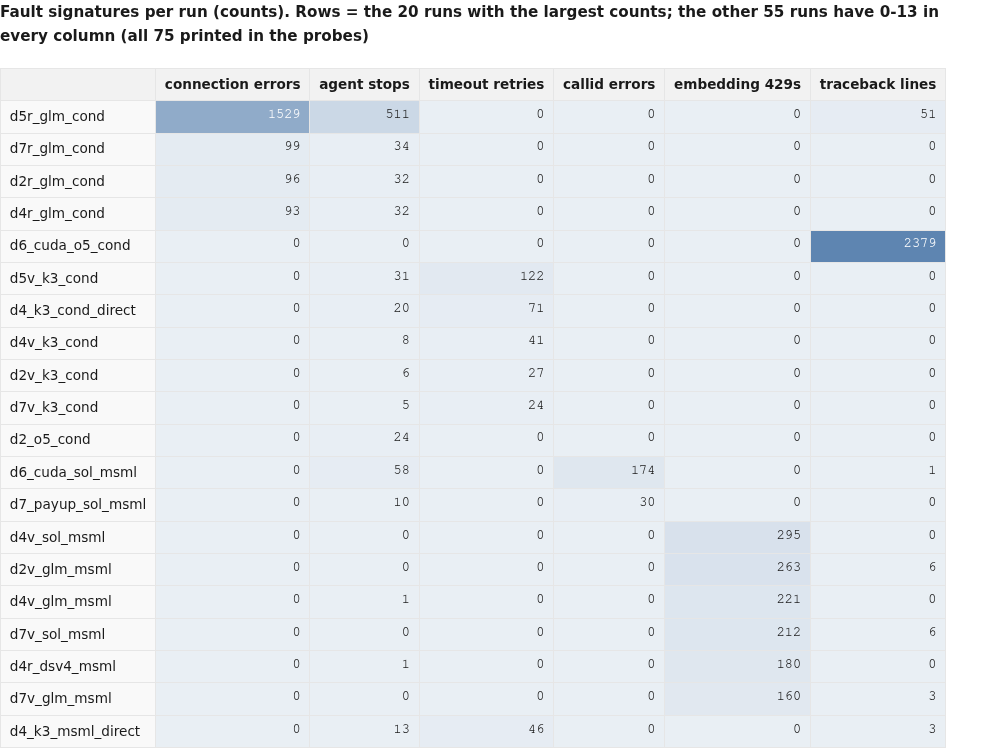

<details><summary>chart data</summary>

```chart
type: heatmap
title: Fault signatures per run (counts). Rows = the 20 runs with the largest counts; the other 55 runs have 0-13 in every column (all 75 printed in the probes)
cols: connection errors | agent stops | timeout retries | callid errors | embedding 429s | traceback lines
row d5r_glm_cond | 1529 | 511 | 0 | 0 | 0 | 51
row d7r_glm_cond | 99 | 34 | 0 | 0 | 0 | 0
row d2r_glm_cond | 96 | 32 | 0 | 0 | 0 | 0
row d4r_glm_cond | 93 | 32 | 0 | 0 | 0 | 0
row d6_cuda_o5_cond | 0 | 0 | 0 | 0 | 0 | 2379
row d5v_k3_cond | 0 | 31 | 122 | 0 | 0 | 0
row d4_k3_cond_direct | 0 | 20 | 71 | 0 | 0 | 0
row d4v_k3_cond | 0 | 8 | 41 | 0 | 0 | 0
row d2v_k3_cond | 0 | 6 | 27 | 0 | 0 | 0
row d7v_k3_cond | 0 | 5 | 24 | 0 | 0 | 0
row d2_o5_cond | 0 | 24 | 0 | 0 | 0 | 0
row d6_cuda_sol_msml | 0 | 58 | 0 | 174 | 0 | 1
row d7_payup_sol_msml | 0 | 10 | 0 | 30 | 0 | 0
row d4v_sol_msml | 0 | 0 | 0 | 0 | 295 | 0
row d2v_glm_msml | 0 | 0 | 0 | 0 | 263 | 6
row d4v_glm_msml | 0 | 1 | 0 | 0 | 221 | 0
row d7v_sol_msml | 0 | 0 | 0 | 0 | 212 | 6
row d4r_dsv4_msml | 0 | 1 | 0 | 0 | 180 | 0
row d7v_glm_msml | 0 | 0 | 0 | 0 | 160 | 3
row d4_k3_msml_direct | 0 | 13 | 46 | 0 | 0 | 3
```

</details>

**External interference.** (a) The GLM engine outage: in d5r_glm_cond all 1,529 connection errors and all 511 agent stops fall in the 20:00 and 21:00 hours; its msml twin sent its 1,643 requests to the *same* host (gpu-host-2.example.com:8000) mostly at 00:00-03:00 and logged zero. Cost: 511 dead turns, 11 seats that never got a first response, 51 tracebacks — and the run still produced 19 scored experiments and the best d5_rfq glm score. For that run the registry reports time_to_best_hours 2.24, wall_hours 3.95, median_queue_wait_minutes 10.5. (b) MLflow: d6_cuda_o5_cond's tracebacks are `HTTPSConnectionPool(host='mlflow.example.com'…)` failures (1,108 connection-pool lines, 120 log_artifact failures) — the registry counts 1,340 tracebacks and 1,979 infrastructure error lines, and the run exits 0. (c) kimi timeout bursts on the shared serving machine, in both harnesses. (d) The d7v_sol_cond SIGKILL (exit 137).

**Harness defects.** cond: 3-retries-then-kill (511 exhaustion lines, 505 immediately followed by "Agent stopped unexpectedly"). msml: the embeddings 429 storm (1,678 / 945 degradations, cond 0) and the Responses-API request-assembly bug (204 callid errors, all msml, all in sol cells).

**Model defects.** GLM malformed JSON ("Unterminated string starting at" — 15 cond, 6 msml); deepseek emitting argument text as a tool name (`read_file" path="backtest/strategy.py`, and a variant carrying raw `DSML` tokens); hallucinated tool names (`memorro_search`, `_shell_exec`, `cat`, `harness_engine`), 1-2 each; gemma's contract failures.

**Shape of the runs.** Agents stopped unexpectedly: cond 719 vs msml 91 corpus-wide — but 511 of cond's are the one outage window. Dispatcher crashes: 0 everywhere. Final exit codes: 0 for all finished runs except d7v_sol_cond (137) and the unfinished d6_cuda_sol_msml (none).

---

## 9. Cost

Corpus totals from the ledgers: **cond $3,425.04** (2,459,635,904 fresh input; 1,236,064,704 cache-read; 79,193,356 output) and **msml $3,344.64** (1,273,311,108 fresh; 1,767,594,962 cache-read; 62,592,283 output). Lab-hosted models (glm, kimi, deepseek, gemma) are priced at $0.0/1M on every axis by construction — absent, not free.


<details><summary>chart data</summary>

```chart
type: stacked
title: Metered token composition by harness (millions) — cache reads are real metered volume on priced vendors
row cond | fresh_input=2459.6 | cache_read=1236.1 | output=79.2
row msml | fresh_input=1273.3 | cache_read=1767.6 | output=62.6
```

</details>

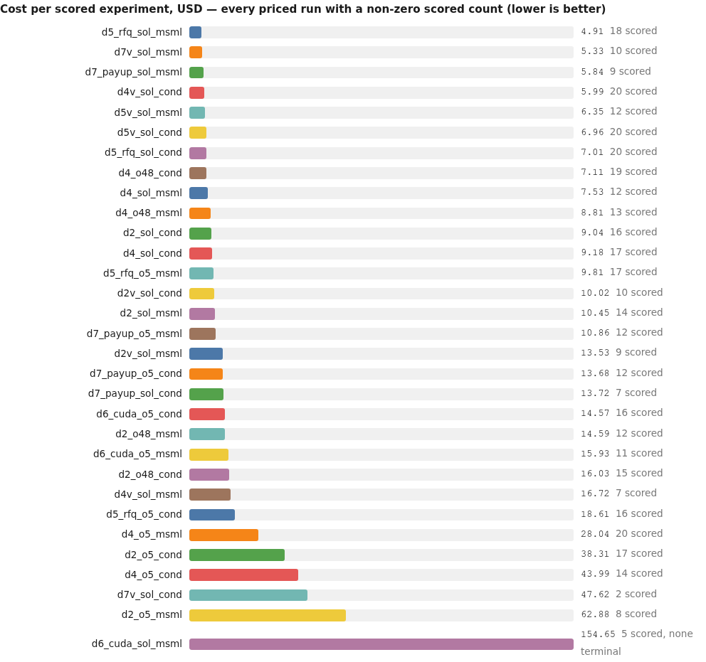

<details><summary>chart data</summary>

```chart
type: bars
title: Cost per scored experiment, USD — every priced run with a non-zero scored count (lower is better)
d5_rfq_sol_msml | 4.91 | 18 scored
d7v_sol_msml | 5.33 | 10 scored
d7_payup_sol_msml | 5.84 | 9 scored
d4v_sol_cond | 5.99 | 20 scored
d5v_sol_msml | 6.35 | 12 scored
d5v_sol_cond | 6.96 | 20 scored
d5_rfq_sol_cond | 7.01 | 20 scored
d4_o48_cond | 7.11 | 19 scored
d4_sol_msml | 7.53 | 12 scored
d4_o48_msml | 8.81 | 13 scored
d2_sol_cond | 9.04 | 16 scored
d4_sol_cond | 9.18 | 17 scored
d5_rfq_o5_msml | 9.81 | 17 scored
d2v_sol_cond | 10.02 | 10 scored
d2_sol_msml | 10.45 | 14 scored
d7_payup_o5_msml | 10.86 | 12 scored
d2v_sol_msml | 13.53 | 9 scored
d7_payup_o5_cond | 13.68 | 12 scored
d7_payup_sol_cond | 13.72 | 7 scored
d6_cuda_o5_cond | 14.57 | 16 scored
d2_o48_msml | 14.59 | 12 scored
d6_cuda_o5_msml | 15.93 | 11 scored
d2_o48_cond | 16.03 | 15 scored
d4v_sol_msml | 16.72 | 7 scored
d5_rfq_o5_cond | 18.61 | 16 scored
d4_o5_msml | 28.04 | 20 scored
d2_o5_cond | 38.31 | 17 scored
d4_o5_cond | 43.99 | 14 scored
d7v_sol_cond | 47.62 | 2 scored
d2_o5_msml | 62.88 | 8 scored
d6_cuda_sol_msml | 154.65 | 5 scored, none terminal
```

</details>

**Where the money goes by seat.** In the one fully-instrumented example of a large cond run (d2_glm_cond, lab-priced so $0 but token-metered): strategist 210.5M, worker 172.3M, verifier 60.7M, conductor 49.4M of 520.7M — i.e. governance+verification ≈ 21% of tokens, matching the corpus-wide governance share of 17.25%.

**Cache semantics.** Reported cache_read is real metered volume on anthropic/openai; on lab endpoints cache fields are simply absent (0 = unreported, and the serving engines prefix-cache internally). The registry's `efficiency.total_tokens_m` excludes cache reads and therefore misprices cache-dominated runs by up to ~100x (d6_cuda_o5_cond: 1.5M "total tokens" vs 150,755,951 metered, $233.10).

---

## 10. Search dynamics and lineage

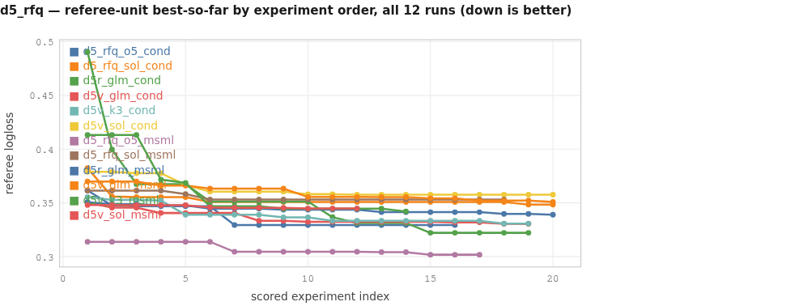

<details><summary>chart data</summary>

```chart
type: line
title: d5_rfq — referee-unit best-so-far by experiment order, all 12 runs (down is better)
x: scored experiment index
y: referee logloss
series d5_rfq_o5_cond: 1,0.361513; 2,0.347595; 3,0.346909; 4,0.346909; 5,0.346909; 6,0.346909; 7,0.329428; 8,0.329428; 9,0.329428; 10,0.329428; 11,0.329428; 12,0.329428; 13,0.329428; 14,0.329428; 15,0.329428; 16,0.329428
series d5_rfq_sol_cond: 1,0.382305; 2,0.355933; 3,0.355271; 4,0.355271; 5,0.355271; 6,0.350783; 7,0.350783; 8,0.350783; 9,0.350783; 10,0.350783; 11,0.350783; 12,0.350783; 13,0.350783; 14,0.35076; 15,0.35076; 16,0.35076; 17,0.35076; 18,0.35076; 19,0.348412; 20,0.348412
series d5r_glm_cond: 1,0.490469; 2,0.399631; 3,0.367399; 4,0.367399; 5,0.367399; 6,0.351185; 7,0.351185; 8,0.351185; 9,0.351185; 10,0.351185; 11,0.336684; 12,0.331324; 13,0.331324; 14,0.331324; 15,0.322081; 16,0.322081; 17,0.322081; 18,0.322081; 19,0.322081
series d5v_glm_cond: 1,0.350321; 2,0.345507; 3,0.345507; 4,0.340551; 5,0.340551; 6,0.340551; 7,0.340551; 8,0.333342; 9,0.333342; 10,0.33245; 11,0.33245; 12,0.33245; 13,0.33245; 14,0.33245; 15,0.33245; 16,0.331919; 17,0.331919; 18,0.330448; 19,0.330448
series d5v_k3_cond: 1,0.355511; 2,0.352821; 3,0.352821; 4,0.352084; 5,0.338889; 6,0.338889; 7,0.338889; 8,0.338889; 9,0.336588; 10,0.336588; 11,0.333272; 12,0.333272; 13,0.333272; 14,0.333272; 15,0.333272; 16,0.333272; 17,0.333272; 18,0.330717; 19,0.330717
series d5v_sol_cond: 1,0.378861; 2,0.378861; 3,0.377635; 4,0.377635; 5,0.36664; 6,0.360478; 7,0.360478; 8,0.360478; 9,0.360478; 10,0.358038; 11,0.358038; 12,0.357661; 13,0.357661; 14,0.357661; 15,0.357661; 16,0.357661; 17,0.357661; 18,0.357661; 19,0.357661; 20,0.357661
series d5_rfq_o5_msml: 1,0.313841; 2,0.313841; 3,0.313841; 4,0.313841; 5,0.313841; 6,0.313841; 7,0.304456; 8,0.304456; 9,0.304456; 10,0.304456; 11,0.304456; 12,0.304456; 13,0.304174; 14,0.304174; 15,0.301737; 16,0.301737; 17,0.301737
series d5_rfq_sol_msml: 1,0.361333; 2,0.361333; 3,0.361333; 4,0.361333; 5,0.358141; 6,0.353141; 7,0.353141; 8,0.353141; 9,0.353141; 10,0.353141; 11,0.353141; 12,0.353141; 13,0.353141; 14,0.353141; 15,0.353141; 16,0.353141; 17,0.353141; 18,0.353141
series d5r_glm_msml: 1,0.350614; 2,0.348797; 3,0.348797; 4,0.347588; 5,0.347588; 6,0.344576; 7,0.344576; 8,0.344576; 9,0.343642; 10,0.343642; 11,0.343642; 12,0.343642; 13,0.341384; 14,0.341384; 15,0.341384; 16,0.341384; 17,0.341384; 18,0.339666; 19,0.339666; 20,0.338886
series d5v_glm_msml: 1,0.369851; 2,0.369851; 3,0.369851; 4,0.366043; 5,0.366043; 6,0.363238; 7,0.363238; 8,0.363238; 9,0.363238; 10,0.355498; 11,0.355498; 12,0.355498; 13,0.355324; 14,0.355324; 15,0.35415; 16,0.35415; 17,0.352064; 18,0.352064; 19,0.352064; 20,0.350845
series d5v_k3_msml: 1,0.413209; 2,0.413209; 3,0.413209; 4,0.371645; 5,0.368579; 6,0.346825; 7,0.346825; 8,0.346825; 9,0.344656; 10,0.344656; 11,0.344656; 12,0.344656; 13,0.344656; 14,0.342039
series d5v_sol_msml: 1,0.347961; 2,0.347961; 3,0.347783; 4,0.347783; 5,0.347783; 6,0.345728; 7,0.345433; 8,0.345433; 9,0.345433; 10,0.3447; 11,0.3447; 12,0.3447
```

</details>

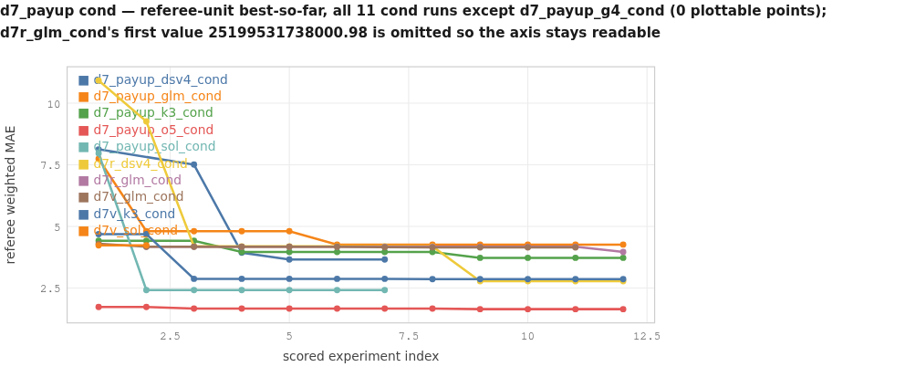

<details><summary>chart data</summary>

```chart
type: line
title: d7_payup cond — referee-unit best-so-far, all 11 cond runs except d7_payup_g4_cond (0 plottable points); d7r_glm_cond's first value 25199531738000.98 is omitted so the axis stays readable
x: scored experiment index
y: referee weighted MAE
series d7_payup_dsv4_cond: 1,8.125064; 3,7.509517; 4,3.933951; 5,3.65858; 7,3.65858
series d7_payup_glm_cond: 1,7.743149; 2,4.805948; 3,4.805948; 4,4.805948; 5,4.805948; 6,4.260018; 8,4.260018; 9,4.260018; 10,4.260018; 11,4.260018; 12,4.260018
series d7_payup_k3_cond: 1,4.417042; 2,4.417042; 3,4.417042; 4,3.964984; 5,3.964984; 6,3.964984; 7,3.964984; 8,3.964984; 9,3.724917; 10,3.724917; 11,3.724917; 12,3.724917
series d7_payup_o5_cond: 1,1.730889; 2,1.730685; 3,1.666326; 4,1.666326; 5,1.666326; 6,1.666326; 7,1.666326; 8,1.666326; 9,1.640616; 10,1.640616; 11,1.640616; 12,1.640616
series d7_payup_sol_cond: 1,7.965779; 2,2.416756; 3,2.416756; 4,2.416756; 5,2.416756; 6,2.416756; 7,2.416756
series d7r_dsv4_cond: 1,10.92211; 2,9.259123; 3,4.191213; 4,4.191213; 5,4.191213; 6,4.191213; 7,4.191213; 8,4.191213; 9,2.779368; 10,2.779368; 11,2.779368; 12,2.779368
series d7r_glm_cond: 2,4.172542; 3,4.172542; 4,4.172542; 5,4.172542; 6,4.172542; 7,4.172542; 8,4.172542; 9,4.172542; 10,4.172542; 11,4.172542; 12,3.965152
series d7v_glm_cond: 1,4.291275; 2,4.177196; 3,4.177196; 4,4.177196; 5,4.177196; 6,4.177196; 7,4.156752; 8,4.152972; 9,4.144928; 10,4.144928; 11,4.144928
series d7v_k3_cond: 1,4.685605; 2,4.685605; 3,2.872231; 4,2.872231; 5,2.872231; 6,2.872231; 7,2.872231; 8,2.862204; 9,2.862204; 10,2.862204; 11,2.862204; 12,2.862204
series d7v_sol_cond: 1,4.230359; 2,4.230359
```

</details>

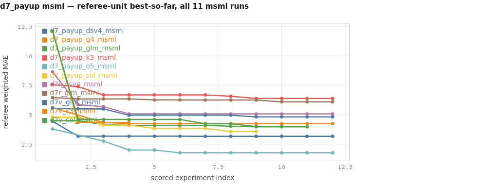

<details><summary>chart data</summary>

```chart
type: line
title: d7_payup msml — referee-unit best-so-far, all 11 msml runs
x: scored experiment index
y: referee weighted MAE
series d7_payup_dsv4_msml: 1,4.43985; 2,3.173246; 3,3.173246; 4,3.173246; 5,3.173246; 6,3.173246; 7,3.171442; 8,3.171442; 9,3.171442; 10,3.171442; 11,3.171442; 12,3.171442
series d7_payup_g4_msml: 1,5.601142; 3,4.339227; 4,4.339227
series d7_payup_glm_msml: 1,4.490791; 2,4.490791; 3,4.164332; 4,4.101154; 5,4.101154; 6,4.101154; 7,4.101154; 8,4.023623; 9,3.97507; 10,3.97507; 11,3.97507
series d7_payup_k3_msml: 1,7.561641; 2,7.379699; 3,6.684611; 4,6.684611; 5,6.684611; 6,6.684611; 7,6.684611; 8,6.574496; 9,6.378698; 10,6.378698; 11,6.378698; 12,6.378698
series d7_payup_o5_msml: 1,3.789295; 3,2.763511; 4,2.004241; 5,2.004241; 6,1.77077; 7,1.77077; 8,1.77077; 9,1.77077; 10,1.77077; 11,1.77077; 12,1.77077
series d7_payup_sol_msml: 1,4.791756; 2,4.791756; 3,4.115611; 4,4.115611; 5,3.847297; 6,3.847297; 7,3.847297; 8,3.574268; 9,3.574268
series d7r_dsv4_msml: 1,8.642662; 2,5.854077; 3,5.689701; 4,5.072812; 5,5.072812; 6,5.072812; 7,5.072812; 8,5.072812; 9,5.072812; 10,5.072812; 11,5.072812; 12,5.072812
series d7r_glm_msml: 1,6.456074; 2,6.343837; 3,6.343837; 4,6.343837; 5,6.258611; 6,6.258611; 7,6.251839; 8,6.251839; 9,6.251839; 10,6.095922; 11,6.095922; 12,6.095922
series d7v_glm_msml: 1,5.547805; 2,5.491361; 3,5.491361; 4,4.957831; 5,4.957831; 6,4.957831; 7,4.957831; 8,4.957831; 9,4.81724; 10,4.81724; 11,4.81724; 12,4.81724
series d7v_k3_msml: 1,12.098022; 2,4.354015; 3,4.354015; 4,4.242443; 5,4.242443; 6,4.242443; 7,4.242443; 8,4.242443; 9,4.242443; 10,4.242443; 11,4.242443; 12,4.242443
series d7v_sol_msml: 1,12.098022; 2,4.59601; 3,4.59601; 4,4.59601; 5,4.59601; 6,4.59601; 7,4.234013; 8,4.234013; 9,4.001524; 10,4.001524
```

</details>

**Shape.** Almost every run finds its best in the first two thirds of its board and then flatlines: d5_rfq_o5_cond is done at experiment 7 of 16; d7_payup_sol_cond at 2 of 7. The exception is d5r_glm_cond, still improving at 15 of 19 — the run that also won its task in cond. Registry `search.tail_after_last_improvement` medians (cond 3, msml 2) say the same thing: the last experiments rarely earn their keep.

The registry's own pair of timing metrics makes the waste explicit: d5v_k3_cond reports time_to_best_hours 22.96 with wall_hours 31.83; d2v_sol_cond time_to_best_hours 7.88 with wall_hours 11.14; d6_cuda_sol_cond time_to_best_hours 0.05 with wall_hours 2.49; d5_rfq_o5_cond time_to_best_hours 0.87 with wall_hours 8.01; d7_payup_sol_cond time_to_best_hours 0.43 with wall_hours 5.97.

**Lineage.** Variant chaining is cond-only by tool availability. Where refinements exist they usually beat their parents: `search.refinement_win_fraction` medians 1.0 (deepseek), 0.675 (opus-5), 0.625 (kimi), 0.55 (glm), 0.5 (sol), 0.42 (opus-4-8).

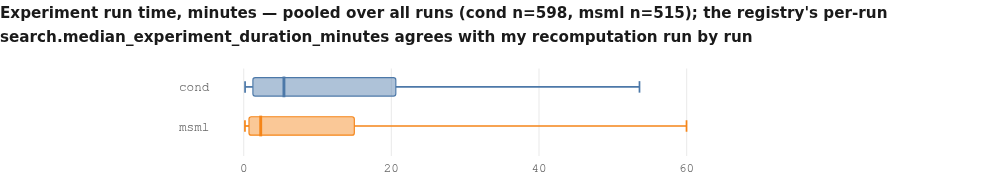

<details><summary>chart data</summary>

```chart
type: box
title: Experiment run time, minutes — pooled over all runs (cond n=598, msml n=515); the registry's per-run search.median_experiment_duration_minutes agrees with my recomputation run by run
box cond | 0.18 | 1.24 | 5.45 | 20.6 | 53.61
box msml | 0.17 | 0.71 | 2.3 | 14.98 | 59.98
```

</details>

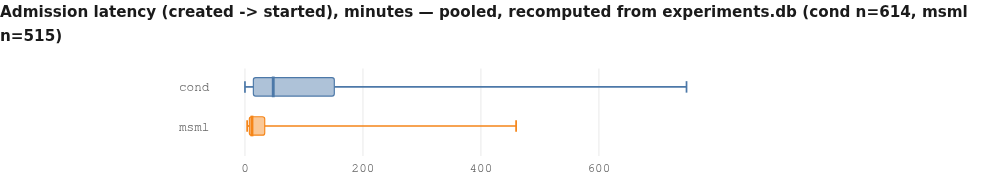

<details><summary>chart data</summary>

```chart
type: box
title: Admission latency (created -> started), minutes — pooled, recomputed from experiments.db (cond n=614, msml n=515)
box cond | 0.0 | 14.13 | 47.91 | 151.34 | 748.56
box msml | 3.54 | 7.42 | 11.74 | 33.5 | 459.61
```

</details>

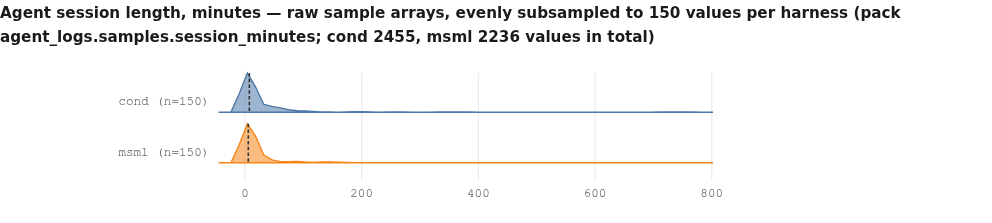

<details><summary>chart data</summary>

```chart
type: density
title: Agent session length, minutes — raw sample arrays, evenly subsampled to 150 values per harness (pack agent_logs.samples.session_minutes; cond 2455, msml 2236 values in total)
series cond: 1.97, 5.54, 3.55, 6.59, 0.57, 2.85, 4.56, 4.51, 1.07, 10.5, 3.84, 5.76, 346.68, 8.87, 5.7, 6.78, 756.73, 13.89, 4.89, 10.52, 41.36, 12.92, 45.1, 10.7, 20.41, 4.4, 2.19, 2.42, 2.54, 2.14, 3.07, 2.21, 1.89, 4.25, 2.03, 1.45, 1.15, 5.0, 7.5, 3.21, 21.98, 10.09, 17.27, 95.63, 370.22, 70.47, 63.05, 4.05, 21.26, 19.51, 9.22, 26.62, 6.18, 7.29, 4.49, 7.64, 201.58, 59.1, 0.18, 9.59, 6.99, 2.42, 56.8, 15.82, 3.14, 0.4, 0.11, 2.5, 9.72, 2.43, 53.13, 2.35, 2.98, 9.23, 3.36, 35.17, 61.18, 4.81, 8.44, 15.41, 38.09, 7.73, 7.33, 719.44, 0.54, 25.88, 30.0, 44.23, 46.0, 80.44, 6.18, 3.84, 1.99, 3.12, 9.02, 0.07, 2.28, 6.33, 254.89, 80.2, 10.86, 26.81, 53.09, 10.17, 8.44, 18.55, 8.16, 3.78, 4.33, 6.85, 1.08, 7.06, 16.41, 107.89, 101.94, 38.86, 101.8, 1.91, 2.7, 6.08, 3.13, 7.96, 9.64, 34.66, 11.21, 52.01, 60.12, 45.09, 2.65, 3.25, 7.96, 4.44, 0.37, 3.27, 33.18, 4.66, 129.23, 1.21, 1.94, 2.91, 2.18, 10.85, 13.97, 1.74, 60.1, 12.41, 13.46, 6.37, 182.43, 2.25
series msml: 8.12, 7.89, 1.41, 12.86, 3.19, 1.39, 5.42, 5.18, 6.97, 9.89, 8.96, 2.04, 1.2, 6.48, 0.39, 16.0, 3.61, 25.45, 32.1, 3.52, 1.13, 9.94, 7.55, 7.56, 126.16, 8.63, 3.69, 63.97, 16.04, 8.48, 2.04, 0.66, 6.04, 1.45, 31.72, 0.73, 0.38, 0.72, 144.69, 0.57, 1.55, 3.05, 8.56, 8.96, 24.57, 70.48, 38.33, 22.51, 23.15, 6.78, 7.27, 2.64, 2.72, 15.18, 21.59, 1.01, 0.73, 1.13, 2.96, 166.17, 3.48, 2.73, 46.78, 3.25, 176.48, 2.49, 0.52, 0.56, 0.24, 0.67, 0.91, 23.36, 5.9, 1.74, 3.82, 3.8, 5.85, 25.28, 25.15, 98.99, 15.21, 18.04, 22.76, 3.53, 1.42, 4.62, 4.97, 0.7, 1.51, 3.97, 8.88, 3.16, 48.85, 84.27, 19.8, 84.83, 6.21, 4.54, 4.3, 1.1, 9.11, 10.78, 6.33, 28.88, 14.68, 17.83, 4.06, 0.45, 1.39, 2.74, 12.57, 3.85, 20.91, 3.04, 1.27, 3.55, 2.1, 27.09, 28.74, 88.4, 35.41, 58.78, 0.82, 6.24, 5.69, 10.21, 5.26, 3.53, 5.45, 39.35, 36.7, 19.24, 136.11, 3.61, 1.06, 6.03, 6.09, 2.13, 1.52, 4.11, 3.07, 19.32, 2.56, 3.21, 8.36, 1.75, 5.45, 3.74, 25.31, 2.45
```

</details>

---

## 11. Context engineering and tool calling


<details><summary>chart data</summary>

```chart
type: box
title: Request payload size, bytes — pooled sample arrays (cond 15200, msml 14800 values)
box cond | 5353 | 84528 | 143644 | 228855 | 7288178
box msml | 4169 | 66186 | 116115 | 213270 | 4488223
```

</details>

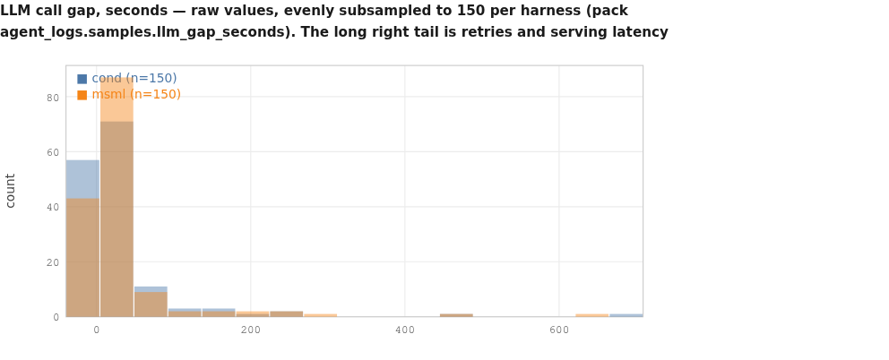

<details><summary>chart data</summary>

```chart
type: hist
title: LLM call gap, seconds — raw values, evenly subsampled to 150 per harness (pack agent_logs.samples.llm_gap_seconds). The long right tail is retries and serving latency
series cond: 5.566, 15.929, 15.057, 7.24, 8.561, 8.066, 50.109, 8.893, 6.378, 47.882, 15.571, 3.653, 10.162, 9.609, 31.594, 4.631, 9.668, 4.583, 7.47, 11.507, 24.014, 245.053, 15.571, 25.278, 4.365, 0.5, 2.035, 3.874, 2.375, 3.392, 1.669, 0.726, 1.914, 0.942, 0.869, 2.329, 47.437, 668.929, 217.205, 67.159, 59.254, 60.724, 4.042, 8.061, 9.56, 4.563, 15.674, 7.181, 9.887, 8.997, 101.169, 24.691, 9.393, 3.157, 8.277, 3.794, 2.675, 0.861, 9.883, 0.379, 2.341, 0.642, 1.58, 2.961, 2.892, 17.709, 2.176, 0.979, 42.372, 26.386, 4.248, 481.058, 8.6, 5.745, 12.745, 33.144, 2.339, 4.469, 4.688, 3.526, 3.198, 0.507, 2.128, 2.486, 59.793, 33.131, 67.108, 144.137, 3.878, 17.399, 12.491, 7.768, 6.419, 20.259, 2.685, 39.229, 93.265, 144.294, 2.749, 85.832, 4.068, 2.953, 3.356, 1.119, 34.172, 1.509, 0.486, 156.367, 21.806, 32.046, 249.867, 8.422, 5.305, 24.256, 4.187, 9.81, 3.173, 1.719, 5.782, 112.76, 71.487, 91.265, 69.917, 7.093, 4.224, 20.109, 7.86, 27.946, 9.554, 23.768, 8.912, 1.097, 0.581, 4.013, 3.848, 7.699, 24.414, 13.389, 4.551, 1.116, 35.606, 59.425, 2.197, 1.454, 2.301, 7.116, 2.287, 1.542, 1.944, 1.765
series msml: 5.192, 16.261, 12.985, 16.114, 14.243, 18.077, 8.939, 6.945, 11.55, 15.686, 6.211, 36.167, 23.285, 4.113, 46.828, 5.615, 8.718, 23.063, 19.137, 6.735, 7.847, 12.432, 78.478, 17.912, 4.945, 0.944, 8.459, 5.108, 0.54, 2.625, 0.387, 2.035, 4.982, 0.951, 54.676, 2.013, 16.321, 56.392, 10.763, 117.341, 184.368, 36.189, 9.118, 25.73, 23.243, 5.432, 8.399, 48.119, 24.578, 22.695, 5.587, 9.621, 13.92, 47.326, 12.482, 8.419, 14.011, 8.041, 0.636, 2.314, 2.457, 0.706, 1.259, 4.049, 1.677, 4.315, 1.336, 45.393, 2.813, 0.76, 25.846, 58.002, 22.496, 142.285, 9.623, 11.902, 5.929, 16.804, 5.408, 6.756, 4.356, 3.947, 0.537, 3.657, 1.09, 1.678, 59.815, 643.046, 290.931, 28.128, 7.081, 5.428, 5.786, 7.548, 0.383, 38.198, 0.874, 7.985, 64.773, 5.156, 8.468, 211.804, 3.461, 1.105, 0.357, 1.182, 5.86, 146.793, 11.974, 226.828, 445.975, 11.413, 4.344, 11.694, 4.347, 5.225, 28.498, 10.993, 0.505, 53.649, 9.437, 70.01, 249.985, 8.599, 7.205, 93.36, 2.649, 0.817, 0.95, 6.059, 4.858, 11.938, 0.576, 12.209, 3.451, 1.265, 0.782, 20.992, 2.199, 7.345, 22.782, 88.816, 2.616, 2.595, 14.085, 1.208, 0.633, 29.805, 13.215, 0.959
```

</details>

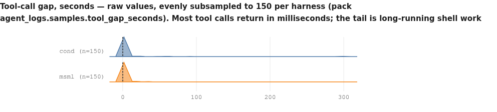

<details><summary>chart data</summary>

```chart
type: density
title: Tool-call gap, seconds — raw values, evenly subsampled to 150 per harness (pack agent_logs.samples.tool_gap_seconds). Most tool calls return in milliseconds; the tail is long-running shell work
series cond: 0.089, 0.004, 0.091, 0.045, 0.004, 0.015, 0.011, 0.015, 0.004, 0.119, 0.034, 0.005, 0.053, 0.735, 0.007, 0.004, 0.242, 0.105, 0.088, 0.054, 0.137, 0.006, 0.098, 21.12, 0.031, 0.005, 0.074, 0.004, 0.054, 0.066, 0.14, 0.092, 0.001, 0.361, 0.159, 0.006, 0.001, 0.005, 44.939, 0.611, 0.006, 0.001, 0.12, 10.426, 0.005, 0.031, 0.029, 0.132, 62.039, 0.046, 0.04, 0.089, 0.057, 0.004, 0.011, 0.004, 0.006, 0.093, 0.073, 0.393, 300.277, 0.072, 0.077, 4.146, 0.053, 8.446, 0.028, 0.01, 22.978, 2.082, 0.084, 0.005, 0.046, 0.101, 0.067, 0.038, 0.048, 0.009, 0.005, 0.005, 0.088, 0.008, 300.177, 55.999, 25.215, 0.005, 0.007, 0.132, 0.004, 1.05, 0.004, 0.004, 0.004, 0.006, 0.001, 0.111, 91.203, 0.055, 0.006, 0.004, 0.004, 0.008, 0.037, 2.027, 0.008, 0.123, 0.004, 0.004, 0.006, 0.19, 0.005, 0.004, 0.004, 0.092, 0.005, 0.004, 0.063, 8.347, 0.125, 0.063, 0.07, 3.731, 0.074, 0.047, 0.005, 0.004, 0.126, 0.007, 0.034, 0.016, 0.005, 0.02, 0.06, 0.039, 0.195, 0.022, 0.005, 0.023, 0.073, 6.446, 0.083, 0.014, 0.013, 1.135, 0.114, 0.009, 0.521, 0.065, 2.76, 0.005
series msml: 0.014, 0.044, 0.015, 0.001, 0.213, 0.014, 0.241, 0.004, 1.928, 1.989, 0.008, 0.099, 2.707, 0.08, 0.023, 0.733, 61.033, 0.004, 0.014, 0.009, 0.022, 0.165, 0.013, 0.004, 0.064, 170.487, 0.001, 0.005, 0.007, 0.01, 2.118, 0.013, 0.02, 0.01, 0.895, 0.012, 1.529, 0.02, 0.001, 0.01, 0.302, 0.105, 0.005, 0.031, 1.965, 0.005, 0.005, 0.004, 0.004, 0.013, 0.013, 0.022, 1.257, 0.149, 0.028, 0.004, 0.005, 0.032, 1.339, 0.017, 0.028, 0.013, 0.01, 0.001, 0.078, 0.078, 14.559, 0.023, 0.004, 37.026, 0.458, 0.007, 0.095, 0.13, 0.01, 0.052, 0.172, 18.956, 0.005, 0.913, 18.599, 0.004, 6.128, 0.017, 0.004, 0.026, 0.016, 0.016, 0.005, 6.476, 0.0, 0.739, 0.004, 0.007, 0.005, 0.009, 0.054, 0.163, 0.376, 0.0, 0.006, 0.01, 0.591, 0.004, 5.009, 0.001, 0.017, 1.565, 0.0, 0.008, 0.004, 0.005, 0.003, 0.006, 0.004, 2.863, 0.039, 0.004, 0.034, 0.061, 0.005, 2.749, 0.004, 0.05, 0.001, 0.498, 0.006, 33.966, 0.01, 0.009, 0.011, 0.009, 0.109, 0.014, 0.005, 0.048, 0.038, 0.008, 0.028, 20.379, 0.009, 0.025, 2.411, 0.009, 0.056, 0.031, 240.027, 23.501, 0.051, 0.006
```

</details>

Composition and repetition (36 paired cells, medians): images share 0.2227 cond vs 0.1602 msml; tool-results share 0.3642 vs 0.3967; thinking share ~0.10 both. **Replay**: the median request shares 0.9124 (cond) / 0.8803 (msml) of its bytes with the previous request as a common prefix (p90 0.9709 / 0.9632), cond higher in 28-29 of 36 pairs — both harnesses re-send ~90% of the previous payload every call. On lab endpoints that is metered volume and latency, not recomputation (the GLM engine's own metrics show 95.3% prefix-cache hits). Fresh input grows 41,590 (cond) vs 30,872 (msml) tokens per session; worker prompts are 36,494 vs 23,338 chars (cond larger in 36/36).

**Tool census.** Failure rate per seat:tool (failures/invocations, same pair):

| seat:tool | cond | msml |
|---|---|---|
| worker:shell_exec | 210/30,636 = 0.69% | 417/42,950 = 0.97% |
| worker:read_file | 510/24,198 = 2.11% | 962/32,988 = 2.92% |
| strategist:read_file | 687/7,339 = 9.36% | 1,061/7,583 = 13.99% |
| strategist:grep_file | 1/2,625 = 0.04% | 30/3,921 = 0.77% |
| verifier:shell_exec | 226/6,479 = 3.49% | — (no seat) |
| conductor:shell_exec | 22/6,224 = 0.35% | — (no seat) |
| worker:memory_store | 0/1,277 = 0.00% | 207/1,800 = 11.50% (195 of them in one runaway; 12/1,095 = 1.10% otherwise) |
| reporter:read_file | 118/1,015 = 11.63% | 26/515 = 5.05% |

Verdict per tool: `shell_exec`, `grep_file`, `read_board`, `update_playbook`, `memory_read/search` are healthy everywhere. `read_file` is the problem tool and the problem is the *strategist seat* — a path-contract miss ("[ERROR] File not found: …", 6,569 such lines in d2_glm_cond's strategist transcript, 2,728 in d7_payup_g4_msml's), 9x model-dependent. `complete_research` is a contract failure, not I/O. `memory_store` fails only in msml and only materially in one run.

---

## 12. Behaviour provenance

| behaviour | origin | citation |
|---|---|---|
| verification triad, proof notebooks | **prescribed** by cond's verifier stage | 58 candidate dirs with WORKER_NOTE/CRITIC_REVIEW/ARBITER_VERDICT in 36 of 38 cond runs; 0 in msml |
| completion gate + evidence requirement | **prescribed** by msml | poll text "Review the board and either propose the next scientifically useful experiments or explicitly complete the research if none remain."; refusals "[ERROR] complete_research: experiment work is still active …" and "… `evidence` must contain at least one non-empty string." |
| variant chaining / flat lineage | **harness-forced** | `propose_variant`, `park`, `set_priority`, `kill_experiment`, `request_verification`, `request_phase_rewind`, `issue_directive` exist only in cond seats; `cancel_experiments`, `complete_research` only in msml; distinct tools 29 vs 16 in 36/36 pairs |
| semantic memory / throttling | **harness-forced (msml)** | 76,268 embedding calls in msml, 0 in cond |
| playbook updating | **prescribed both sides**, volume model-dependent | `update_playbook` present in both; median playbook bytes 25,572 (opus-5) → 2,016 (gemma) |
| cancel/complete storms | **emergent (model)** | d7_payup_g4_msml: `cancel_experiments` ×117, `complete_research` ×56 |
| malformed tool names | **emergent (model)** | deepseek runs emit `read_file" path="backtest/strategy.py` and a DSML-token variant; `memorro_search`, `_shell_exec`, `cat`, `harness_engine` 1-2 each |

**Adapter patch audit.** Phase 0 rewrites the adapters in essentially every run (cond 407 `patch_adapter_file` calls, msml 392; ~11 per run), and a supervisor patches mid-run in a minority (cond 40 calls, msml 29). `lifecycle.adapter_files_patched_midrun` is non-zero in 14 runs and concentrated in the kimi cells (11, 10, 9, 6, 5) — **but** that metric counts files touched more than an hour after run start, and the kimi runs are the longest in the corpus, with a 42-minute phase 0. For reference, the registry reports for those runs: d5v_k3_cond wall_hours 31.83; d4_k3_msml_direct wall_hours 24.44; d4v_k3_cond wall_hours 21.56; d2v_k3_msml wall_hours 20.87; d2v_k3_cond wall_hours 19.71. So I do not attribute mid-run rule rewriting to kimi: duration-confounded, left open.

---

## 13. Code and written artifacts

Volume (medians, 36 paired cells): py files 111.5 cond vs 45 msml (34/36); total lines 17,147 vs 9,245 (30/36); code lines per experiment 825 vs 477 (29/36); functions per experiment 24.5 vs 17; branches per 100 lines 12.56 vs 11.29; comment share 5.2% vs 5.9%. AST parse failures: 0 everywhere except 1 in d7_payup_g4_cond.

Do the reproductions match? Read, not counted: yes in the two arbiter cases, and the more important observation is that **the arbiter's job is to find where they don't** — the d7v_sol_cond verdict reproduces 3.0367074677 exactly and then shows the number is not a live-implementable score (honest ≈ 3.131, three stable seeds spanning 2.9850-3.1310). Board-level, 84.92% of cond's claimed numbers reproduce vs 71.96% of msml's; the registry's own DB-vs-file mismatch counters are closer and slightly favour msml (cond 57 vs msml 49), so the verifier's value shows up in *reproducibility of claims*, not in bookkeeping.

Code-level keep/fix per harness: **cond** — keep the verify/ scaffold and the debrief template; fix the retry policy and the admission cap. **msml** — keep the completion contract; fix the embeddings path, the Responses-API request assembly, and add a verification seat.

---

## 14. Measurement hygiene and the numerical-oddities register

1. `efficiency.total_tokens_m` excludes cache reads → d6_cuda_o5_cond registry **1.5M** vs ledger **150,755,951** metered ($233.10); d5_rfq_o5_cond **3.8M** vs **213,482,965** ($297.81). Both values on the record.
2. HTTP 429s: my run.log scan **1,678** vs registry `http.rate_limited` **1,652**; the single disagreeing run is d7_payup_dsv4_msml (52 vs 26).
3. Tracebacks in d6_cuda_o5_cond: registry **1,340** vs my raw count of **2,379** lines starting "Traceback (most recent call last)" — different normalisation.
4. Referee counter vs its own status list: differs in 21 runs; `artifact_coverage` = list/counter in 17 of them; three domain2 rows publish a lower value than the ratio (d2_sol_cond 1.0 not 1.19; d2v_sol_cond 1.0 not 1.4; d2_glm_cond 0.737 not 0.757) — **open**.
5. Per-scored ratios explode when re-scored artifacts outnumber board scores: d4_dsv4_msml_direct "tokens per scored exp" 56,143,515 from 1 board score.
6. d7r_glm_cond's first experiment carries a referee score of **25,199,531,738,000.98** — a blown-up prediction the board never promoted. Real, not a parsing artifact; excluded from the chart axis with this note.
7. `lifecycle.adapter_files_patched_midrun` is duration-confounded (see §12).
8. Cross-checks that passed: registry `search.median_experiment_duration_minutes` matches my DB recomputation run by run (d2_glm_cond 21.5233 vs 21.52), and the registry admission-latency metric matches mine for the same run (48.6 vs 48.65).
9. An anchor mismatch in the registry's timing pair: for d6_cuda_o5_cond, time_to_best_hours 3.05 exceeds wall_hours 1.88 — the two windows are measured from different anchors. Flagged, unexplained.

---

## 15. Campaign design integrity

1. **Era = treatment + interference + schedule order.** reasonfix is simultaneously the replay fix, the GLM outage evening, and the era in which cond ran first in every domain. Fix: randomise harness order inside an era; never bundle an infrastructure change with a scoring era.
2. **Seat pins break the single-model premise** (8 cond runs, opus-4-7 conductor). Fix: pin all seats to the run's model or make the conductor an explicit arm.
3. **Replication is thinnest where noise is largest**: 2-3 repeats on d7_payup/domain4 against 54.57%/26.85% spread; d6_cuda has none and one cell never finished. Fix: 3 repeats minimum on noisy tasks.
4. **Validation identity is inconsistent by design**: domain2 own-slice (7 unrankable pairs), domain4 per-pair pools of 7 shared origins (56 in one pair), d7 metric names varying. Fix: freeze one holdout per task before the campaign.
5. **Cheapest of all**: fix the experiment-loop concurrency before spending another dollar — every elapsed-time and time-to-best number in this campaign was measured on an effectively serialized loop.

---

## Findings, with the mechanism behind each

1. **Three runs had no recorded model; recovered** (d2_o5_cond, d4_o5_cond = claude-opus-5; d4_sol_cond = gpt-5.6-sol). Mechanism: registry field empty, config.json and per-seat call tallies intact. Consequence: the domain4 "cond + ''" replication group is void.
2. **cond is not single-model in 8 runs** — conductor pinned to claude-opus-4-7 (161/128/75/121/310/145/256/128 calls) while msml pins only a web_search model. Mechanism: config `seat_pins`.
3. **cond 15 / msml 12 over 27 comparable pairs; only 7 margins clear cell noise.** Mechanism: replication spread of 54.57% (d7_payup) and 26.85% (domain4) versus margins of a few percent.
4. **msml's memory throttles itself**: 76,268 embedding calls (cond 0), 1,678 429s in 21 runs, 945 "Semantic memory search unavailable; using full text" fallbacks. Mechanism: one remote embedding call per memory op, failing open.
5. **The GLM outage was a 2-hour window, and cond's client converted it into 511 dead turns**: 511 "API error after 3 retries" lines, 505 immediately followed by "Agent stopped unexpectedly"; the msml twin ran later on the same host with zero errors.
6. **Reasoning replay was broken for 18 runs and is fixed**: request-side reasoning 0% → 90.3% (glm) / 95.5% (deepseek); kimi control 93.5-93.8% throughout; gemma 0% both sides.
7. **Post-fix, all 5 cond cells improved and 4 of 5 msml cells worsened**, inside kimi-sized era drift; the measurable price is ~4x median LLM gap.
8. **Denominators agree run-by-run; the referee's counter and its own list differ in 21 runs**, artifact_coverage being their ratio in 17. Mechanism: two populations (board scores vs re-scorable artifacts) under similar names.
9. **The dominant tool failure is strategist read_file** (9.36% cond / 13.99% msml, "[ERROR] File not found"), 9x model-dependent; msml's `complete_research` fails as a *contract* (55/56, 24/25, 10/10); the msml memory_store gap is a single-run artifact (**retraction**, see below).
10. **cond's verifier triad is real and caught a bad headline** (0.0943 MAE of 3.0367 was a sort artifact); cond's claims reproduce 84.92% vs msml's 71.96%; msml has no verify tree in any run.
11. **6 workers configured, ~1 realized, in both harnesses** (time-weighted 0.70 / 0.55); this plus cond's deeper backlog explains the 47.91 vs 11.74-minute admission latencies.
12. **gemma-4-31b is the process floor**, worst of seven on tool failure rate and scored fraction, and its collapse is asymmetric (msml 17th of 22; cond board scored nothing).
13. **No harness is more repeatable** (4-4 split; medians 10.61% vs 9.20% after dropping the censored cell). Spread is a task property.
14. **"Total tokens" is not cost**: cache-dominated runs are mispriced up to ~100x; the most expensive run in the corpus ($773.27) produced no terminal rows.

---

## What to change first — ranked

**cond**
1. Replace 3-retries-then-kill with jittered backoff + resume-from-transcript (511 dead turns from one outage).
2. Cap admitted-but-unstarted experiments near the worker count (median 12, max 61 pending against ~1 realized concurrency).
3. Make the arbiter step mandatory rather than best-effort (27 verdicts across 58 candidates).
4. Add a completion contract with an evidence requirement (copy msml's idea, not its error handling).
5. Trim governance token share (17.25% median) by shortening conductor timer sessions — directive ack rate is 0.0 in 10 runs, so much of that traffic is unread.

**msml**
1. Fix the embeddings memory path: cache/batch per record, rate budget, and surface the fallback instead of silently degrading (1,678 429s, 945 degradations).
2. Fix the OpenAI-Responses request assembly (204 "No tool call found for … call_id" lines, all msml) and add a per-seat call/loop guard — this is the mechanism next to a $773, 0-row runaway.
3. Add a verification seat with an independent re-derivation mandate (currently 0 in 37 runs; the reproduction gap is 84.92% vs 71.96%).
4. Turn `complete_research` refusals into structured guidance plus an attempt limiter (56 attempts, 55 failures in one run).
5. Give the strategist a variant/refinement affordance; today lineage is flat because the tool does not exist.

**Infrastructure (both)**
1. Find and fix the experiment-loop serialisation (6 configured workers → 0.55-0.70 realized).
2. Publish tokens as fresh / cache-read / output / metered total, never one "total".
3. Make the MLflow logging-backend failure non-fatal-and-quiet (1,340 tracebacks in a run that exited 0).
4. Freeze one holdout per task; require 3 repeats per cell on d7_payup and domain4.
5. Reconcile the anchors of the registry's two timing metrics — d6_cuda_o5_cond reports time_to_best_hours 3.05 against wall_hours 1.88.

---

## Corrections and retractions

* **Retracted:** "msml's worker memory_store fails 11.5% of the time" as a harness-level claim. 195 of 207 failures are the single unfinished runaway d6_cuda_sol_msml; excluding it msml is 12/1,095 = 1.10% against cond's 0/1,277. The residual 1.10% mechanism is **open** — the worker transcripts do not preserve a distinguishable memory_store error string.
* **Corrected (mission input):** the domain4 replication group "cond + ''" is not a replication group; it joins claude-opus-5 and gpt-5.6-sol runs.
* **Corrected (naive reading):** cond is not intrinsically more fragile than msml under serving faults. The reasonfix connection storm is time-localized and cond simply ran during it; whether msml's client would have survived is untested.
* **Corrected (naive reading):** cond's long admission latencies are not a scheduler-budget difference — both harnesses configure 6 workers; the gap is backlog depth on top of ~1 realized concurrency.
* **Corrected (plan assumption):** msml is not always at "0 verification artifacts" in the registry sense — 4 msml runs contain 19/12/31/2 verification files as model-initiative side products — but no msml run has a verify/ tree with worker/critic/arbiter documents.

---

## Verdict robustness — could another reviewer land elsewhere?

* **"No harness quality winner"** — the heaviest evidence is the replication table: d7_payup cond sol spread 54.57%, msml glm 42.74%. A reviewer who ignored repeat spread would report "cond wins 15-12" as a result. They would be reading noise. Robust.
* **"Copy the verifier"** — carried by two artifacts read end to end plus the 84.92%/71.96% reproduction gap. A reviewer could argue the gap is model-mix driven; the paired view (7 cond / 2 msml / 18 ties) answers that, though it concentrates in the d7_payup newdomains cells. Moderately robust.
* **"msml memory is the biggest self-inflicted fault"** — a full-population log census (0 vs 76,268 calls). Only contestable on *impact*: I show the throttling and the silent degradation, not a quality loss. Robust on fault, unproven on cost to quality.
* **"6 workers, ~1 realized"** — heaviest single number: time-weighted concurrency medians 0.70/0.55 from every run's own DB timestamps. A reviewer might argue the DB timestamps understate overlap; the admission-latency reconciliation (44.96 predicted vs 47.91 observed) independently supports ~1. Robust on measurement, open on cause.
* **"opus-5 is tier 1"** — could flip on cost-normalised terms: opus-5 cells cost $130-$651 per run against $0 for glm/kimi cells that come within a few percent on domain4 and beat it inside cond on d5_rfq.

---

## What stays unresolved, and what would settle it

| # | Open question | Why it cannot be closed here | What would settle it |
|---|---|---|---|
| 1 | Does cond's **conductor** improve outcomes? | In 8 runs it was a different model (opus-4-7); elsewhere its actions cannot be separated from other seats, and there is no conductor-off arm | a no_conductor arm (the config field exists and is null in every run) |
| 2 | Cause of the ~1 realized concurrency | Per-worker slot occupancy is not preserved; GPU pinning, turn structure and launcher serialisation are all consistent with the data | slot-level telemetry, or a run with `gpu_ids` unset and 6 forced parallel experiments |
| 3 | The residual 1.10% msml memory_store failure rate | Worker transcripts contain experiment code that swamps grep for tool errors | preserved tool-error records per call |
| 4 | Whether msml's client would survive the GLM outage | It was never exposed (cond ran first in every reasonfix domain) | a fault-injection replay |
| 5 | Retrieval quality: semantic (msml) vs literal (cond) memory | No artifact records what a memory search returned vs what was needed | logged query/result pairs with relevance labels |
| 6 | The three domain2 `artifact_coverage` rows that do not equal list/counter | The referee's formula is not published and these three deviate | referee source or a coverage field spec |
| 7 | Whether replay improves GLM/deepseek *quality* | Treatment is fused with the outage and with schedule order; single-cell deltas sit inside 27-55% task noise | 3 repeats per treated cell inside one clean era |
| 8 | Mid-run adapter rewriting as a model habit | The registry metric is duration-confounded and the kimi runs are the longest | patch timestamps relative to phase boundaries rather than run start |
| 9 | The registry timing-anchor mismatch (d6_cuda_o5_cond time_to_best_hours 3.05 vs wall_hours 1.88) | The two metrics' anchors are not documented in the pack | metric definitions or the raw event windows for that run |

**Dimensions examined but showing no material difference** (stated so they are not silently skipped): dispatcher crashes (0 in all 75), `integrity.primary_mutations_after_finish` and `results_replaced_after_finish` (single digits, both harnesses), `memory.duplicate_fraction` (0 for every model), `code.ast_parse_failures` (1 in the corpus), `agents.sessions_ended_clean_total` (16/36 pairs, no direction), `http.peak_requests_per_minute` (37.5 vs 33), `speed.median_llm_gap_seconds` (7.35 vs 6.78), `context.thinking_share` (~0.10 both), `search.improvements` (4 vs 4), `lifecycle.phase1_hours`/`phase2_hours` (no direction), `reliability.capacity_refusals` (0 except 70 in d2_o5_cond's strategist, 27 in d4_o5_cond, 5 in d2_o5_msml, 3 in d4_o5_msml).

**Dimension left unexamined by name:** per-seat *token* attribution across all 75 runs (examined for the paired-metric medians and one large run in detail, not run-by-run); and the `conductor` pack section's directive *text* beyond counts and ack rates.

---

## Closing self-audit — my weakest claims

1. **"cond's verifier triad causes the higher reproduction rate."** I show the artifacts exist, that one caught a real defect, and that cond's claims reproduce more often. The causal link is inference: the paired advantage concentrates in the d7_payup newdomains cells where *both* sides largely fail, so the mechanism could partly be metric-name discipline rather than verification.
2. **"cond wins d5_rfq for glm."** Two replicates, both clear of noise — but n=2, and one of them ran during a serving outage.
3. **The d6_cuda verdicts.** Two pairs, no repeats, one side unfinished. I report them as pilots; a reader could over-read the msml lead.
4. **Model tier 1 for opus-5.** Its domain4 cells have no pair-identity score, so "best everywhere it ran" is really "best on the three tasks where a comparable score exists".
5. **The heatmap and the cost-per-scored bar chart are ranked subsets** (top-20 fault runs; priced runs with non-zero scored counts). The full per-run populations are in the probes and appendices; I state the exclusion each time rather than implying completeness.
6. **The raw-array charts are 150-value even subsamples** of pools of 2,236-15,200 values, taken by the standard sampler; the five-number boxes over the full pools are shown beside them so the reader can see the subsample is representative.

---

# Appendix A1 — registry timing metrics, all 75 runs

Each line quotes the registry's published values for that run.

- d2_o5_cond — time_to_best_hours 5.27, wall_hours 13.75, median_queue_wait_minutes 70.3
- d2_o5_msml — time_to_best_hours 10.55, wall_hours 22.36, median_queue_wait_minutes 50.2
- d4_o5_cond — time_to_best_hours 4.95, wall_hours 7.83, median_queue_wait_minutes 137.4
- d2_glm_cond — time_to_best_hours 12.77, wall_hours 17.16, median_queue_wait_minutes 48.6
- d2_glm_msml — time_to_best_hours 1.96, wall_hours 7.91, median_queue_wait_minutes 7.0
- d4_dsv4_cond_direct — time_to_best_hours 3.51, wall_hours 8.89, median_queue_wait_minutes 256.3
- d4_glm_cond_direct — time_to_best_hours 2.63, wall_hours 5.34, median_queue_wait_minutes 99.5
- d4_k3_cond_direct — time_to_best_hours 10.82, wall_hours 18.76, median_queue_wait_minutes 254.4
- d4_dsv4_msml_direct — time_to_best_hours 0.51, wall_hours 4.26, median_queue_wait_minutes 12.2
- d4_glm_msml_direct — time_to_best_hours 1.58, wall_hours 7.44, median_queue_wait_minutes 13.1
- d4_k3_msml_direct — time_to_best_hours 18.19, wall_hours 24.44, median_queue_wait_minutes 136.5
- d2_o48_cond — time_to_best_hours 2.0, wall_hours 8.1, median_queue_wait_minutes 91.7
- d2_sol_cond — time_to_best_hours 5.4, wall_hours 7.11, median_queue_wait_minutes 199.4
- d2_o48_msml — time_to_best_hours 2.13, wall_hours 8.61, median_queue_wait_minutes 6.8
- d2_sol_msml — time_to_best_hours 2.42, wall_hours 7.91, median_queue_wait_minutes 8.2
- d4_o48_cond — time_to_best_hours 1.75, wall_hours 2.97, median_queue_wait_minutes 37.6
- d4_sol_cond — time_to_best_hours 2.54, wall_hours 7.25, median_queue_wait_minutes 151.9
- d4_o48_msml — time_to_best_hours 0.82, wall_hours 2.23, median_queue_wait_minutes 10.0
- d4_o5_msml — time_to_best_hours 3.13, wall_hours 9.62, median_queue_wait_minutes 30.2
- d4_sol_msml — time_to_best_hours 1.4, wall_hours 3.67, median_queue_wait_minutes 9.5
- d5_rfq_o5_cond — time_to_best_hours 0.87, wall_hours 8.01, median_queue_wait_minutes 39.4
- d5_rfq_sol_cond — time_to_best_hours 1.04, wall_hours 2.98, median_queue_wait_minutes 13.2
- d5_rfq_o5_msml — time_to_best_hours 2.46, wall_hours 4.82, median_queue_wait_minutes 19.2
- d5_rfq_sol_msml — time_to_best_hours 0.41, wall_hours 1.6, median_queue_wait_minutes 6.2
- d6_cuda_o5_cond — time_to_best_hours 3.05, wall_hours 1.88, median_queue_wait_minutes 19.5
- d6_cuda_sol_cond — time_to_best_hours 0.05, wall_hours 2.49, median_queue_wait_minutes 3.8
- d6_cuda_o5_msml — time_to_best_hours 1.29, wall_hours 4.47, median_queue_wait_minutes 16.3
- d6_cuda_sol_msml — wall_hours 17.05 (time_to_best_hours and median_queue_wait_minutes not published)
- d7_payup_dsv4_cond — time_to_best_hours 0.67, wall_hours 2.21, median_queue_wait_minutes 11.7
- d7_payup_g4_cond — wall_hours 3.37, median_queue_wait_minutes 39.5 (time_to_best_hours not published)
- d7_payup_glm_cond — wall_hours 3.7, median_queue_wait_minutes 7.4 (time_to_best_hours not published)
- d7_payup_k3_cond — time_to_best_hours 1.48, wall_hours 6.58, median_queue_wait_minutes 70.9
- d7_payup_o5_cond — time_to_best_hours 0.94, wall_hours 6.58, median_queue_wait_minutes 32.0
- d7_payup_sol_cond — time_to_best_hours 0.43, wall_hours 5.97, median_queue_wait_minutes 35.9
- d7_payup_dsv4_msml — time_to_best_hours 1.26, wall_hours 6.54, median_queue_wait_minutes 55.0
- d7_payup_g4_msml — time_to_best_hours 2.34, wall_hours 2.02, median_queue_wait_minutes 26.4
- d7_payup_glm_msml — time_to_best_hours 0.15, wall_hours 4.12, median_queue_wait_minutes 5.8
- d7_payup_k3_msml — time_to_best_hours 1.44, wall_hours 5.4, median_queue_wait_minutes 28.8
- d7_payup_o5_msml — time_to_best_hours 1.77, wall_hours 5.58, median_queue_wait_minutes 33.5
- d7_payup_sol_msml — time_to_best_hours 0.69, wall_hours 2.09, median_queue_wait_minutes 6.3
- d5r_glm_cond — time_to_best_hours 2.24, wall_hours 3.95, median_queue_wait_minutes 10.5
- d5r_glm_msml — time_to_best_hours 2.16, wall_hours 4.73, median_queue_wait_minutes 8.8
- d7r_dsv4_cond — time_to_best_hours 1.02, wall_hours 3.94, median_queue_wait_minutes 5.4
- d7r_glm_cond — time_to_best_hours 1.49, wall_hours 3.68, median_queue_wait_minutes 37.5
- d7r_dsv4_msml — time_to_best_hours 0.78, wall_hours 4.29, median_queue_wait_minutes 35.5
- d7r_glm_msml — time_to_best_hours 0.78, wall_hours 4.18, median_queue_wait_minutes 9.8
- d2r_glm_cond — time_to_best_hours 5.41, wall_hours 8.1, median_queue_wait_minutes 169.7
- d2r_glm_msml — time_to_best_hours 2.62, wall_hours 5.66, median_queue_wait_minutes 10.4
- d4r_dsv4_cond — time_to_best_hours 3.15, wall_hours 7.16, median_queue_wait_minutes 222.9
- d4r_glm_cond — time_to_best_hours 0.97, wall_hours 6.17, median_queue_wait_minutes 70.9
- d4r_dsv4_msml — time_to_best_hours 1.0, wall_hours 1.73, median_queue_wait_minutes 9.4
- d4r_glm_msml — time_to_best_hours 1.43, wall_hours 3.35, median_queue_wait_minutes 14.8
- d5v_glm_cond — time_to_best_hours 1.41, wall_hours 3.82, median_queue_wait_minutes 7.0
- d5v_k3_cond — time_to_best_hours 22.96, wall_hours 31.83, median_queue_wait_minutes 183.0
- d5v_sol_cond — time_to_best_hours 0.87, wall_hours 3.81, median_queue_wait_minutes 9.9
- d5v_glm_msml — time_to_best_hours 1.31, wall_hours 4.83, median_queue_wait_minutes 6.6
- d5v_k3_msml — time_to_best_hours 9.36, wall_hours 17.55, median_queue_wait_minutes 78.0
- d5v_sol_msml — time_to_best_hours 0.8, wall_hours 2.26, median_queue_wait_minutes 7.2
- d7v_glm_cond — time_to_best_hours 0.6, wall_hours 3.61, median_queue_wait_minutes 32.0
- d7v_k3_cond — time_to_best_hours 4.47, wall_hours 17.23, median_queue_wait_minutes 151.3
- d7v_sol_cond — time_to_best_hours 0.18, wall_hours 14.66, median_queue_wait_minutes 19.6
- d7v_glm_msml — time_to_best_hours 0.99, wall_hours 4.06, median_queue_wait_minutes 13.9
- d7v_k3_msml — time_to_best_hours 6.68, wall_hours 14.08, median_queue_wait_minutes 68.8
- d7v_sol_msml — time_to_best_hours 0.77, wall_hours 2.56, median_queue_wait_minutes 5.8
- d2v_glm_cond — time_to_best_hours 5.31, wall_hours 12.71, median_queue_wait_minutes 0.0
- d2v_k3_cond — time_to_best_hours 9.98, wall_hours 19.71, median_queue_wait_minutes 198.2
- d2v_sol_cond — time_to_best_hours 7.88, wall_hours 11.14, median_queue_wait_minutes 236.2
- d2v_glm_msml — time_to_best_hours 2.43, wall_hours 13.23, median_queue_wait_minutes 6.4
- d2v_k3_msml — time_to_best_hours 6.67, wall_hours 20.87, median_queue_wait_minutes 86.0
- d2v_sol_msml — time_to_best_hours 2.93, wall_hours 6.02, median_queue_wait_minutes 10.0
- d4v_glm_cond — time_to_best_hours 1.38, wall_hours 4.57, median_queue_wait_minutes 50.2
- d4v_k3_cond — time_to_best_hours 11.51, wall_hours 21.56, median_queue_wait_minutes 199.1
- d4v_sol_cond — time_to_best_hours 0.98, wall_hours 4.53, median_queue_wait_minutes 70.5
- d4v_glm_msml — time_to_best_hours 2.81, wall_hours 5.14, median_queue_wait_minutes 17.4
- d4v_sol_msml — time_to_best_hours 1.41, wall_hours 3.58, median_queue_wait_minutes 11.2

# Appendix A — run registry (75 runs)

| task | harness | model | era | run | rows | term | scored | referee best |
|---|---|---|---|---|---|---|---|---|
| d5_rfq | cond | claude-opus-5 | newdomains | d5_rfq_o5_cond | 20 | 20 | 16 | 0.329428 |
| d5_rfq | cond | gpt-5.6-sol | newdomains | d5_rfq_sol_cond | 20 | 20 | 20 | 0.348412 |
| d5_rfq | cond | glm-5.2 | vary | d5v_glm_cond | 20 | 20 | 19 | 0.330448 |
| d5_rfq | cond | glm-5.2 | reasonfix | d5r_glm_cond | 20 | 20 | 19 | 0.322081 |
| d5_rfq | cond | gpt-5.6-sol | vary | d5v_sol_cond | 20 | 20 | 20 | 0.357661 |
| d5_rfq | cond | kimi-k3 | vary | d5v_k3_cond | 20 | 20 | 19 | 0.330717 |
| d5_rfq | msml | claude-opus-5 | newdomains | d5_rfq_o5_msml | 17 | 17 | 17 | 0.301737 |
| d5_rfq | msml | gpt-5.6-sol | newdomains | d5_rfq_sol_msml | 20 | 20 | 18 | 0.353141 |
| d5_rfq | msml | glm-5.2 | vary | d5v_glm_msml | 20 | 20 | 20 | 0.350845 |
| d5_rfq | msml | glm-5.2 | reasonfix | d5r_glm_msml | 20 | 20 | 20 | 0.338886 |
| d5_rfq | msml | gpt-5.6-sol | vary | d5v_sol_msml | 13 | 13 | 12 | 0.344700 |
| d5_rfq | msml | kimi-k3 | vary | d5v_k3_msml | 14 | 14 | 14 | 0.342039 |
| d6_cuda | cond | claude-opus-5 | newdomains | d6_cuda_o5_cond | 21 | 20 | 16 | 215.033 |
| d6_cuda | cond | gpt-5.6-sol | newdomains | d6_cuda_sol_cond | 20 | 14 | 4 | 185.640 |
| d6_cuda | msml | claude-opus-5 | newdomains | d6_cuda_o5_msml | 14 | 14 | 11 | 222.953 |
| d6_cuda | msml | gpt-5.6-sol | newdomains | d6_cuda_sol_msml (unknown) | 5 | 0 | 5 | 186.284 |
| d7_payup | cond | claude-opus-5 | newdomains | d7_payup_o5_cond | 12 | 12 | 12 | 1.640616 |
| d7_payup | cond | deepseek-v4-flash | newdomains | d7_payup_dsv4_cond | 12 | 12 | 8 | 3.658580 |
| d7_payup | cond | deepseek-v4-flash | reasonfix | d7r_dsv4_cond | 12 | 12 | 12 | 2.779368 |
| d7_payup | cond | gemma-4-31b | newdomains | d7_payup_g4_cond | 12 | 12 | 0 | 12.855811 |
| d7_payup | cond | glm-5.2 | newdomains | d7_payup_glm_cond | 12 | 12 | 12 | 4.260018 |
| d7_payup | cond | glm-5.2 | vary | d7v_glm_cond | 12 | 12 | 11 | 4.144928 |
| d7_payup | cond | glm-5.2 | reasonfix | d7r_glm_cond | 12 | 12 | 12 | 3.965152 |
| d7_payup | cond | gpt-5.6-sol | newdomains | d7_payup_sol_cond | 12 | 12 | 7 | 2.416756 |
| d7_payup | cond | gpt-5.6-sol | vary | d7v_sol_cond (exit 137) | 12 | 11 | 2 | 4.230359 |
| d7_payup | cond | kimi-k3 | newdomains | d7_payup_k3_cond | 12 | 12 | 12 | 3.724917 |
| d7_payup | cond | kimi-k3 | vary | d7v_k3_cond | 12 | 12 | 12 | 2.862204 |
| d7_payup | msml | claude-opus-5 | newdomains | d7_payup_o5_msml | 12 | 12 | 12 | 1.770770 |
| d7_payup | msml | deepseek-v4-flash | newdomains | d7_payup_dsv4_msml | 12 | 12 | 12 | 3.171442 |
| d7_payup | msml | deepseek-v4-flash | reasonfix | d7r_dsv4_msml | 12 | 12 | 12 | 5.072812 |
| d7_payup | msml | gemma-4-31b | newdomains | d7_payup_g4_msml | 11 | 11 | 4 | 4.339227 |
| d7_payup | msml | glm-5.2 | newdomains | d7_payup_glm_msml | 12 | 12 | 11 | 3.975070 |
| d7_payup | msml | glm-5.2 | vary | d7v_glm_msml | 12 | 12 | 12 | 4.817240 |
| d7_payup | msml | glm-5.2 | reasonfix | d7r_glm_msml | 12 | 12 | 12 | 6.095922 |
| d7_payup | msml | gpt-5.6-sol | newdomains | d7_payup_sol_msml | 11 | 11 | 9 | 3.574268 |
| d7_payup | msml | gpt-5.6-sol | vary | d7v_sol_msml | 12 | 12 | 10 | 4.001524 |
| d7_payup | msml | kimi-k3 | newdomains | d7_payup_k3_msml | 12 | 12 | 12 | 6.378698 |
| d7_payup | msml | kimi-k3 | vary | d7v_k3_msml | 12 | 12 | 12 | 4.242443 |
| domain2 | cond | claude-opus-5 (recovered) | certclean | d2_o5_cond | 25 | 25 | 17 | own-identity 0.7986 |
| domain2 | cond | claude-opus-4-8 | native | d2_o48_cond | 20 | 20 | 15 | own-identity 0.8180 |
| domain2 | cond | glm-5.2 | glm52 | d2_glm_cond | 92 | 92 | 37 | own-identity 0.8162 |
| domain2 | cond | glm-5.2 | vary | d2v_glm_cond | 20 | 4 | 20 | own-identity 0.8001 |
| domain2 | cond | glm-5.2 | reasonfix | d2r_glm_cond | 20 | 20 | 15 | own-identity 0.8411 |
| domain2 | cond | gpt-5.6-sol | native | d2_sol_cond | 20 | 20 | 16 | own-identity 0.8694 |
| domain2 | cond | gpt-5.6-sol | vary | d2v_sol_cond | 20 | 20 | 10 | own-identity 0.8805 |
| domain2 | cond | kimi-k3 | vary | d2v_k3_cond | 20 | 20 | 20 | own-identity 0.7821 |
| domain2 | msml | claude-opus-4-8 | native | d2_o48_msml | 15 | 15 | 12 | own-identity 0.8406 |
| domain2 | msml | claude-opus-5 | certclean | d2_o5_msml | 20 | 20 | 8 | own-identity 0.7684 |
| domain2 | msml | glm-5.2 | glm52 | d2_glm_msml | 18 | 18 | 11 | own-identity 0.8584 |
| domain2 | msml | glm-5.2 | vary | d2v_glm_msml | 20 | 20 | 16 | own-identity 0.8182 |
| domain2 | msml | glm-5.2 | reasonfix | d2r_glm_msml | 20 | 20 | 7 | own-identity 0.8395 |
| domain2 | msml | gpt-5.6-sol | native | d2_sol_msml | 20 | 20 | 14 | own-identity 0.9199 |
| domain2 | msml | gpt-5.6-sol | vary | d2v_sol_msml | 20 | 20 | 9 | own-identity 0.9221 |
| domain2 | msml | kimi-k3 | vary | d2v_k3_msml | 15 | 15 | 14 | own-identity 0.7861 |
| domain4 | cond | gpt-5.6-sol (recovered) | native | d4_sol_cond | 20 | 20 | 17 | no pair identity |
| domain4 | cond | claude-opus-5 (recovered) | certclean | d4_o5_cond | 20 | 20 | 14 | no pair identity |
| domain4 | cond | claude-opus-4-8 | native | d4_o48_cond | 20 | 20 | 19 | 0.021697 |
| domain4 | cond | deepseek-v4-flash | glm52 | d4_dsv4_cond_direct | 20 | 20 | 14 | 0.028697 |
| domain4 | cond | deepseek-v4-flash | reasonfix | d4r_dsv4_cond | 20 | 20 | 20 | 0.021904 |
| domain4 | cond | glm-5.2 | glm52 | d4_glm_cond_direct | 20 | 20 | 11 | 0.022886 |
| domain4 | cond | glm-5.2 | vary | d4v_glm_cond | 20 | 20 | 16 | 0.024608 |
| domain4 | cond | glm-5.2 | reasonfix | d4r_glm_cond | 20 | 20 | 17 | 0.022144 |
| domain4 | cond | gpt-5.6-sol | vary | d4v_sol_cond | 20 | 20 | 20 | 0.024073 |
| domain4 | cond | kimi-k3 | glm52 | d4_k3_cond_direct | 20 | 20 | 20 | 0.021847 |
| domain4 | cond | kimi-k3 | vary | d4v_k3_cond | 20 | 20 | 20 | no pair identity |
| domain4 | msml | claude-opus-4-8 | native | d4_o48_msml | 13 | 13 | 13 | 0.022167 |
| domain4 | msml | claude-opus-5 | native | d4_o5_msml | 20 | 20 | 20 | no pair identity |
| domain4 | msml | deepseek-v4-flash | glm52 | d4_dsv4_msml_direct | 15 | 15 | 1 | 0.022418 |
| domain4 | msml | deepseek-v4-flash | reasonfix | d4r_dsv4_msml | 10 | 10 | 10 | 0.022597 |
| domain4 | msml | glm-5.2 | glm52 | d4_glm_msml_direct | 20 | 20 | 13 | 0.022426 |
| domain4 | msml | glm-5.2 | vary | d4v_glm_msml | 17 | 17 | 14 | 0.023437 |
| domain4 | msml | glm-5.2 | reasonfix | d4r_glm_msml | 13 | 13 | 13 | 0.024587 |
| domain4 | msml | gpt-5.6-sol | native | d4_sol_msml | 15 | 15 | 12 | no pair identity |
| domain4 | msml | gpt-5.6-sol | vary | d4v_sol_msml | 20 | 20 | 7 | 0.023835 |
| domain4 | msml | kimi-k3 | glm52 | d4_k3_msml_direct | 16 | 16 | 16 | 0.021862 |

# Appendix B — cube coverage (model × task × harness)

`ABSENT BOTH` = neither harness ran that model on that task.

| task | model | cond | msml |
|---|---|---|---|
| d5_rfq | claude-opus-5 | 1 | 1 |
| d5_rfq | glm-5.2 | 2 | 2 |
| d5_rfq | gpt-5.6-sol | 2 | 2 |
| d5_rfq | kimi-k3 | 1 | 1 |
| d5_rfq | claude-opus-4-8 / deepseek / gemma | ABSENT BOTH | ABSENT BOTH |
| d6_cuda | claude-opus-5 | 1 | 1 |
| d6_cuda | gpt-5.6-sol | 1 | 1 (unfinished) |
| d6_cuda | glm / kimi / deepseek / gemma / opus-4-8 | ABSENT BOTH | ABSENT BOTH |
| d7_payup | claude-opus-5 | 1 | 1 |
| d7_payup | deepseek-v4-flash | 2 | 2 |
| d7_payup | gemma-4-31b | 1 | 1 |
| d7_payup | glm-5.2 | 3 | 3 |
| d7_payup | gpt-5.6-sol | 2 | 2 |
| d7_payup | kimi-k3 | 2 | 2 |
| d7_payup | claude-opus-4-8 | ABSENT BOTH | ABSENT BOTH |
| domain2 | claude-opus-4-8 | 1 | 1 |
| domain2 | claude-opus-5 | 1 (recovered) | 1 |
| domain2 | glm-5.2 | 3 | 3 |
| domain2 | gpt-5.6-sol | 2 | 2 |
| domain2 | kimi-k3 | 1 | 1 |
| domain2 | deepseek / gemma | ABSENT BOTH | ABSENT BOTH |
| domain4 | claude-opus-4-8 | 1 | 1 |
| domain4 | claude-opus-5 | 1 (recovered, certclean) | 1 (native) — no same-era pair |
| domain4 | deepseek-v4-flash | 2 | 2 |
| domain4 | glm-5.2 | 3 | 3 |
| domain4 | gpt-5.6-sol | 2 (one recovered) | 2 |
| domain4 | kimi-k3 | 2 | 1 |
| domain4 | gemma-4-31b | ABSENT BOTH | ABSENT BOTH |

# Appendix C — the 36 same-era/task/model pairs used for all paired process comparisons

certclean/domain2/claude-opus-5 · glm52/domain2/glm-5.2 · glm52/domain4/{deepseek, glm-5.2, kimi-k3} · native/domain2/{claude-opus-4-8, gpt-5.6-sol} · native/domain4/{claude-opus-4-8, gpt-5.6-sol} · newdomains/d5_rfq/{claude-opus-5, gpt-5.6-sol} · newdomains/d6_cuda/{claude-opus-5, gpt-5.6-sol} · newdomains/d7_payup/{claude-opus-5, deepseek, gemma, glm-5.2, gpt-5.6-sol, kimi-k3} · reasonfix/{d5_rfq/glm, d7_payup/deepseek, d7_payup/glm, domain2/glm, domain4/deepseek, domain4/glm} · vary/{d5_rfq/glm, d5_rfq/sol, d5_rfq/kimi, d7_payup/glm, d7_payup/sol, d7_payup/kimi, domain2/glm, domain2/sol, domain2/kimi, domain4/glm, domain4/sol}.

Unpaired cells (no counterpart in the other harness in the same era): certclean/domain4/claude-opus-5 (cond only), native/domain4/claude-opus-5 (msml only), vary/domain4/kimi-k3 (cond only).
