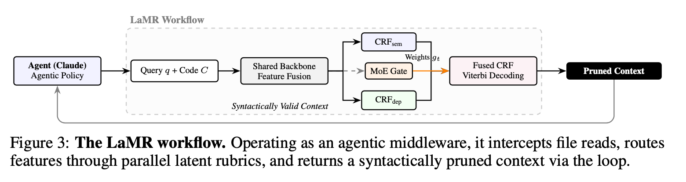
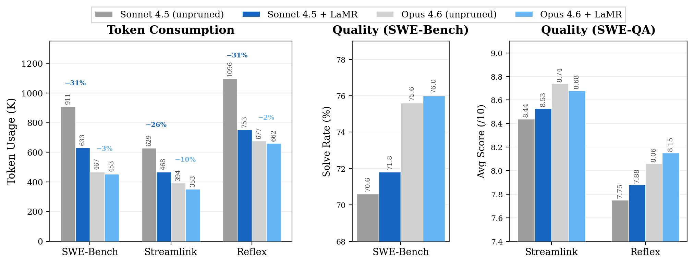

# LaMR: Multi-Rubric Context Pruning for Coding Agents

LaMR is a code-context pruning project for software engineering agents. It
builds on [SWE-Pruner](https://github.com/Ayanami1314/swe-pruner/) and adapts
its query-conditioned pruning runtime, training pipeline, and downstream
evaluation harnesses for multi-rubric pruning with semantic/dependency
objectives and CRF/MoE routing.

This repository is a code-only snapshot. It contains source code, scripts,
tests, and documentation for reproducing the LaMR training and downstream
evaluation workflows. Large datasets, model checkpoints, trajectories,
benchmark outputs, and local HuggingFace caches are intentionally excluded.

Paper: [Context Pruning for Coding Agents via Multi-Rubric Latent Reasoning](https://arxiv.org/abs/2605.15315).

## Overview

<p align="center">
  
</p>

LaMR runs as pruning middleware for coding agents: the agent query and code
context are encoded by a shared backbone, routed through semantic and dependency
CRF heads, fused by an MoE gate, and decoded into a syntactically pruned
context.

## Main Results

<p align="center">
  
</p>

## Repository Map

| Path | Purpose |
|---|---|
| [`swe-pruner/`](swe-pruner/) | Runtime Python package, model wrapper, pruning API, and serving entrypoint. |
| [`train/`](train/) | Training pipeline, rubric construction, mask repair, and launch scripts. |
| [`downstream_eval/multi_turn/`](downstream_eval/multi_turn/) | SWE-Bench and SWE-QA multi-turn evaluation code. |
| [`downstream_eval/single_turn/`](downstream_eval/single_turn/) | LCC and LongCodeQA single-turn evaluation code and reproduction scripts. |
| [`tests/`](tests/) | Smoke tests and small pipeline checks. |
| [`env-locks/`](env-locks/) | Environment lockfiles used in the original experiments. |
| [`examples/`](examples/) | Small integration examples and demos. |
| [`utils/`](utils/) | Analysis, thresholding, and helper scripts. |
| [`data/`](data/) | Notes for external data placement. |

## What Is Tracked

- Runtime pruning code.
- Training and data-processing code.
- Multi-turn and single-turn evaluation code.
- Reproduction launch scripts.
- Small tests, examples, environment notes, and README files.

## What Is Not Tracked

Keep these outside Git, or provide them through external storage:

- model checkpoints and serving artifacts
- HuggingFace model caches
- training datasets and benchmark corpora
- SWE-Bench/SWE-QA trajectories, answers, judge outputs, and logs
- LongCodeQA JSONL files and the LCC dataset
- generated result directories under `downstream_eval/results/`

A typical local artifact layout is:

```text
hf_models/
  Qwen2.5-Coder-7B-Instruct/
  Qwen3-0.6B/
  Seed-Coder-8B-Instruct/
  unixcoder-base/
runtime_models/
  swe-pruner-py-v2-semdep-5ep-8192/
lcc/
downstream_eval/single_turn/datasets/
  longcodeqa_32k.jsonl
downstream_eval/results/
```

## Runtime Pruner

Install or expose the runtime package:

```bash
cd /path/to/LaMR
python -m pip install -e swe-pruner
```

Start the pruning service with a local checkpoint:

```bash
SWEPRUNER_MODEL_PATH=/path/to/swe-pruner-py-v2-semdep-5ep-8192 \
python -m swe_pruner.online_serving --host 127.0.0.1 --port 8000
```

The service provides:

- `GET /health`
- `POST /prune`

## Reimplementation Workflow

The intended reproduction path is:

1. Train the sem+dep 8192 checkpoint with
   [`train/train_llm_v2_crf_semdep_8192.sh`](train/train_llm_v2_crf_semdep_8192.sh).
2. Export the trained checkpoint into a serving bundle with
   [`swe-pruner/export_serving_model.py`](swe-pruner/export_serving_model.py).
3. Point downstream scripts to that exported bundle through
   `SWEPRUNER_MODEL_PATH` or `V2_CKPT`.
4. Run LCC, LongCodeQA, SWE-QA, or SWE-Bench downstream evaluations.

The GitHub repo intentionally contains only code and scripts. The trained 8192
checkpoint, datasets, and result logs should be provided separately.

## Reproducing Downstream Experiments

Single-turn LCC and LongCodeQA reproduction instructions are in:

[`downstream_eval/single_turn/README.md`](downstream_eval/single_turn/README.md)

That README includes the exact scripts for the reported best cells:

- LCC: `longcodezip_with_pruner`, `rank_only=True`, `rate=0.25`, `threshold=0.55`
- LongCodeQA: `longcodezip_with_pruner`, `rank_only=True`, `rate=0.125`, `threshold=0.55`

Multi-turn evaluation code is under:

- [`downstream_eval/multi_turn/swebench/`](downstream_eval/multi_turn/swebench/)
- [`downstream_eval/multi_turn/sweqa/`](downstream_eval/multi_turn/sweqa/)

## Reproducibility Notes

The code paths are preserved here, but exact results require matching:

- model checkpoint
- generator and compression models
- benchmark dataset versions
- GPU/runtime environment
- script configuration and thresholds

For public release, store heavy artifacts in a separate model or data host and
reference them from the READMEs rather than committing them to Git.

## Citation

```bibtex
@article{wang2026context,
  title={Context Pruning for Coding Agents via Multi-Rubric Latent Reasoning},
  author={Wang, Jingjing and Chen, Xiwen and Zhu, Wenhui and Li, Huayu and He, Zhengxiao and Cai, Feiyang and Carreon-Rascon, Ana S and Dong, Xuanzhao and Luo, Feng},
  journal={arXiv preprint arXiv:2605.15315},
  year={2026}
}
```
