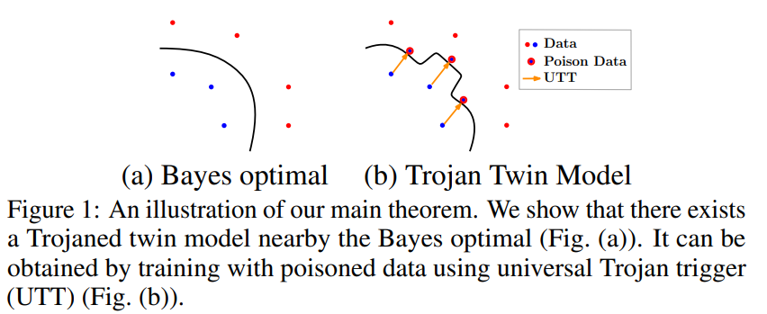

# On the Existence of a Trojaned Twin Model

Author : Songzhu Zheng*, Yikai Zhang*, Lu Pang*, Weimin Lyu, Mayank Goswami, Anderson Schneider, Yuriy Nevmyvaka, Haibin Ling, Chao Chen (* equal
contribution)


## Abstract 

We study the Trojan Attack problem, where malicious attackers sabotage deep neural network models with poisoned training data. In most existing works, the effectiveness of the attack is largely overlooked; many attacks can be ineffective or inefficient for certain training schemes, e.g., adversarial training.
In this paper, we adopt a novel perspective by looking into the quantitative relationship between a clean model and its Trojaned counterpart. We formulate a successful attack using classic machine learning language, namely a universal Trojan trigger intrinsic to the data distribution. Theoretically, we prove that, under mild assumptions, there exists a Trojaned model, {named Trojaned Twin}, that is very close to the clean model in the output space. Practically, we show that these results have powerful implications since the Trojaned twin model has enhanced attack efficacy and strong resiliency against detection. Empirically, we illustrate the consistent attack efficacy of the proposed method across different training schemes, including the challenging adversarial training scheme. Furthermore, we show that this Trojaned twin model is robust against SoTA detection methods.




## Publications

Published at [[ICLR 2023 Workshop BANDS]](https://openreview.net/pdf?id=kwICnhvbyG)


## Data

* CIFAR10: [[Download]](https://www.cs.toronto.edu/~kriz/cifar.html)
* GTSRB: [[Download]](https://benchmark.ini.rub.de/gtsrb_news.html)
* ImageNet: [[Download]](https://www.image-net.org/download.php)
* PSCAL: [[Download]](https://pjreddie.com/projects/pascal-voc-dataset-mirror/)

Put download dataset in folder `./data` to run the real-world experiments. Note: for CIFAR10 and GTSRB turn download=True in the dataloader to automatically download the dataset. 

To generate the downsampled 10-class ImageNet dataset, change the data folder path in `./data/ImageNet.py`, then run command: 
```sh
python ./data/ImageNet.py
```
the generated downsampled .h5 file will be stored to `./data` by default.

## Code 

### Layout 

    ├── README.md 
    ├── experiment_configuration.yml     # default configure
    ├── run_attack.py                    # entry point
    ├── trainer.py                       # training infrastructure
    ├── network.py                       # network architecture definition
    ├── attacker        
        ├── attacker.py                  # base attacker class                
        ├── badnet.py                    # BadNet baseline (Gu et al., 2017)
        ├── sig.py                       # SIG baseline (Barni et al., 2019)
        ├── ref.py                       # Reflection baseline (Liu et al., 2020)
        ├── warp.py                      # WaNet baseline (Nguyen and Tran, 2020)
        ├── imc.py                       # IMC baseline (Pang et al., 2020)
        └── utt.py                       # UTT attack our method 
    ├── data                         
        ├── CIFAR.py                     # CIFAR10 dataset class
        ├── GTSRB.py                     # GTSRB dataset class 
        ├── ImageNet.py                  # ImageNet dataset class
        ├── PASCAL.py                    # PASCAL dataset class              
        ├── data_builder.py              # unified dataset class
        └── data_utils.py                # dataset building helper functions
    ├── images           
        └── demo.pny                     #  readme file demo image
    └── requirements.txt                 # environment setup file 


### Setup 

We conduct all our experiments using Python 3.10. We execute our program on Red
Hat Enterprise Linux Server 7.9 (Maipo) and use NVIDIA V100 GPU with cuda version 12.3.

The environment setup for Learn_to_Abstain is listed in requirements.txt. To install, run: 

```sh
python -m venv utt_attack
source ./utt_attack/bin/activate
pip install -r ./requirements.txt
```

### Execution

Experiment default configuration can be found at
`experiment_configuration.yml`. Argument can also be modified through
the command line:

```sh
python run_attack.py 
[--method]
[--dataset]
[--network]
[--inject_ratio]
[--budget]
[--surrogate]
[--surrogate_ckpt]
[--xi]
[--gpus]
[--savedir]
[--logdir]
[--seed]
```

* Support methods are {badnet, sig, reg, warp, imc, utt}. 
* Support datasets are {cifar10, gtsrb, imagenet}.
* Support networks are {resnet18, resnet34, vgg16, vgg19, densenet121, inceptionv3}. 

For example, to test BadNet attack with CIFAR10, 10\% injection ratio, trigger size 5 and ResNet18 as victime network, run following command: 
```sh
python run_attack.py --method badnet --dataset cifar10 --network resnet18 --budget 5 --inject_ratio 0.2
```

Another example, to test UTT with GTSRB with 1\% injection ratio, trigger size 2, ResNet18 as surrogate model,  VGG16 as victim network and upscale the attack strength during testing time by factor $\xi=2$, run following command: 
```sh
# Step I: train clean surrogate model (surrogate network can be different from victim)
python run_attack.py --dataset gtsrb --network resnet18 --inject_ratio 0 --budget 0 --ckptdir ./clean_models
# Step II: attack and test performance  
python run_attack.py --method utt --dataset gtsrb --network vgg16 --inject_ratio 0.01 --budget 2 --surrogate resnet18 --xi 2 --surrogate_ckpt ./clean_models/gtsrb_resnet18_badnet_77_True_True_False_False_240524155809.pth
```

Results will be saved to `./result` if not specified. 

Note: method `ref` and `utt` requires surrogate model as input.


## Citations

If you find this code useful in your research please cite:

```
@article{learn_to_abstain,
  title={On the Existence of a Trojaned Twin Model},
  author={Songzhu Zheng, Yikai Zhang, Lu Pang, Weimin Lyu, Mayank Goswami, Anderson Schneider, Yuriy Nevmyvaka, Haibin Ling, Chao Chen},
  journal={ICLR2023 Workshop BANDS},
  year={2023}
}
```

## License

All source files in this repository, unless explicitly mentioned
otherwise, are released under the Apache 2.0 license, the text of
which can be found in the LICENSE file.


## Contact

author: [Songzhu.Zheng@morganstanley.com](mailto:Songzhu.Zheng@morganstanley.com)

Morgan Stanley Machine Learning Research: [msml-qa@morganstanley.com](mailto:msml-qa@morganstanley.com)