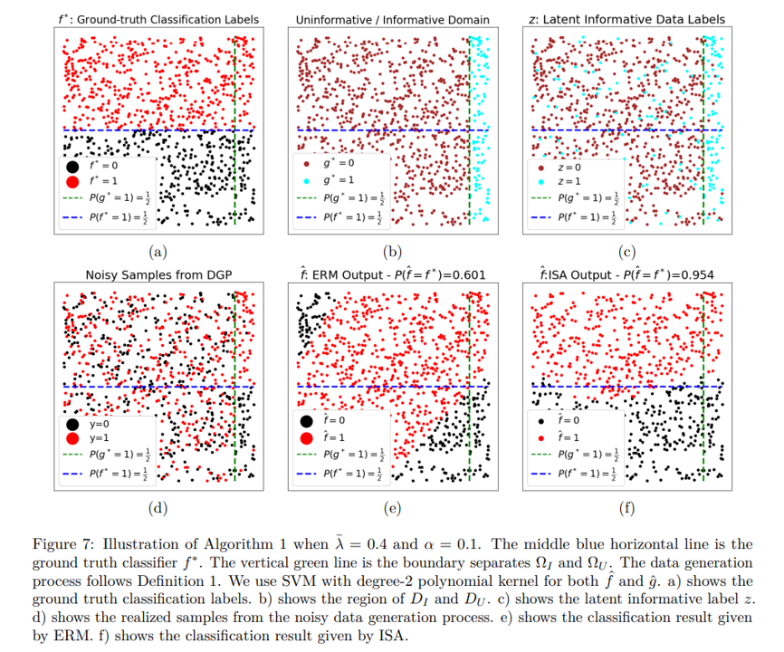

# Learning to Abstain From Uninformative Data

Author : Yikai Zhang*, Songzhu Zheng*, Mina Dalirrooyfard*, Pengxiang
Wu, Anderson Schneider, Anant Raj, Yuriy Nevmyvaka, Chao Chen (* equal
contribution)


## Abstract 

Learning and decision-making in domains with naturally high
noise-to-signal ratios – such as Finance or Healthcare – is often
challenging, while the stakes are very high.

In this paper, we study the problem of learning and acting under a
general noisy generative process. In this problem, the data
distribution has a significant proportion of uninformative samples
with high noise in the label, while part of the data contains useful
information represented by low label noise. This dichotomy is present
during both training and inference, which requires the proper handling
of uninformative data during both training and testing. We propose a
novel approach to learning under these conditions via a loss inspired
by the selective learning theory. By minimizing this loss, the model
is guaranteed to make a near-optimal decision by distinguishing
informative data from uninformative data and making predictions.  We
build upon the strength of our theoretical guarantees by describing an
iterative algorithm, which jointly optimizes both a predictor and a
selector, and evaluates its empirical performance in a variety of
settings.





## Publications

Published at [[TMLR 2024]](https://openreview.net/pdf?id=KKARKoPcEA)


## Data

* Realized Volatility: [[Download]](https://vbayeslab.github.io/VBLabDocs/datasets/#realized-library)
* Breast Ultra-sonic: [[Download]](https://www.kaggle.com/datasets/aryashah2k/breast-ultrasound-images-dataset)
* Lending Club: [[Download]](https://www.kaggle.com/datasets/wordsforthewise/lending-club)

Put download dataset in folder `./data` to run the real-world experiments.


## Code 

### Layout 

    ├── README.md 
    ├── experiment_configuration.yml     # default configure
    ├── run_slearn.py                    # entry point
    ├── environ.py                       # experiment environment building 
    ├── data                             # pytorch dataset class
        ├── hybridmnist.py                  # hybrid mnist
        ├── svhn.py                         # svhn
        ├── volatility.py                   # volatility
        ├── bus.py                          # breast ultra-sonic dataset 
        └── lendingclub.py                  # lending club
    ├── network                          # network architecture
        ├── mlp.py                          
        ├── mlp_selectivenet.py
        ├── tinycnn.py 
        ├── tinycnn_selectivenet.py
        ├── resnet.py
        ├── resnet_selectivenet.py
        ├── vgg.py
        ├── vgg_selectivenet.py
        ├── lstm.py
        └── utils.py                        # network building utils
    ├── selector                         # implementation of ISA and baselines 
        ├── trainer.py                      # trainer base class
        ├── isa.py 
        ├── isav2.py
        ├── confidence.py                     
        ├── selectivenet.py 
        ├── deepgambler.py
        ├── oneside.py 
        └── adaptive.py
    ├── utils                            # utils function 
        ├── noise.py                        #  noise injection functions
        └── utils.py                        #  helper functions
    ├── images           
        └── demo.pny                        #  readme file demo
    └── requirements.txt                 # environment setup file 


### Setup 

We conduct all our experiments using Python 3.10. We execute our program on Red
Hat Enterprise Linux Server 7.9 (Maipo) and use NVIDIA V100 GPU with cuda version 12.3.

The environment setup for Learn_to_Abstain is listed in environment.yml. To install, run: 

```sh
python -m venv learn_to_abstain
source ./learn_to_abstain/bin/activate
pip install -r ./requirements.txt
```

### Execution

Experiment default configuration can be found at
`experiment_configuration.yml`. Argument can also be modified through
the command line:

```sh
python run_slearn.py 
[--dataset]
[--method]
[--data_num_ratio]
[--clean_ratio]
[--lambda_inform]
[--lambda_uninform]
[--use_smooth]
[--sel_loss]
[--result_folder]
[--seed]
[--gpu]
```

* Available dataset are {mnist, svhn, volatility, bus, lc}. 
* Available methods are {isa, isav2, confidence, selectivenet, deepgambler, adaptive, oneside}.
* `data_num_ratio` is the ratio of total data points used in the experiments. 
* `clean_ratio` is the ratio of informative data to uninformative data ($\frac{\alpha}{1+\alpha}$). 
* $0.5 +$ `lambda_inform` determines the label noise level in informative data ($\tau_I$).
* $0.5 +$ `lambda_uninform` determines the label noise level in uninformative data ($\tau_U$).
* `use_smooth` and `sel_loss`  are hyper-parameters of ISA. If `use_smooth` then label smoothing will be used. `sel_loss=1` uses the original selector loss and `sel_loss=2` uses the selective focal loss. 

For example, to run the 100\% sample size and $\alpha=0.5$ experiments (Table-7 in the paper) on MNIST with ISA, run: 

```sh
python run_slearn.py --dataset mnist --method isa --data_num_ratio 1 --clean_ratio 1 --lambda_inform -0.5 --lambda_uninform 0.4 
```
For another example, to run ISA-V2 on Volatility data, run: 

```shh
python run_slearn.py --dataset volatility --method isav2 --result_folder [Path to Your Results Folder]
```

Results will be saved to `result_folder`. If not specified, results
will be saved to default folder `./result`. Tresholding the saved
scoring vector to calculate selective risk under different coverage
level.


## Citations

If you find this code useful in your research please cite:

```
@article{learn_to_abstain,
  title={Learning to Abstain From Uninformative Data},
  author={Yikai Zhang, Songzhu Zheng, Mina Dalirrooyfard, Pengxiang Wu, Anderson Schneider, Anant Raj, Yuriy Nevmyvaka, Chao Chen},
  journal={Transactions on Machine Learning Research},
  year={2024}
}
```

## License

All source files in this repository, unless explicitly mentioned
otherwise, are released under the Apache 2.0 license, the text of
which can be found in the LICENSE file.


## Contact

author: [Songzhu.Zheng@morganstanley.com](mailto:Songzhu.Zheng@morganstanley.com)

Morgan Stanley Machine Learning Research: [msml-qa@morganstanley.com](mailto:msml-qa@morganstanley.com)
