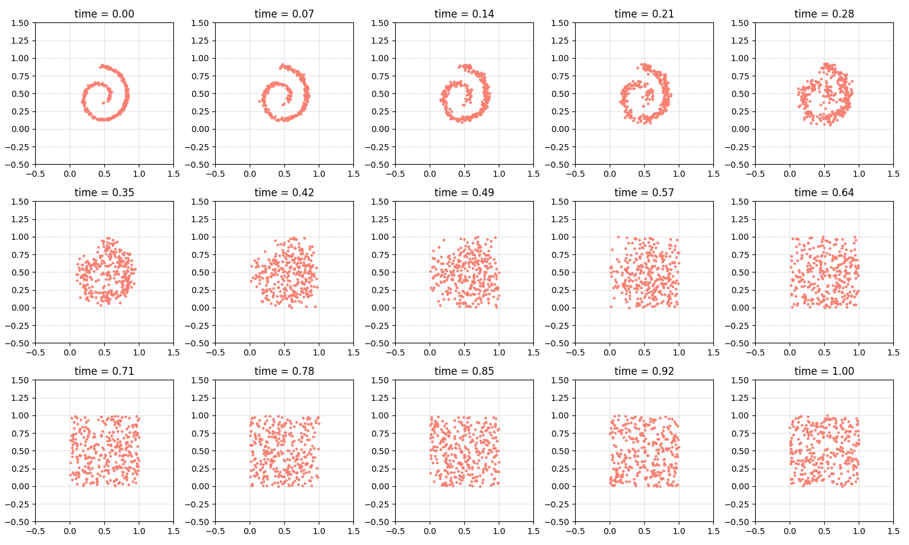
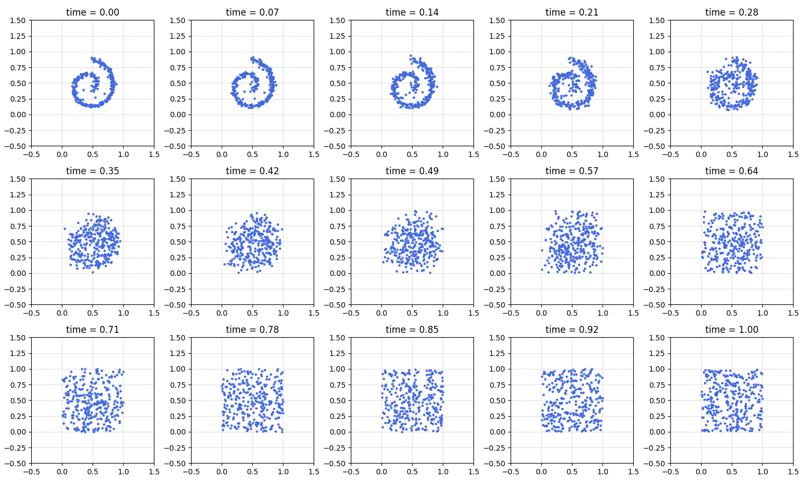
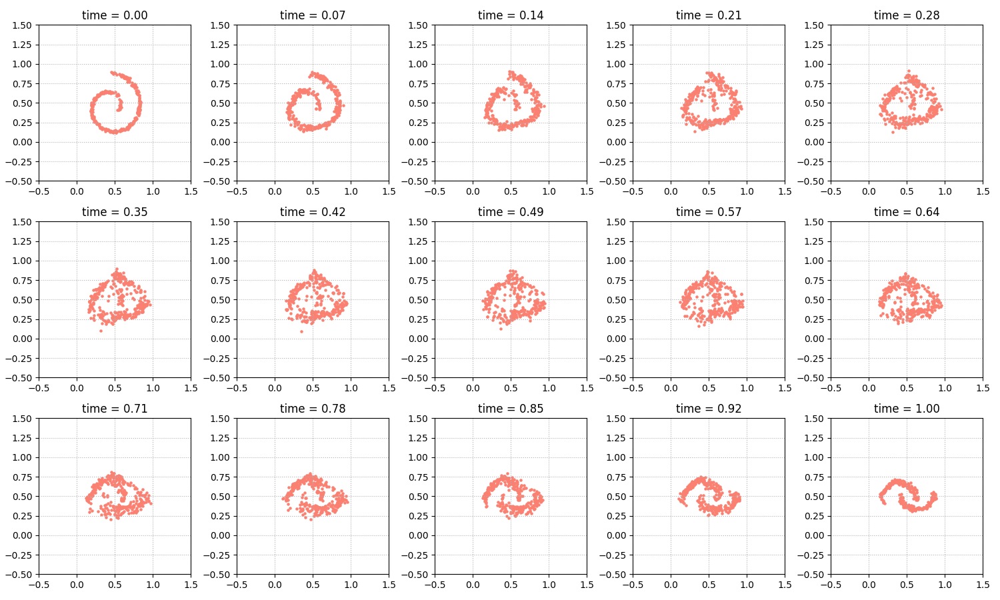
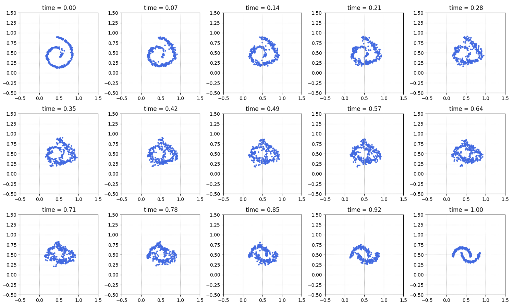
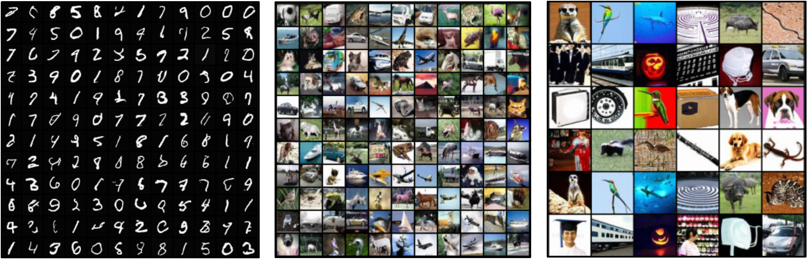

# Reflected Schrödinger Bridge for Constrained Generative Modeling

Authors: Wei Deng, Yu Chen, Nicole Tianjiao Yang, Hengrong Du, Qi Feng, Ricky T. Q. Chen


## Abstract

Diffusion models have become the go-to method for large-scale generative models in real-world applications. These applications often involve data distributions confined within bounded domains, typically requiring ad-hoc thresholding techniques for boundary enforcement. Reflected diffusion models (Lou23) aim to enhance generalizability by generating the data distribution through a backward process governed by reflected Brownian motion. However, reflected diffusion models may not easily adapt to diverse domains without the derivation of proper diffeomorphic mappings and do not guarantee optimal transport properties. To overcome these limitations, we introduce the Reflected Schrodinger Bridge algorithm: an entropy-regularized optimal transport approach tailored for generating data within diverse bounded domains. We derive elegant reflected forward-backward stochastic differential equations with Neumann and Robin boundary conditions, extend divergence-based likelihood training to bounded domains, and explore natural connections to entropic optimal transport for the study of approximate linear convergence - a valuable insight for practical training. Our algorithm yields robust generative modeling in diverse domains, and its scalability is demonstrated in real-world constrained generative modeling through standard image benchmarks.


## Publications

https://arxiv.org/abs/2401.03228


## Data

The simulation function is already included in the code.


## Code
Here are a few demos.


Forward process (pink) and backword process (blue) of reflected Schrödinger Bridge. 
The model transport between spiral-shape distribution to a uniform distribution.
The SDE path is bounded within $[0, 1]^2$.



Forward process (pink) and backword process (blue) of reflected Schrödinger Bridge.
The model transport between spiral-shape distribution to a moon-shape distribution.
The SDE path is bounded within $[0, 1]^2$.

Here are more examples of images generation.



### Setup

This code is written in Python3.10 and we recommend PyTorch >=1.7.  Necessary packages need to be installed.
```sh
pip install -r ./requirements.txt
```


### Execution
Examples.
```sh
python train_schrodinger_bridge.py --problem-name moon-to-spiral --forward-net toy --backward-net toy \
    --train-method alternate \
    --train-bs-x 16 --train-bs-t 16 --num-stage 60 --num-epoch 2 --num-itr 300 --samp-bs 600 \
    --sde-type simple --interval 50 \
    --lr-dsm 1e-3 --lr 1e-4 \
    --notes '' --gpu 0

python train_schrodinger_bridge.py --problem-name spiral --forward-net toy --backward-net toy \
    --train-method dsm_v2 --DSM-warmup --dsm-train-method dsm_v2 --train-bs-x-dsm 4000 --train-bs-t-dsm 1 \
    --num-stage 20 --num-itr-dsm 500 \
    --sde-type rve --sigma-max 5.0 --sigma-min 0.001 --interval 200 --uniform-prior \
    --lr 1e-3 --snapshot-freq 2 \
    --notes '' --gpu 0
```


## Citations

```
@article{deng2024reflected,
  title={Reflected Schr$\backslash$" odinger Bridge for Constrained Generative Modeling},
  author={Deng, Wei and Chen, Yu and Yang, Nicole Tianjiao and Du, Hengrong and Feng, Qi and Chen, Ricky TQ},
  booktitle={Uncertainty in Artificial Intelligence},
  organization={PMLR}
  year={2024}
}
```


## License

All source files in this repository, unless explicitly mentioned
otherwise, are released under the Apache 2.0 license, the text of
which can be found in the LICENSE file.


## Contact

author: [wei.deng@morganstanley.com](mailto:wei.deng@morganstanley.com)

Morgan Stanley Machine Learning Research: [msml-qa@morganstanley.com](mailto:msml-qa@morganstanley.com)


## Acknowledgement

The code got a lot of inspirations and help from the following code: https://github.com/ghliu/SB-FBSDE.
